Windows 10段堆内部机理

> 译者：玉涵
>
> 由于本人英文水准有限，对Windows内部机制的理解也不够精细，所以译文中难免会有错误，如果你发现了什么问题，还请与我联系，我会尽快修正。

<div align='right'>

> Mark Vincent Yason
>
> IBM X-Force Advanced Research
>
> yasonm[at]ph[dot]ibm[dot]com
>
> @MarkYason

</div>

## 摘要

段堆(Segment Heap)是一种新的堆实现机制，在Windows 10系统中引入，由Windows apps和特定的系统进程使用(一般称作Modern/Metro apps)。这一新的堆实现机制是对已经研究透彻、广泛文档化的NT堆的附加，NT堆仍然用于传统的应用程序中，也用于Windows apps中的特定类型分配。

段堆有一个很重要的点在于，对于Microsoft Edge来说它是启用的，这意味着运行于Edge的组件/依赖项不会使用定制堆管理器(custom heap manager)，而是使用段堆。因此，对这些Edge组件/依赖项来说可靠的内存污染漏洞exp需要对段堆有一定程度的理解。

本文会讨论段堆的数据结构、算法和安全机制。段堆的知识也会应用在对Microsoft WinRT PDF library(CVE-2016-0117)内存污染漏洞的讨论和演示，该漏洞在Edge content进程的上下文中利用了一个可靠的任意写。

[TOC]

## 介绍

段堆是一种本地的(native)堆实现机制，在Windows10中引入。它被Windows apps和特定系统进程使用，另一方面，旧的堆实现机制(NT堆)仍然应用于传统应用程序中。

从安全研究者的视角来看，理解段堆的内部机制与攻击者即将利用这一新颖且关键的组件来进行exp同样至关重要，对Edge浏览器来说尤甚。此外，安全研究者进行软件审计可能需要为漏洞开发一个PoC以便于证明厂商/开发者的可利用性。如果创建PoC需要对段堆管理的堆进行精心布局，那么理解它的内部机理就非常有用了。本文旨在帮助读者对段堆有一个深层次的理解。

本文分成3个主要部分，第一部分(内部机理)深度讨论了段堆的各种组件，包括每个段堆组件所用的数据结构和算法。第二部分(安全机制)讨论了各种安全机制，它们使得攻击段堆元数据非常困难且不够可靠，对特定情景来说，精心操纵堆布局将变得非常困难。第三部分(案例研习)是理解段堆的一个应用，我们会讨论如何精心操纵段堆布局，利用漏洞实现可靠的任意写。

因为段堆和NT堆共享相似的概念，读者最好先研究一下NT堆的内部机理。这些工作有着各种各样的论文/演讲，它们引用并讨论了NT堆的安全机制和攻击手法，会帮助读者理解为什么段堆中会有某一种特定的堆安全机制。

本文的所有信息都基于64位的NTDLL.DLL，版本是10.0.14295.1000，系统版本是Windows 10 Redstone 1 Preview (Build 14295)。

## 内部机理

本节深度讨论了段堆的内部机制。我们将从段堆不同组件的概括开始，然后描述段堆启用的实例。概括之后，每个段堆组件会在自己的小节中被详细讨论到。

### 概览

#### 架构

段堆由4个组件组成：(1)后端管理器，为128~508KB大小的分配请求服务。它使用NT内存管理器提供的虚拟内存函数，创建并管理后端分配的块。(2)可变尺寸(VS)分配组件为小于128KB的分配请求服务。它利用后端来创建VS 子段，VS块存放于此。(3)LFH为<=16368字节的分配请求服务，但仅在分配尺寸被探测为通用用途时才可用。它利用后端来创建LFH 子段，LFH块从这里分配。(4)大块分配组件为>508KB的分配请求服务。它使用NT内存管理器提供的虚拟内存函数来进行分配和释放大块。

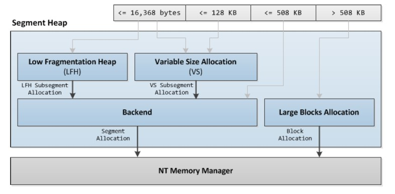

#### 缺省配置

段堆当前是一个可选特性。Windows apps默认使用它，下面的一些系统进程也默认使用它：

- csrss.exe
- lsass.exe
- runtimebroker.exe
- services.exe
- smss.exe
- svchost.exe

可以通过设置下面的IFEO(Image File Execution Options, 映像文件可执行选项)对特定EXE激活或禁用段堆：

```
HKEY_LOCAL_MACHINE\SOFTWARE\Microsoft\Windows NT\CurrentVersion\
Image File Execution Options\(executable)
FrontEndHeapDebugOptions = (DWORD)

Bit 2 (0x04): Disable Segment Heap
Bit 3 (0x08): Enable Segment Heap
```

为所有的EXE全局启用或禁用段堆，可以设置该键值：

```
HKEY_LOCAL_MACHINE\SYSTEM\CurrentControlSet\Control\Session Manager\Segment Heap
Enabled = (DWORD)

0 : Disable Segment Heap
(Not 0): Enable Segment Heap
```

在检查进行之后，如果进程会使用段堆，那么全局变量`RtlpHpHeapFeatures`的0位会被置位。

注意到即使段堆在进程中启用了，也不是说进程创建的所有堆就都由段堆来管理，某些特定类型堆仍然需要由NT堆来管理(会在下一节中讨论)。

#### 堆的创建

如果段堆被启用(`RtlpHpHeapFeatures`的位0被置位)，由`HeapCreate()`创建的堆会由段堆来管理，除非传入的`dwMaximumSize`参数非0(意味着堆不可增长)。

如果`RtlCreateHeap()` API被直接用来创建堆，对段堆来说下面的这些条件都要满足：

- 堆是可增长的：传递给`RtlCreateHeap()`的`Flags`参数应该设置了`HEAP_GROWABLE`标志。
- 堆内存不能被预分配(暗示其为共享堆)：`HeapBase`参数应该是NULL。
- 如果`Parameters`参数传递给了`RtlCreateHeap()`，那么下面的`Parameters`字段就应该被设置为0/NULL: `SegmentReverse`, `SegmentCommit`, `VirtualMemoryThreshold`和`CommitRoutine`。
- 传递给`RtlCreateHeap()`的`Lock`参数应该是NULL。

下面的阐释展示了Edge content进程初始化加载时堆的创建。

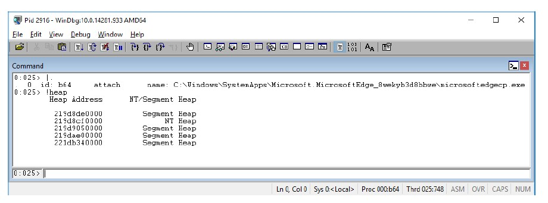

段堆管理4/5的堆。第一个堆是默认进程堆，第三个堆是MSVCRT堆(`msvcrt!crtheap`)。第二个堆是一个共享堆(`ntdll!CsrPortHeap`)，因此，它由NT堆管理。

#### HeapBase和_SEGMENT_HEAP结构

当段堆管理的堆被创建后，堆地址/句柄(此后一律称为`HeapBase`)会由`HeapCreate()`或`RtlCreateHeap()`返回，它指向一个`_SEGMENT_HEAP`结构，与NT堆的`_HEAP`结构十分相似。

`HeapBase`是中枢位置，各种段堆组件的状态都存储于此。它有着下面这些字段：

```
windbg> dt ntdll!_SEGMENT_HEAP
+0x000 TotalReservedPages : Uint8B
+0x008 TotalCommittedPages : Uint8B
+0x010 Signature : Uint4B
+0x014 GlobalFlags : Uint4B
+0x018 FreeCommittedPages : Uint8B
+0x020 Interceptor : Uint4B
+0x024 ProcessHeapListIndex : Uint2B
+0x026 GlobalLockCount : Uint2B
+0x028 GlobalLockOwner : Uint4B
+0x030 LargeMetadataLock : _RTL_SRWLOCK
+0x038 LargeAllocMetadata : _RTL_RB_TREE
+0x048 LargeReservedPages : Uint8B
+0x050 LargeCommittedPages : Uint8B
+0x058 SegmentAllocatorLock : _RTL_SRWLOCK
+0x060 SegmentListHead : _LIST_ENTRY
+0x070 SegmentCount : Uint8B
+0x078 FreePageRanges : _RTL_RB_TREE
+0x088 StackTraceInitVar : _RTL_RUN_ONCE
+0x090 ContextExtendLock : _RTL_SRWLOCK
+0x098 AllocatedBase : Ptr64 UChar
+0x0a0 UncommittedBase : Ptr64 UChar
+0x0a8 ReservedLimit : Ptr64 UChar
+0x0b0 VsContext : _HEAP_VS_CONTEXT
+0x120 LfhContext : _HEAP_LFH_CONTEXT
```

- `Signature` - 0xDDEEDDEE(堆由段堆管理)

用于追溯大块分配的状态：

- `LargeAllocMetadata` - 大块元数据的红黑树
- `LargeReversedPages` - 为所有的大块分配保留的页数
- `LargeCommittedPages` - 为所有的大块分配提交的页数

追溯后端分配状态的字段：

- `SegmentCount` - 对所控制的段数量
- `SegmentListHead` - 堆所控制的段链表头
- `FreePageRanges` - 空闲后端块的红黑树

追溯可变尺寸分配和LFH状态的子结构字段：

- `VsContext` - 跟踪可变尺寸分配的状态
- `LfhContext` - 跟踪LFH的状态

堆由`RtlpHpSegHeapCreate()`分配并初始化。`NtAllocateVirtualMemory()`用于保留和提交堆的虚拟内存。保留尺寸的变化取决于处理器的数量，提交的尺寸就是`_SEGMENT_HEAP`结构的大小。

在`_SEGMENT_HEAP`结构下面剩余的保留内存称为LFH上下文扩展，它被动态的提交以为激活的LFH 桶存储必要的数据。

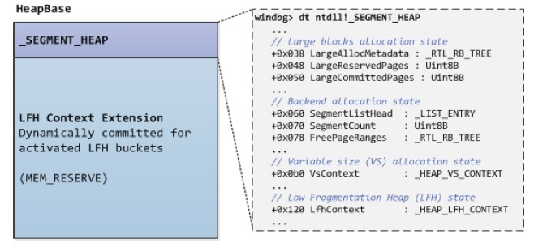

#### 块分配

当通过`HeapAlloc()`或`RtlAllocateHeap()`分配块时，分配请求最终会由`RtlpHpAllocateHeap()`处理，如果堆由段堆管理的话。

`RtlpHpAllocateHeap()`有着这样的函数签名：

```cpp
PVOID RtlpHpAllocateHeap(_SEGMENT_HEAP* HeapBase, SIZE_T UserSize, ULONG Flags, USHORT Unknown)
```

`UserSize`是传递给`HeapAlloc()`或`RtlAllocateHeap()`的请求尺寸。返回值是新分配块的指针(本文后续称其为`UserAddress`)。

下图展示了`RtlpHpAllocateHeap()`的流程：

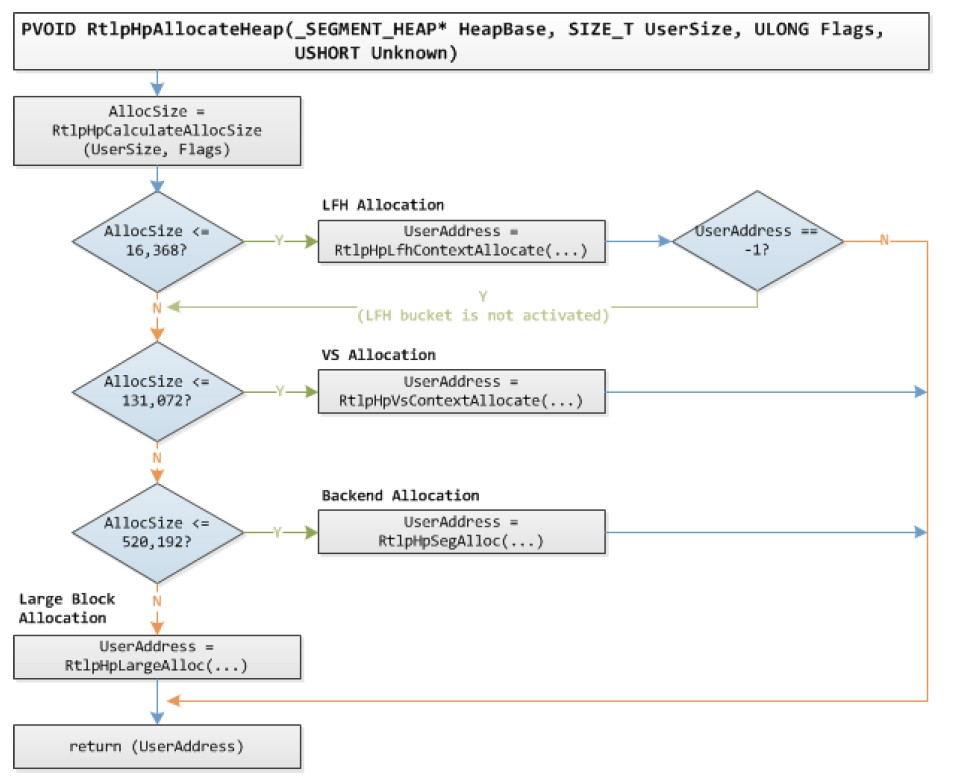

`RtlpHpAllocateHeap()`的目的在于调用合适的段堆分配组件，它依赖于`AllocSize`。`AllocSize`是`UserSize`根据`Flags`调整后的尺寸，但是默认情况下，`AllocSize`等同于`UserSize`，除非`UserSize`是0（如果`UserSize`是0，`AllocSize`就是1）。

注意到`AllocSize`被检查的逻辑，实际上它在独立的`RtlpHpAllocateHeapInternal()`函数中，在图中为了简洁，我们直接把它内联了。同时，还要注意到如果LFH分配返回-1，就意味着LFH对应`AllocSize`的桶还没有被激活，因此，分配请求最终会传递给VS分配组件。

#### 块释放

当通过`HeapFree()`或`RtlFreeHeap()`释放块时，调用最终会走到`RtlpHpFreeHeap()`，如果堆是由段堆管理的话。

`RtlpHpFreeHeap()`签名如下：

```cpp
BOOLEAN RtlpHpFreeHeap(_SEGMENT_HEAP* HeapBase, PVOID UserAddress, ULONG Flags, SIZE_T* UserSize, USHORT* Unknown)
```

`UserAddress`是由`HeapAlloc()`或`RtlAllocateHeap()`返回的块地址，`UserSize`应是当初用户请求的尺寸。

下图展示了`RtlpHpFreeHeap()`释放的逻辑：

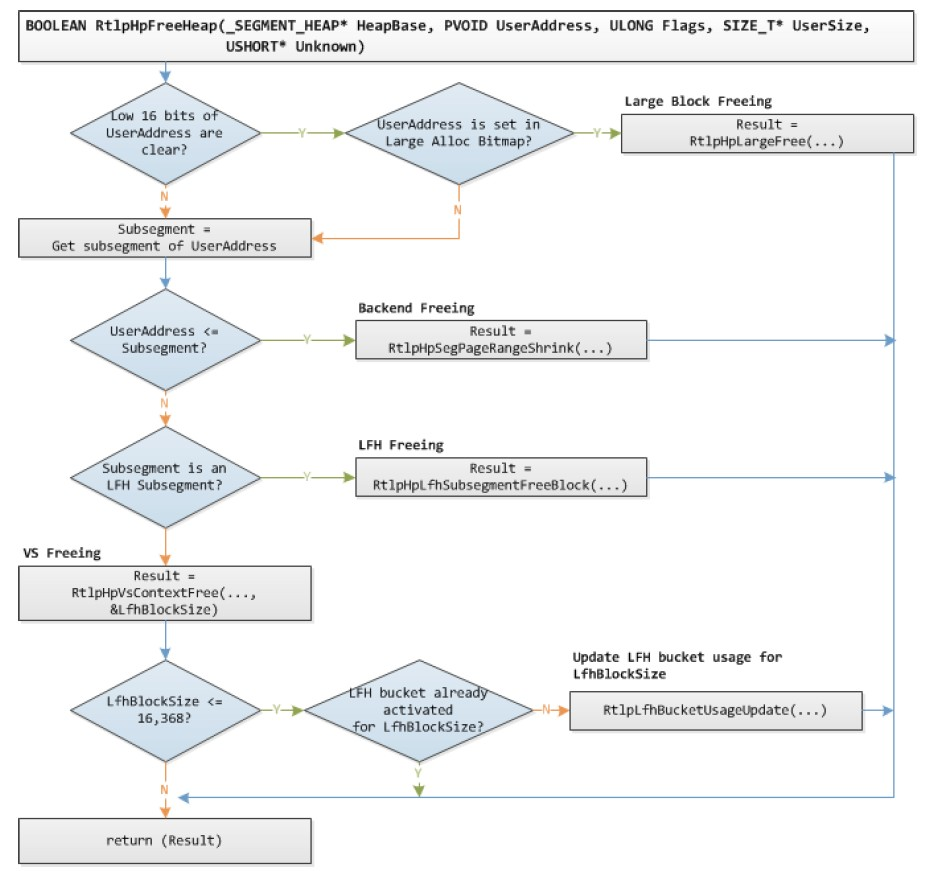

`RtlpHpFreeHeap()`的目的在于调用合适的段堆组件的释放函数，它基于`UserAddress`的值以及它所在哪种类型的子段上。子段会在文章后面讨论，但是现在，子段就是后端块的特殊类型，VS和LFH块都由其分配。

既然大块分配的地址是64KB对齐，所以第一步就要检查低16位都是0的`UserAddress`的大分配位图。如果`UserAddress`(实际是，`UserAddress >> 16`)如果在大分配位图中置位了，那么就调用大块释放过程。

此后，判断`UserAddress`所在的子段。如果`UserAddress`小于等于返回的子段地址，就意味着`UserAddress`是后端块分配的，这是因为VS块和LFH块地址是大于子段地址的（VS/LFH 子段头放置在VS/LFH块之前）。如果`UserAddress`指向一个后端块，后端释放被调用。

最后，如果子段是LFH子段，就调用LFH释放过程。否则，就调用VS释放过程。如果VS释放过程被调用，且返回的`LfhBlockSize`(等同于释放的VS块尺寸减去0x10)可以由LFH服务，LFH 桶对应`LfhBlockSize`的计数会相应更新。

注意到逻辑起始处鉴别`UserAddress`所在子段的代码实际上在`RtlpHpSegFree()`函数中，这里为了简洁直接内联在图示中了。同时，图中仅仅展示了`RtlpHpFreeHeap()`的释放逻辑，并未囊括它的其他功能。

### 后端分配

后端用于为131,073(0x20001)~520,192(0x7F000)字节的请求分配内存。后端块以页尺寸作为粒度，且每个块的起始位置都没有块头。除了分配后端块以外，后端也被VS和LFH组件用来创建VS/LFH 子段(特殊的后端块类型)，VS/LFH块从这里分配。

#### 段结构

后端在端结构上操作，这是一个1MB(0x100000)大小的通过`NtAllocateVirtualMemory()`分配的虚拟内存块。段由`HeapBase`的`SegmentListHead`字段追溯。

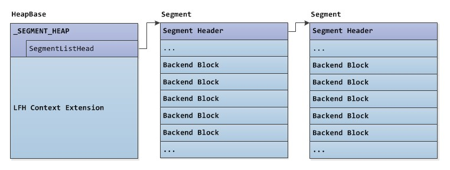

段的前0x2000字节用作段头，剩余的部分用于后端分配块。初始时，前0x2000加上初始段提交尺寸被提交，剩余的均处于保留态，根据需要进行提交或取消提交。

段头由256个页描述符构成的数组的组成，它们描述了段中每个页的状态。因为段的数据部分起始位置在偏移0x2000处，所以第一个页范围描述符另作它用——用于存储`_HEAP_PAGE_SEGMENT`结构，第二个页范围描述符未被使用。

#### _HEAP_PAGE_SEGMENT结构

如所提及，第一个页范围描述符用作存储`_HEAP_PAGE_SEGMENT`结构。它有下列字段：

```
windbg> dt ntdll!_HEAP_PAGE_SEGMENT
+0x000 ListEntry : _LIST_ENTRY
+0x010 Signature : Uint8B
```

- `ListEntry` -  每个段都是堆段链表的一个节点(`HeapBase.SegmentListHead`)。
- `Signature` - 用于验证地址是否是段的一部分。该字段计算方法：(`SegmentAddress >> 0x14) ^ RtlpHeapKey ^ HeapBase ^ 0xA2E64EADA2E64EAD`)。

#### _HEAP_PAGE_RANGE_DESCRIPTOR结构

如所提及，页范围描述符用于描述段中每个页的状态。因为后端块可以跨越多个页面，所以后端块的第一个页的页范围描述符被标记为'first'，因此，就需要一些额外的字段集。

```
windbg> dt ntdll!_HEAP_PAGE_RANGE_DESCRIPTOR -r
+0x000 TreeNode : _RTL_BALANCED_NODE
+0x000 TreeSignature : Uint4B
+0x004 ExtraPresent : Pos 0, 1 Bit
+0x004 Spare0 : Pos 1, 15 Bits
+0x006 UnusedBytes : Uint2B
+0x018 RangeFlags : UChar
+0x019 Spare1 : UChar
+0x01a Key : _HEAP_DESCRIPTOR_KEY
  +0x000 Key : Uint2B
  +0x000 EncodedCommitCount : UChar
  +0x001 PageCount : UChar
+0x01a Align : UChar
+0x01b Offset : UChar
+0x01b Size : UChar
```

- `TreeNode` - 后端空闲块的'first'页范围描述符是后端空闲树的节点(`HeapBase.FreePageRanges`)。
- `UnusedBytes` - 为"first"页范围描述符准备。UserSize和块尺寸的差异。
- `RangeFlags` - 表示后端块类型的位字段和页范围描述符所表示的页状态。
  - 0x01: `PAGE_RANGE_FLAGS_LFH_SUBSEGMENT`。为"first"页范围描述符准备。后端块是一个LFH子段。
  - 0x02: `PAGE_RANGE_FLAGS_COMMITED`。页已提交。
  - 0x04: `PAGE_RANGE_FLAGS_ALLOCATED`。页已分配/繁忙。
  - 0x08: `PAGE_RANGE_FLAGS_FIRST`。页范围描述符被标记为'first'。
  - 0x20: `PAGE_RANGE_FLAGS_VS_SUBSEGMENT`。为"first"页范围描述符准备。后端块是一个VS子段。
- `Key` - 为空闲后端块的"first"页范围描述符准备。当空闲后端块被插入到后端空闲树时会使用到。
  - `Key` - WORD尺寸key用于后端空闲树，高字节是`PageCount`字段，低字节是`EncodedCommitCount`字段。
  - `EncodedCommitCount` - 按位取反后端块已提交页的数量。后端块已提交的页数越大，该值就越小。
  - `PageCount` - 后端块的页数量。
- `Offset` - 为非'first'页范围描述符而准备。页范围描述符自"first"页范围描述符的偏移。
- `Size` - 为"first"页范围描述符而准备。与`Key.PageCount`值相同（重叠字段）。

下面是段的阐释图：

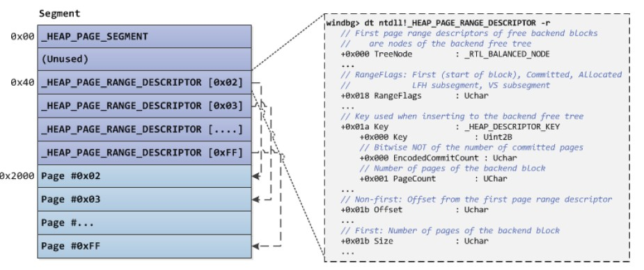

下面是131,328字节(0x20100)繁忙后端块及其对应页范围描述符的示意图("first"页范围描述符被高亮)：

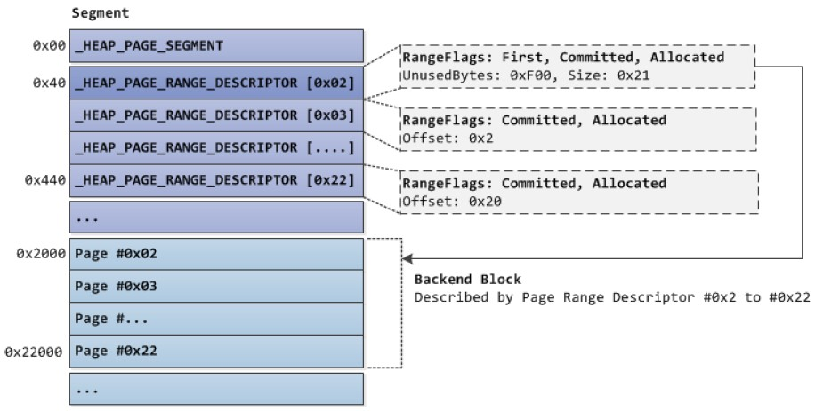

注意到因为描述后端块的页范围描述符存储在段的顶部，所以后端块起始位置并不包含一个块头。

#### 后端空闲树

后端分配和释放会使用后端空闲树来查找并存储空闲后端块的信息。

后端空闲树的根存储于`HeapBase.FreePageRanges`，树的节点是后端块的'first'页范围描述符。插入节点的键是'first'页范围描述符的`Key.Key`字段。

下面是后端空闲树的示意图，这里有3个空闲后端块，大小为0x21000,0x23000和0x4F000(空闲块的所有页面都是取消提交态 - `Key.EncodedCommitCount`是0xFF)：

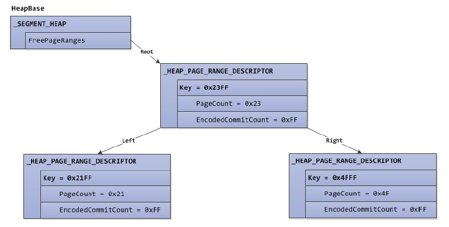

#### 后端分配

后端分配由`RtlpHpSegAlloc()`执行，函数签名如下：

```cpp
PVOID RtlpHpSegAlloc(_SEGMENT_HEAP* HeapBase, SIZE_T UserSize, SIZE_T AllocSize, ULONG Flags)
```

`RtlpHpSegAlloc()`首先调用`RtlpHpSegPageRangeAllocate()`来分配一个后端块。`RtlpHpSegPageRangeAllocate()`，另一方面，会接受需要分配的页数量并返回分配的后端块的"first"页范围描述符。此后，`RtlpHpSegAlloc()`转换返回的"first"页范围描述符到实际的后端块地址(`UserAddress`)，它被随后用作返回值。

下图展示了`RtlpHpSegPageRangeAllocate()`的处理逻辑：

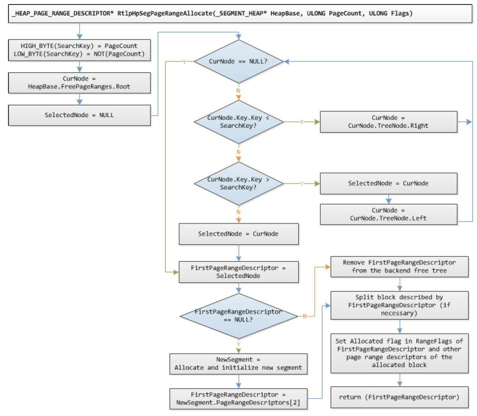

`RtlpHpSegPageRangeAllocate()`首先检索后端空闲树来找到一个可以满足分配请求的空闲后端块。搜索的键是一个WORD尺寸的值，高字节是请求的页数，低字节是请求页数的按位取反。这意味着最合适的搜索由已提交最多的块来主导，换句话说，如果两个或更多空闲块具有相同的尺寸且可以满足本次分配，此时会选择已提交最多的空闲块。如果没有空闲后端块可以满足分配请求，就会创建新的段。

因为选择的空闲后端块比请求的页数有着更多的页，如果需要的话空闲块会被`RtlpHpSegPageRangeSplit()`进行切割，剩余的空闲块的"first"页范围描述符会被插入到后端空闲树中。

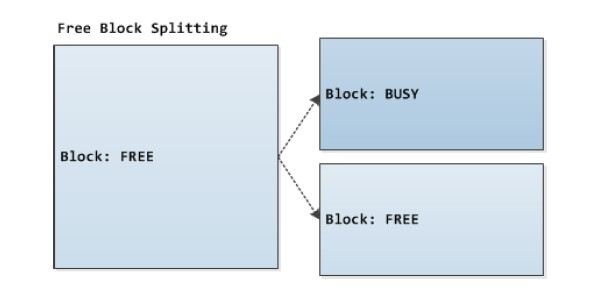

最后，该块的页范围描述符的`RangeFlags`字段会被更新(`PAGE_RANGE_FLAGS_ALLOCATED`位被设置)，以标志该块的页被分配出去了。

#### 后端释放

后端释放由`RtlpHpSegPageRangeShrink()`来处理，它的签名如下：

```cpp
BOOLEAN RtlpHpSegPageRangeShrink(_SEGMENT_HEAP* HeapBase,
_HEAP_PAGE_RANGE_DESCRIPTOR* FirstPageRangeDescriptor, ULONG NewPageCount, ULONG Flags)
```

`FirstPageRangeDescriptor`是待释放后端块的"first"页范围描述符，`NewPageCount`是0，这意味着要去释放该块。

`RtlpHpSegPageRangeShrink()`首先清除所有页范围描述符(除了'first')中的`RangeFlags`字段的`PAGE_RANGE_FLAGS_ALLOCATED`位。此后它会调用`RtlpHpSegPageRangeCoalesce()`去合并待释放后端块与其相邻的空闲块(前块和后块)，清除'first'页范围描述符的`RangeFlags`字段的`PAGE_RANGE_FLAGS_ALLOCATED`位。

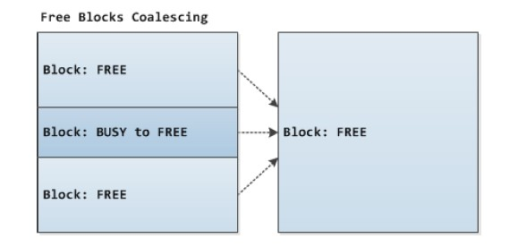

合并块的'first'页范围描述符此后会被插入到后端空闲树，使得合并的空闲块可以为日后的分配所用。

### 可变尺寸分配

可变尺寸分配为大小在1~131,072(0x20000)字节之间的请求服务。VS块以16字节为粒度，每个块都有一个块头在块首。

#### VS 子段

VS分配组件依赖于后端创建的VS 子段，VS块从子段上分配。VS子段是一种特殊的后端块类型，它的'first'页范围描述符的`RangeFlags`的`PAGE_RANGE_FLAGS_VS_SUBSEGMENT(0x20)`位被置位。

下面是`HeapBase`，段与VS子段的关系：

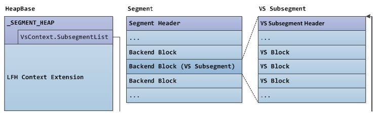

#### _HEAP_VS_CONTEXT结构

VS上下文结构用于追溯空闲VS块、VS子段以及其他和VS分配状态相关的信息。他存储于`HeapBase`的`VsContext`子段，它有着下列字段：

```
windbg> dt ntdll!_HEAP_VS_CONTEXT
+0x000 Lock : _RTL_SRWLOCK
+0x008 FreeChunkTree : _RTL_RB_TREE
+0x018 SubsegmentList : _LIST_ENTRY
+0x028 TotalCommittedUnits : Uint8B
+0x030 FreeCommittedUnits : Uint8B
+0x038 BackendCtx : Ptr64 Void
+0x040 Callbacks : _HEAP_SUBALLOCATOR_CALLBACKS
```

- `FreeChunkTree` - VS块的红黑树
- `SubsegmentList` - 所有VS子段的链表
- `BackendCtx` - 指向`_SEGMENT_HEAP`结构(`HeapBase`)
- `Callbacks` - 编码的回调函数，为VS子段的管理单元所用

#### _HEAP_VS_SUBSEGMENT结构

VS块从VS子段上分配。VS子段通过`RtlpHpVsSubsegmentCreate()`分配和初始化，它会有一个`_HEAP_VS_SUBSEGMENT`结构类型的头部：

```
windbg> dt ntdll!_HEAP_VS_SUBSEGMENT
+0x000 ListEntry : _LIST_ENTRY
+0x010 CommitBitmap : Uint8B
+0x018 CommitLock : _RTL_SRWLOCK
+0x020 Size : Uint2B
+0x022 Signature : Uint2B
```

- `Listentry` - 每个VS子段都是VS子段链表的一个节点(`VsContext.SubsegmentList`)
- `CommitBitmap` - VS子段页的提交位图
- `Size` - VS子段的尺寸，以16字节为单位(减去0x30 VS子段头)
- `Signature` - 用于检查VS子段是否被污染了。计算方法：`Size ^ 0xABED`

下图是对VS子段的阐释。`_HEAP_VS_SUBSEGMENT`结构在偏移0x00处，VS块起始在偏移0x30处：

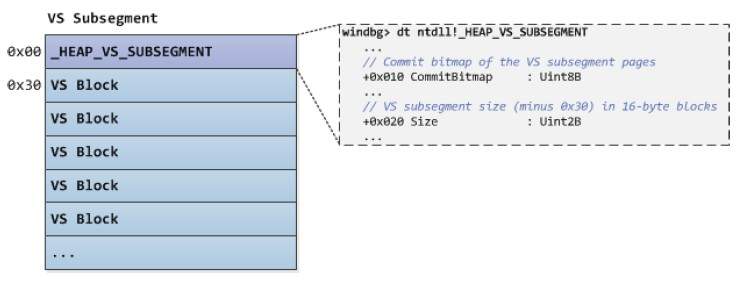

#### _HEAP_VS_CHUNK_HEADER结构

繁忙态VS块有一个16字节的头部，定义如下：

```
windbg> dt ntdll!_HEAP_VS_CHUNK_HEADER -r
+0x000 Sizes : _HEAP_VS_CHUNK_HEADER_SIZE
    +0x000 MemoryCost : Pos 0, 16 Bits
    +0x000 UnsafeSize : Pos 16, 16 Bits
    +0x004 UnsafePrevSize : Pos 0, 16 Bits
    +0x004 Allocated : Pos 16, 8 Bits
    +0x000 KeyUShort : Uint2B
    +0x000 KeyULong : Uint4B
    +0x000 HeaderBits : Uint8B
+0x008 EncodedSegmentPageOffset : Pos 0, 8 Bits
+0x008 UnusedBytes : Pos 8, 1 Bit
+0x008 SkipDuringWalk : Pos 9, 1 Bit
+0x008 Spare : Pos 10, 22 Bits
+0x008 AllocatedChunkBits : Uint4B
```

- `Sizes` - 编码的8字节子结构，封装了重要的尺寸和状态信息：
  - `MemoryCost` - 空闲态VS块所用。它是一个基于该块已提交部分的大小而计算出的值。已提交的部分越大，该值就越小。这意味着在分配时如果一个`MemoryCost`越小的块被选中，那么其需要提交的内存就越少。
  - `UnsafeSize` - VS块的尺寸，16字节为单位
  - `UnsafePrevSize` - 前一个VS块的大小(包括块首)，16字节为单位
  - `Allocated` - 如果值非0就表示块是繁忙态。
  - `KeyULong` - 空闲态VS块所用。它是一个4字节值，用于插入空闲VS块到VS空闲树。高2字节是`UnsafeSize`字段，低2字节是`MemoryCost`字段。
- `EncodedSegmentPageOffset` - 页中块到VS子段起始位置的偏移，该值会被编码处理。
- `UnusedBytes` - 指示了块是否有未使用的字节的标志，未使用的字节就是指`UserSize`和全部块尺寸(减去0x10字节头部)的差值。如果该flag被置位，VS块的最后两个字节被视为16位小端值。如果未使用字节数是1，该16位置的高位被置位，剩余的位没有被用到；否则，高位被清0，低13位用于存储未使用字节数的值。

下面是繁忙态VS块的示意图(注意到前9个字节是已编码的)：

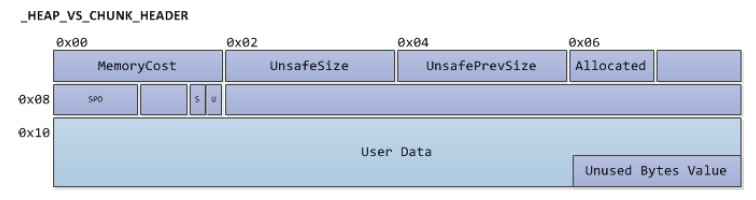

#### _HEAP_VS_CHUNK_FREE_HEADER结构

空闲VS块有一个32字节的头部，前8个字节就是`_HEAP_VS_CHUNK_HEADER`结构的前8个字节。0x08偏移处是`Node`字段，它扮演了VS空闲树中节点的角色(`VsContext.FreeChunkTree`)。

```
windbg> dt ntdll!_HEAP_VS_CHUNK_FREE_HEADER -r
+0x000 Header : _HEAP_VS_CHUNK_HEADER
    +0x000 Sizes : _HEAP_VS_CHUNK_HEADER_SIZE
        +0x000 MemoryCost : Pos 0, 16 Bits
        +0x000 UnsafeSize : Pos 16, 16 Bits
        +0x004 UnsafePrevSize : Pos 0, 16 Bits
        +0x004 Allocated : Pos 16, 8 Bits
        +0x000 KeyUShort : Uint2B
        +0x000 KeyULong : Uint4B
        +0x000 HeaderBits : Uint8B
    +0x008 EncodedSegmentPageOffset : Pos 0, 8 Bits
    +0x008 UnusedBytes : Pos 8, 1 Bit
    +0x008 SkipDuringWalk : Pos 9, 1 Bit
    +0x008 Spare : Pos 10, 22 Bits
    +0x008 AllocatedChunkBits : Uint4B
+0x000 OverlapsHeader : Uint8B
+0x008 Node : _RTL_BALANCED_NODE
```

下面是空闲VS块的示意图(注意前8个字节是已编码的)：

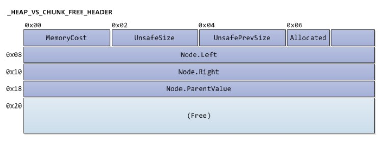

#### VS空闲树

VS分配和释放使用VS空闲树来搜索和存储空闲VS块的信息。

VS空闲树的根存储于`VsContext.FreeChunkTree`中，树节点是空闲VS块的`Node`字段。用于插入节点的键是空闲VS块的`Header.Sizes.KeyULong`字段(`Sizes.KeyULong`在`_HEAP_VS_CHUNK_HEADER`结构一节中被讨论)。

下面是VS空闲树的示意图，此时有3个空闲块，尺寸分别为0xF80, 0x1010和0x3010(空闲块的所有部分都已提交 - `MemoryCost`是0x0000)：

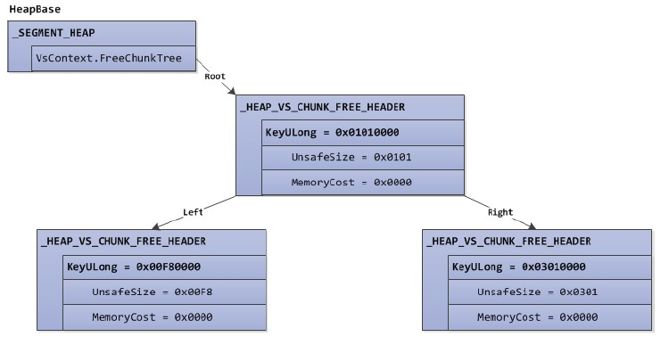

#### VS分配

VS分配由`RtlpHpVsContextAllocate()`执行，签名如下：

```
PVOID RtlpHpVsContextAllocate(_HEAP_VS_CONTEXT* VsContext, SIZE_T UserSize, SIZE_T AllocSize, ULONG Flags)
```

下图展示了该函数的逻辑：

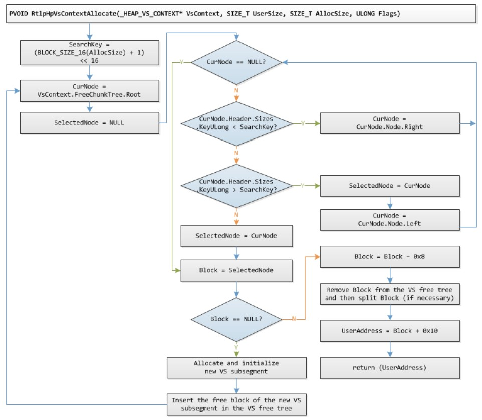

函数首先检索VS空闲树，找到一个可以满足分配的空闲VS块。搜索键是个4字节值，其中高2字节是可以容纳`AllocSize+1`(头部大小)的16字节块的数量，低2字节是0(`MemoryCost`)。这意味着best-fit搜索策略将首选最低内存消耗(块中已提交部分最多)的块，换句话说，如果多个空闲块尺寸相同且可以满足分配，那么已提交最多的空闲块将被选择出来。如果找不到合适的空闲VS块，就需要创建新的子段。

既然选择的空闲VS块的尺寸可能会大于容纳`AllocSize`的尺寸，因此大块的空闲块需要被切割，除非剩余的块尺寸小于0x20字节(空闲VS块首大小)。

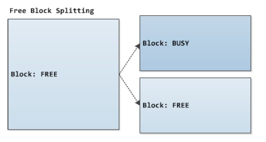

空闲VS块切割由`RtlpHpVsChunkSplit()`执行，该函数也会从VS空闲树中移除空闲块，并插入切割后剩余的空闲块到VS空闲树中。

#### VS释放

VS释放由`RtlpHpVsContextFree()`进行，签名如下：

```cpp
BOOLEAN RtlpHpVsContextFree(_HEAP_VS_CONTEXT* VsContext, _HEAP_VS_SUBSEGMENT* VsSubegment, PVOID UserAddress, ULONG Flags, ULONG* LfhBlockSize)
```

`UserAddress`是待释放VS块的地址，`LfhBlockSize`将变成待释放VS块尺寸减去0x10(繁忙VS块首大小)。`LfhBlockSize`会被`RtlpHpVsContextFree()`调用以更新LFH 桶中对应`LfhBlockSize`的使用计数。

`RtlpHpVsContextFree()`首先检查VS块是否确实被分配了，这使通过检查块首的`Allocated`字段来完成的。它随后会调用`RtlpHpVsChunkCoalesce()`来合并待释放块与其临近空闲块(前块和后块)。

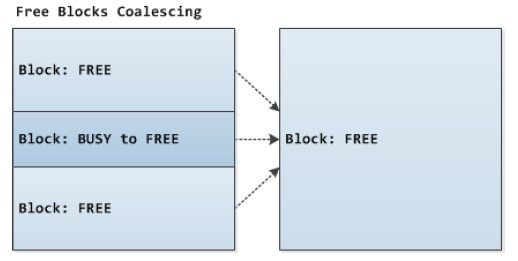

最后，合并的空闲块被插入到VS空闲树，可为后续分配所用。

### 低碎片堆

LFH为尺寸在1~16,368(0x3FF0)字节范围内的分配请求五福。与NT对的LFH类似，段堆中的LFH也是使用桶调度策略来防止碎片化，它会引起相似的尺寸块从预分配大内存块中分配。

下面是各个LFH 桶的表格，给出了分散到不同桶的分配尺寸以及每个桶对应的粒度：

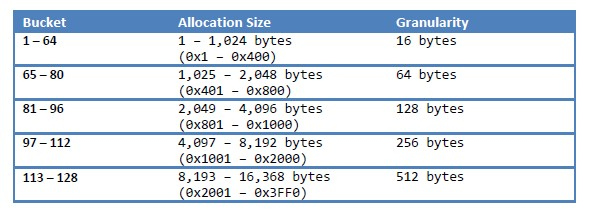

LFH 桶仅在对应的分配尺寸被探测为活跃(popular)时才被激活。LFH 桶激活机制以及使用计数将在后面讨论。

下面是一些已激活和未激活的桶示意图，包括它们对应的分配尺寸：

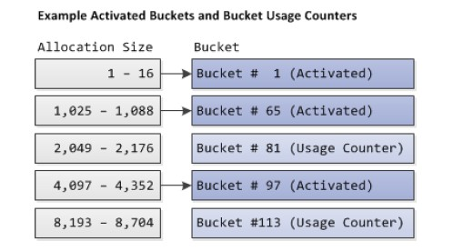

桶 #1, #65和#97都已激活，因此，对应大小的分配请求会由LFH 桶来处理。桶 #81和#113未激活，那么对应尺寸的分配请求就会引起使用计数的更新。如果使用计数在更新后达到了特定的阈值，那么桶就会被激活，此后的分配就会从LFH 桶中分配，否则，请求的分配最终还是传递给VS分配组件。

#### LFH 子段

LFH组件依赖于后端创建的LFH子段，LFH块从这里分配。LFH子段是一种后端块的特殊类型，其对应的'first'页范围描述符的`RangeFlags`的`PAGE_RANGE_FLAGS_LFH_SUBSEGMENT(0x01)`位被置位。

下面是`HeapBase`、段和LFH子段的关系图：

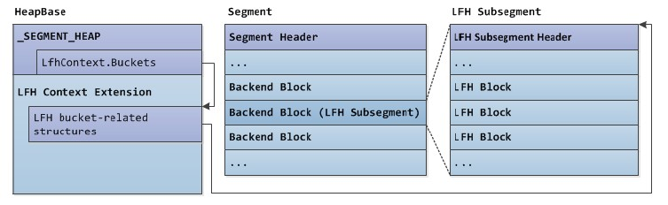

#### _HEAP_LFH_CONTEXT结构

LFH上下文用于追溯LFH桶、LFH桶使用计数以及其它的LFH状态相关信息。它存储于`HeapBase`的`LfhContext`字段中，有着下列字段：

```
windbg> dt ntdll!_HEAP_LFH_CONTEXT -r
+0x000 BackendCtx : Ptr64 Void
+0x008 Callbacks : _HEAP_SUBALLOCATOR_CALLBACKS
+0x030 SubsegmentCreationLock : _RTL_SRWLOCK
+0x038 MaxAffinity : UChar
+0x040 AffinityModArray : Ptr64 UChar
+0x050 SubsegmentCache : _HEAP_LFH_SUBSEGMENT_CACHE
	+0x000 SLists : [7] _SLIST_HEADER
+0x0c0 Buckets : [129] Ptr64 _HEAP_LFH_BUCKET
```

- `BackendCtx` - 指向`_SEGMENT_HEAP`结构(`HeapBase`)
- `Callbacks` - 编码的回调函数，用于管理LFH子段和LFH上下文扩展。
- `MaxAffinity` - 可创建亲和性槽的最大值
- `SubsegmentCache` - 追溯缓存的LFH子段(未使用的)
- `Buckets` - LFH桶的指针数组。如果桶被激活，指针的位0被清0且指针指向一个`_HEAP_LFH_BUCKET`结构；否则，指针实际上是一个`_HEAP_LFH_ONDEMAND_POINTER`结构，它用于跟踪LFH桶的使用情况。

保留的虚拟内存布置在`HeapBase`的`_SEGMENT_HEAP`结构之后，称作LFH上下文扩展，它被动态的提交以为动态激活的LFH桶存储LFH桶相关的结构(查看前面的说明)。

#### _HEAP_LFH_ONDEMAND_POINTER结构

如前所述，如果某个LFH桶未被激活，`LfhContext.Buckets`的对应条目就是一个使用计数。桶使用计数器有如下签名：

```
windbg> dt ntdll!_HEAP_LFH_ONDEMAND_POINTER
+0x000 Invalid : Pos 0, 1 Bit
+0x000 AllocationInProgress : Pos 1, 1 Bit
+0x000 Spare0 : Pos 2, 14 Bits
+0x002 UsageData : Uint2B
+0x000 AllBits : Ptr64 Void
```

- `Invalid` - 一个标记，用于判断是否是非法的`_HEAP_LFH_BUCKET`指针(最低位被设置)，如是则说明是桶使用计数。
- `UsageData` - 2字节值，描述了LFH桶的使用情况。由位0到位4表示的值是桶分配尺寸可用的分配数量，分配和释放时会使该值发生变化。位5到位15所表示的值是该尺寸分配请求的数量，在分配时它会递增。

#### _HEAP_LFH_BUCKET结构

如果桶已被激活，`LfhContext.Buckets`的条目就是一个指向`_HEAP_LFH_BUCKET`的指针。该结构定义如下：

```
windbg> dt ntdll!_HEAP_LFH_BUCKET
+0x000 State : _HEAP_LFH_SUBSEGMENT_OWNER
+0x038 TotalBlockCount : Uint8B
+0x040 TotalSubsegmentCount : Uint8B
+0x048 ReciprocalBlockSize : Uint4B
+0x04c Shift : UChar
+0x050 AffinityMappingLock : _RTL_SRWLOCK
+0x058 ContentionCount : Uint4B
+0x060 ProcAffinityMapping : Ptr64 UChar
+0x068 AffinitySlots : Ptr64 Ptr64 _HEAP_LFH_AFFINITY_SLOT
```

- `TotalBlockCount` - 在于桶相关的所有LFH子段中，LFH块的总量
- `TotalSubsegmentCount` - 与桶相关的LFH子段的数量
- `ContentionCount` - 用于指示何时从LFH子段中分配块的竞争(contentions)的数量。该字段达到`RtlpHpLfhContentionLimit`时，新的亲和性槽会为请求的线程处理器创建出来。
- `ProcAffinityMapping` - 指向字节尺寸的数组，数组项索引`AffinitySlots`。它用于动态的委派处理器到亲和性槽中(随后解释)。初始时，所有成员都是0，这意味着所有的处理器都被赋值到初始的亲和槽中，该槽是在桶被激活时被创建出来的。
- `AffinitySlots` - 指向亲和槽的指针数组(`_HEAP_LFH_AFFINITY_SLOT*`)。当桶被激活后，只有一个槽被初始化创建，当更多的竞争被探测到时，新的亲和性槽会被创建。

#### _HEAP_LFH_AFFINITY_SLOT结构

亲和性槽控制着LFH块来源的LFH子段。初始时，只有一个亲和槽在桶激活时被创建，所有的处理器都指派到该初始化亲和槽中。

因为初始时只有一个亲和槽被创建，这意味着所有的处理器都将使用相同的LFH子段集，也因此，会发生竞争。如果探测到过多的竞争，新的亲和槽就会被创建，请求的线程处理器会被重新指派到新创建的亲和槽，这是通过桶的`ProcAffinityMapping`字段来完成的。

在亲和槽中只有一个字段，它的结构会在后面描述。

```
windbg> dt ntdll!_HEAP_LFH_AFFINITY_SLOT
+0x000 State : _HEAP_LFH_SUBSEGMENT_OWNER
```

下面是桶、处理器、亲和槽和LFH子段的关系示意图：

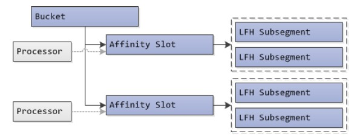

#### _HEAP_LFH_SUBSEGMENT_OWNER结构

子段所有者结构为亲和槽所用(`LfhAffinitySlot.State`)，得以跟踪它所控制的子段，它有下列字段：

```
windbg> dt ntdll!_HEAP_LFH_SUBSEGMENT_OWNER
+0x000 IsBucket : Pos 0, 1 Bit
+0x000 Spare0 : Pos 1, 7 Bits
+0x001 BucketIndex : UChar
+0x002 SlotCount : UChar
+0x002 SlotIndex : UChar
+0x003 Spare1 : UChar
+0x008 AvailableSubsegmentCount : Uint8B
+0x010 Lock : _RTL_SRWLOCK
+0x018 AvailableSubsegmentList : _LIST_ENTRY
+0x028 FullSubsegmentList : _LIST_ENTRY
```

- `AvailableSubsegmentCount` - `AvailableSubsegmentList`中LFH子段的数量
- `AvailableSubsegmentList` - 包含空闲LFH块的LFH子段链表
- `FullSubsegmentList` - 不包含空闲LFH块的LFH子段链表

#### _HEAP_LFH_SUBSEGMENT结构

LFH子段用于分配LFH块。LFH子段经`RtlpHpLfhSubsegmentCreate()`创建和初始化，它会以`_HEAP_LFH_SUBSEGMENT`结构作为头部：

```
windbg> dt ntdll!_HEAP_LFH_SUBSEGMENT -r
+0x000 ListEntry : _LIST_ENTRY
+0x000 Link : _SLIST_ENTRY
+0x010 Owner : Ptr64 _HEAP_LFH_SUBSEGMENT_OWNER
+0x010 DelayFree : _HEAP_LFH_SUBSEGMENT_DELAY_FREE
    +0x000 DelayFree : Pos 0, 1 Bit
    +0x000 Count : Pos 1, 63 Bits
    +0x000 AllBits : Ptr64 Void
+0x018 CommitLock : _RTL_SRWLOCK
+0x020 FreeCount : Uint2B
+0x022 BlockCount : Uint2B
+0x020 InterlockedShort : Int2B
+0x020 InterlockedLong : Int4B
+0x024 FreeHint : Uint2B
+0x026 Location : UChar
+0x027 Spare : UChar
+0x028 BlockOffsets : _HEAP_LFH_SUBSEGMENT_ENCODED_OFFSETS
    +0x000 BlockSize : Uint2B
    +0x002 FirstBlockOffset : Uint2B
    +0x000 EncodedData : Uint4B
+0x02c CommitUnitShift : UChar
+0x02d CommitUnitCount : UChar
+0x02e CommitStateOffset : Uint2B
+0x030 BlockBitmap : [1] Uint8B
```

- `Listentry` - 每个LFH子段都是亲和槽的LFH子段链表中的一个节点(`LfhAffinitySlot.AvailableSubsegmentList`或`LfhAffinitySlot.FullSubsegmentList`)
- `Owner` - 指向控制该子段的亲和槽的指针
- `FreeHint` - 最近分配或释放的LFH块的索引。在分配算法中搜索空闲LFH块时会用到
- `Location` - LFH子段在亲和槽LFH子段链表的位置：0表示`AvailableSubsegmentList`，1表示`FullSubsegmentList`。
- `FreeCount` - LFH子段中空闲块的数量
- `BlockCount` - LFH子段中块的数量
- `BlockOffsets` - 编码的4字节子段，包含每个LFH块的尺寸和LFH子段中第一个LFH块的偏移位置。
  - `BlockSize` - LFH子段中每个LFH块的尺寸
  - `FirstBlockOffset` - LFH子段中第一个LFH块的偏移
- `CommitStateOffset` - LFH子段中提交状态数组的偏移。LFH子段被分成多个"提交部分"；提交状态是一个2字节值数组，用于表示每个"提交部分"的提交状态。
- `BlockBitmap` - 每个LFH块都由块位图的2个位来表示(后面会讨论到)

下面是LFH子段的示意图：

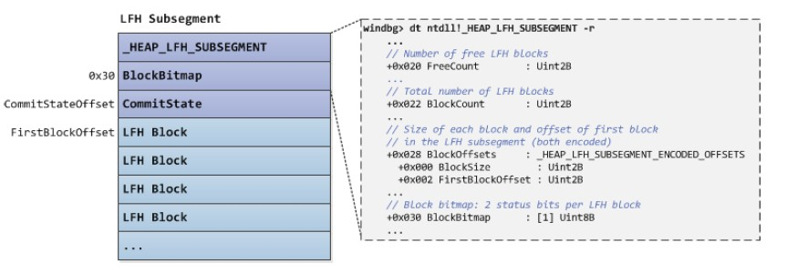

下面是支撑LFH组件的不同数据结构和字段示意图：

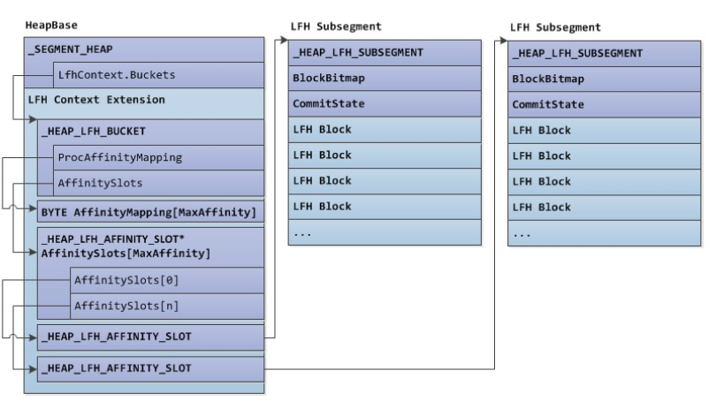

#### LFH块位图

每个LFH块在起始位置并没有块首，取而代之的，块位图被用于跟踪LFH子段中每个LFH块的状态(`LfhSubsegment.BlockBitmap`)。

每个LFH块在块位图中都用两个位来表示。位0表示BUSY位，位1白哦是UNUSED BYTES位。如果UNUSED BYTES位被置位，就意味着`UserSize`和LFH块尺寸之间存在差值，此时LFH块的最后两个字节被视为一个16位小端数，用以表示差值。如果UNUSED BYTES被置位，那么16位数的最高位就是1，其余位不会使用；否则，最高位是0，低14位用于存储未使用字节数大小。

块位图也被分割成8字节(64位)块，本文中称为`BitmapBits`，每个`BitmapBits`代表32个LFH块。

下面是LFH块位图的示意图：

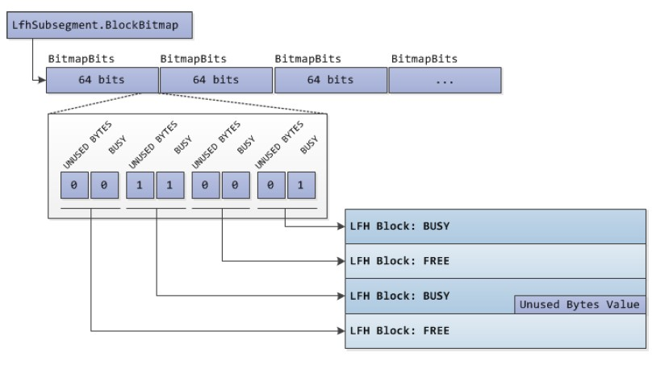

#### LFH 桶激活

每个尺寸<=16,368(0x3FF0)字节的请求都会先通过`LfhSubsegment.BlockBitmap()`来判断尺寸对应的桶是否已经激活。如果已激活，就由LFH服务分配请求。

如果桶未被激活，桶使用计数会更新。在更新后如果桶使用计数达到了特定阈值，那么就会通过`RtlpHpLfhBucketActivate()`来激活桶，LFH会服务下一次的该尺寸请求。否则，VS分配组件会最终处理该分配请求。

桶激活的触发需要17次连续的同尺寸分配。第17次会激活桶，本次和后续的分配都会由LFH来处理。

当检测到某个桶尺寸累计有2040次分配时，无论这些分配是否被释放，第2040次分配都会激活桶，第2040次和此后的分配都会由LFH处理。

#### LFH分配

LFH分配由`RtlpHpLfhBucketActivate()`处理，签名如下：

```cpp
PVOID RtlpHpLfhContextAllocate(_HEAP_LFH_CONTEXT* LfhContext, SIZE_T UserSize, SIZE_T AllocSize, ULONG Flags)
```

该函数首先检查桶对应分配尺寸是否被激活。如果桶未被激活，计数器会更新，如果更新后桶使用计数达到了激活的阈值，桶会被激活，LFH分配会继续。

此后，桶中合适的亲和槽被选择出来，这取决于请求的线程处理器和处理器到亲和性槽的映射(`LfhContext.ProcAffinityMapping`)。一旦亲和槽被选择，亲和槽可用的LFH子段分配就会通过`RtlpHpLfhSlotAllocate()`来执行。

另一方面，`RtlpHpLfhSlotAllocate()`首先要确保该槽有一个可用的LFH子段，如果需要则创建一个新的LFH子段或重用缓存的LFH子段。`RtlpHpLfhSlotAllocate()`此后会调用`RtlpHpLfhSlotReserveBlock()`来尝试从可用LFH子段的一个亲和槽中保留一个块，原子地递减LFH子段的`FreeCount`字段。`RtlpHpLfhSlotReserveBlock()`探测到过多的竞争时，会引起新的亲和槽的创建，以服务线程的处理器。

如果`RtlpHpLfhSlotReserveBlock()`可以在亲和槽的某一个LFH子段中预留一个块，那么`RtlpHpLfhSlotAllocate()`就会调用`RtlpHpLfhSubsegmentAllocateBlock()`从预留块的LFH子段中执行实际的分配。

`RtlpHpLfhSubsegmentAllocateBlock()`寻找空闲LFH块的逻辑如下图：

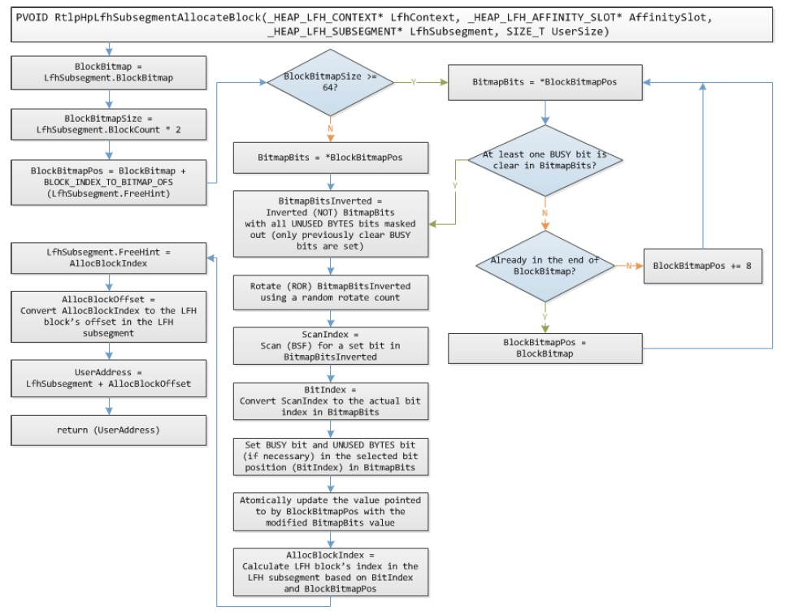

大部分逻辑源于`RtlpLfhBlockBitmapAllocate()`(出于简洁而内联)，它扫描了块位图去找到一个清除了BUSY位的块。块位图中搜索的起点由`LfhSubsegment.FreeHint`决定，而选择清除BUSY位的块是随机的。

逻辑起始用`BlockBitmapPos`找到块位图中的`FreeHint`的`BitmapBits`，`FreeHint`是最近一次分配或释放块的块索引。此后它会向前移动`BlockBitmapPos`，直到找到一个至少有一个BUSY位为0的`BitmapBits`。如果`BlockBitmapPos`到达了位图尾部，就跳回位图的起始处来继续搜索。

一旦选择了`BitmapBits`，就会随机选择`BitmapBits`中BUSY位为0的一个随机位。选择了位索引(`BitIndex`)以后，BUSY位(以及UNUSED BYTES位，如果需要的话)会被设置，此后，由`BlockBitmapPos`指向的值会用修改的`BitmapBits`值原子地更新。最后，位索引连同`BlockBitmapPos`的值都被转换成分配的LFH块的地址(`UserAddress`)。注意，为了简洁，原子更新失败时需要重试的代码没有在图中包含。

下面是8个LFH块从新的LFH子段中连续分配的示意图，注意到每个LFH分配的位置都是随机的。

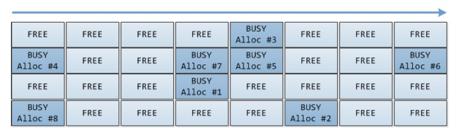

#### LFH释放

LFH释放由`RtlpHpLfhSubsegmentFreeBlock()`执行，函数签名如下：

```cpp
BOOLEAN RtlpHpLfhSubsegmentFreeBlock(_HEAP_LFH_CONTEXT* LfhContext,
_HEAP_LFH_SUBSEGMENT* LfhSubsegment, PVOID UserAddress, ULONG Flags)
```

释放代码首先会计算`UserAddress`的LFH块索引(`LfhBlockIndex`)。如果`LfhBlockIndex`小于等于`LfhSubsegment.FreeHint`，那么`LftSubsegment.FreeHint`就会设置为`LfhBlockIndex`的值。

此后，LFH块在块位图中对应的BUSY和UNUSED BYTES位会被原子地清除。然后，LFH子段的`FreeCount`子段会原子地递增，使得LFH块可以为后续分配服务。

### 大块分配

大于等于520,193字节(>=0x7F001)的分配使用大块分配。大块的块首也没有块头，分配和释放都使用NT内存管理器提供的虚拟内存函数。

#### _HEAP_LARGE_ALLOC_DATA结构

每个大块都有一个相应的元数据结构：

```
windbg> dt ntdll!_HEAP_LARGE_ALLOC_DATA
+0x000 TreeNode : _RTL_BALANCED_NODE
+0x018 VirtualAddress : Uint8B
+0x018 UnusedBytes : Pos 0, 16 Bits
+0x020 ExtraPresent : Pos 0, 1 Bit
+0x020 Spare : Pos 1, 11 Bits
+0x020 AllocatedPages : Pos 12, 52 Bits
```

- `TreeNode` - 每个大块元数据都是大块元数据树的一个节点(`HeapBase.LargeAllocMetadata`)。
- `VirtualAddress` - 块的地址。前16位为`UnusedBytes`字段所用。
- `UnusedBytes` - `UserSize`和已提交块尺寸的差值。
- `AllocatedPages` - 页中块已提交的尺寸。

有意思的是，该元数据存储在一个独立的堆中，它的地址存储在全局变量`RtlpHpMetadataHeap`中。

#### 大块分配

大块分配由`RtlpHpLargeAlloc()`执行，函数签名如下：

```cpp
PVOID RtlpHpLargeAlloc(_SEGMENT_HEAP* HeapBase, SIZE_T UserSize, SIZE_T AllocSize, ULONG Flags)
```

大块分配直接干脆，因为它不需要查询空闲树/表。首先，会从元数据堆中分配块元数据。随后，通过`NtAllocateVirtualMemory()`，分配尺寸加0x1000字节(为守护页准备)大小的虚拟内存被保留。此后，分配尺寸大小的内存从初始保留的内存中被提交，独留守护页仍处于保留态。

在分配块之后，块元数据字段被设置，大块分配位图(`RtlpHpLargeAllocationBitmap`)被更新，标志块地址(实际上是`UserAddress >> 16`)为一个大块分配。

最后，块元数据被插入到大块元数据树中(`HeapBase.LargeAllocMetadata`)，以块地址作为键，然后，块地址(`UserAddress`)返回给调用者。

下面是支撑大块分配的各种数据结构和全局变量示意图：


#### 大块释放

`RtlpHpLargeFree()`执行大块释放，函数签名如下：

```cpp
BOOLEAN RtlpHpLargeFree(_SEGMENT_HEAP* HeapBase, PVOID UserAddress, ULONG Flags)
```

与大块分配相似，大块释放也很直接了断。首先，大块的元数据由`RtlpHpLargeAllocGetMetadata()`来检索，随后会从大块元数据树中移除。

此后，大块分配位图被更新，取消该大块地址的标记。然后，该块的虚拟内存被释放，块元数据也被释放。

### 块填充(padding)

在未将段堆作为默认堆的应用程序中(例如：非Windows app，也不是前面讨论的那些系统EXE)，块会增加额外的16字节垫。该垫将增长块的整体尺寸，改变后端块、VS块和LFH块的布局。

下面是增加了垫之后，后端、VS和LFH块的布局：

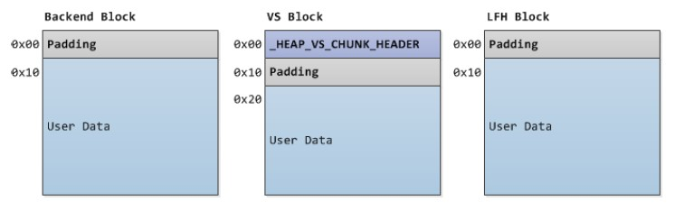

在分析分配的块时，需要考虑垫的存在，尤其是对那些既不是Windows app也不是系统进程的应用程序。

### 总结和分析：内部机理

段堆的实现和NT堆的实现完全不同。最主要的差异就是使用的数据结构不同，使用了空闲树代替了空闲链表来检索空闲块，以及best-fit搜索算法还要优先考虑已提交内存最多的块。

同时，尽管段堆的LFH和NT堆的LFH都有着相同的降低碎片化的设计初衷，也有着相同的通用设计，但段堆的LFH的实现被彻底重构了。最主要的差别就是使用的数据结构，表示LFH块的位图，以及LFH块首位置不再有块头结构。

## 安全机制

本节讨论了段堆中新增的各种安全机制，这使得堆元数据的攻击更为困难且不可靠，在特定情境下，也使得精准地操纵堆布局不那么可靠。

### 链表节点污染的快速失败

段堆使用链表来管理段和子段。与NT堆相似，在链表节点插入和移除操作中会检查链表节点以防止传统的基于链表节点污染的任意写攻击。如果探测到节点被污染了，进程会直接通过FastFail机制来终止：


### 红黑树节点污染的快速失败

段堆使用红黑树来管理后端块和空闲VS块。它也用于管理大块元数据。NTDLL导出的函数`RtlRbInsertNodeEx()`和`RtlRbInsertNodeEx()`分别执行节点的插入和移除工作，保证了红黑树的平衡。为了阻止利用树节点污染的任意写攻击，这两个函数在操纵红黑树节点时会执行校验。与链表节点校验类似，红黑树节点校验一旦失败也会引起FastFail的调用。

在下面的校验例子中，左孩子的父亲被操纵，这将导致左孩子的`ParentValue`指针被攻击者控制来达成任意写。为了阻止任意写，父亲的孩子节点会被检查，其中的一个是否确实是左孩子。

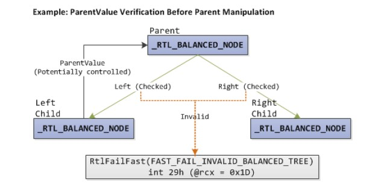

### 堆地址随机化

为了保证堆地址的不可靠预测，虚拟内存中的堆地址引入了随机性。

堆地址随机化由`RtlpHpSegHeapAllocate()`执行，该函数负责创建堆。它首先保留堆尺寸加上随机生成的尺寸大小的虚拟内存(随机值是64KB的倍数)。此后，保留内存的起始位置到生成的随机数偏移的终止位置这一片内存会被释放。然后，`HeapBase`指向了这片内存未释放区域的起始位置。

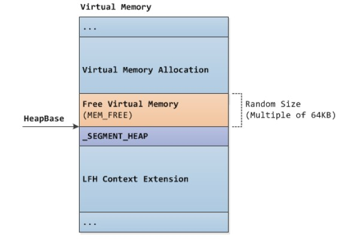

### 守护页

VS子段、LFH子段以及大块在分配时，尾部都会附加一个守护页。对VS和LFH子段来说，子段的尺寸应该是>=64KB的。

守护页防止了VS块和LFH块顺序溢出到另一个子段中，也防止了大块的相邻数据溢出到另一个块中。

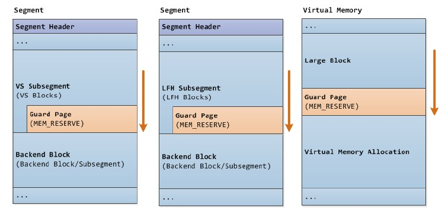

另一方面，后端块的尾部没有守护页，溢出块范围以污染相邻数据是可行的。

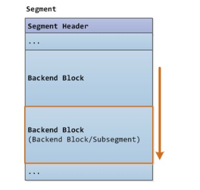

### 函数指针编码

如果攻击者有能力判断堆的地址，且假定攻击者已经绕过了CFG，那么攻击者就可以攻击`HeapBase`中存储的函数指针来直接控制执行流。为了保护这些函数指针免受篡改，函数指针会使用堆键和LFH/VS上下文地址来编码。

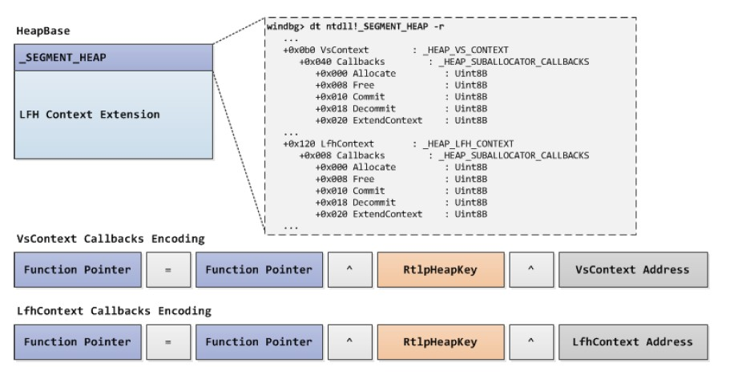

### VS块头编码

与后端/LFH/大块不同，VS块在每个块的首部有一个头部结构，这使得VS块的头部可能被作为缓冲区溢出的目标。为了保护VS块重要的头部数据免受篡改，它们被LFH键和VS块地址进行了编码。

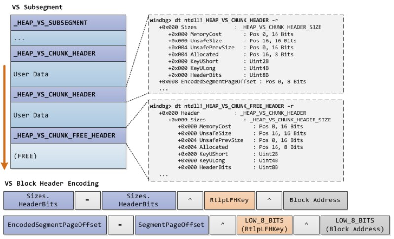

### LFH子段BlockOffsets编码

为了保护重要的LFH子段头字段免受篡改，LFH子段头部中块尺寸字段和首块偏移字段被LFH键和LFH子段地址进行了编码。

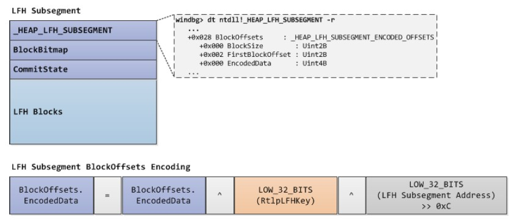

### LFH分配随机化

为了使基于LFH缓冲区溢出和UAF的利用更加不可靠，LFH组件随机的选择哪一个LFH块用于服务分配请求。该分配随机化机制使得布置目标LFH块到一个可以溢出的LFH块的相邻位置这种手法不再可靠，同时想要重用最近释放的LFH块也不再可靠。分配随机化算法在"LFH分配"一小节中已经讨论过。

下面是8个LFH块连续从一个新的LFH子段中分配的示意图：

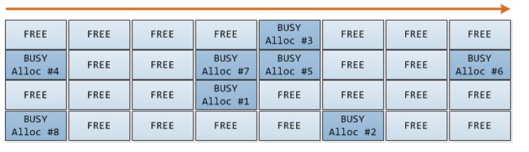

注意到第一个分配是第20个LFH块，第二个分配是第30个LFH块，第三个分配是第5个LFH块等等。

### 总结和分析：安全机制

段堆中应用的安全机制大部分源于NT堆，值得注意的是守护页和LFH分配随机化时在Windows 8发行版中新引入的。基于这些重要的数据结构字段被保护的方式，我们可以说段堆和NT堆相比在安全机制的应用上毫不逊色。然而，还是能够看到对新的段堆数据结构的元数据攻击研究变得流行了起来。

为了精心操纵堆布局，相比较使用了随机化分配的LFH组件，后端和VS组件的best-fit搜索算法及空闲块切割机制更受堆布局操纵的欢迎。

## 实例研习

本节陈述了一个由段堆管理的堆布局是如何通过一种利用内存污染的漏洞来精心操纵的案例，并最终达成Edge content进程上下文的任意写。

### CVE-2016-0117漏洞细节

漏洞(CVE-2016-0117, MS16-028)发生于WinRT PDF的PostScript解释器的类型4函数中(PostScript Calculator)。PostScript Calculator函数使用了一个PostScript语言操作符集合，在执行其函数时，这些操作符使用PostScript的操作数栈。

PostScript操作数栈是一个包含0x65个`CType4Operand`指针的`vector`。另一方面，每个`CType4Operand`都是一个数据结构，它由一个表示类型的DWORD和一个表示PostScript操作数栈中的值的DWORD组成。

PostScript操作数栈和CType4Operands从MSVCRT堆中分配，该堆由段堆管理，如果WinRT PDF加载到了Edge的content进程上下文中的话。

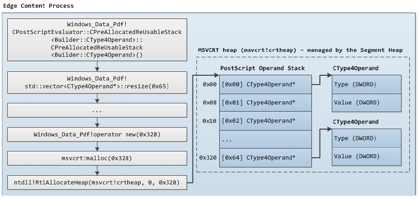

问题就在于PostScript解释器没有验证PostScript操作数栈索引是否越界(PostScript栈索引到0x65即越界)，这就允许对PostScript操作数栈之外的内存进行`CType4Operand`指针的解引用操作。

在下面的阐释中，多个整型数(1094795585或0x41414141)被置入PostScript操作数栈中，最后的一个0x41414141被置入非法的PostScript操作数栈的0x65索引处：


### 注入目标地址的方案

理解了这一漏洞成因之后，下一步计划就是在PostScript操作数栈的最后播种目标地址：

1. 分配一个可控的缓冲区，设置缓冲区偏移0x328处为目标地址(0x4242424242424242)。为了可靠性，可控的缓冲区和PostScript操作数栈将使用VS分配而不用LFH分配。
2. 释放可控缓冲区。
3. PostScript操作数栈将使用此释放的可控块进行分配。

下面就是我们的计划：

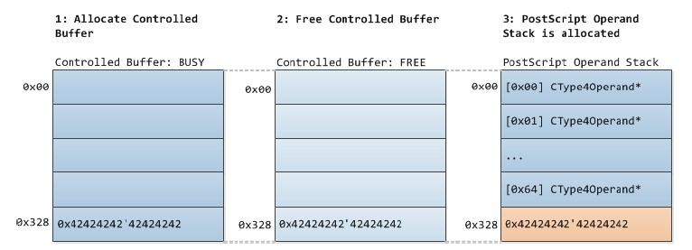

执行上面的计划需要有能力操纵MSVCRT堆，以便于可靠地播种目标地址到PostScript操作数栈的正后方，这意味着我们要有能力从MSVCRT堆分配一个可控块以及能释放该可控块。此外，有些因素会影响可靠性(比如释放块的合并)，所以也要处理。下一小节将讨论如何满足这些需求以及如何避开这些因素的影响。

### 利用Chakra的ArrayBuffer操纵MSVCRT堆

嵌入在PDF中的JavaScript可以潜在地满足MSVCRT堆操纵的需求，但是不幸的是，在攥写本文之际，WinRT PDF仍不支持内嵌的JavaScript。

幸运的是，在Chakra(Edge的JS引擎)的`ArrayBuffer`实现机制中可以找到一种解决办法。类似WinRT PDF的PostScript操作数栈，Chakra的`ArrayBuffer`也通过`msvcrt!malloc()`从MSVCRT堆中分配内存，如果`ArrayBuiffer`是一个特定尺寸的话(例如: 尺寸小于64KB，或尺寸>=64KB，额外检查会执行)。

这意味着在HTML文件中的JavaScript代码可以从MSVCRT堆中分配和释放可控缓冲区(计划的第一步和第二步)。此后，JavaScript代码会在页面中注入一个`<embed>`元素，它将引起包含漏洞触发的PDF文件由WinRT PDF加载。在加载PDF文件时，WinRT PDF会从MSVCRT堆中分配PostScript操作数栈，被释放的可控缓冲区VS块会被返回给WinRT PDF，满足本次的分配请求(计划的第三步)。

#### 分配并设置可控值

在下面的阐释中，HTML文件中JavaScript代码以0x340尺寸实例化了一个`ArrayBuffer`，它会导致从MSVCRT堆上分配一个0x340字节的块；偏移0x328处被设置了目标地址。

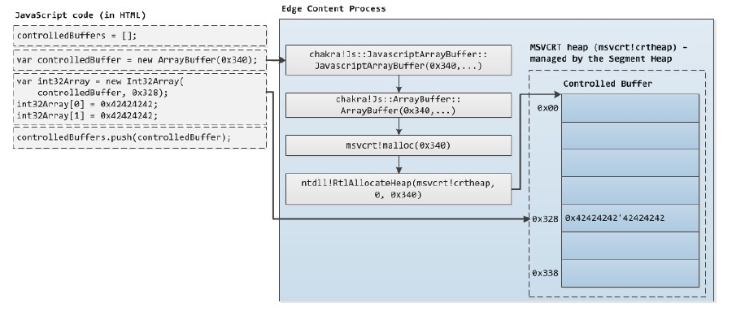

#### LFH 桶激活

为特定分配尺寸激活LFH桶也是一个重要的能力，在本计划中关于它的使用会在后面探讨。为了激活特定尺寸的LFH桶，需要分配17个相同尺寸的`ArrayBuffer`：

```javascript
lfhBucketActivators = [];
for (var i=0; i<17; i++){
    lfhBucketActivators.push(new ArrayBuffer(blockSize));
}
```

#### 释放和垃圾收集

释放块涉及到`ArrayBuffer`对象引用的移除以及垃圾收集的触发。注意到Chakra的`CollectGarbage()`仍然是可以被调用的，但在Edge中期功能已经被禁用了，因此，需要另一种机制来触发垃圾回收。

再次查看`ArrayBuffer`的功能，每次创建`ArrayBuffer`时，传递给`ArrayBuffer`构造器的尺寸都被增加到一个内部Chakra堆管理计数器上。如果在内存大于1GB的机器上(机器内存越小，阈值也就越小)该计数器达到了>=192MB的值，就会触发一次垃圾回收。

因此，为了执行垃圾回收，192MB的`ArrayBuffer`被创建，然后引入一个延迟，使得垃圾回收得以完成，此后，就可以成功执行JavaScript代码:

```javascript
// trigger concurrent garbage collection
gcTrigger = new ArrayBuffer(192 * 1024 * 1024);
// then call afterGcCallback after some delay (adjust if needed)
setTimeout(afterGcCallback, 1000);
```

### 防止目标地址被污染

既然VS分配使用best-fit策略，第一想法就是用VS使用0x330尺寸来分配我们可控的缓冲区。然而，这一想法有着一个问题，目标地址的高16位会被覆盖为Unused Bytes，这货存储于VS块的最后两个字节中。

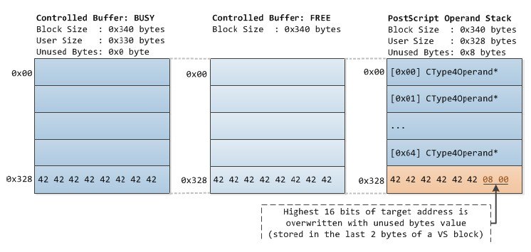

为了解决这一问题，我们可以利用VS块切割这一属性。特别的，如此前在"VS分配"一节中所提到的，大的空闲块会被切割，除非切割后剩余块尺寸大小小于0x20字节。

因此，我们使用0x340字节大小的可控缓冲区(整个块尺寸包含头部就是:0x350)，0x328字节的PostScript操作数栈(整个块尺寸包含头部是: 0x340)会在被释放的可控缓冲区块位置处分配，剩余的块在切割后仅为0x10字节，因此不会对0x350字节的VS块进行切割。而此时，Unused Bytes值会存储在VS块的偏移0x33E处，不会修改我们的目标地址：

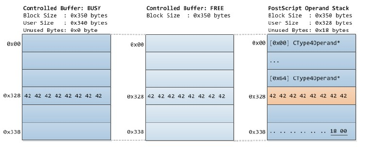

### 防止释放块被合并

为了防止释放的VS块与邻居空闲块合并，我们可以创建15个可控的缓冲区，然后，按照间隔释放，保留8个，7个被释放。

下图展示了这一分配策略，它可以阻止VS块释放时的合并操作：

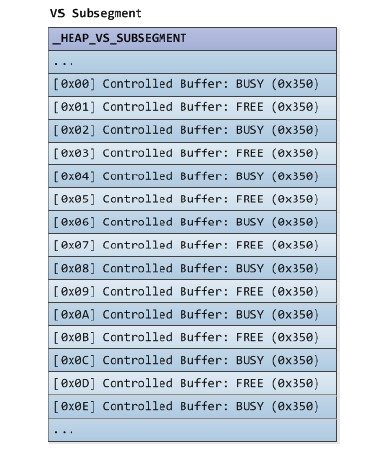

实际的分配策略不总是与上面的展示严格一致，因为有时候一些可控缓冲区是从另外的VS子段中分配的。然而，多重空闲态和繁忙态的可控缓冲区增加了释放VS块时不会合并的概率。

### 防止被释放块的未预期使用

在可控缓冲区第二步被释放后，其对应的空闲VS块可能会被切割以满足其他的小分配请求，这种情况很可能在第三步之前出现。为了阻止对该释放VS块的未预期的使用，为分配尺寸0x1到0x320之间对应的LFH桶都需要被激活，如此LFH就可以为这些尺寸的分配请求服务，而不再使用VS分配组件：

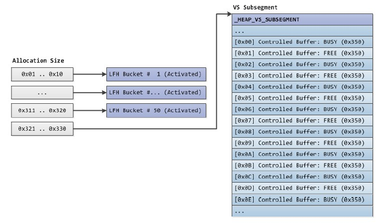

### 调整注入目标地址的方案

现在所有的问题都被解决了，初始的播种目标地址的方案需要做如下调整：

1. HTML/JavaScript: 创建15个可控缓冲区，通过实例化尺寸为0x340的`ArrayBuffer`对象完成。
2. HTML/JavaScript: 激活尺寸在0x1到0x320之前的LFH桶。
3. HTML/JavaScript: 交叉释放7个可控缓冲区，留下8个可控缓冲区为busy态。
4. HTML/JavaScript: 页面中注入`<embed>`元素，使得WinRT PDF加载PDF文件触发漏洞。
5. PDF: WinRT PDF会分配PostScript操作数栈，由堆管理器返回的块就是之前释放的可控缓冲区块。

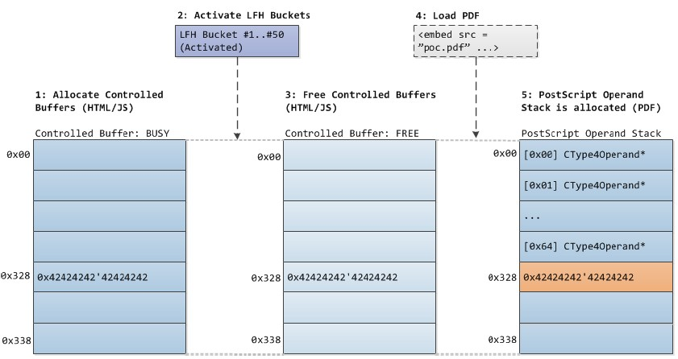

### 成功达成任意写

一旦目标地址被成功播种到PostScript操作数栈之后，漏洞触发时就会达成任意写：

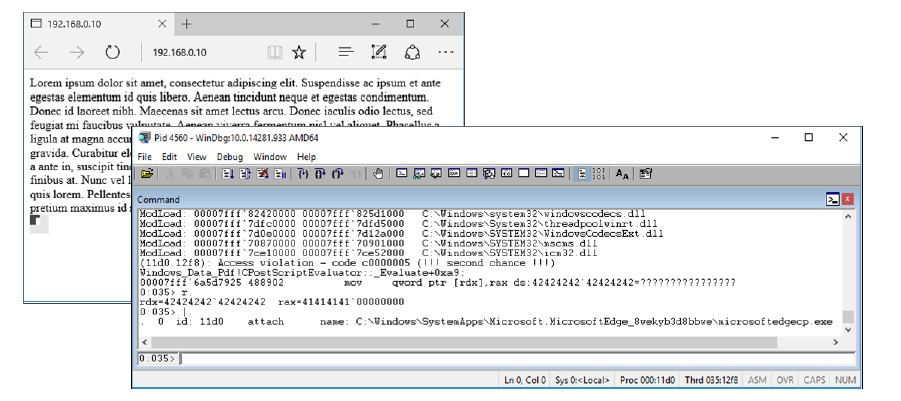

### 分析和总结：案例研习

本案例研习展示了如何在段堆中实现精准的堆布局操纵。特别的，它展示了VS分配的布局是如何被控制的，以及LFH如何被用来保护可控的VS分配的布局——它将非预期的请求都重定向到了激活的LFH桶中。

完成精准操纵堆布局有两个重要因素：Chakra JavaScript引擎提供了脚本能力，Chakra的`ArrayBuffer`和WinRT PDF的PostScript解释器使用同一个通用堆。没有这两个因素，使用WinRT PDF内部的对象分配和释放来完成精准堆布局操纵可能会变得非常困难。

最后，在开发PoC时，你可能会遇到无法解决的问题，比如本节中描述的目标地址污染案例。如果遇到了这种情况，那么对堆的内部机制有一个深层次的理解，说不定会为你提供一些解决方案。

## 总结

段堆的内部机制和NT堆大相径庭。尽管段堆和NT堆的一些内部组件设计初衷相同，但支撑两种堆的数据结构却截然不同。因此，这些新的段堆数据结构对于研究元数据攻击手法来说很有意思。

同时，Windows 10段堆初始发布的安全机制，直接参考了NT堆中此前的攻击手法，在开发时就已经采用了诸多相应的缓解措施。

在堆布局精心操纵方面，案例研习一节中展示了，在拥有任意分配和释放的能力情况下，精准操纵段堆管理的堆布局是可以达成的。这一案例也展示了对段堆有一个深层次的理解可以极大的帮助我们解决看似不可能解决的问题。

最后，我希望本文可以帮助你深入理解Windows 10的段堆。

## 附录：WinDbg !heap 为段堆准备的扩展命令

下面是一些有用的`WinDbg !heap`扩展命令，它们为段堆服务。

### `!heap -x <address>`

如果不知道一个块是从什么样的堆中分配出来的话这个命令就很有用。因为该命令只需要块的地址。该命令可以展示其对应的堆、段、子段以及子段的"first"页面范围描述符、类型和块的总尺寸。

一个busy块的输出示例(用户请求尺寸为0x328字节):

```
windbg> !heap -x 00000203`6b2b6200

[100 Percent Complete]
[33 Percent Complete]
Search was performed for the following Address: 0x000002036b2b6200
Below is a detailed information about this address.
Heap Address : 0x000002036b140000
The address was found in backend heap.
Segment Address : 0x000002036b200000
Page range index (0-255) : 120
Page descriptor address : 0x000002036b200f00
Subsegment address : 0x000002036b278000
Subsegment Size : 266240 Bytes
Allocation status : Variable size allocated chunk.
Chunk header address : 000002036b2b61f0
Chunk size (bytes) : 848
Chunk unused bytes : 24
```

###`!heap -i <address> -h <heap>`

一旦块对应的堆是已知的，该命令就可以用来展示块额外的信息，比如它的用户请求尺寸和对应子段的"first"页范围描述符的已解码`RangeFlags`字段。

一个busy VS块的输出示例(用户请求尺寸为0x328字节，与前面的例子是同一块)：

```
windbg> !heap -i 00000203`6b2b6200 -h 000002036b140000

The address 000002036b2b6200 is in Segment 000002036b200000
Page range descriptor address: 000002036b200f00
Page range start address: 000002036b278000
Range flags (2e): First Allocated Committed VS

UserAddress: 0x000002036b2b6200
Block is : Busy
Total Block Size (Bytes): 0x350
User Size (bytes): 0x328
UnusedBytes (bytes): 0x18
```

###`!heap -s -a -h <heap>`

带有`-a`选项的`!heap -s`命令可以被用来检查堆的布局，因为它会按顺序展示每个段堆组件的每个块信息。

输出示例：

```
windbg> !heap -s -a -h 000002036b140000

Large Allocation X-RAY.
    Block Address 	Metadata Address 	Virtual Address 	Pages 	Ununsed Size
    												Allocated 	(Bytes)
    20c7fc020c0 	20c7fc020c0 		20300df0000 		227 	2383
    20c7fc02080 	20c7fc02080 		20300ee0000 		137 	1912
Backend Heap X-RAY.

			Page Range Page Range
	Segment 	Descriptor 	Descriptor 	Subsegment 	  Range     Subsegment 	  	  Pages Unused
	Address 	Address 	Index 		Address 	 Flags 		    Type 	 Allocated Bytes
2036b200000 	2036b200040 	 2 		2036b202000 	2e 	 Variable Alloc 		17 	4096
2036b200000 	2036b200260 	19 		2036b213000 	2e 	 Variable Alloc 		65 	4096
2036b200000 	2036b200a80 	84 		2036b254000 	 f 	 LFH Subsegment 		 1 	   0
[...]
Variable size allocation X-RAY

	Segment 	Subsegment 	Chunk Header 	Chunk 	Bucket 	Status 	Unused
	Address 	Address 	Address 		Size 	Index 			Bytes
	
2036b200000 	2036b202000  2036b202030 	  752 	     47  Allocated 	  8
2036b200000 	2036b202000  2036b202320 	 1808 		 77  Allocated 	  0
2036b200000 	2036b202000  2036b202a30 	  272 		 17  Allocated 	  0
[...]
LFH X-RAY
	Segment 	Subsegment 		Block 	Block 	Bucket 	Commit 	Busy 	Free 	Unused
	Address 	   Address 	   Address 	 Size 	 Index 	Status 	Bytes 	Bytes 	 Bytes
2036b200000 	2036b254000 2036b254040   256 		16 Committed 256 		0 		0
2036b200000 	2036b254000 2036b254140   256		16 Committed 256 		0 		0
2036b200000 	2036b254000 2036b254240   256 		16 Committed 256 		0 		0

[...]
```

##参考文献

- [1] J. McDonald and C. Valasek, "Practical Windows XP/2003 Heap Exploitation," [Online]. Available:

  https://www.blackhat.com/presentations/bh-usa-09/MCDONALD/BHUSA09-McDonald-WindowsHeap-PAPER.pdf.

- [2] B. Moore, "Heaps About Heaps," [Online]. Available: https://www.insomniasec.com/downloads/publications/Heaps_About_Heaps.ppt.

- [3] B. Hawkes, "Attacking the Vista Heap," [Online]. Available: http://www.blackhat.com/presentations/bh-usa-08/Hawkes/BH_US_08_Hawkes_Attacking_Vista_Heap.pdf.

- [4] C. Valasek, "Understanding the Low Fragmentation Heap," [Online]. Available: http://illmatics.com/Understanding_the_LFH.pdf.

- [5] C. Valasek and T. Mandt, "Windows 8 Heap Internals," [Online]. Available: http://illmatics.com/Windows%208%20Heap%20Internals.pdf.

- [6] Wikipedia, "Red–black tree," [Online]. Available: https://en.wikipedia.org/wiki/Red-black_tree.

- [7] A. Ionescu, "New Security Assertions in "Windows 8"," [Online]. Available: http://www.alexionescu.com/?p=69.

- [8] K. Johnson and M. Miller, "Exploit Mitigation Improvements in Windows 8," [Online]. Available:http://media.blackhat.com/bh-us-12/Briefings/M_Miller/BH_US_12_Miller_Exploit_Mitigation_Slides.pdf.

- [9] IBM, "X-FORCE ADVISORY: Microsoft Windows WinRT PDF Renderer Library PostScript Interpreter Remote Code Execution Vulnerability," [Online]. Available: https://exchange.xforce.ibmcloud.com/collection/XFORCE-ADVISORY-Microsoft-Windows-WinRT-PDF-Renderer-Library-PostScript-Interpreter-Remote-Code-Execution-Vulnerability-736a7f02705bd90867262493dca2a2b7.

- [10] Microsoft, "Microsoft Security Bulletin MS16-028 - Critical," [Online]. Available: https://technet.microsoft.com/en-us/library/security/ms16-028.aspx.

- [11] M. V. Yason, "WinRT PDF: A Potential Route for Attacking Edge," [Online]. Available: https://securityintelligence.com/winrt-pdf-a-potential-route-for-attacking-edge/.

- [12] Adobe Systems Incorporated, "Document Management - Portable Document Format - Part 1: PDF 1.7, First Edition," [Online]. Available: http://www.adobe.com/devnet/pdf/pdf_reference.html.

- [13] Microsoft, "GitHub: Microsoft / ChakraCore / lib / Runtime / Library / ArrayBuffer.cpp

  (JavascriptArrayBuffer::JavascriptArrayBuffer)," [Online]. Available:
  https://github.com/Microsoft/ChakraCore/blob/447fa0df2b64717c15ae95a6e4d054ab11ce5be5/lib/Runtime/Library/ArrayBuffer.cpp#L761-L764.

- [14] M. Tomassoli, "IE10: Reverse Engineering IE," [Online]. Available: http://expdevkiuhnm.rhcloud.com/2015/05/31/ie10-reverse-engineering-ie/.

- [15] Microsoft, "GitHub: Microsoft / ChakraCore / lib / Common / ConfigFlagsList.h

  (DEFAULT_CONFIG_CollectGarbage)," [Online]. Available:
  https://github.com/Microsoft/ChakraCore/blob/5df046f68f37e8170d0fe5c6cd183fc69bbc10da/lib/Common/ConfigFlagsList.h#L479-L480.

- [16] Microsoft, "GitHub: Microsoft / ChakraCore / lib / Runtime / Library / ArrayBuffer.cpp

  (JavascriptArrayBuffer::Create)," [Online]. Available:
  https://github.com/Microsoft/ChakraCore/blob/447fa0df2b64717c15ae95a6e4d054ab11ce5be5/lib/Runtime/Library/ArrayBuffer.cpp#L779.