# Windows 8堆内部机理

译者：玉涵

> 译文的质量受限于本人的英文功底以及对Windows内部机制的熟悉程度，所以难免存在错误。读者如若发现，还望及时斧正，精益求精。

[TOC]

## 简介

Windows 8开发者预览版在2011年九月发布。大多数人聚焦于操作系统的Metro UI，而我们决定调研一下内存管理器。尽管通用的堆exp已经消亡相当一段时间了，但对应用程序和底层操作系统内存管理器之间错综复杂的关系有一个深入的了解将大大提高在具体环境下的exp的可靠性。本文聚焦于Windows 7到Windows 8之间exp缓解措施的过渡，从用户空间到内核空间。我们将试验Windows内存管理器在分配、释放时内部做了哪些处理，我们也会找出Windows 8中所有新增的堆相关安全特性。同时，一些额外的技巧也会涉及，用于为读者提供相应的知识以便于达成更高级别的堆控制。

## 概览

本文分成两部分，每部分都有数个小节。第一部分主要是谈及用户空间堆管理，它是应用程序使用动态内存的默认机制。第一小节将对Windows 8堆管理器的数据结构的改变进行概述，随后对整个堆管理器架构的更新进行简述。第二小节则谈及分配和释放内存的关键算法。第三小节将揭露Windows 8上新的安全缓解措施，它们为动态分配内存提供了更好的全局保护。第四小节和最后一小节将揭示利用(exp)手法的详细信息。尽管在Windows 8预览版中有效的利用少得可怜。最后，我们将围绕整个用户空间堆管理器来进行总结。

第二部分内容会详述Windows 8的内核池分配器。在第一小节中，我们将简述内核池中的链表和数据结构。第二小节重点谈及了Windows 8内核池中新增的安全提升特性，诸如不可执行非分页池和内核池cookie。在第三小节中，我们将看到此前在Windows 7中可行的攻击手法是如何在Windows 8中被缓解措施阻断的。在第四小节，我们将讨论一些攻击Windows 8内核池的一些可替代手法，仍然聚焦于池头部攻击。最后的第五小节，我们会围绕整个内核池做一个汇总。

## 预研工作

尽管本文的内容是完全原创，但它也是基于旧知识所著。下面的列表包含了一些资料，我建议读者在看本文前预先研读这些资料。

- While some of the algorithms and data structures have changed for the Heap Manager, the underlying foundation is very similar to the Windows 7 Heap Manager (Valasek 2010)（尽管堆管理器的一些算法和数据结构有所改变，但底层机制和Windows 7堆管理器非常相似）
- Again, the vast majority of changes to the Kernel Pool were derived from the Windows 7 Kernel Pool which should be understood before digesting the follow material (Mandt 2011)（在消化下面的材料之前，需要先对Windows 7内核池的大量改动有一定理解）
- Lionel d’Hauenens (http://www.laboskopia.com) Symbol Type Viewer was an invaluable tool when analyzing the data structures used by the Windows 8 heap manager. Without it many hours might have been wasted looking for the proper structures.（Lionel d’Hauenens Symbol Type Viewer是一个无价之宝，可用于分析Windows 8堆管理器的数据结构。如果没有它，那么势必将在寻找数据结构上浪费大量的时间）

## 先决条件

### 用户空间

所有的伪代码和数据结构都获取于Windows 8 32位预览版的ntdll.dll(6.2.8400.0)，这也是该二进制最新的版本。显然，代码和数据受限于32位架构，但也和64位架构有一定关联。

如果你有什么问题，或是发现了本文的错误，请与Chris邮件联系(cvalasek@gmail.com)。

### 内核空间

所有的伪代码和数据结构都获取于Windows 8 64位预览版的ntoskrnl.exe(6.2.8400.0)。然而，为了找出缓解措施实现的不同，32位和64位都做了调研。在具体应用的地方会显式的提到。

如果你存在任何疑问，或是发现了什么错误，请与Tarjei邮件联系(kernelpool@gmail.com)。

## 术语

与以前的文章一样，本节用来避免在描述Windows 8堆对象和函数时存在任何的含糊其辞的术语。可能所用的术语无法与所有人达成一致，但贯穿整篇文章我们都将使用同一个约定的术语。

术语block或blocks指8字节或16字节连续的内存，两个大小分别所属于32位和64位架构。它是堆chunk头用于指示其大小所用的最基本的度量单位。chunk是一片连续的内存，可以使用blocks或是bytes来度量。

chunk头部或堆chunk头部与`_HEAP_ENTRY`结构是同义词。它们都可以与术语“头部”替代混用。

`_HEAP_LIST_LOOKUP`结构用于跟踪某一尺寸的空闲chunk，一般被称为`BlocksIndex`或是一个`ListLookup`。

`FreeList`是一个双向链表，它是`HeapBase`的一个成员，有一个指向链表中最小的chunk的头指针，后续的指针一路指向更大的chunk直到最后会指回自己，标志着链表的结束。另一方面，`ListHints`指向`FreeLists`的特定位置，作为一个搜索具体尺寸chunks的优化处理。

术语`UserBlocks`或`UserBlock container`(容器)用于描述独立的以`_HEAP_USERDATA_HEADER`先导的chunks集合。这些独立的chunks就是LFH返回给调用函数的内存空间。`UserBlocks`中的chunks由尺寸来组织在一起，或者是放置在`HeapBuckets`或`Buckets`中。

最后，`Bitmap`用于描述连续的一片内存空间，其中每个位表示一个状态，比如free或busy。

## 用户空间堆管理器

本节通过详述数据结构、算法以及安全机制对Windows 8堆管理器的内部工作机制进行了探讨。这并不意味着我们的工作尽善尽美，我们只是对Windows 8中最重要的概念做了一个内视。

### 数据结构

下面的数据结构来自于Windows 8预览版，使用windbg对6.2.8400.0版本的ntdll.dll进行了数据攫取。当应用程序调用诸如`free()`,` malloc()`，`realloc()`等函数时，这些结构被用来跟踪和管理空闲/已分配内存。

#### _HEAP(HeapBase)

每个进程都会创建一个堆结构(默认进程堆)，也可以通过`HeapCreate()`创建额外的堆。它作为主体设施为动态内存相关事宜提供服务，包括用于分配和释放内存的其他结构体、指针以及堆管理器所使用的数据。

完整的列表请在Windbg中使用`dt _HEAP`命令。

```
0:030> dt _HEAP
ntdll!_HEAP
+0x000 Entry : _HEAP_ENTRY
…
+0x018 Heap : Ptr32 _HEAP
…
+0x04c EncodeFlagMask : Uint4B
+0x050 Encoding : _HEAP_ENTRY
+0x058 Interceptor : Uint4B
…
+0x0b4 BlocksIndex : Ptr32 Void
…
+0x0c0 FreeLists : _LIST_ENTRY
+0x0c8 LockVariable : Ptr32 _HEAP_LOCK
+0x0cc CommitRoutine : Ptr32 long
+0x0d0 FrontEndHeap : Ptr32 Void
…
+0x0d8 FrontEndHeapUsageData : Ptr32 Uint2B
+0x0dc FrontEndHeapMaximumIndex : Uint2B
+0x0de FrontEndHeapStatusBitmap : [257] UChar
+0x1e0 Counters : _HEAP_COUNTERS
+0x23c TuningParameters : _HEAP_TUNING_PARAMETERS
```

- `FrontEndHeap` - 指向前端堆结构的指针。在Windows 8中，LFH是唯一的可选项。
- `FrontEndHeapUsageData` - 128个元素的16位整型数数组，用于表示计数器或是`HeapBucket`的索引。计数器指示了某个具体尺寸的分配数量，每次分配都会递增而释放时递减。`HeapBucket`索引为前端堆所用，判断哪一个`_HEAP_BUCKET`可以服务该请求。当后端管理器在处理分配和释放请求时，一旦为某一个具体尺寸启发式地激活了LFH，那么该`HeapBucket`索引值就在此时被更新。Windows 7此前将这些值保存在`BlocksIndex`内的`ListHint[Size]->Blink`变量中。
- `FrontEndHeapStatusBitmap` - 用于优化的位图，当处理内存请求时可以用于判断是由后端还是前端堆管理器来处理。如果位被置位那么LFH（前端堆）就会服务该请求，否则交给后端堆来处理。该值也是在后端管理器处理分配和释放请求时，启发式地为某个尺寸激活LFH时所设置。

#### _LFH_HEAP(Heap->FrontEndHeap)

`_LFH_HEAP`结构自Windows 7以来没有什么大的变化，只是`regular InfoArrays`和`Affinitized InfoArrays`被独立了出来。这意味着，与Windows 7不同的是，Windows 8不再使用`LocalData`成员来访问合适的基于处理器亲和性的`_HEAP_LOCAL_SEGMENT_INFO`结构，它使用分离出来的数组。

```
0:030> dt _LFH_HEAP
ntdll!_LFH_HEAP
+0x000 Lock : _RTL_SRWLOCK
+0x004 SubSegmentZones : _LIST_ENTRY
+0x00c Heap : Ptr32 Void
+0x010 NextSegmentInfoArrayAddress : Ptr32 Void
+0x014 FirstUncommittedAddress : Ptr32 Void
+0x018 ReservedAddressLimit : Ptr32 Void
+0x01c SegmentCreate : Uint4B
+0x020 SegmentDelete : Uint4B
+0x024 MinimumCacheDepth : Uint4B
+0x028 CacheShiftThreshold : Uint4B
+0x02c SizeInCache : Uint4B
+0x030 RunInfo : _HEAP_BUCKET_RUN_INFO
+0x038 UserBlockCache : [12] _USER_MEMORY_CACHE_ENTRY
+0x1b8 Buckets : [129] _HEAP_BUCKET
+0x3bc SegmentInfoArrays : [129] Ptr32 _HEAP_LOCAL_SEGMENT_INFO
+0x5c0 AffinitizedInfoArrays : [129] Ptr32 _HEAP_LOCAL_SEGMENT_INFO
+0x7c8 LocalData : [1] _HEAP_LOCAL_DATA
```

- `SegmentInfoArrays` - 当特定`HeapBucket`不存在亲和性关联时使用该数组。
- `AffinitizedInfoArrays` - 当特定处理器或核心为具体分配负责时使用该数组。可以了解一下SMP。

#### _HEAP_LOCAL_DATA(Heap->FrontEndHeap->LocalData)

唯一值得注意的地方在于，因为LFH控制Affinitized和LocalInfo数组的方式，`_HEAP_LOCAL_DATA`结构体不再需要持有一个`_HEAP_LOCAL_SEGMENT_INFO`数组成员。

```
0:001> dt _HEAP_LOCAL_DATA
ntdll!_HEAP_LOCAL_DATA
+0x000 DeletedSubSegments : _SLIST_HEADER
+0x008 CrtZone : Ptr32 _LFH_BLOCK_ZONE
+0x00c LowFragHeap : Ptr32 _LFH_HEAP
+0x010 Sequence : Uint4B
+0x014 DeleteRateThreshold : Uint4B
```

#### _HEAP_LOCAL_SEGMENT_INFO(Heap->LFH->SegmentInfoArrays[] / AffinitizedInfoArrays[])

该结构自Windows 7以来改变不大。它不再包含Hint `_HEAP_SUBSEGMENT`结构，这也意味着没有Hint再为分配服务了。除了移除了Hint以外，另外的一个改变就是成员的顺序。

```
0:001> dt _HEAP_LOCAL_SEGMENT_INFO
ntdll!_HEAP_LOCAL_SEGMENT_INFO
+0x000 LocalData : Ptr32 _HEAP_LOCAL_DATA
+0x004 ActiveSubsegment : Ptr32 _HEAP_SUBSEGMENT
+0x008 CachedItems : [16] Ptr32 _HEAP_SUBSEGMENT
+0x048 SListHeader : _SLIST_HEADER
+0x050 Counters : _HEAP_BUCKET_COUNTERS
+0x058 LastOpSequence : Uint4B
+0x05c BucketIndex : Uint2B
+0x05e LastUsed : Uint2B
+0x060 NoThrashCount : Uint2B
```

- `ActiveSubsegment` - 如你所见，在`LocalInfo`结构中当前只有一个`_HEAP_SUBSEGMENT`。Hint Subsegment已不复存焉。

#### _HEAP_SUBSEGMENT(Heap->LFH->InfoArrays[]->ActiveSubsegment->UserBlocks)

`_HEAP_SUBSEGMENT`结构仅仅有着一些次要的改变，它新增了一个单链表用于跟踪那些在特定时间点不能被释放的chunks。

```
0:001> dt _HEAP_SUBSEGMENT
ntdll!_HEAP_SUBSEGMENT
+0x000 LocalInfo : Ptr32 _HEAP_LOCAL_SEGMENT_INFO
+0x004 UserBlocks : Ptr32 _HEAP_USERDATA_HEADER
+0x008 DelayFreeList : _SLIST_HEADER
+0x010 AggregateExchg : _INTERLOCK_SEQ
+0x014 BlockSize : Uint2B
+0x016 Flags : Uint2B
+0x018 BlockCount : Uint2B
+0x01a SizeIndex : UChar
+0x01b AffinityIndex : UChar
+0x014 Alignment : [2] Uint4B
+0x01c SFreeListEntry : _SINGLE_LIST_ENTRY
+0x020 Lock : Uint4B
```

- `DelayFreeList` - 该单链表用于存储那些特定时点不能被释放的chunks的地址。当下一次RtlFreeHeap被调用时，释放器会尝试遍历该链表，如果可以的话会释放chunks。

#### _HEAP_USERDATA_HEADER(Heap->LFH->InfoArrays[]->ActiveSubsegment->UserBlocks)

该数据结构自Windows 7以来改变的最多。这些改动使得堆管理器不必盲目的依赖于那些可能被污染的信息。当分配`UserBlock`容器时也会增加守护页以提供额外的保护。

```
0:001> dt _HEAP_USERDATA_HEADER
ntdll!_HEAP_USERDATA_HEADER
+0x000 SFreeListEntry : _SINGLE_LIST_ENTRY
+0x000 SubSegment : Ptr32 _HEAP_SUBSEGMENT
+0x004 Reserved : Ptr32 Void
+0x008 SizeIndexAndPadding : Uint4B
+0x008 SizeIndex : UChar
+0x009 GuardPagePresent : UChar
+0x00a PaddingBytes : Uint2B
+0x00c Signature : Uint4B
+0x010 FirstAllocationOffset : Uint2B
+0x012 BlockStride : Uint2B
+0x014 BusyBitmap : _RTL_BITMAP
+0x01c BitmapData : [1] Uint4B
```

- `GuardPagePresent` - 如果该标志置位那么为`UserBlocks`的初始化分配就会包含一个守护页在最后的位置。这阻止了顺序溢出导致的毗邻内存访问。
- `FirstAllocationOffset` - 该SHORT值用途和Windows 7的初始化值0x2非常相似。现在，这个值被显式地设定为`UserBlocks`中第一个可分配的chunk。
- `BlockStride` - 用来指示`UserBlocks`包含的每个chunk尺寸的值(chunks的大小都相同)。此前，该值继承自`FreeEntryOffset`。
- `BusyBitmap` - 连续的一片内存，包含了一个位图用于指示`UserBlock`中的哪些chunks是FREE，哪些是BUSY。在Windows 7中，它是通过`FreeEntryOffset`和`_INTERLOCK_SEQ.Hint`变量实现的。

#### _RTL_BITMAP(Heap->LFH->InfoArrays[]->ActiveSubsegment->UserBlocks->Bitmap)

这个小型数据结构用于判断父UserBlock容器中哪些chunks是FREE，哪些是BUSY。

```
0:001> dt _RTL_BITMAP
ntdll!_RTL_BITMAP
+0x000 SizeOfBitMap : Uint4B
+0x004 Buffer : Ptr32 Uint4B
```

- `SizeOfBitmap` - 位图的尺寸，单位是字节
- `Buffer` - 实际的位图，用于核实操作

#### _HEAP_ENTRY

尽管`_HEAP_ENTRY`(亦称chunk头或头部)结构和以前保持一致，但对LFH上的chunks来说，某些字段的使用意图有所调整。

```
0:001> dt _HEAP_ENTRY
ntdll!_HEAP_ENTRY
+0x000 Size : Uint2B
+0x002 Flags : UChar
+0x003 SmallTagIndex : UChar
+0x000 SubSegmentCode : Ptr32 Void
+0x004 PreviousSize : Uint2B
+0x006 SegmentOffset : UChar
+0x006 LFHFlags : UChar
+0x007 UnusedBytes : UChar
+0x000 FunctionIndex : Uint2B
+0x002 ContextValue : Uint2B
+0x000 InterceptorValue : Uint4B
+0x004 UnusedBytesLength : Uint2B
+0x006 EntryOffset : UChar
+0x007 ExtendedBlockSignature : UChar
+0x000 Code1 : Uint4B
+0x004 Code2 : Uint2B
+0x006 Code3 : UChar
+0x007 Code4 : UChar
+0x004 Code234 : Uint4B
+0x000 AgregateCode : Uint8B
```

- `PreviousSize` - 如果chunk在LFH上，`PreviousSize`成员将是`UserBlocks`使用的位图的索引，而不是前一个chunk的尺寸（这很有意义，因为`UserBlock`容纳的所有的chunks大小一致）。

### 架构

Windows 8 `ListHint`和`FreeList`结构的架构与Windows 7几乎一致，只是移除了`ListHint`的二重效用。Windows 7的`ListHint[Size]->Blink`有二重效用，如果LFH没有被启用，那么该值包含的就是一个计数器。而一旦LFH被激活了，那么该值包含的就是`_HEAP_BUCKET`结构体的地址(+1)。下面的例子展示了双向链表是如何为双向效用服务的，既对分配次数进行计数，又指向一个`FreeList`条目（如果存在的话）。

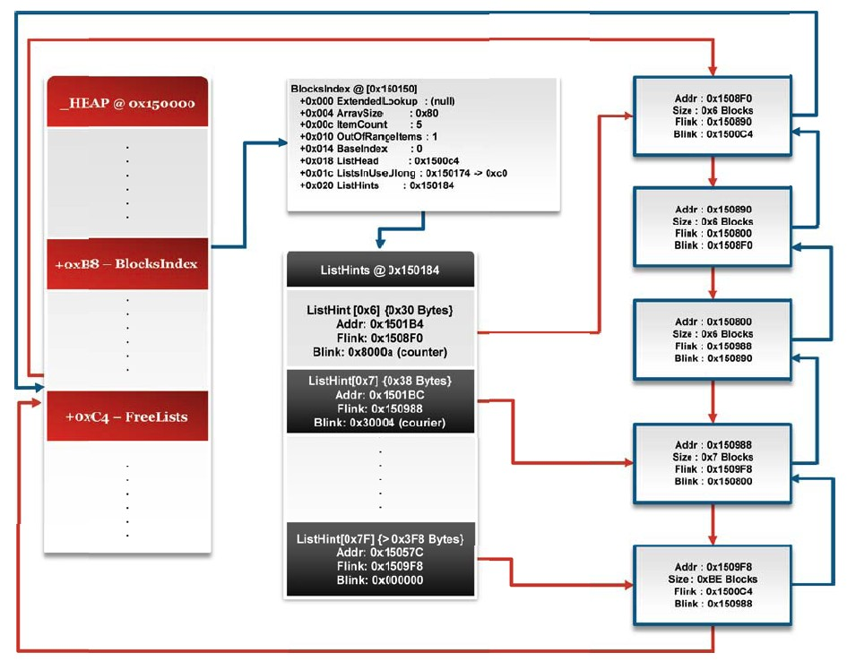

假定这已经处理好了，因此无需创建新的数据结构，`_LIST_ENTRY`也可以有多重用途。不幸的是，如Ben Hawkes所指出的那样(Hawkes 2008)，`_HEAP_BUCKET`结构可能被覆写并破坏前端分配器。因此，Windows 8堆团队决定为分配计数增加一个专门的变量并存储`_HEAP_BUCKET`索引(取代实际的`_HEAP_BUCKET`)，把这些连同位图优化放在一起用于决定何时使用前端堆，何时使用后端堆。

你可以在下图中看到`ListHints`不再在Blink中包含counter，它被设置为NULL。同时，`HeapBase`增加了新的成员，用于跟踪LFH应为哪些chunk尺寸服务。这不仅仅加速了分配所属的判断，更是作为一个缓解措施有效的针对了Ben Hawkes的`_HEAP_BUCKET`覆写攻击手法。

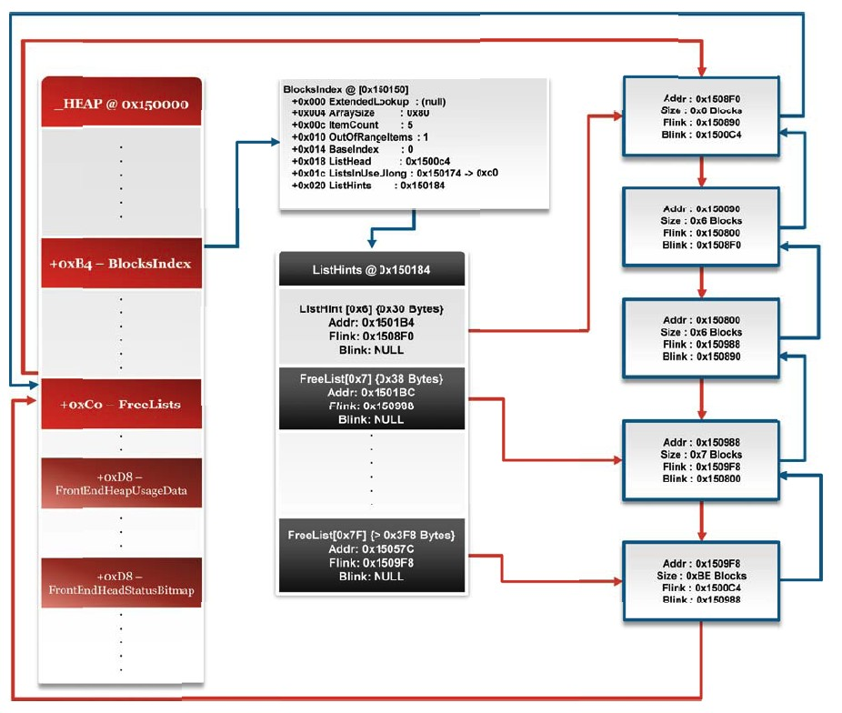

### 算法 - 分配

本节将探讨Windows 8堆管理器使用的分配算法。第一小节覆盖了中间件算法，它判断了服务该请求到底应该用LFH还是用后端堆。第二小节详述了后端堆，它使用启发式策略来激活LFH。最后，会详述LFH分配例程。中间件和后端算法与Windows 7版本大同小异，而LFH分配器则有着显著的变化。

> 注意：为了更好的理解分配过程，这里简化并省略了很多代码。如果想要更深层次的信息请联系Chris。

#### 中间件

LFH或后端堆被使用前，具体的字段需要被检查以判断应该使用哪一个。负责该任务的函数是`RtlAllocateHeap`。函数签名如下：

```cpp
void *RtlAllocateHeap(_HEAP *Heap, DWORD Flags, size_t Size);
```

该函数处理的第一件事是对请求内存的总量做一些检查。如果请求尺寸过大(32位上大于2GB)，那么调用直接失败。如果请求尺寸过小，那么就会改为请求最小的内存单位。此后，该尺寸会向上按8字节取整，因为所有的chunks都以block为单位，而不是字节。

```cpp
void *chunk;
//if the size is above 2GB, it won't be serviced
//如果尺寸大于2GB，是不会服务该请求的
if(Size > 0x7FFFFFFF)
	return ERROR_TOO_BIG;

//ensure that at least 1‐byte will be allocated
//and subsequently rounded (result ==> 8 byte alloc)
//确保至少分配一个字节，向上取整就是8个字节
if(Size == 0)
	Size = 1;

//ensure that there will be at least 8 bytes for user data
//and 8 bytes for the _HEAP_ENTRY header
//确保至少有8个字节的用户数据，8个字节的_HEAP_ENTRY头
int RoundSize = (Size + 15) & 0xFFFFFF8;

//blocks are contiguous 8‐byte chunks
//连续的8字节chunks
int BlockSize = RoundSize / 8;
```

下一步，如果chunk的尺寸超过了LFH可以服务的范围(`<16k`)，那么就会使用后端堆分配。后端堆从定位合适的`BlocksIndex`结构开始，标记要用到的`ListHint`。如果`BlocksIndex`没有足够大小的`ListHint`，那么就使用`OutOfRange ListHint`(也就是`ListHints[BlocksIndex->ArraySize-1]`)。最后，后端分配器将获取正确的函数参数并试图分配内存，成功则返回一个chunk，失败则返回某个error。

```cpp
//The maximum allocation unit for the LFH 0x4000 bytes
//0x4000字节(16K)是LFH最大分配单元
if(Size > 0x4000)
{
  _HEAP_LIST_LOOKUP *BlocksIndex;
  while(BlockSize >= BlocksIndex‐>ArraySize)
  {
    if(!BlocksIndex‐>ExtendedLookup)
    {
      BlockSize = BlocksIndex‐>ArraySize ‐ 1;
      break;
    }
    BlocksIndex = BlocksIndex‐>ExtendedLookup;
  }
  //gets the ListHint index based on the size requested
  //根据请求尺寸获取ListHint索引
  int Index = GetRealIndex(BlocksIndex, BlockSize);
  _LIST_ENTRY *hint = Heap‐>ListHints[Index];
  int DummyRet;
  
  chunk = RtlpAllocateHeap(Heap, Flags | 2, Size, RoundSize, Hint, &DummyRet);
  if(!chunk)
  	return ERROR_NO_MEMORY;
  return chunk;
}
```

如果请求的尺寸可以由LFH处理，那么`RtlAllocateHeap`将试图查看该尺寸的前端堆是否被激活了(记住这里是向上取整的尺寸，而不是调用时请求的尺寸)。如果位图中标识了该尺寸的LFH被激活了，那就使用LFH来分配。如果LFH分配失败或者位图标识着LFH没有被启用，那么就会用上面描述的例程进行分配，也就是通过后端堆来分配。

```cpp
else
{
  //check the status bitmap to see if the LFH has been enabled
  //查看位图的状态，LFH是否被激活
  int BitmapIndex = 1 << (RoundSize / 8) & 7;
  if(BitmapIndex & Heap‐>FrontEndStatusBitmap[RoundSize >> 6])
  {
    //Get the BucketIndex (as opposed to passing a _HEAP_BUCKET)
    //获取BucketIndex (而不是直接传递一个_HEAP_BUCKET)
    _LFH_HEAP LFH = Heap‐>FrontEndHeap;
    unsigned short BucketIndex = FrontEndHeapUsageData[BlockSize];
    
    chunk = RtlpLowFragHeapAllocFromContext(LFH,
    BucketIndex, Size, Flags | Heap‐>GlobalFlags);
  }
  if(!chunk)
  	TryBackEnd();
  else
  	return chunk;
}
```

> 注意：Windows 7中`ListHint->Blink`将被检查以判断对请求的尺寸的LFH是否被激活了。新的位图机制以及用户数据数组已经接过了这项大任，同时也作为一种exp的缓解措施。

#### 后端

后端分配器和Windows 7几乎一致，除了新的位图机制和状态数组取代了`ListHint.Blink`，用于跟踪LFH的激活状态。对虚分配来说也增加了一些安全特性，防止地址的可预测行为。为后端分配负责的函数是`RtlpAllocateHeap`，函数签名大抵如下：

```cpp
void *__fastcall RtlpAllocateHeap(_HEAP *Heap, int Flags, int Size, unsigned int RoundedSize, _LIST_ENTRY *ListHint, int *RetCode)
```

后端分配的第一步是对中间函数的补充，确保其设置了最小和最大尺寸。最大尺寸字节数必须低于2GB，最小字节数必须为16字节，8字节头部以及8字节用户数据。此外，他还会检查堆是否设置了使用LFH(可以设置为永远不使用LFH)，更新一些启发式策略值。

```cpp
void *Chunk = NULL;
void *VirtBase;
bool NormalAlloc = true;

//covert the 8‐byte aligned amount of bytes
// to 'blocks' assuring space for at least 8‐bytes user and 8‐byte header
//转换8字节对齐总量到'blocks'单位，确保至少有8字节用户数据和8字节头部
int BlockSize = RoundedSize / 8;
if(BlocksSize < 2)
{
  BlockSize = 2;
  RoundedSize += 8;
}
//32‐bit arch will only allocate less than 2GB
//32位架构只能分配小于2GB的内存
if(Size >= 0x7FFFFFFF)
	return 0;
//if we have serialization enabled (i.e. use LFH) then go through some heuristics
//如果串行标记被启用了，直接跳过启发式策略的设置
if(!(Flags & HEAP_NO_SERIALIZE))
{
  //This will activate the LFH if a FrontEnd allocation is enabled
  //如果前端分配被启用了，那么这就会激活LFH
  if (Heap‐>CompatibilityFlags & 0x30000000)
  	RtlpPerformHeapMaintenance(vHeap);
}
```

下一步就是测试待分配的尺寸是否大于`VirtualMemory`的阈值(`RtlCreateHeap`默认设置为0x7F000)。如果分配尺寸过大，`FreeLists`会被绕过转而使用虚分配。新增的特性会使用一些安全措施来增大分配以确保虚分配的内存地址不再那么容易预测。Windows 8会生成一个随机数，把它用作虚分配内存的头部起始，当然副作用就是请求的内存总量也会被随机化。

```cpp
//Virtual memory threshold is set to 0x7F000 in RtlCreateHeap()
//在RtlCreateHeap中，虚分配阈值被设置为0x7F000
if(BlockSize > Heap‐>VirtualMemoryThreshold)
{
  //Adjust the size for a _HEAP_VIRTUAL_ALLOC_ENTRY
  //调整_HEAP_VIRTUAL_ALLOC_ENTRY的尺寸
  RoundedSize += 24;
  
  int Rand = (RtlpHeapGenerateRandomValue32() & 15) << 12;
  
  //Total size needed for the allocation
  //需要分配的尺寸总量
  size_t RegionSize = RoundedSize + 0x1000 + Rand;
  
  int Protect = PAGE_READWRITE;
  if(Flags & 0x40000)
  	Protect = PAGE_EXECUTE_READWRITE;
  
  //if we can't reserve the memory, then we're going to abort
  //如果我们无力保留该大小的内存，就中止
  if(NtAllocateVirtualMemory(‐1, &VirtBase, 0, &RegionSize,
  MEM_RESERVE, Protect) < 0)
  	return NULL;
  
  //Return at an random offset into the virtual memory
  //返回虚分配内存的一个随机偏移量
  _HEAP_VIRTUAL_ALLOC_ENTRY *Virt = VirtBase + Rand;
  
  //If we can't actually commit the memory, abort
  //如果我们实际上并不能提交该内存，也中止
  if(NtAllocateVirtualMemory(‐1, &Virt, 0, &RoundedSize,
  MEM_COMMIT, Protect) < 0)
  {
    RtlpSecMemFreeVirtualMemory(‐1, &VirtBase, &Rand, MEM_RESET);
    ++heap‐>Counters.CommitFailures;
    return NULL;
  }
  //Assign the size, flags, etc
  //赋予尺寸，标记等
  SetInfo(Virt);
  
  //add the virtually allocated chunk to the list ensuring
  //safe linking in at the end of the list
  //把虚分配chunk增加到链表中，确保其在链表的尾部被安全链入
  if(!SafeLinkIn(Virt))
  	RtlpLogHeapFailure();
  
  Chunk = Virt + sizeof(_HEAP_VIRTUAL_ALLOC_ENTRY);
  return Chunk;
}
```

如不使用虚分配，后端堆会尝试更新启发式机制来让堆管理器知晓LFH可以被使用，如果可以且需要的话。

```cpp
//attempt to determine if the LFH should be enabled for the size requested
//试图判断为该请求尺寸的LFH是否要启用
if(BlockSize >= Heap‐>FrontEndHeapMaximumIndex)
{
  //if a size that could be serviced by the LFH is requested
  //attempt to set flags indicating bucket activation is possible
  //如果LFH可以服务的尺寸被请求到，就试图设置标志来指示bucket是可以激活的
  if(Size < 0x4000 && (Heap‐>FrontEndHeapType == 2 && !Heap‐>FrontEndHeap))
  	Heap‐>CompatibilityFlags |= 0x20000000;
}
```

在兼容性检查后，期望的尺寸被立即用于判断是否落入LFH的边界之内。如是则分配计数器被更新并试图查看`_HEAP_BUCKET`是否是活跃的。如果堆bucket是活跃的，那么`FrontEndHeapStatusBitmap`就会被更新以告知堆管理器，下一个分配应该从LFH中进行，而不再是从后端。否则，仅仅递增分配计数来标志着已经进行了一次分配，计数增长到一定程度会触发堆bucket的活跃态。

```cpp
else if(Size < 0x4000)
{
  //Heap‐>FrontEndHeapStatusBitmap has 256 possible entries
  //Heap->FrontEndHeapStatusBitmap有256个条目
  int BitmapIndex = BlockSize / 8;
  int BitPos = BlockSize & 7;
  
  //if the lfh isn't enabled for the size we're attempting to allocate
  //determine if we should enable it for the next go‐around
  //如果LFH没有为该尺寸激活，就判断我们是否要为后来的分配激活它
  if(!((1 << BitPos) & Heap‐>FrontEndHeapStatusBitmap[BitmapIndex]))
  {
    //increment the counter used to determine when to use the LFH
    //增加用来判断何时使用LFH的计数器
    unsigned short Count = Heap‐>FrontEndHeapUsageData[BlockSize] + 0x21;
    Heap‐>FrontEndHeapUsageData[BlockSize] = Count;
    //if there were 16 consecutive allocation or many allocations consider LFH
    //如果有16个或更多连续的分配，就考虑考虑LFH
    if((Count & 0x1F) > 0x10 || Count > 0xFF00)
    {
      //if the LFH has been initialized and activated, use it
      //如果LFH已经被初始化且激活了，就使用它
      _LFH_HEAP *LFH = NULL;
      if(Heap‐>FrontEndHeapType == 2)
      	LFH = heap‐>FrontEndHeap;
      
      //if the LFH is activated, it will return a valid index
      //如果LFH是激活的，它会返回一个合法的索引
      short BucketIndex = RtlpGetLFHContext(LFH, Size);
      if(BucketIndex != ‐1)
      {
        //store the heap bucket index
        //存储堆bucket索引
        Heap‐>FrontEndHeapUsageData[BlockSize] = BucketIndex;
        //update the bitmap accordingly
        //更新位图的对应位
        Heap‐>FrontEndHeapStatusBitmap[BitmapIndex] |= 1 << BitPos;
      }
      else if(Count > 0x10)
      {
        //if we haven't been using the LFH, we will next time around
        //如果我们此前未使用过LFH，我们下一次会使用它
        if(!LFH)
            Heap‐>CompatibilityFlags |= 0x20000000;
      }
    }
  }
}
```

有了前端启发式激活这一方式，后端现在可以开始搜索一个chunk来满足分配请求。第一个被检查的就是传递给`RtlpAllocateHeap`的`ListHint`，在`RtlAllocateHeap`中获得的`ListHint`是最明显的选择。如果`ListHint`没能提供或不包含任何的空闲chunks，就意味着对期望的总字节数没有一个完美的匹配，`FreeLists`将被跟踪以找到一个充足的chunk(一定是大于等于请求尺寸的chunk)。如果还是没有合适尺寸的chunks，堆就必须由`RtlpExtendHeap`来扩展。如果`FreeLists`中寻找chunk失败且扩展堆也失败了，那么最后才会返回一个错误。

```cpp
//attempt to use the ListHints to optimally find a suitable chunk
//试图使用ListHints来找到一个最合适的chunk
_HEAP_ENTRY *HintHeader = NULL;
_LIST_ENTRY *FreeListEntry = NULL;
if(ListHint && ListHint‐>Flink)
	HintHeader = ListHint ‐ 8;
else
{
  FreeListEntry = RtlpFindEntry(Heap, BlockSize);
  if(&Heap‐>FreeLists == FreeListEntry)
  {
    //if the freelists are empty, you will have to extend the heap
    //如果freelists为空，就需要扩展堆
    _HEAP_ENTRY *ExtendedChunk = RtlpExtendHeap(Heap, aRoundedSize);
    if(ExtendedChunk)
    	HintHeader = ExtendedChunk;
    else
    	return NULL;
  }
  else
  {
    //try to use the chunk from the freelist
    //尝试使用freelist的chunk
    HintHeader = FreeListEntry ‐ 8;
    if(Heap‐>EncodeFlagMask)
    	DecodeValidateHeader(HintHeader, Heap);
    
    int HintSize = HintHeader‐>Size;
    
    //if the chunk isn't big enough, extend the heap
    //如果chunk不够大，就扩展堆
    if(HintSize < BlockSize)
    {
      EncodeHeader(HintHeader, Heap);
      _HEAP_ENTRY *ExtendedChunk = RtlpExtendHeap(Heap, RoundedSize);
      if(ExtendedChunk)
          HintHeader = ExtendedChunk;
      else
          return NULL;
    }
  }
}
```

返回前夕，后端将检查从`FreeLists`取得的条目有没有被污染，如果双向链表被污染了，那就返回错误。这一功能自Windows XP SP2引入，干掉了一票通用堆溢出利用手法。

```cpp
ListHint = HintHeader + 8;
_LIST_ENTRY *Flink = ListHint‐>Flink;
_LIST_ENTRY *Blink = ListHint‐>Blink;

//safe unlinking or bust
//要么安全链出，要么瞬间爆炸
if(Blink‐>Flink != Flink‐>Blink || Blink‐>Flink != ListHint)
{
  RtlpLogHeapFailure(12, Heap, ListHint, Flink‐>Blink, Blink‐>Flink, 0);
  return ERROR;
}
unsigned int HintSize = HintHeader‐>Size;
_HEAP_LIST_LOOKUP *BlocksIndex = Heap‐>BlocksIndex;
if(BlocksIndex)
{
  //this will traverse the BlocksIndex looking for
  //an appropriate index, returning ArraySize ‐ 1
  //for a chunk that doesn't have a ListHint (or is too big)
  //追溯BlocksIndex来找到一个合适的索引，如果对一个chunk来说
  //没有对应的ListHint(或尺寸过巨)就返回ArraySize - 1
  HintSize = SearchBlocksIndex(BlocksIndex);
}
//updates the ListHint linked lists and Bitmap used by the BlocksIndex
//更新ListHint链表以及BlocksIndex所用的位图
RtlpHeapRemoveListEntry(Heap, BlocksIndex, RtlpHeapFreeListCompare,
ListHint, HintSize, HintHeader‐>Size);

//unlink the entry from the linked list
//safety check above, so this is OK
//从链表中断链chunk，在之前已经检查过了，所以这里不检查也OK
Flink‐>Blink = Blink;
Blink‐>Flink = Flink;
```

> 注意：头部编码和解码部分代码被移除了。你只要记住在头部属性被访问之前就会进行解码操作，而在这之后会立即进行编码操作。

最后，头部值被更新，内存被零化（如果需要的话）。我移除了块切割的过程。对chunk的切割你可以查看`RtlpCreateSplitBlock`来了解更多细节(如果`UnusedBytes`大于1的话就会发生)。

```cpp
if( !(HintHeader‐>Flags & 8) || RtlpCommitBlock(Heap, HintHeader))
{
  //Depending on the flags and the unused bytes the header
  //will set the UnusedBytes and potentially alter the 'next'
  //chunk directly after the one acquired from the FreeLists
  //which migh result in a call to RtlpCreateSplitBlock()
  //根据标志和未使用的字节数，头部会设置UnusedBytes并潜在的改变
  //从FreeLists获取到的chunk的下一个chunk，引起对RtlpCreateSplitBlock()的调用
  int UnusedBytes = HintHeader‐>Size ‐ RoundedSize;
  bool OK = UpdateHeaders(HintHeader);
  
  if(OK)
  {
    //We've updated all we need, MEM_ZERO the chunk
    //if needed and return to the calling function
    //我们已经更新了所有需要的，MEM_ZERO该chunk如果需要的话
    //返回给调用函数
    Chunk = HintHeader + 8;
    if(Flags & 8)
    	memset(Chunk, 0, HintHeader‐>Size ‐ 8);
    return Chunk;
  }
  else
  	return ERROR;
}
else
{	
  RtlpDeCommitFreeBlock(Heap, HintHeader, HintHeader‐>Size, 1);
  return ERROR;
}
```

#### 前端

LFH是Windows 8唯一的前端分配器，它有能力处理尺寸小于16k(0x4000字节)的chunks。与Windows 7一样，Windows 8 LFH也使用`UserBlocks`，它用做预分配容器分割成较小的chunks来服务内存请求。以上就是所有的相似之处。搜索FREE chunks、分配`UserBlocks`以及许多其他的任务都发生了变化。前端分配负责的函数是`RtlpLowFragHeapAllocFromContext`，它的签名如下：

```cpp
void *RtlpLowFragHeapAllocFromContext(_LFH_HEAP *LFH, unsigned short BucketIndex, int Size, char Flags)
```

你可能注意到的第一件事就是`_HEAP_BUCKET`指针不再作为函数参数传递，取而代之的是，传递了LFH内`HeapBucket`数组的索引值。我们此前已经讨论过，此举是为了阻止Ben Hawkes的攻击手法。

第一步是判断我们处理的尺寸是否已被打上了affinity的标签，如果是的话，就要初始化即将用到的所有的变量。

```cpp
_HEAP_BUCKET *HeapBucket = LFH‐>Buckets[BucketIndex];
_HEAP_ENTRY *Header = NULL;

int VirtAffinity = NtCurrentTeb()‐>HeapVirtualAffinity ‐ 1;
int AffinityIndex = VirtAffinity;
if(HeapBucket‐>UseAffinity)
{
  if(VirtAffinity < 0)
  	AffinityIndex = RtlpAllocateAffinityIndex();
  
  //Initializes all global variables used for Affinity based allocations
  //初始化基于亲和性分配的所有全局变量
  AffinitySetup();
}
```

在affinity变量全部被初始化后，前端将决定用哪个数组来获取`_HEAP_LOCAL_SEGMENT_INFO`结构，按尺寸(和亲和性affinity，如果存在的话)排序。此后它会获取`ActiveSubsegment`，它将为即将到来的分配所用。

```cpp
int SizeIndex = HeapBucket‐>SizeIndex;
_HEAP_LOCAL_SEGMENT_INFO *LocalSegInfo;

if(AffinityIndex)
	LocalSegInfo = LFH‐>AffinitizedInfoArrays[SizeIndex][AffinityIndex ‐ 1];
else
	LocalSegInfo = LFH‐>SegmentInfoArrays[SizeIndex];

_HEAP_SUBSEGMENT *ActiveSubseg = LocalSegInfo‐>ActiveSubsegment;
```

> 注意：你会注意到不再有Hint Subsegment了，它已经被移除了。

下一步，会进行检查来确保`ActiveSubsegment`非空，如果`ActiveSubsegment`是NULL，就检查此前用过的`_HEAP_SUBSEGMENT`的缓存。最好是`Subsegment`有效且`Depth`, `Hint`和`UserBlocks`均被找到。其中`Depth`表示剩余chunks的数量。`Hint`曾经是`UserBlocks`中第一个free chunk的偏移，但现在它用于其它目的。

如果`UserBlocks`还没有部署或者`UserBlocks`容器内没有剩余chunks，那么会检查缓存并创建一个新的`UserBlocks`。这就好比一头扎入之前要先检查游泳池是否存在，也要检查游泳池的水是否满溢。

```cpp
//This is actually done in a loop but left out for formatting reasons
//The LFH will do its best to attempt to service the allocation before giving up
//实际上由循环完成，但因为格式问题没有保留
//在放弃之前，LFH将尽最大努力来服务内存分配
if(!ActiveSubseg)
	goto check_cache;

_INTERLOCK_SEQ *AggrExchg = ActiveSubseg‐>AggregateExchg;
//ensure the values are acquired atomically
//确保原子地获取该值
int Depth, Hint;
AtomicAcquireDepthHint(AggrExchg, &Depth, &Hint);

//at this point we should have acquired a sufficient subsegment and can
//now use it for an actual allocation, we also want to make sure that
//the UserBlocks has chunks left along w/ a matching subsegment info structures
//此时我们已经获取到了合适的subsegment，现在可以用来处理实际的分配了
//我们也要确保UserBlocks还有剩余的chunks
_HEAP_USERDATA_HEADER *UserBlocks = ActiveSubseg‐>UserBlocks;

//if the UserBlocks haven't been allocated or the
//_HEAP_LOCAL_SEGMENT_INFO structures don't match
//attempt to acquire a Subsegment from the cache
//如果UserBlocks尚未被分配或者_HEAP_LOCAL_SEGMENT_INFO结构不匹配
//尝试从缓存中获取一个Subsegment
if(!UserBlocks || ActiveSubseg‐>LocalInfo != LocalSegInfo)
	goto check_cache;
```

这里既有和Windows 7相似之处，也有Windows 8自身出彩的地方。不再是盲目的使用`Hint`作为`UserBlocks`的索引，Windows 8将使用另一个值(`FreeEntryOffset`)来更新自己，它使用`UserBlocks`的随机偏移作为起始点。

新的处理过程的第一步就是获取一个随机值，它预先填充到一个全局数组中。使用该随机值而不是下一个可用的free chunk，分配器就可以避免堆布局的确定性，它对于UAF以及连续溢出漏洞的利用增加了相当的难度。

```cpp
//Instead of using the FreeEntryOffset to determine the index
//of the allocation, use a random byte to start the search
//不再使用FreeEntryOffset来决定分配的索引，而是使用随机字节作为搜索的起始位置
short LFHDataSlot = NtCurrentTeb()‐>LowFragHeapDataSlot;
BYTE Rand = RtlpLowFragHeapRandomData[LFHDataSlot];
NtCurrentTeb()‐>LowFragHeapDataSlot++;
```

此后在`UserBlock`容器中用于判断哪些chunks是free，哪些是busy的位图，会被获取到并会为指定的free chunks选择一个起始偏移。

```cpp
//we need to know the size of the bitmap we're searching
//搜索前我们需要知晓位图的尺寸
unsigned int BitmapSize = UserBlocks‐>BusyBitmap‐>SizeOfBitmap;

//Starting offset into the bitmap to search for a free chunk
//从位图的StartOffset偏移处开始搜索free chunk
unsigned int StartOffset = Rand;

void *Bitmap = UserBlocks‐>BusyBitmap‐>Buffer;

if(BitmapSize < 0x20)
	StartOffset = (Rand * BitmapSize) / 0x80;
else
	StartOffset = SafeSearchLargeBitmap(UserBlocks‐>BusyBitmap‐>Buffer);
```

> 注意：`StartOffset`可能实际上不是FREE态。它仅仅是搜索FREE chunk的一个起始点。

位图此后循环右移以保证即使我们从一个随机位置开始，所有的可用的位置也都会被检测到。此后，由于汇编指令`bsf`的效果，位图需要被翻转。它会扫描位图寻找第一个bit为1的实例。因为我们对FREE chunks感兴趣，位图必须把所有的0都翻转成1。

```cpp
//Rotate the bitmap (as to not lose items) to start
//at our randomly chosen offset
//循环遍历位图，从随机选择的偏移开始
int RORBitmap = __ROR__(*Bitmap, StartOffset);

//since we're looking for 0's (FREE chunks)
//we'll invert the value due to how the next instruction works
//因为我们要找0的位(FREE chunks)
//所以我们会翻转该值，出于下一个指令的效果
int InverseBitmap = ~RORBitmap;

//these instructions search from low order bit to high order bit looking for a 1
//这些指令从低位到高位查找1
//since we inverted our bitmap, the 1s will be 0s (BUSY) and the 0s will be 1s (FREE)
//因为我们翻转了位图，所以1实际上是0(Busy)，而0实际上是1(Free)
// <‐‐ search direction
//搜索方向
//H.O L.O
//‐‐‐‐‐‐‐‐‐‐‐‐‐‐‐‐‐‐‐‐‐‐‐‐‐‐‐‐‐‐‐‐‐‐‐‐‐‐‐‐‐‐‐‐‐‐‐‐‐‐‐‐‐‐‐
//| 1 | 1 | 1 | 0 | 0 | 1 | 1 | 1 | 0 | 1 | 1 | 0 | 0 | 0
//‐‐‐‐‐‐‐‐‐‐‐‐‐‐‐‐‐‐‐‐‐‐‐‐‐‐‐‐‐‐‐‐‐‐‐‐‐‐‐‐‐‐‐‐‐‐‐‐‐‐‐‐‐‐‐
//the following code would look at the bitmap above, starting at L.O
//looking for a bit position that contains the value of one, and storing that index
//下面的代码会查看上面的位图，从L.O开始找到一个包含值为1的位，存储该索引值
int FreeIndex;
__asm{bsf FreeIndex, InverseBitmap};
```

现在位图需要被更新，chunk内存的地址需要从位图的索引来推导出来，它和`StartOffset`理应不同(取决于哪些chunks是free态，哪些是busy态)。`Depth`可以按1递减，`Hint`被更新，尽管它不再用于chunk的分配偏移了。

chunk的头部通过`UserBlocks`的起始地址增加`FirstAllocationOffset`来获取。位图的索引(`UserBlocks`中有着一对一的关系)会乘上`BlockStride`。

```cpp
//shows the difference between the start search index and
//the actual index of the first free chunk found
//展示起始搜索索引和找到的第一个空闲chunk实际索引的区别
int Delta = ((BYTE)FreeIndex + (BYTE)StartOffset) & 0x1F;

//now that we've found the index of the chunk we want to allocate
//mark it as 'used'; as it previously was 'free'
//现在我们已经找到了想要分配的chunk的索引，标记为'used'，此前它是'free'
*Bitmap |= 1 << Delta;

//get the location (current index into the UserBlock)
//获取位置(UserBlock的当前索引)
int NewHint = Delta + sizeof(_HEAP_USERDATA_HEADER) *
(Bitmap ‐ UserBlocks‐>BusyBitmap‐>Buffer);

AggrExchg.Depth = Depth ‐ 1;
AggrExchg.Hint = NewHint;

//get the chunk header for the chunk that we just allocated
//获取刚刚分配的chunk头
Header = (_HEAP_ENTRY)UserBlocks + UserBlocks‐>FirstAllocationOffset + (NewHint * UserBlocks‐>BlockStride);
```

最后，会对头部进行检查以保证不会返回一个被污染的chunk。最后chunk的头部被更新，并返回给调用函数。

```cpp
if(Header‐>UnusedBytes & 0x3F)
	RtlpReportHeapFailure(14, LocalSegInfo‐>LocalData‐>LowFragHeap‐>Heap,
Header, 0, 0, 0);

if(Header)
{
  if(Flags & 8)
  	memset(Header + 8, 0, HeapBucket‐>BlockUnits ‐ 8);
  
  //set the unused bytes if there are any
  //设置未使用字节数，如果有的话
  int Unused = (HeapBucket‐>BlockUnits * 8) ‐ Size;
  Header‐>UnusedBytes = Unused | 0x80;
  if(Unused >= 0x3F)
  {
    _HEAP_ENTRY *Next = Header + (8 * HeapBucket‐>BlockUnits) ‐ 8;
    Next‐>PreviousSize = Unused;
    Header‐>UnusedBytes = 0xBF;
  }
  return Header + sizeof(_HEAP_ENTRY);
}
```

不幸的是，有时候`_HEAP_SUBSEGMENT`和对应的`UserBlocks`还没有初始化，比如第一个某个具体尺寸的LFH分配就是这样。这种情况，如下面所展示，是需要搜索`Subsegment`缓存的。如果不存在`_HEAP_SUBSEGMENT`缓存，那么就会随后创建一个。

```cpp
_HEAP_SUBSEGMENT *NewSubseg = NULL;
NewSubseg = SearchCache(LocalSegInfo);
```

> 注意：我简化了缓存搜索功能。可以查看二进制来了解更多细节。

此时，`UserBlocks`需要被创建，因此请求尺寸的chunks对LFH来说应是可用的。有一个严格的公式可以计算整个`UserBlocks`尺寸，它有点复杂，它以请求的尺寸、该尺寸chunks的总量(每`_HEAP_LOCAL_SEGMENT_INFO`)以及亲和性affinity为基础计算。

```cpp
int PageShift, BlockSize;
int TotalBlocks = LocalSegInfo‐>Counters‐>TotalBlocks;

//Based on the amount of chunks allocated for a given
//_HEAP_LOCAL_SEGMENT_INFO structure, and the _HEAP_BUCKET
//size and affinity formulate how many pages to allocate
//对给定_HEAP_LOCAL_SEGMENT_INFO结构，基于分配chunks的总量和_HEAP_BUCKET
//尺寸和亲和性来计算需要分配多少个页面
CalculateUserBlocksSize(HeapBucket, &PageShift, &TotalBlocks, &BlockSize);
```

> 注意：`UserBlocks`尺寸计算的更多细节请参考二进制。

代码的下一部分在Consumer Preview期间增加，作为阻止连续溢出以污染毗邻内存的一种手段。如果满足具体条件，就会设置一个守护页，堆管理器将以此拦截试图访问无效内存的行为，并终止进程。守护页标志会传递给`RtlpAllocateUserBlock`，因此在`UserBlocks`分配时，还要考虑这一额外的内存。

```cpp
//If we've seen enough allocations or the number of pages
//to allocate is very large, we're going to set a guard page
//after the UserBlocks container
//如果分配量足够多或者分配的页数非常大，那么就需要在UserBlocks容器之后设置一个守护页
bool SetGuard = false;
if(PageShift == 0x12 || TotalBlocks >= 0x400)
	SetGuard = true;

//Allocate memory for a new UserBlocks structure
//为新的UserBlocks结构分配内存
_HEAP_USERDATA_HEADER *UserBlock =
RtlpAllocateUserBlock(LFH, PageShift, BlockSize + 8, SetGuard);
if(UserBlock == NULL)
	return 0;
```

Windows 8版本的`RtlpAllocateUserBlock`和Windows 7非常相似，但有一个小差别。它不再是自己处理后端的分配，而是通过调用`RtlpAllocateUserBlockFromHeap`这一函数来处理。

`RtlpAllocateUserBlock`签名如下：

```cpp
_HEAP_USERDATA_HEADER *RtlpAllocateUserBlock(_LFH_HEAP *LFH, unsigned __int8 PageShift, int ChunkSize, bool SetGuardPage)
```

```cpp
int ByteSize = 1 << PageShift;
if(ByteSize > 0x78000)
	ByteSize = 0x78000;
UserBlocks = CheckCache(LFH‐>UserBlockCache, PageShift);

if(!UserBlocks)
	UserBlocks = RtlpAllocateUserBlockFromHeap(LFH‐>Heap, PageShift,
ChunkSize, SetGuardPage);
UpdateCounters(LFH‐>UserBlockCache, PageShift);

return UserBlocks;
```

`RtlpAllocateUserBlockFromHeap`为`UserBlock`容器提供分配服务，如果需要的话还会增加一个守护页。函数签名如下：

```cpp
_HEAP_USERDATA_HEADER *RtlpAllocateUserBlockFromHeap(_HEAP *Heap, PageShift, ChunkSize, SetGuardPage)
```

该函数的第一件事就是获取合适的尺寸，以字节为单位，为`UserBlocks`容器分配内存。如果内存不够就会返回NULL。

```cpp
int ByteSize = 1 << PageShift;
if(ByteSize > 0x78000)
	ByteSize = 0x78000;

int SizeNoHeader = ByteSize ‐ 8;
int SizeNoHeaderOrig = SizeNoHeader;

//Add extra space for the guard page
//为守护页增加额外空间
if(SetGuardPage)
	SizeNoHeader += 0x2000;

_HEAP_USERDATA_HEADER *UserBlocks = RtlAllocatHeap(Heap, 0x800001, SizeNoHeader);
if(!UserBlocks)
	return NULL;
```

此后`RtlpAllocateUserBlockFromHeap`会检查`SetGuardPage`变量是否为true，它表示`UserBlocks`之间需要实施额外的保护。如果额外的保护是需要的，那么额外的页(0x1000字节)内存就会增加到总量上，并且给予该页`PAGE_NOACCESS`的权限。最后，`_HEAP_USERDATA_HEADER`成员会被更新，以表示增加了守护页，从其对象被返回给`RtlpAllocateUserBlock`。

```cpp
if(!SetGuardPage)
{
  UserBlocks‐>GuardPagePresent = false;
  return UserBlocks;
}

//add in a guard page so that a sequential overflow will fail
//as PAGE_NOACCESS will raise a AV on read/write
//增加一个守护页，以致于连续溢出会因为PAGE_NOACCESS抛出读写请求的访问违例异常而失败
int GuardPageSize = 0x1000;
int AlignedAddr = (UserBlocks + SizeNoHeaderOrig + 0xFFF) & 0xFFFFF000;
int NewSize = (AlignedAddr ‐ UserBlocks) + GuardPageSize;

//reallocate the memory
//重新分配内存
UserBlocks = RtlReAllocateHeap(Heap, 0x800001, UserBlocks, NewSize);
//Sets the last page (0x1000 bytes) of the memory chunk to PAGE_NOACCESS (0x1)
//http://msdn.microsoft.com/en‐us/library/windows/desktop/aa366786(v=vs.85).aspx
//设置内存chunk的最后一页(0x1000字节)为PAGE_NOACCESS权限(0x1)
ZwProtectVirtualMemory(‐1, &AlignedAddr, &GuardPageSize, PAGE_NOACCESS, &output);

//Update the meta data for the UserBlocks
//更新UserBlocks的元数据
UserBlocks‐>GuardPagePresent = true;
UserBlocks‐>PaddingBytes = (SizeNoHeader ‐ GuardPageSize) ‐ SizeNoHeaderOrig;
UserBlocks‐>SizeIndex = PageShift;

return UserBlocks;
```

从这里开始`RtlpAllocateUserBlock`会返回一个`UserBlock`容器给`RtlpLowFragHeapAllocFromContext`，它最终与一个`_HEAP_SUBSEGMENT`结构相关联。

`Subsegment`要么来自一个`_HEAP_SUBSEGMENT`域，这是一个特殊设计的`Subsegment`结构体数组的预分配内存区域，要么来自于此前删除的`Subsegment`。如果无法获取到`Subsegment`，前端分配器就会失败并返回，这将导致后端堆来服务该请求。

```cpp
//See if there are previously deleted Subsegments to use
//查看是否存在此前删除的Subsegments可以用
NewSubseg = CheckDeletedSubsegs(LocalSegInfo);

if(!NewSubseg)
	NewSubseg = RtlpLowFragHeapAllocateFromZone(LFH, AffinityIndex);

//if we can't get a subsegment we can't fulfill this allocation
//如果我们获取不到subsegment，就无法满足分配
if(!NewSubseg)
	return;
```

`RtlpLowFragHeapAllocateFromZone`也负责为前端堆提供`_HEAP_SUBSEGMENT`。它将试图从此前分配的池(或域)中获取一个条目，如果不存在或者大小不合适的话，就分配一个新的池。函数签名如下：

```cpp
_HEAP_SUBSEGMENT *RtlpLowFragHeapAllocateFromZone(_LFH_HEAP *LFH, int AffinityIndex)
```

该函数首先从存储于`_HEAP_LOCAL_DATA`结构中的预分配域获取一个`_HEAP_SUBSEGMENT`。如果域不存在或者不包含大小足够的条目，就会创建一个`_HEAP_SUBSEGMENT`。否则，`Subsegment`会通过`RtlpLowFragHeapAllocFromContext`返回。

```cpp
int LocalIndex = AffinityIndex * sizeof(_HEAP_LOCAL_DATA);
_LFH_BLOCK_ZONE *Zone = NULL;
_LFH_BLOCK_ZONE *NewZone;
char *FreePtr = NULL;

try_zone:
//if there aren’t any CrtZones allocate some
//如果没有CrtZones
Zone = LFH‐>LocalData[LocalIndex]‐>CrtZone;
if(Zone)
{
  //this is actually done atomically
  //实际上原子的完成
  FreePtr = Zone‐>FreePointer;
  if(FreePtr + 0x28 < Zone‐>Limit)
  {
    AtomicIncrement(&Zone‐>FreePointer, 0x28);
    return FreePtr;
  }
}
```

有些时候没有域，或是没有大小充足的空间，因此该函数会尝试从后端堆分配内存。分配成功且链表通过检查的话，新的域会被链入，然后会返回`_HEAP_SUBSEGMENT`结构。如果双向链表被污染了，执行流会通过触发中断的方式立即终止。

```cpp
//allocate 1016 bytes for _LFH_BLOCK_ZONE structs
//为_LFH_BLOCK_ZONE结构分配1016字节
NewZone = RtlAllocateHeap(LFH‐>Heap, 0x800000, 0x3F8);
if(!NewZone)
	return 0;

_LIST_ENTRY *ZoneHead = &LFH‐>SubSegmentZones;
if(ZoneHead‐>Flink‐>Blink == ZoneHead &&
ZoneHeader‐>Blink‐>Flink == ZoneHead)
{
  LinkIn(NewZone);
  
  NewZone‐>Limit = NewZone + 0x3F8;
  NewZone‐>FreePointer = NewZone + sizeof(_LFH_BLOCK_ZONE);
  
  //set the current localdata
  //设置当前的localdata
  LFH‐>LocalData[LocalIndex]‐>CrtZone = NewZone;
  goto try_zone;
}
else
{
  //fast fail!
  //光速失败！
  __asm{int 0x29};
}
```

> 注意：int 0x29中断是为开发者在遭遇链表被污染事件时可以快速终止执行流而增加的。可以查看安全缓解措施一节来了解更多信息。

`RtlpLowFragHeapAllocFromContext`现在得到了一个`UserBlock`容器，并关联了一个`Subsegment`。现在前端堆可以初始化`UserBlocks`内所有的数据了，设置`_HEAP_SUBSEGMENT`的成员，这是通过调用`RtlpSubSegmentInitialize`来完成的。它的函数签名如下：

```cpp
int RtlpSubSegmentInitialize(_LFH_HEAP *LFH, _HEAP_SUBSEGMENT *NewSubSeg,
_HEAP_USERDATA_HEADER *UserBlocks, int ChunkSize, int SizeNoHeader, _HEAP_BUCKET *HeapBucket)
```

```cpp
//Initialize the Subsegment, which will divide out the
//chunks in the UserBlock by writing a _HEAP_ENTRY header
//every HeapBucket‐>BlockUnits bytes
//初始化Subsegment，在UserBlock中划分chunks
//每HeapBucket->BlockUnits字节大小的chunk，就写一个_HEAP_ENTRY头
NewSubseg‐>AffinityIndex = AffinityIndex;
RtlpSubSegmentInitialize(LFH, NewSubseg, UserBlock, RtlpBucketBlockSizes[HeapBucket‐>SizeIndex], SizeIndex ‐ 8, HeapBucket);
```

`RtlpSubsegmentInitialize`会首先通过亲和性affinity和分配请求尺寸找到合适的`_HEAP_LOCAL_SEGMENT_INFO`结构。

```cpp
_HEAP_LOCAL_SEGMENT_INFO *SegmentInfo;
_INTERLOCK_SEQ *AggrExchg = NewSubSeg‐>AggregateExchg;

int AffinityIndex = NewSubSeg‐>AffinityIndex;
int SizeIndex = HeapBucket‐>SizeIndex;

//get the proper _HEAP_LOCAL_SEGMENT_INFO based on affinity
//根据亲和性找到合适的_HEAP_LOCAL_SEGMENT_INFO
if(AffinityIndex)
	SegmentInfo = LFH‐>AffinitizedInfoArrays[SizeIndex][AffinityIndex ‐ 1];
else
	SegmentInfo = LFH‐>SegmentInfoArrays[SizeIndex];
```

此后它会计算出每个chunk的尺寸，按8字节向上取整并为每个chunk预留头部。一旦决定了每个chunk的总尺寸，那么chunks的总数量就可以通过`_HEAP_USERDATA_HEADER`结构体的空间计算出来了。有了chunks的全部尺寸以及`UserBlocks`最终可用的总内存量，就可以计算出`UserBlocks`的第一个free offset。

```cpp
unsigned int TotalSize = ChunkSize + sizeof(_HEAP_ENTRY);
unsigned short BlockSize = TotalSize / 8;

//this will be the number of chunks in the UserBlocks
//UserBlocks的chunks数量
unsigned int NumOfChunks = (SizeNoHeader ‐ sizeof(_HEAP_USERDATA_HEADER)) / TotalSize;

//Set the _HEAP_SUBSEGMENT and denote the end
//设置_HEAP_SUBSEGMENT，指示尾部
UserBlocks‐>SfreeListEntry.Next = NewSubSeg;

char *UserBlockEnd = UserBlock + SizeNoHeader;

//Get the offset of the first chunk that can be allocated
//Windows 7 just used 0x2 (2 * 8), which was the size
//of the _HEAP_USERDATA_HEADER
//获取第一个可以被分配的chunk的偏移
//Windows 7直接使用0x2(2 * 8)，它是_HEAP_USERDATA_HEADER的尺寸
unsigned int FirstAllocOffset = ((((NumOfChunks + 0x1F) / 8) & 0x1FFFFFFC) + sizeof(_HEAP_USERDATA_HEADER)) & 0xFFFFFFF8;
UserBlocks‐>FirstAllocationOffset = FirstAllocOffset;
```

> 注意：`FirstAllocationOffset`在Windows 7中不需要，因为第一个free项隐式地放在0x10字节`_HEAP_USERDATA_HEADER`之后。

在尺寸和总量计算完毕后，`RtlpSubSegmentInitialize`会迭代这片连续内存，为每个chunk写头部数据。

```cpp
//if permitted, start writing chunk headers every TotalSize bytes
//如果允许，就每TotalSize字节写一个chunk头
if(UserBlocks + FirstAllocOffset + TotalSize < UserBlockEnd)
{
  	_HEAP_ENTRY *CurrHeader = UserBlocks + FirstAllocOffset;
  	do
    {
        //set the encoded lfh chunk header, by XORing certain
        //values. This is how a Subsegment can be derived in RtlpLowFragHeapFree
      	//设置编码的lfh chunk头，通过异或某个具体的值来计算
      	//这就是RtlpLowFragHeapFree获取Subsegment的方式
        *(DWORD)CurrHeader = (DWORD)Heap‐>Entry ^ NewSubSeg ^
        RtlpLFHKey ^ (CurrHeader >> 3);
        //FreeEntryOffset replacement
      	//FreeEntryOffset替代
        CurrHeader‐>PreviousSize = Index;
        //denote as a free chunk in the LFH
      	//在LFH中指示一个free chunk
        CurrHeader‐>UnusedBytes = 0x80;
        //increment the header and counter
      	//增加header和counter
        CurrHeader += TotalSize;
        Index++;
    }
	while((CurrHeader + TotalSize) < UserBlockEnd);
}
```

> 注意：你可能注意到这里没有设置`FreeEntryOffset`，而是将索引存储于chunk头部的`PreviousSize`字段。当在LFH中释放chunk时，索引用于更新位图。

既然每个chunk中不再有`FreeEntryOffset`了，那么`UserBlocks`必须通过其他方式来跟踪空闲chunks。它通过一个关联位图来跟踪free chunks，该位图与`UserBlocks`的chunks有着一对一的关系。初始化时所有的位都是0，表示每个chunk都是free态。在位图被更新后，函数会关联`_HEAP_LOCAL_SEGMENT_INFO`(`SegmentInfo`)，`_HEAP_USERDATA_HEADER`(`UserBlocks`)到新获取/创建的`_HEAP_SUBSEGMENT`(`NewSubSeg`)。

```cpp
//Initialize the bitmap and zero out its memory (Index == Number of Chunks)
//初始化位图，零化内存(Index == chunk数量)
RtlInitializeBitMap(&UserBlocks‐>BusyBitmap; UserBlocks‐>BitmapData, Index);
char *Bitmap = UserBlocks‐>BusyBitmap‐>Buffer;

unsigned int BitmapSize = UserBlocks‐>BusyBitmap‐>SizeOfBitMap;

memset(Bitmap, 0, (BitmapSize + 7) / 8);

//This will set all the members of this structure
//to the appropriate values derived from this func
//associating UserBlocks and SegmentInfo
//这将设置该结构所有的成员值，这些值来源于关联的UserBlocks和SegmentInfo
UpdateSubsegment(NewSubSeg,SegmentInfo, UserBlocks);
```

最后，`RtlpSubSegmentInitialize`会保存新的`Depth`(chunks数量)和`Hint`(free chunk偏移)到新创建的`_INTERLOCK_SEQ`结构中。同时，`RtlpLowFragHeapRandomData`会被更新，它是一个存储无符号随机字节的数组，用于在`UserBlock`容器内搜索free chunks的起始点。

```cpp
//Update the random values each time a _HEAP_SUBSEGMENT is init
//每次_HEAP_SUBSEGMENT初始化时，更新随机值
int DataSlot = NtCurrentTeb()‐>LowFragHeapDataSlot;

//RtlpLowFragHeapRandomData is generated in
//RtlpInitializeLfhRandomDataArray() via RtlpCreateLowFragHeap
//RtlpLowFragHeapRandomData在RtlpInitializeLfhRandomDataArray()中通过
//RtlpCreateLowFragHeap生成
short RandWord = GetRandWord(RtlpLowFragHeapRandomData, DataSlot);
NtCurrentTeb()‐>LowFragHeapDataSlot = (DataSlot + 2) & 0xFF;

//update the depth to be the amount of chunks we created
//更新depth为创建的chunks的总量
_INTERLOCK_SEQ NewAggrExchg;
NewAggrExchg.Depth = Index;
NewAggrExchg.Hint = RandWord % (Index << 16);

//swap of the old and new aggr_exchg
//交换aggr_exchg的新旧值
int Result = _InterlockedCompareExchange(&NewSubSeg‐>AggregateExchg,
NewAggrExchg, AggrExchg);

//update the previously used SHORT w/ new random values
//使用新的随机值更新以前用到的SHORT 
if(!(RtlpLowFragHeapGlobalFlags & 2))
{
  unsigned short Slot = NtCurrentTeb()‐>LowFragHeapDataSlot;
  
  //ensure that all bytes are unsigned
  //确保所有字节都是无符号的
  int Rand1 = RtlpHeapGenerateRandomValue32() & 0x7F7F7F7F;
  int Rand2 = RtlpHeapGenerateRandomValue32() & 0x7F7F7F7F;
  
  //reassign the random data so it’s not the same for each Subsegment
  //重新赋予随机数，因此每个Subsegment都不一样
  RtlpLowFragHeapRandomData[Slot] = Rand1;
  RtlpLowFragHeapRandomData[Slot+1] = Rand2;
}

return result;
```

`RtlpLowFragHeapAllocFromContext`现在获取到并标准化了服务请求的所需要的所有信息。`UserBlock`容器也使用期望的尺寸创建出来了。`Subsegment`已通过多种渠道获取到并与`UserBlocks`完成了关联。最后，`UserBlocks`的大片连续内存也被切割成了用户所请求的大小的chunks。当`ActiveSubsegment`用于服务分配请求时，`RtlpLowFragHeapAllocFromContext`会回到起始。

```cpp
UserBlock‐>Signature = 0xF0E0D0C0;
LocalSegInfo‐>ActiveSubsegment = NewSubseg;

//same logic seen in previous code
//与前面代码逻辑相同
goto use_active_subsegment;
```

### 算法-释放

本节将对Windows 8堆管理器的释放算法进行探讨。第一小节涵盖了中间件算法，它用于判定待释放的chunk应释放到LFH还是后端堆。第二小节详述了后端堆释放算法，也就是熟悉的双向链表架构。最后会讨论LFH释放例程。中间件和后端算法看起来和Windows 7版本相近，而LFH则发生了显著地变化。

> 注意：为了简化学习过程，省略了很多代码。更多深层次内容请与我联系。

#### 中间件

chunk被正式释放前，堆管理器必须判定该chunk归属于前端或是后端堆。`RtlFreeHeap`负责这项工作，函数签名如是:

```cpp
int RtlFreeHeap(_HEAP *Heap, int Flags, void *Mem)
```

该函数的第一步就是确保传入的地址是非空的。如果chunk是NULL，函数就会直接返回。因此，NULL chunks的释放对于用户空间堆来说没有什么效果。此后，会检查flags以判定是否应该在使用后端堆释放例程之前进行其他的校验。

```cpp
//free a NULL chunk passed to it
//如果传递NULL，直接返回
if(!Mem)
	return;

//the header to be used in the freeing process
//即将在释放过程中用到的头部指针
_HEAP_ENTRY *Header = NULL;
_HEAP_ENTRY *HeaderOrig = NULL;

//you can force the heap to ALWAYS use the back‐end manager
//可以强制堆总是使用后端管理器
if(Heap‐>ForceFlags & 0x1000000)
	return RtlpFreeHeap(Heap, Flags | 2, Header, Mem);
```

`RtlFreeHeap`现在会确保待释放内存时8字节对齐，因为所有的堆内存都是8字节对齐的。若非如此，函数返回时就会报告一个堆失败。

```cpp
if(Mem & 7)
{
    RtlpLogHeapFailure(9, Heap, Mem, 0, 0, 0);
    return ERROR;
}
```

现在可以检查头部了，它们始终在chunk内存空间的前8个字节。第一个头部检查会查看`SegmentOffset`来识别是否需要重新布置头，如是，则头部会向后移动。此后会有一个检查来保证调整的头是一个正确的类型，如果类型不正确就会中止。

```cpp
//Get the _HEAP_ENTRY header
//获取_HEAP_ENTRY头
Header = Mem ‐ 8;
HeaderOrig = Mem ‐ 8;

//ben hawkes technique will use this adjustment
//to point to another chunk of memory
//Ben Hawkes的技巧会使用这一调整机制来指向到另一个内存chunk
if(Header‐>UnusedBytes == 0x5)
	Header ‐= 8 * Header‐>SegmentOffset;

//another header check to ensure valid frees
//另一个头部检查来确保合法的释放
if(!(Header‐>UnusedBytes & 0x3F))
{
    RtlpLogHeapFailure(8, Heap, Header, 0, 0, 0);
    Header = NULL;
}

//if anything went wrong, return ERROR
//出了问题就返回ERROR
if(!Header)
	return ERROR;
```

为了阻止Ben Hawkes在2008年公开的利用技术，额外的头部校验机制已经加入。如果头部发生了重定位且chunk布置在LFH上，校验调整头的算法实际上意味着通过调用`RtlpValidateLFHBlock`来释放。如果该chunk不在LFH上，头部的校验还是通过传统的方式，验证它们是否被污染，如果被污染就返回错误。

```cpp
//look at the original header, NOT the adjusted
//查看原始头，而不是被调整过的
bool valid_chunk = false;
if(HeaderOrig‐>UnusedBytes == 0x5)
{
    //look at adjusted header to determine if in the LFH
  	//查看调整过的头来判断是否在LFH中
    if(Header‐>UnusedBytes & 0x80)
    {
        //RIP Ben Hawkes SegmentOffset attack :(
      	//Ben Hawkes SegmentOffset攻击的消亡 :(
        valid_chunk = RtlpValidateLFHBlock(Heap, Header);
    }
    else
    {
        if(Heap‐>EncodeFlagMask)
        {
            if(!DecodeValidateHeader(Heap, Header))
            	RtlpLogHeapFailure(3, Heap, Header, Mem, 0, 0);
            else
            	valid_chunk = true;
        }
    }
    //if it’s found that this is a tainted chunk, return ERROR
  	//如果发现chunk被污染了，就返回ERROR
    if(!valid_chunk)
    	return ERROR_BAD_CHUNK;
}
```

最后`RtlFreeHeap`会解码头部(前4个字节被编码)，查看`UnusedBytes`(Offset 0x7)，它指示一个chunk是由LFH还是后端堆分配的，据此选择`RtlpLowFragHeapFree`或是`RtlpFreeHeap`。

```cpp
//and ensure that all the meta‐data is correct
//确保所有的元数据都是正确的
Header = DecodeValidateHeader(Heap, Header);

//being bitwase ANDed with 0x80 denotes a chunk from the LFH
//与0x80按位与，指示chunk是否来自LFH
if(Header‐>UnusedBytes & 0x80)
	return RtlpLowFragHeapFree(Heap, Header);
else
	return RtlpFreeHeap(Heap, Flags | 2, Header, Mem);
```

#### 后端

Windows 8后端释放器与Windows 7非常相似，它会把chunk插入到双向链表中。然而Windows 8不会更新blink中的计数器，而是更新`FrontEndHeapUsageData`来指示LFH是否应该为后续的分配所启用。`RtlpFreeHeap`为后端释放负责，签名如下：

```cpp
int RtlpFreeHeap(_HEAP *Heap, int Flags, _HEAP_ENTRY *Header, void *Chunk)
```

在释放chunk前，堆管理器会做一些预先检查以确保chunk的完整性。chunk与`_HEAP`结构体地址进行对比以确保他们不会指向相同的位置。如果这个测试通过了，chunk头就会被解码并校验。两个测试在失败时都会返回错误。

```cpp
if(Heap == Header)
{
	RtlpLogHeapFailure(9, Heap, Header, 0,0,0);
	return;
}

//attempt to decode and validate the header
//if it doesn't decode properly, abort
//试图解码并校验头部，如果解码有问题就中止
if(Heap‐>EncodeFlagMask)
	if(!DecodeValidateHeader(Header, Heap))
		return;
```

> 注意：`_HEAP`结构体检查是Windows 8新增的。

下一步就是遍历`BlocksIndex`结构体，查找到一个可以跟踪该chunk的结构（基于尺寸）。在标准的释放发生前，后端会检查具体的头部特征值是否存在，它表示chunk是否是虚分配，如果是的话就调用虚释放器。

```cpp
//search for the appropriately sized blocksindex
//搜索合适尺寸的BlocksIndex
_HEAP_LIST_LOOKUP *BlocksIndex = Heap‐>BlocksIndex;
do
{
    if(Header‐>Size < BlocksIndex‐>ArraySize)
      	break;
    BlocksIndex = BlocksIndex‐>ExtendedLookup;
}
while(BlocksIndex);

//the UnusedBytes (offset: 0x7) are used for many things
//a value of 0x4 indicates that the chunk was virtually
//allocated and needs to be freed that way (safe linking included)
//UnusedBytes(offset:0x7)用处广泛，0x4值指示了该chunk是虚分配的，需要通过
//同样的方式来释放(也包含安全链入)
if(Header‐>UnusedBytes == 0x4)
	return VirtualFree(Head, Header);
```

`RtlpFreeHeap`会更新堆的`FrontEndHeapUsageData`。这只在被释放的chunk可以由LFH服务的时候，才会有效的更新用户数据。通过递减该值，触发该尺寸LFH分配器的启发式机制会回退一步，在前端堆被启用前需要更多的连续的分配。

```cpp
//maximum permitted for the LFH
//LFH最大的允许值
int Size = Header‐>Size;

//if the chunk is capable of being serviced by the LFH then check the
//counters, if they are greater than 1 decrement the value to denote
//that an item has been freed, remember, you need at least 16 CONSECUTIVE
//allocations to enable the LFH for a given size
//如果LFH有能力为该chunk服务，就检查计数器，如果大于1就递减该值来表示该条目已经被释放了
//记住，你需要至少16个连续分配才能为特定尺寸激活LFH
if(Size < Heap‐>FrontEndHeapMaximumIndex)
{
    if(!( (1 << Size & 7) & (heap‐>FrontEndStatusBitmap[Size / 8])))
    {
        if(Heap‐>FrontEndHeapUsageData[Size] > 1)
        Heap‐>FrontEndHeapUsageData[Size]‐‐;
    }
}
```

现在校验和启发式机制都已经解决了，释放器可以尝试合并物理相邻的free chunks了。这意味着被释放chunk物理相邻前后的两个chunks如果是FREE态的话，就可以进行合并。这可以避免堆碎片化。如果合并的chunks尺寸超出了具体的界限，就会触发de-commited，添加到虚分配chunks链表中。

```cpp
//if we can coalesce the chunks adjacent to this one, do it to
//avoid fragmentation (something the LFH directly addresses)
//如果我们可以合并chunks，就合并，避免碎片化
int CoalescedSize;
if(!(heap‐>Flags 0x80))
{
    Header = RtlpCoalesceFreeBlocks(Heap, Header, &CoalescedSize, 0);
  
    //if the combined space is greater than the Heap‐>DecommittThreshold
    //then decommit the chunk from memory
  	//如果合并的空间大于Heap‐>DecommittThreshold，就decommit该chunk内存
    DetermineDecommitStatus(Heap, Header, CoalescedSize);
  
    //if the chunk is greater than the VirtualMemoryThreshold
    //insert it and update the appropriate lists
  	//如果chunk大于VirtualMemoryThreshold，插入并更新对应的链表
    if(CoalescedSize > 0xFE00)
    	RtlpInsertFreeBlock(Heap, Header, CoalescedSize);
}
```

chunk现在可以被链入到`FreeLists`中了。算法会从链表的起始位置开始搜索，找到一个尺寸大于等于待释放chunk尺寸的chunk，然后把它插入到这里。

```cpp
//get a pointer to the FreeList head
//获取指向FreeList头的指针
_LIST_ENTRY *InsertPoint = &Heap‐>FreeLists;
_LIST_ENTRY *NewNode;

//get the blocks index and attempt to assign
//the index at which to free the current chunk
//获取blocks索引，尝试赋予该索引释放当前chunk的位置
_HEAP_LIST_LOOKUP *BlocksIndex = Heap‐>BlocksIndex;
int ListHintIndex;

Header‐>Flags = 0;
Header‐>UnusedBytes = 0;

//attempt to find the proper insertion point to insert
//chunk being freed, which will happen at the when a freelist
//entry that is greater than or equal to CoalescedSize is located
//尝试找到合适的插入点，插入chunk
if(Heap‐>BlocksIndex)
	InsertPoint = RtlpFindEntry(Heap, CoalescedSize);
else
	InsertPoint = *InsertPoint;

//find the insertion point within the freelists
while(&heap‐>FreeLists != InsertPoint)
{
    _HEAP_ENTRY *CurrEntry = InsertPoint ‐ 8;
    if(heap‐>EncodeFlagMask)
    	DecodeHeader(CurrEntry, Heap);
    if(CoalescedSize <= CurrEntry‐>Size)
    	break;
    InsertPoint = InsertPoint‐>Flink;
}
```

在chunk被链入到FreeLists之前，还有一个检查，它在Windows 7中引入。它确保了FreeLists没有被污染，避免臭名昭著的4字节写原语(插入攻击)。

```cpp
//insertion attacks FOILED! Hi Brett Moore/Nico
NewNode = Header + 8;
_LIST_ENTRY *Blink = InsertPoint‐>Blink;
if(Blink‐>Flink == InsertPoint)
{
    NewNode‐>Flink = InsertPoint;
    NewNode‐>Blink = Blink;
    Blink‐>Flink = NewNode;
    Blink = NewNode;
}
else
{
	RtlpLogHeapFailure(12, 0, InsertPoint, 0, Blink‐>Flink, 0);
}
```

最后，释放例程会设置TotalFreeSize来反射出整体空闲区总量在本次释放操作中的增益并更新ListHints。尽管FreeLists已经被更新了，ListHint优化也必须要更新以便于前端分配器可以快速的找到特定尺寸的chunks。

```cpp
//update the total free blocks available to this heap
Heap‐>TotalFreeSize += Header‐>Size;

//if we have a valid _HEAP_LIST_LOOKUP structure, find
//the appropriate index to use to update the ListHints
if(BlocksIndex)
{
    int Size = Header‐>Size;
    int ListHintIndex;
    while(Size >= BlocksIndex‐>ArraySize)
    {
        if(!BlocksIndex‐>ExtendedLookup)
        {
            ListHintIndex = BlocksIndex‐>ArraySize ‐ 1;
            break;
        }
        BlocksIndex = BlocksIndex‐>ExtendedLookup;
    }
    //add the current entry to the ListHints doubly linked list
    RtlpHeapAddListEntry(Heap, BlocksIndex, RtlpHeapFreeListCompare,
    NewNode, ListHintIndex, Size);
}
```

#### 前端

LFH是Windows 8唯一的前端堆，它可以处理16k以下的chunks。与前端分配器类似，释放机制会把chunks放回UserBlocks，但不再依赖于`_INTERLOCK_SEQ`结构去决定整个容器内的偏移。新的机制也使得Windows 8前端堆释放过程更为的简单和安全。负责LFH释放的函数是RtlpLowFragHeapFree，签名如下：

```cpp
int RtlpLowFragHeapFree(_HEAP *Heap, _HEAP_ENTRY *Header)
```

LFH释放过程的第一步就是找到待释放chunk所属的`_HEAP_SUBSEGMENT`(Subsegment)和`_HEAP_USERDATA_HEADER`(UserBlocks)。作为一个安全机制，我不会对Subsegment的来历进行区分，当chunk的头被污染时释放过程会遭遇失败(很可能是遇到了一个连续内存堆溢出)。

```cpp
//derive the subsegment from the chunk to be freed, this
//can royally screw up an exploit for a sequential overflow
_HEAP_SUBSEGMENT *Subseg = (DWORD)Heap ^ RtlpLFHKey ^ *(DWORD)Header ^ (Header >> 3);

_HEAP_USERDATA_HEADER *UserBlocks = Subseg‐>UserBlocks;

//Get the AggrExchg which contains the Depth (how many left)
//and the Hint (at what offset) [not really used anymore]
_INTERLOCK_SEQ *AggrExchg = AtomicAcquireIntSeq(Subseg);
```

此后，位图需要被更新，以指示出在UserBlocks具体偏移处的某个chunk现在是可分配态，毕竟它已经被释放了。通过访问chunk头的PreviousSize字段可以获取到索引。这与Windows 7使用的FreeEntryOffset非常相似，但它多了一层保护，这层保护是由编码的chunk头提供的。

```cpp
//the PreviousSize is now used to hold the index into the UserBlock
//for each chunk. this is somewhat like the FreeEntryOffset used before it
//See RtlpSubSegmentInitialize() for details on how this is initialized
short BitmapIndex = Header‐>PreviousSize;

//Set the chunk as free
Header‐>UnusedBytes = 0x80;

//zero out the bitmap based on the predefined index set in RtlpSubSegmentInitialize
//via the BTR (Bit‐test and Reset) x86 instruction
bittestandreset(UserBlocks‐>BusyBitmap‐>Buffer, BitmapIndex);
```

尽管还需要执行一些额外的操作，chunk现在是FREE态了。任何要在此前释放但却失败了的chunks都将给予另一个访问DelayFreeList的机会。此后Depth(剩余多少chunks)以及Hint(下一个free chunk在哪儿)会被赋值更新，以反射到相应的free chunks。如果UserBlocks不完全是FREE态，那么就说明其中至少存在一个BUSY chunk，此后Subsegment会被更新，函数会返回。

```cpp
//If there are any of these chunks, attempt to free them
//by resetting the bitmap
int DelayedFreeCount;
if(Subseg‐>DelayFreeList‐>Depth)
	FreeDelayedChunks(Subseg, &DelayedFreeCount);

//now it’s time to update the Depth and Hint for the current Subsegment
//1) The Depth will be increased by 1, since we're adding an item back into the UserBlock
//2) The Hint will be set to the index of the chunk being freed
_INTERLOCK_SEQ NewSeq;
int NewDepth = AggrExchg‐>Depth + 1 + DelayedFreeCount;
NewSeq.Depth = NewDepth;
NewSeq.Hint = BitmapIndex;

//if the UserBlocks still have BUSY chunks in it then update
//the AggregateExchg and return back to the calling function
if(!EmptyUserBlock(Subseg))
{
    Subseg‐>AggregateExchang = NewSeq;
    return NewSeq;
}
```

一旦维持UserBlock容器的Subsegment不再需要，那么释放过程就会更新它的成员，标记Depth和Hint为NULL，这表示与此Subsegment关联的UserBlocks不复存在。

```cpp
//Update the list if we've freed any chunks
//that were previously in the delayed state
UpdateDelayedFreeList(Subseg);

//update the CachedItem[] array with the _HEAP_SUBSEGMENT
//we're about to free below
UpdateCache(Subseg‐>LocalInfo);

Subseg‐>AggregateExchang.Depth = 0;
Subseg‐>AggregateExchang.Hint = 0;

int ret = InterlockedExchange(&Subseg‐>ActiveSubsegment, 0);
if(ret)
	UpdateLockingMechanisms(Subseg)
```

`_HEAP_SUBSEGMENT`中具体的flags会指示UserBlocks起始的下一个页对齐地址应该具有不可执行权限。不可执行权限可以阻止内存被滥用，比如最可能的那种通过堆喷射来达成执行流劫持的利用手法。

```cpp
//if certain flags are set this will mark prtection for the next page in the userblock
if(Subseg‐>Flags & 3 != 0)
{
    //get a page aligned address
    void *PageAligned = (Subseg‐>UserBlock + 0x101F) & 0xFFFFF000;
    
  int UserBlockByteSize = Subseg‐>BlockCount * RtlpGetReservedBlockSize(Subseg);
    UserBlockByteSize *= 8;
    
  //depending on the flags, make the memory read/write or rwx
    //http://msdn.microsoft.com/en‐us/library/windows/desktop/aa366786(v=vs.85).aspx
    DWORD Protect = PAGE_READWRITE;
    if(flags & 40000 != 0)
    	Protect = PAGE_EXECUTE_READWRITE;
    //insert a non‐executable memory page
    DWORD output;
    ZwProtectVirtualMemory(‐1, &PageAligned, &UserBlockByteSize, Protect, &output);
}
```

最后UserBlock容器可以被释放，这意味着它内部所有的chunks实际上都是空闲的(即使并没有逐个被释放过)。

```cpp
//Free all the chunks (not individually) by freeing the UserBlocks structure
Subseg‐>UserBlocks‐>Signature = 0;
RtlpFreeUserBlock(Subseg‐>LocalInfo‐>LocalData‐>LowFragHeap, Subseg‐>UserBlocks);

return;
```

### 安全机制

本节涵盖了Windows 8预览版新增的安全机制。这些安全特性的加入直接缓解了撰写此文之际各路攻击者研究的最新利用技术。我们将从后端管理器的反利用特性开始，一路延展到前端管理器的缓解措施。

#### _HEAP Handle保护

在2008年Ben Hawkes提出了一个payload，它通过覆盖`_HEAP`结构并进行一系列的分配来达成攻击者指定地址的执行。Windows 8缓解了这一利用技术，通过检查被释放的chunk不能是堆句柄来实现。尽管可能存在某种情形，使得待释放的chunk隶属于一个不同于要释放它的`_HEAP`结构，这种可能性非常低。

```cpp
RtlpFreeHeap(_HEAP *heap, DWORD flags, void *header, void *mem)
{
    .
    .
    .
    if(heap == header)
    {
        RtlpLogHeapFailure(9, heap, header, 0, 0, 0);
        return 0;
    }
    .
    .
    .
}
```

> 注意：相同的功能在`RtlpRellocateHeap()`中亦部署。

####虚拟内存随机化

如果`RtlpAllocateHeap`收到的内存请求尺寸超过了`VirtualMemoryThreshold`，那么堆管理器就会调用`NtAllocateVirtualMemory()`而不再使用`FreeLists`。这种虚分配由于其罕见性往往会导致分配的内存布局是可预测的，并被用于一个内存污染exp的原语当中。Windows 8现在对虚分配的地址增加了随机数。因此每次虚分配返回的地址都会附加一个随机数偏移，这就移除了堆元数据的可预测性，避开了确定性的连续堆溢出。

```cpp
//VirtualMemoryThreshold set to 0x7F000 in CreateHeap()
//VirtualMemoryThreshold在CreateHeap中被设置为0x7F000
int request_size = Round(request_size)
int block_size = request_size / 8;
if(block_size > heap‐>VirtualMemoryThreshold)
{
    int rand_offset = (RtlpHeapGenerateRandomValue32() & 0xF) << 12;
    request_size += 24;
    int region_size = request_size + 0x1000 + rand_offset;
    void *virtual_base, *virtual_chunk;
    int protect = PAGE_READWRITE;
    if(heap‐>flags & 0x40000)
    	protect = PAGE_EXECUTE_READWRITE;
  
    //Attempt to reserve region size bytes of memory
  	//试图保留该字节数内存区域
    if(NtAllocateVirtualMemory(‐1, &virtual_base, 0, &region_size,
    MEM_RESERVE, protect) < 0)
    	goto cleanup_and_return;
    virtual_chunk = virtual_base + rand_offset;
    if(NtAllocateVirtualMemory(‐1, &virtual_chunk, 0, &request_size,
    MEM_COMMIT, protect) < 0)
    	goto cleanup_and_return;
  
    //XXX Set headers and safe link‐in
  	//XXX设置头部，安全链入
    return virtual_chunk;
}
```

> 注意：每次虚分配chunk的尺寸也都相应是随机的，以此来对抗堆确定性的利用手段。

#### 前端激活

Windows 7把`ListHints`作为多重功能的数据结构。第一个功能提供了在内存分配时的一种优化机制，不必完全依赖于`FreeLists`。第二个功能是使用`ListHint->Blink`作为分配计数，存储数据。如果分配计数超过了阈值(16次连续的相同尺寸的分配)，那么对该尺寸的LFH就会被激活，`_HEAP_BUCKET`的地址会被放置于Blink中。这种双重效用的机制已经被更有效更直接的解决方案所取缔，Windows 8转而使用专门的计数器和一个位图。新的数据结构用于指示特定尺寸进行了多少次分配，以及哪些`_HEAP_BUCKET`是被激活的。

如你在后端分配算法中所见，`FrontEndHeapUsageData`数组用于存储分配计数或是`_LFH_HEAP`中`_HEAP_BUCKET`数组的索引。这两种措施使得bucket的激活不那么复杂，与此同时也缓解了Ben Hawkes多年前提出的`_HEAP_BUCKET`覆盖攻击手法。

```cpp
else if(Size < 0x4000)
{
    //Heap‐>FrontEndHeapStatusBitmap has 256 possible entries
  	//Heap‐>FrontEndHeapStatusBitmap有256个可用项
    int BitmapIndex = BlockSize / 8;
    int BitPos = BlockSize & 7;
  
    //determine if the LFH should be activated
  	//判断LFH是否应该被激活
    if(!( (1 << BitPos) & Heap‐>FrontEndHeapStatusBitmap[BitmapIndex]) )
    {
        //increment the counter used to determine when to use the LFH
      	//增加用来判断何时使用LFH的计数
        int Count = Heap‐>FrontEndHeapUsageData[BlockSize] + 0x21;
        Heap‐>FrontEndHeapUsageData[BlockSize] = Count;
      
        //if there were 16 consecutive allocation or many allocations consider LFH
      	//如果已有16次或更多连续的分配，就考虑LFH
        if((Count & 0x1F) > 0x10 || Count > 0xFF00)
        {
            _LFH_HEAP *LFH = NULL;
            if(Heap‐>FrontEndHeapType == 2)
            LFH = heap‐>FrontEndHeap;
          
            //if the LFH is activated, it will return a valid index
          	//如果LFH被激活，他会返回一个合法的索引
            short BucketIndex = RtlpGetLFHContext(LFH, Size);
            if(BucketIndex != ‐1)
            {
                //store the heap bucket index and update accordingly
              	//存储堆bucket索引，相应更新位图
                Heap‐>FrontEndHeapUsageData[BlockSize] = BucketIndex;
                Heap‐>FrontEndHeapStatusBitmap[BitmapIndex] |= 1 << BitPos;
            }
            else (BucketIndex > 0x10)
            {
                //if we haven't been using the LFH, we will next time around
              	//如果还没开始使用LFH，下一次再使用
                if(!LFH)
                	Heap‐>CompatibilityFlags |= 0x20000000;
            }
        }
    }
}
```

#### 前端分配

不只是负责LFH激活的数据结构发生了改变，从`UserBlocks`分配chunks的方式也发生了改变。Windows 8之前，前端分配器依赖于`_INTERLOCK_SEQ.Hint`来判断下一个空闲chunk在哪儿，此后会使用`FreeEntryOffset`来更新Hint。不幸的是，对微软来说，该过程没有对`FreeEntryOffset`做任何的校验处理，这就给了攻击者一个从`UserBlocks`的基地址开始可以覆盖任意字节内存的能力(Phrack 68)。

同时，因为chunks被分配在连续的内存上，chunks也指向容器中下一个空闲chunk(可能是物理毗邻)，后续的分配就有可能做到具体环境下的堆布局预测。这一结果导致我们有能力判断`UserBlocks`的下一个chunk是已分配态还是空闲态，对UAF和堆溢出漏洞的利用提供了堆风水(堆布局的确定性)。

Windows 8直接缓解了这两个问题。首先，移除了`FreeEntryOffset`改而使用`_HEAP_USERDATA_HEADER`中新增的位图。新增的位图的每一位都表示`UserBlocks`中的每个chunk。没一位对应的索引指示了`UserBlocks`使用了哪个chunk。

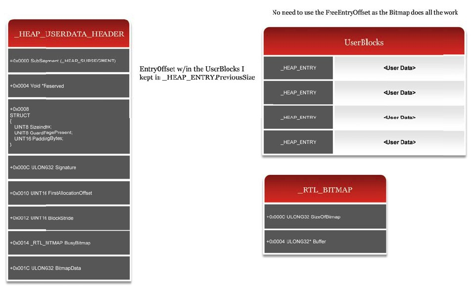

> 注意：可以在前端分配一节中找到对应的代码。

在Windows 7 LFH进行分配时，内存的位置往往是可预测的。这一问题在Windows 8中也进行了缓解，它会在在位图的搜索中随机化起始位置，而不是总是选择`_INTERLOCK_SEQ.Hint`字段设置的free chunk。

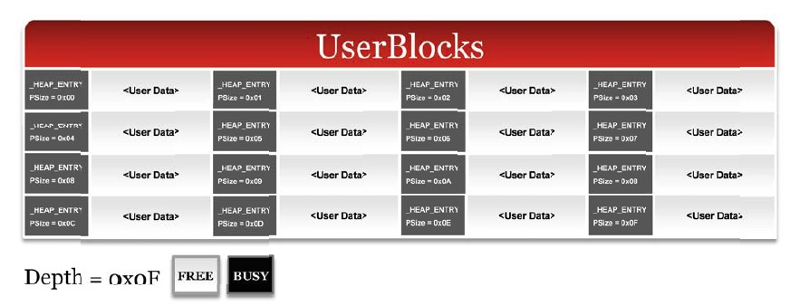

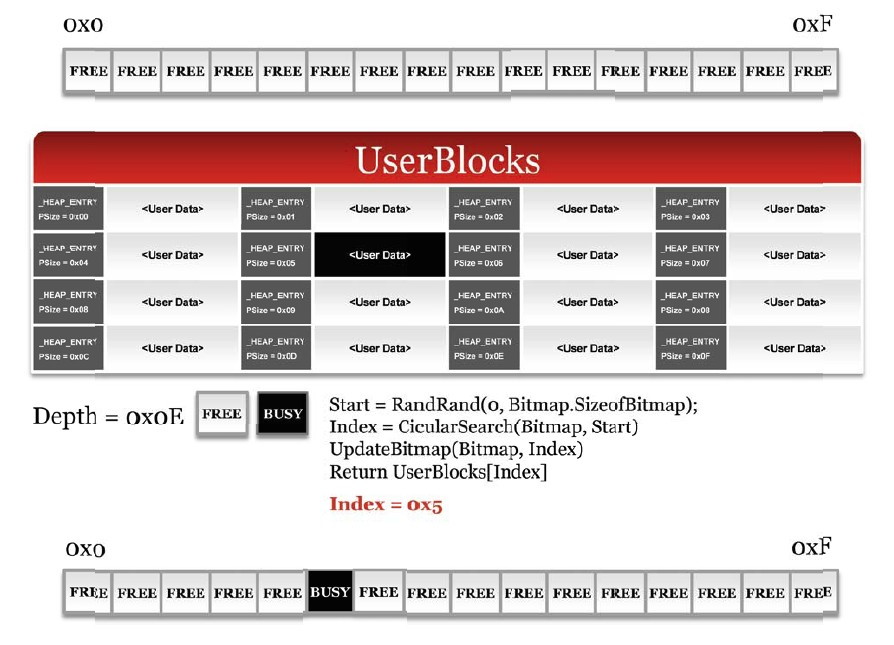

#### 快速失败

在Windows操作系统上，对于存储收集相似的对象这一功能来说，链表往往是雷同的。自堆溢出exp问世以来，这些相同的链表也早就成为了攻击者的猎物。通过污染链表条目(Flink或Blink，这取决于链表的类型)，攻击者可以有效地实现任意地址4字节任意写。尽管从Windows XP SP2以来，已经引入了很多检查机制，但当前仍然存在不合安全标准的链入链出代码。

快速失败中断的设计被用来给应用程序开发者提供一个无需知晓堆创建时是否指定了合适的flags的情境下就可以终止进程的能力。例如，如果没有通过`HeapSetInformation`来设置`HeapEnableTerminationOnCorruption`，那么即使函数调用出现了错误应用程序也不会终止。快速失败使得进程执行流的终止变得更为容易，它通过一个简单的中断"`int 0x29`"。

你可以查看`RtlpLowFragHeapAllocateFromZone`在检查域(zones)时是如何使用该新的中断的。这一检查机制可以保证链表的完整性。你可以搜索其它的二进制中`int 0x29`的使用来查看它的用法。

```cpp
_HEAP_SUBSEGMENT *RtlpLowFragHeapAllocateFromZone(_LFH_HEAP *LFH, int AffinityIndex)
{
    .
    .
    .
    _LIST_ENTRY *subseg_zones = &LFH‐>SubSegmentZones;
    if(LFH‐>SubSegmentZones‐>Flink‐>Blink != subseg_zones ||
    LFH‐>SubSegmentZones‐>Blink‐>Flink != subseg_zones)
    	__asm{int 29};
}
```

> 注意：Windows 7使用了一套更难懂的检查。

#### 守护页

LFH的设计初衷在于可以提供一种快速、可靠的获取内存的方式，同时最小化内存碎片。不幸的是，还是存在具体的场景当连续的溢出发生时会导致堆元数据被覆写。如果LFH中的chunk可以覆写到相同`UserBlocks`中物理毗邻的chunks，那么他也可能覆写到另一个`UserBlocks`容器(该容器维护了尺寸不同的chunks)。

在Windows 7中，`UserBlocks`地址空间隐式地布局在连续的内存上。这意味着一个包含某种尺寸chunks的`UserBlock`在内存空间上可能和另一个包含另一个尺寸chunks的`UserBlocks`(也可能尺寸相同)。

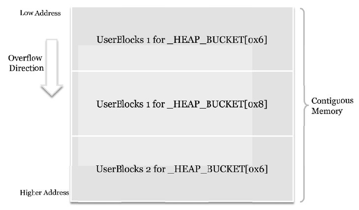

举个例子，在下图中`UserBlock`包含0x30字节(0x6 blocks)大小的chunks，它布置在包含0x40字节(0x8 blocks)大小的chunks的`UserBlock`之前。从0x6 block大小的chunk这里可以连续溢出到0x40字节chunks所在的`_HEAP_USERDATA_HEADER`元数据上。

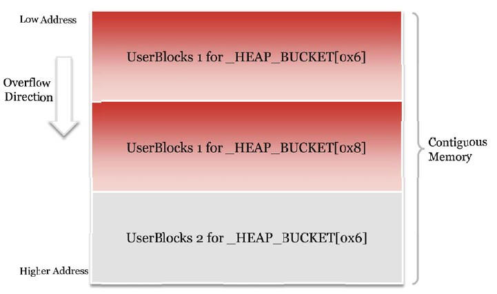

在`UserBlocks`内部，Windows 8通过随机化分配请求的索引值处理了这种连续溢出的问题。微软也意识到两个`UserBlock`容器之间也需要一个安全机制。如果具体的启发式机制被触发，比如同一尺寸的分配数量剧增，那么在`UserBlocks`之后会插入一个额外的守护页，用以阻止连续溢出去污染后一个`UserBlocks`的数据。

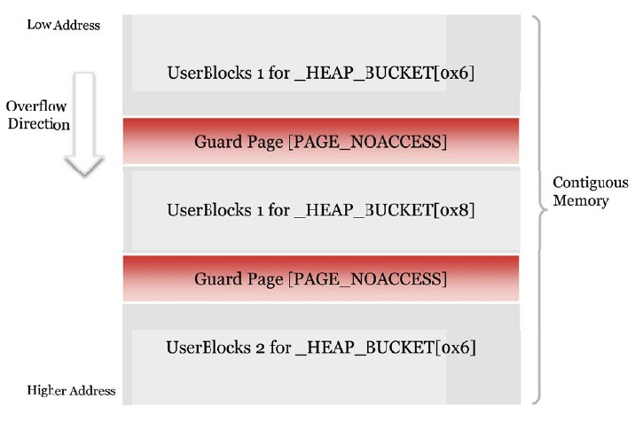

#### 任意释放

Ben Hawkes发现的另一种利用技术就是通过覆写`SegmentOffset`来达成LFH chunks的任意释放。如果具体的flags被设置，chunk头的地址就被调整成指向一个新的位置。

```cpp
RtlFreeHeap(_HEAP *Heap, DWORD Flags, void *Mem)
{
    .
    .
    //if the header denotes a different segment
    //then adjust the header accordingly
    //如果头指定了不同的段，就相应调整头部
    _HEAP_ENTRY *Header = Mem ‐ 8;
    _HEAP_ENTRY *HeaderOrig = Mem – 8;
    if(Header‐>UnusedBytes == 0x5)
    	Header ‐= 8 * Header‐>SegmentOffset;
  
    if(!(Header‐>UnusedBytes & 0x3F))
    {
        //this will prevent the chunk from being freed
      	//这将阻止chunk被释放
        RtlpLogHeapFailure(8, Heap, Header, 0,0,0);
        Header = NULL;
    }
    .
    .
}
```

在Windows 7中，这一新增的处理暗含着危险，chunk会传递给前端释放器。结果就是当释放一个当前为BUSY态的chunk时，会送给攻击者一个修改数据的机会。

Windows 8在中间件释放例程中插入了检查，以确保被调整过的chunk是一个有效的chunk，因为调整过的chunks有着具体的特征(characteristics)。如果具体的特征不匹配，那么函数就会返回失败。

```cpp
if(HeaderOrig‐>UnusedBytes == 0x5)
{
    //this chunk was from the LFH
  	//这一chunk源于LFH
    if(Header‐>UnusedBytes & 0x80)
    {
        //ensures that the header values haven't been altered
      	//确保头部值没有被更改
        if(!RtlpValidateLFHBlock(Heap, Header))
        {
            RtlpLogHeapFailure(3, Heap, Header, Mem, 0, 0);
            return 0;
        }
    }
}
```

#### 异常处理

Windows 7 LFH分配器在分配时受制于catch-all异常处理机制。本质上来说，当函数捕捉到任何错误，比如内存访问违例，就会返回NULL，交付后端分配器来处理请求。

```cpp
int RtlpLowFragHeapAllocFromContext(_HEAP_BUCKET *aHeapBucket, int aBytes)
{
    try {
      	//Attempt allocatcion
      	//尝试分配
    }
    catch
    {
      	return 0;
    }
}
```

我曾推论一旦有能力触发多重溢出，这种catch-all行为必将被攻击者所滥用(Valasek 2010)。这一暴力手法使得攻击者可以绕过如ASLR等机制，这是因为它控制了无效的地址访问。

Windows堆团队意识到了非特定异常处理会导致安全隐患，因此它们在`RtlpLowFragHeapAllocFromContext`中移除了异常处理，以阻止任何的恶意意图。

### 利用(Exp)战术

本节会探讨一些用于针对Windows 8堆管理器的战术，以达成代码执行。Windows 8堆管理器已经实现了多种反利用技术，阻止了所有在Windows 7上此前公开的利用技巧。然而，新的数据结构和算法还是提供了一些机会去利用元数据来达成代码执行的利用。

#### 位图翻转2.0

在前端释放一节中我们看到了`UserBlocks->BusyBitmap`是如何用于指示LFH管理的chunk是否是free态。该位图会清除`_HEAP_ENTRY.PreviousSize`成员提供的索引位。

```cpp
int RtlpLowFragHeapFree(_HEAP *Heap, _HEAP_ENTRY *Header)
{
    .
    .
    .
    short BitmapIndex = Header‐>PreviousSize;
  
    //Set the chunk as free
  	//设置chunk为free态
    Header‐>UnusedBytes = 0x80;
  
    bittestandreset(UserBlocks‐>BusyBitmap‐>Buffer, BitmapIndex);
    .
    .
    .
}
```

同时，如果你还记得`_HEAP_USERDATA_HEADER`(`UserBlocks`)`的_RTL_BITMAP`结构的话，它提供了一个非常小但是理论上可行的攻击面，只要攻击者可以污染该位图之后的`PreviousSize`值。例如，如果位图的尺寸是0x4，但是攻击者覆写了chunk头部的尺寸为0x20，那么chunk中相对`UserBlocks`的一个位会被置0。如果知晓chunks具体的数量信息，就可能利用这一战术来污染敏感数据。


**限制**

尽管内存零化已经证明了对软件漏洞的利用有所缓解(Moore 2008)，但因为一些原因这一变种还是相当受限的。

- `UserBlock`和对应的位图是从`_HEAP_SUBSEGMENT`获取的。
- `_HEAP_SUBSEGMENT`是通过chunk头释放时推导出的。
  - `SubSegment = *(DWORD)header ^ (header / 8) ^ heap ^ RtlpLFHKey;`
- 因此，连续溢出最可能会导致不良结果，终止进程。
- 覆写需要从编码chunk头部后开始，或者不是一个连续的覆写，比如off-by-a-few。

#### _HEAP_USERDATA_HEADER攻击

`FreeEntryOffset`攻击在Windows 8上不再有效，因为`_HEAP_USERDATA_HEADER`结构体新增的成员接过了定位free chunks的职责。但与`FreeEntryOffset`攻击一样，`UserBlocks`头也可以被用来为用户提供`UserBlocks`管辖之外的地址空间。

例如，可以获取物理位置毗邻的多个`UserBlocks`容器。下图展示了`_HEAP_USERDATA_HEADER`可以坐落在一个不同的`UserBlocks`容器的chunks之后。


> 注意：`UserBlock`容器不需要维护相同尺寸的chunks。

如果攻击者可以把一个`_HEAP_USERDATA_HEADER`部署在可以被溢出的chunk后，那么后续的分配就会指向未知且暗含危险的内存位置。

> 注意：这很像`FreeEntryOffset`攻击，但受限于`_HEAP_USERDATA_HEADER`s。

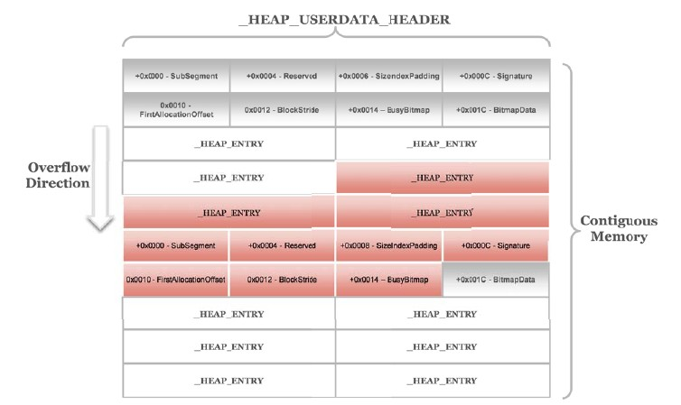

一旦`FirstAllocationOffset`和`BlockStride`值被覆写，后续的分配就会从被污染的`UserBlocks`中分配。这可以从前端分配器中返回半任意内存地址。

```cpp
//If the FirstAllocationOffset and/or the BlockStride are attacker controlled
//semi arbitrary memory will be returned to calling function, potential for code exec
//如果FirstAllocationOffset和BlockStride被攻击者控制，那么就可以返回一个半任意控制的内存空间
//可能会导致代码执行
Header = (_HEAP_ENTRY)UserBlocks + UserBlocks->FirstAllocationOffset + (NewHint * UserBlocks->BlockStride);
```

**限制**

- 可溢出chunk必须在`_HEAP_USERDATA_HEADER`之前。
- 被溢出的`_HEAP_USERDATA_HEADER`控制的chunks尺寸最好要知晓。
- 返回的chunk必须是FREE态(`!(Header->UnusedBytes & 0x3F)`)
- `_RTL_BITMAP`结构也需要考虑，因为非法的位图遍历将导致访问违例，如位图尺寸过巨。
- 最重要的，分配次数要少，不能激活守护页的启发式机制。
  - TIP: 当准备攻击堆时先标记Heap Bucket尺寸。
    - 例如 Alloc(0x40) x 10; Alloc(0x50) x 0x10等

### 用户空间总结

Windows 8自Windows 7基础代码以来改变很大。我们看到了增加了新的数据结构以协助内存管理器，使其分配和释放更为可靠。这些新数据结构也改变了具体算法的工作流程。新版的Windows建立了从新数据结构中获取收益的新算法，而不是对此前存在的结构进行数据填充。

`ListHints`不再具有双重效用。新的专用的位图和计数器被引入，以保护内存管理器其元数据不会被滥用。管理堆内存的算法可能因为引入了一些其他内容而显得复杂，但却使得分配和释放的整体机制更易于理解。

微软在Windows 8的发行版中确实着重考虑了安全性。如前文所述，Windows这一版本缓解措施的数量比此前全部其他版本加起来还多。所有在Windows 7上公开的利用技术都被缓解了。我认为这展示了微软对安全研究者发声的重视，同时也愿意去学习如何更好的保护他们的消费者。

最后，我们看到了大部分堆元数据攻击手法的消亡。但它们确实扑街了吗？我认为利用手法一节已经证实了在Windows 8操作系统中，堆元数据利用手法虽然可行、但难度极大且数量极少这一事实。

Windows 8可能是用户空间堆最难利用的操作系统，它为攻击者现代利用技术的使用设置了大量的绊脚石。我不认为它的目标是打造一个不可利用堆管理器，但它确实花了大手笔劝退了一票普通的攻击者。

## 内核池分配器

这一部分探讨了Windows 8内核池分配器，也对Windows 8预览版和Windows 7间的差异进行了对比。尽管自Windows 7以来算法和数据结构没有什么显著地变化，但还是引入了一些安全机制，缓解了此前内核池攻击的某些手段。我们先对内核池进行一个简单的介绍，同时也会介绍它的关键数据结构，然后再讨论其实现的细节。

### 基本组件

Windows内核以及第三方驱动通常都会从内核池分配器中分配内存。与用户模式堆不同的是，内核池尽量避免费时的操作以及不必要的页错误，因为它们会影响系统的性能表现，毕竟Windows的各个领域都会使用它。为了以最快最有效的方式服务分配请求，分配器使用可以检索碎片和池内存的多个链表。了解与这些链表相关的数据结构，以及如何使用它们对于理解内核池操作来说至关重要，同时也是在对抗池污染攻击时评估安全性和鲁棒性的要点。

#### 池类型

当从池分配器中请求内存时，驱动或系统组件会指定池类型。尽管定义了非常多的类型，实际上池内存真正意义上只有两种基础类型，分页池和非分页池。

为了使资源和内存的使用守恒，分配器允许池内存被换出到磁盘上。当此后访问到被换出的内存时，Windows会触发缺页异常，会把数据取回内存，为特定页重新创建PTE。然而，如果内核此时运行在IRQ高于DPC/Dispatch级别之上(例如：在处理一个中断)，它就无法处理该缺页异常。因此，内核必须提供非分页内存机制以保证这种页面始终不会被换出。因为这一需求，非分页池是一个稀有的资源，受系统物理内存的限制。

在一个标准的单处理器系统上，Windows设置一个非分页池和四个分页池，系统的组件和驱动可以访问它们。它们分别通过`nt!PoolVector`和`nt!ExpPagedPoolDescriptor`数组来访问。注意到每个登录的用户也有自己的会话池，由会话空间结构定义。

#### 池描述符

为了管理给定的池，Windows定义了众所周知的池描述符。吃描述符定义了池本身的属性(比如它的类型)，但更为重要的是它维护了空闲池chunks的双向链表。池管理器以block尺寸为单位进行管理，32位系统上是8字节，64位系统上是16字节。双向链表与池描述符关联，维护了最大尺寸为4080/4064(x86/x64)字节的空闲内存，因此一个描述符控制了32位系统上的512个链表，或者64位系统上的256个链表。池描述符结构(`nt!_POOL_DESCRIPTOR`)在Windows 8预览版(x64)如下：

```
kd> dt nt!_POOL_DESCRIPTOR
+0x000 PoolType : _POOL_TYPE
+0x008 PagedLock : _FAST_MUTEX
+0x008 NonPagedLock : Uint8B
+0x040 RunningAllocs : Int4B
+0x044 RunningDeAllocs : Int4B
+0x048 TotalBigPages : Int4B
+0x04c ThreadsProcessingDeferrals : Int4B
+0x050 TotalBytes : Uint8B
+0x080 PoolIndex : Uint4B
+0x0c0 TotalPages : Int4B
+0x100 PendingFrees : _SINGLE_LIST_ENTRY
+0x108 PendingFreeDepth : Int4B
+0x140 ListHeads : [256] _LIST_ENTRY
```

池描述符也管理着一个池chunks单链表，这些chunks在等待被释放(`PendingFrees`)。这是一种性能优化，可以降低与池锁相关的费用，在向双向链表增加或移除chunks时都需要耗费迟锁。如果该优化被启用(由`nt!ExpPoolFlags`的flags指定)，且池chunk被释放，那么释放算法就会把它插入到该释放阻塞链表中，前提是它还未满(32个条目)。当该链表满了的时候，算法会调用独立的函数(`nt!ExDeferredFreePool`)来锁住相关的池内存符，释放链表中所有的池chunks，挂入到相应的双链表中。

尽管与池内存符没有严格的关联，内核池也可以为较小的分配请求(256字节或更小)尝试使用lookaside链表，它在每个处理器的处理器控制块中定义(`nt!KPRCB`)。Lookaside链表是单链表，因此利用其分配时无需上锁也无需操作池管理结构，这使得它性能很好。然而，它们的性能做了一个折衷，由于单链表结构的简单性，链表的一致性无法轻易的被校验，这些链表在用户模式中几乎已经被废弃，改而使用了更为鲁棒的替代者。

#### 池头部

内核池中另一个重要的数据结构与内存污染攻击情景息息相关，它就是池头。每个分配的池chunk都有一个池头结构，显式的定义了前一个和当前chunk的尺寸、池类型、指向池描述符数组的指针以及指向关联进程的指针。在Windows 8预览版(x64)中，池头结构定义如下(`nt!_POOL_HEADER`)：

```
kd> dt nt!_POOL_HEADER
+0x000 PreviousSize : Pos 0, 8 Bits
+0x000 PoolIndex : Pos 8, 8 Bits
+0x000 BlockSize : Pos 16, 8 Bits
+0x000 PoolType : Pos 24, 8 Bits
+0x000 Ulong1 : Uint4B
+0x004 PoolTag : Uint4B
+0x008 ProcessBilled : Ptr64 _EPROCESS
+0x008 AllocatorBackTraceIndex : Uint2B
+0x00a PoolTagHash : Uint2B
```

与用户模式堆分配器中的LFH不同，在服务池分配时，内核池将池页划分成可变的尺寸碎片。因此，池头维护了给定chunk(`BlockSize`)的尺寸，同时也维护了前一个chunk的尺寸(`PreviousSize`)。分配器得以跟踪chunk的尺寸，也可以合并两个空闲内存块以减少碎片。池头也维护了用于判断池chunk是否是free的元数据(如果`PoolType`的第二位被置位(OR 0x2)就是busy态)以及判断它属于哪个池资源的元数据。

未保护的元数据会在分配之前被用到，这对分配和释放操作来说至关重要，历史上已经有大量的不同攻击手法浮现。Windows 7在内核池中引入了安全链出机制，缓解了臭名昭著的4字节写攻击手法。然而，Windows 7对一些其他的攻击向量没能有效缓解(Mandt 2011)，这就导致了以池分配元数据为目标的一干通用攻击手法大行其道。其中包括lookaside链表的基础攻击，也包括各种其他的方法诸如池索引校验的缺失，使得攻击者可以迫使池算法对用户控制的池描述符进行操作。

在Windows 8中，微软做了重大努力，牢牢地看住了内核池。文章此后的内容会突出这一提升和改变是如何对抗此前讨论过的攻击手法的，同时，这也和state-of-the-art exp缓解措施技术比如SMEP联动的更好。

### Windows 8增强

本节详细讨论了Windows 8内核池主要的安全增强机制，用于缓解此前存在的攻击向量，使得内核池污染漏洞的exp更为困难。

#### 不可执行非分页池(NX Non-Paged Pool)

在Windows 7和以前的版本中，非分页池返回的都是可读可写可执行(RWX)页。尽管DEP早就为微软提供了实现内核内存页NX的支持(在分页池中确实如此)，但非分页池因为各种原因还是需要可执行权限。这一设计就引入了一个问题，他可能潜在的允许一个攻击者去存储任意代码到内核模式，然后找到它的位置使用各种技术。2010年HITB杂志中一篇文章(Jurczyk)就描述了使用内核保留对象去存储用户提供的内核模式shellcode的碎片的攻击手法。因为这些对象有着用户可控的多个字段，同时内核对象的地址可以通过用户模式接口函数来查询到(使用`NtQuerySystemInformation`)，于是通过创建多个对象以创建出一个羽翼丰满的shellcode是完全可能的。Windows 8试图缓解这种用户代码的RWX内存页注入，通过引入NX非分页池使得跳入到非分页池中不再那么有用。

> 应该问问微软为什么在早期的时候不引入不可执行非分页池。一种表面的说法是它们不需要这样做。因为在内核内存插入shellcode很麻烦(随后还要定位shellcode)，攻击者更喜欢把shellcode布置在用户模式的可执行缓冲区中，在那里执行。在Windows 7和以前的系统版本中这工作的非常完美，Windows 8利用了Intel Ivy Bridge CPUs提供的新的硬件缓解措施，称为SMEP(Supervisor Mode Execution Protection)。简单来说，SMEP(或者叫"OS Guard"，这是它的市场名称)阻止了运行在特权模式的CPU去执行被标记为"用户(User)"的可执行页(由PTE指示)，因此对于用户模式页的可执行来说无疑是块强有效的绊脚石。如果非分页内存池是可执行的话，那么由于SMEP的出现，可执行非分页池的利用将变成绕过SMEP的主流手法。

NX非分页池使用一个新的池类型(0x200)，因此出于兼容性的原因需要对现有代码进行更新。`POOL_TYPE`枚举量在Windows 8中包含下面这些定义：

```
kd> dt nt!_POOL_TYPE
NonPagedPool = 0n0
NonPagedPoolExecute = 0n0
PagedPool = 0n1
NonPagedPoolMustSucceed = 0n2
DontUseThisType = 0n3
NonPagedPoolCacheAligned = 0n4
PagedPoolCacheAligned = 0n5
NonPagedPoolCacheAlignedMustS = 0n6
MaxPoolType = 0n7
NonPagedPoolBase = 0n0
NonPagedPoolBaseMustSucceed = 0n2
NonPagedPoolBaseCacheAligned = 0n4
NonPagedPoolBaseCacheAlignedMustS = 0n6
NonPagedPoolSession = 0n32
PagedPoolSession = 0n33
NonPagedPoolMustSucceedSession = 0n34
DontUseThisTypeSession = 0n35
NonPagedPoolCacheAlignedSession = 0n36
PagedPoolCacheAlignedSession = 0n37
NonPagedPoolCacheAlignedMustSSession = 0n38
NonPagedPoolNx = 0n512
NonPagedPoolNxCacheAligned = 0n516
NonPagedPoolSessionNx = 0n544
```

大部分在Windows内核和诸如win32k.sys的系统驱动中的非分页池的分配使用NX池类型。这也包括内核对象，比如此前提到的保留对象。自然而然，NX池与DEP的启用息息相关。如果DEP被禁用，内核会设置`nt!ExpPoolFlags`的0x800位，通知池分配器NX非分页池不能被使用。

Windows 8为每个非分页池创建了两个池描述符，定义了可执行和不可执行池内存。可以通过查看负责创建非分页池的函数`nt!InitializePool`来窥探一二。

```cpp
POOL_DESCRIPTOR * Descriptor;

// check if the system has multiple NUMA nodes
// 查看系统是否有多重NUMA节点
if ( KeNumberNodes > 1 )
{
    ExpNumberOfNonPagedPools = KeNumberNodes;
    // limit by pool index maximum
  	// 池索引最大值限制
    if ( ExpNumberOfNonPagedPools > 127 )
    {
    	ExpNumberOfNonPagedPools = 127;
    }
    // limit by pointer array maximum
  	// 指针数组最大值限制
    // x86: 16; x64: 64
    if ( ExpNumberOfNonPagedPools > EXP_MAXIMUM_POOL_NODES )
    {
    	ExpNumberOfNonPagedPools = EXP_MAXIMUM_POOL_NODES;
    }
    // create two non‐paged pools per NUMA node
  	// 为每个NUMA节点创建两个非分页池
    for ( idx = 0; idx < ExpNumberOfNonPagedPools; idx++ )
    {
        Descriptor = MmAllocateIndependentPages( sizeof(POOL_DESCRIPTOR) * 2 );
          if ( !Descriptor )
        return 0;
        ExpNonPagedPoolDescriptor[idx] = Descriptor;
        ExInitializePoolDescriptor(idx, Descriptor, NonPagedPoolNx);
        ExInitializePoolDescriptor(idx, Descriptor + 1, 0);
    }
}

// initialize the default non‐paged pool descriptors
// 初始化默认非分页池描述符
ExpTaggedPoolLock = 0;
PoolVector = &NonPagedPoolDescriptor;
ExInitializePoolDescriptor( 0, &NonPagedPoolDescriptor, NonPagedPoolNx );
ExInitializePoolDescriptor( 0, &unk_5D9740, NonPagedPool );
```

不可执行和可执行池描述符在内存上毗邻，因此内核仅仅需要通过描述符的尺寸调整指针，以便于二者可以相互切换。对多节点NUMA兼容系统来说，`nt!ExpNonPagedPoolDescriptor`指向独立的一对描述符，而在单处理器(non-NUMA)系统上，`nt!PoolVector`的第一个条目指向一对非分页池描述符，它们布置在内核映像的数据区。此外，Windows 8还为NX非分页池定义了lookaside链表。它们由处理器控制块(`nt!_KPRCB`)管理，其中的`PPNxPagedLookasideList`定义了NX Lookaside链表数组。

```
kd> dt nt!_KPRCB
...
+0x670 LockQueue : [17] _KSPIN_LOCK_QUEUE
+0x780 PPLookasideList : [16] _PP_LOOKASIDE_LIST
+0x880 PPNxPagedLookasideList : [32] _GENERAL_LOOKASIDE_POOL
+0x1480 PPNPagedLookasideList : [32] _GENERAL_LOOKASIDE_POOL
+0x2080 PPPagedLookasideList : [32] _GENERAL_LOOKASIDE_POOL
+0x2c80 PrcbPad20 : Uint8B
```

为了区分可执行和不可执行非分页池分配，池分配器不相信池头的池类型。这可能导致攻击者使用池污染漏洞来注射可执行内存池的chunks，置入管理着不可执行内存池链表中。内核会调用`nt!MmIsNonPagedPoolNx`作为替代来判断chunk是否是不可执行的。该函数查找PTE或是PDE，按下面的方法检查NX位(0x8000000000000000)。

```cpp
BOOL
MmIsNonPagedPoolNx( ULONG_PTR va )
{
	PMMPTE pte,pde;
    
  	if ( MmPaeMask == 0 )
      return TRUE;
    pde = MiGetPdeAddress( va );
    
  	// check no‐execute bit in page directory entry (large page)
  	// 检查PDE的不可执行位
    if ( pde‐>u.Hard.NoExecute )
    	return TRUE;
    pte = MiGetPteAddress( va );
    // check no‐execute bit in page table entry
  	//检查PTE的不可执行位
    if ( pte‐>u.Hard.NoExecute )
    	return TRUE;
    return FALSE;
}
```

#### 内核池Cookie

Windows 8通过在特定位置插入不可预测数据的方式引入了一种缓解措施来对抗池元数据的攻击，这给予了在更早的时点可以检测到漏洞利用的机会。这一随机数据就是众所周知的内核池cookie，它本质上是一个在运行时计算出的随机数(与多种其他属性结合，比如它想保护的结构的地址)。Cookies早在以前就曾被内核用来对抗用户模式的栈缓冲区溢出攻击。只要攻击者无法推断出内核池cookie的值，系统就可以检测到漏洞利用攻击，无论是在分配还是在释放阶段的滥用。

由于内核池cookie安全机制依赖于它本身的秘密性，理解cookie生成的方式至关重要。我们会讨论该cookie的播种，也会讨论它在后期是如何生成的。

**收集引导熵**

池cookie在引导期Windows加载器(Winload)收集熵时被创建，随后用于内核提供的伪随机数生成器种子(通过`nt!ExGenRandom`获取)。该熵值通过加载器参数块(`nt!KeLoaderBlock`)传递给内核，它是在运行Windows加载器时在`winload!OslInitializeLoaderBlock`初始化的。加载器块初始化函数设置了各种设备节点，其中包括磁盘和键盘控制器，在它本身调用`winload!OslGatherEntropy`收集引导熵之前。

Windows收集的引导熵主要是来自6个不同的源。这些源由`winload!OslpEntropySourceGatherFunctions`表中的函数来处理，它们如下：

- `OslpGatherSeedFileEntropy`

  通过查找HKEY_LOCAL_MACHINE\SYSTEM\RNG中的'Seed'键(REG_BINARY)来收集熵。该键是76字节大小，其中后64字节维持了一个独有的哈希值，用于播种CryptoAPI PRNG。

- `OslpGatherExternalEntropy`

  通过查找HKEY_LOCAL_MACHINE\SYSTEM\RNG中的'ExternalEntropyCount'键(REG_DWORD)来收集熵，该键指示了外部熵源的数量(比如TPM)。随后会使用该值(通常是2或3)来计算一个SHA512哈希(64字节)，以便于生成一个实际的熵值。

- `OslpGatherTpmEntropy`

  一些额外的设施被提供用来安全的生成和存储密钥，信任平台模块(TPM, Trusted Platform Module)也提供了自己的(真)随机数生成器(TRNG)。TPM随机数生成器由机器状态组成，它混合了不可预测的数据和单一方式哈希函数的输出。如果系统存在TPM，那么`winload!OslpGatherTpmEntropy`就会调用`winload!TpmApiGetRandom`来生成40字节的随机数。

- `OslpGatherTimeEntropy`

  查询多个信息计数器可以产生56字节的半随机数。这包括性能计数器(`winload!BlArchGetPerformanceCounter`)，时间性能频率计数器(`winload!BlTimeQueryPerformanceCounter`)，当前时间(`winload!BlGetTime`)，还有当前相对时间(`winload!BlTimeGetRelativeTimeEx`)。

- `OslpGatherApciOem0Entropy`

  调用`winload!BlUtlGetAcpiTable`来查询OEM0 ACPI表，获取64字节的数据。

- `OslpGatherRdrandEntropy`

  Intel Ivy Bridge CPUs给出了一个新的伪随机数生成器，通过RDRAND指令。`winload!OslpGatherRdRandEntropy`会检查CPU是否支持这一特性并为此分配0x6000字节的内存。它重复调用RDRAND来填充该缓冲区，每次生成随机的32位值。最后，函数会调用`winload!SymCryptSha512`来为该缓冲区生成一个SHA512哈希值(64字节)，用做最后的熵。

在查询每个函数之前，`winload!OslGatherEntropy`会初始化一个分离的缓冲区来跟踪获取的信息。我们使用下面的`BOOT_ENTROPY`数据结构来描述这一缓冲区。

```cpp
typedef struct _BOOT_ENTROPY {
    DWORD EntropyCount;
    DWORD Unknown;
    ENTROPY_INFO EntropyInfo[7];
    CHAR BootRngData[0x430]; // offset 0x2E0h
} BOOT_ENTROPY;
```

`BOOT_ENTROPY`结构定义了熵源(EntropyCount)的数字和每个查询源的信息(包括指示请求是否成功的状态信息)，使用分离的`ENTROPY_INFO`缓冲区。我们按如下结构进行描述：

```cpp
typedef struct _ENTROPY_INFO {
    DWORD Id;
    DWORD Unknown2;
    DWORD Unknown3;
    DWORD Unknown4;
    DWORD Code; // supplementary to Status
    DWORD Result;
    UINT64 TicksElapsed; // ticks it took to query to entropy function
    DWORD Length;
    CHAR Data[0x40]; // entropy source data
    DWORD Unknown7;
} ENTROPY_INFO;
```

当聚集熵时，Winload会循环处理每个源并传递该`ENTROPY_INFO`缓冲区给`winload!OslpEntropySourceGatherFunctions`表中的函数。我们对这一过程用下面的伪代码进行描摹。

```cpp
#define ENTROPY_FUNCTION_COUNT 6
UINT64 tickcount;
RtlZeroMemory( EntropySource, sizeof( BOOT_ENTROPY ) );
EntropySource‐>EntropyCount = 7;

// the mismatch between EntropyCount and ENTROPY_FUNCTION_COUNT is
// intentional as the last entry is reserved (not used)
// EntropyCount和ENTROPY_FUNCTION_COUNT的这一不匹配是故意的
// 因为最后一项是保留的(不使用)
for ( i = 0; i < ENTROPY_FUNCTION_COUNT; i++ )
{
    tickcount = BlArchGetPerformanceCounter();
    ( OslpEntropySourceGatherFunctions[i] )( HiveIndex, &EntropySource‐>EntropyInfo[i] );
    EntropySource‐>TicksElapsed = BlArchGetPerformanceCounter() ‐ tickcount;
}
```

传递给熵源聚集函数的第一个参数定义了Winload初始化的系统蜂巢表(`HiveTable`)项的索引值。它用于查找注册表的键，聚集函数以此来生成熵。可以在`winload!OslpGatherExternalEntropy`中看到这样一个例子。该函数在HKEY_LOCAL_MACHINE\SYSTEM\RNG中查询"ExternalEntropyCount"注册键(REG_DWORD)，使用它来计算一个SHA512(64字节)的哈希值，生成实际的熵。

```cpp
NTSTATUS
OslpGatherExternalEntropy( DWORD HiveIndex , ENTROPY_INFO * EntropyInfo )
{
    NTSTATUS Status;
    DWORD Code, Type;
    PVOID Root, SubKey;
    CHAR Buf[256];
  
    Code = 2;
  
    EntropyInfo‐>Id = 2;
    EntropyInfo‐>Unknown3 = 0;
    EntropyInfo‐>Unknown4 = 0;
  
    Root = OslGetRootCell( HiveIndex );
  
    Status = OslGetSubkey( HiveIndex, &SubKey, Root, L"RNG" );
  
    if ( NT_SUCCESS( Status ) )
    {
        Length = 256;
      
        // retrieve the value of the ExternalEntropyCount registry key
      	// 检索ExternalEntropyCount注册表键的值
        Status = OslGetValue( HiveIndex,
        					SubKey,
                              L"ExternalEntropyCount",
                              &Type,
                              &Length,
                              &Buf );
        if ( NT_SUCCESS( Status ) )
        {
            // generate a sha512 hash of the registry key value
          	// 为注册表键值生成一个sha512哈希值
            SymCryptSha512( &Buf, &EntropyInfo‐>Data[0], Length );
          
            EntropyInfo‐>Length = 0x40;
          
            Status = STATUS_SUCCESS;
          
            Code = 4;
        }
    }
    EntropyInfo‐>Code = Code;
    EntropyInfo‐>Result = Status;
  
    return Status;
}
```

一旦为需要的熵完成了查询，`winload!OslGatherEntropy`就会为所有的数据chunks创建一个SHA512哈希值，由`ENTROPY_INFO`结构控制。这一哈希值又被用于做内部AES随机数生成器的种子(由Winload特别使用)，该生成器后续会用来生成0x430字节的随机数(BootRngData)。该数据构成了实际的引导熵，此后被ntoskrnl通过加载器参数块来引用。

```cpp
CHAR Hash[64];
NTSTATUS Status;

Status = STATUS_SUCCESSFUL;

SymCryptSha512Init( &ShaInit );

for ( i = 0; i < 7; i++ )
{
    SymCryptSha512Append( &EntropySource‐>EntropyInfo[i].Data[0],
    					&ShaInit,
    					EntropySource‐>EntropyInfo[i].Length );
}

// generate a sha512 hash of the collected entropy
// 生成一个聚集熵的sha512哈希值
SymCryptSha512Result( &ShaInit, &Hash );

if ( SymCryptRngAesInstantiate( &RngAesInit, &Hash ) )
{
	Status = STATUS_UNSUCCESSFUL;
}
else
{
    SymCryptRngAesGenerate( 0x10, &RngAesInit, &Stack );
    SymCryptRngAesGenerate( 0x30, &RngAesInit, &EntropySource‐>BootRngData[0] );
    SymCryptRngAesGenerate( 0x400, &RngAesInit, &EntropySource‐>BootRngData[0x30] );
    SymCryptRngAesUninstantiate( &RngAesInit );
}

// clear the hash from memory
// 清除内存中的哈希
for ( i = 0; i < 64; i++ )
{
	Hash[i] = 0;
}

return Status;
```

当Winload在引导期调用ntoskrnl时，它会传递加载器参数块数据结构(`nt!_LOADER_PARAMETER_BLOCK`)过去，它包含了引导熵也包含了内核初始化所需要的信息。这包括系统和引导分区路径，指向描述物理内存表的指针，指向硬件和软件注册表蜂巢的指针等等。

内核执行初始化有两个阶段，阶段0和阶段1。在阶段0中，它创建基本的结构体，使得阶段1可以被调用并初始化每个处理器以及CPUs共享的内部链表和其他数据结构。在阶段0初始化完成前(`nt!ExpSystemInitPhase0`)，内核调用`nt!ExpRngInitializeSystem`来初始化它自己的随机数生成器。

**随机数生成器**

Windows 8内核的伪随机数生成器基于LFG(Lagged Fibonacci Generator)，由加载器参数块(`nt!KeLoaderBlock`)的熵信息提供种子。它不仅仅用于生成池cookie，还有更多的应用场景，比如基址随机化，堆编码，自顶向下/自底向上分配随机化，PEB随机化以及栈cookie随机化。

该随机数生成器在Winload的引导熵聚集填充`nt!ExpLFGRngState`时被初始化(`nt!ExpRngInitializeSystem`)。即使RNG不会使用所有提供的熵，它也会拷贝不使用的数据到`nt!ExpRemainingLeftoverBootRngData`中。此后，函数处理第一次生随机数的生成(内核GS cookie的一部分)，通过调用`nt!ExGenRandom`。该函数使用附加的LFG算法以参数j=24和k=55来变换LFG RNG的状态，并返回一个32位值。内核也可以请求使用剩余的引导RNG数据(如果存在的话)，通过传递`ExGenRandom`为1作为第一个参数就可以直接返回该随机数。

**池cookie生成**

为了生成池cookie(`nt!ExpPoolQuotaCookie`)，内核使用它的随机数生成器，同时也使用了一些其他变量来提升它的随机性。该cookie在第一个非分页内核池被初始化时定义，在`nt!InitializePool`中(由`nt!MmInitNucleus`调用)，他作为内核初始化阶段0的一部分。该函数首先调用`nt!KeQuerySystemTime`来获取当前系统时间，这是一个`LARGE_INTEGER`，此后会通过RDTSC指令获取当前的滴答数。这些值(时间被切割成两个32位值)此后进行XOR疑惑，然后与`KeSystemCalls`和`InterruptTime`(来自`nt!_KPRCB`)再进行XOR异或。`KeSystemCalls`是一个维持当前系统调用数量的计数器，`InterruptTime`是服务中断所花费的时间。最后，异或的值和一个由`nt!ExGenRandom`返回的伪随机数再次异或。有理由相信最后的这个值一般来说不会是0，如果是的话池cookie会被置为1，如果不是则把这个值用于最终使用的池cookie。

```cpp
ULONG_PTR Value;
KPRCB * Prcb = KeGetCurrentPrcb( );
LARGE_INTEGER Time;

KeQuerySystemTime( &Time );

Value = __rdtsc() ^ // tick count	// 滴答数
        Prcb‐>KeSystemCalls ^ // number of system calls	// 系统调用数
        Prcb‐>InterruptTime ^ // interrupt time	// 断时间
        Time.HighPart ^ // current system time	// 当前系统时间
        Time.LowPart ^
        ExGenRandom(0); // pseudo random number	// 伪随机数
        
ExpPoolQuotaCookie = (Value) ? Value : 1;
```

### 攻击缓解措施

本节中我们将展示Windows 8如何缓解Windows 7内核池此前存在的各种攻击手法(Mandt 2011)。在下面的每个小节中，我们将简明扼要的讨论这些攻击在Windows 7(以及更早的Windows系统)上是如何实施的，然后会展示他们在Windows 8上是如何被缓解的。

#### 进程指针编码

驱动或系统组件可能会通过当前进程来调用`nt!ExAllocatePoolWithQuotaTag`来为配额填充请求内存。池分配器在内部会把一个指向进程对象的指针与此分配关联。在x86平台，内核会以4字节递增请求以便于在池分配的最后4个字节中存储进程指针。在x64平台，进程指针被存储在池头的最后8个字节，作为`ProcessBilled`指针。

在释放配额填充的分配时，池分配器会返回关联进程的配额。这是通过查询进程对象指针，定位关联的配额块(`nt!_EPROCESS_QUOTA_BLOCK`)来完成的。这一隐晦的结构控制了实际的配额信息，包括配额使用量的定义。当释放时，分配器根据池分配的尺寸递减该值。

因为Windows 7和此前的系统版本都没有对该进程指针进行保护，所以一度存在着一种使用内存污染漏洞来覆写该指针以递减任意内核内存地址数据的攻击手法。特别的，攻击者还可以把该指针设计成指向一个伪造的进程对象数据结构(比如用户模式创建的)，以便于控制配额块数据结构的地址(它会递减)。更进一步，在x86平台上没有必要污染相邻的分配块，因为进程指针就在池数据的正后方。下图阐释了在x86系统上的攻击手法。注意在x64上，攻击者必须溢出到下一个分配块才可以触碰到池头所控制的`ProcessBilled`指针。

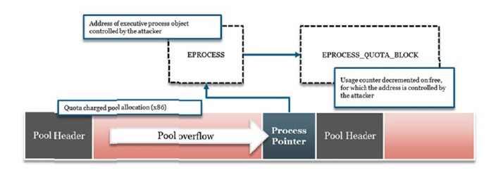

Windows 8通过XOR编码进程指针缓解了这种攻击手法。进程指针首先和池cookie XOR(`nt!ExpPoolQuotaCookie`)，随后和池分配的地址异或(池头首地址)。当配额填充分配被释放时，内核会使用池cookie和池地址来解码存储的指针，随后会校验该值以确保指向的内核地址是正确的(在`nt!MmSystemRangeStart`之上)。

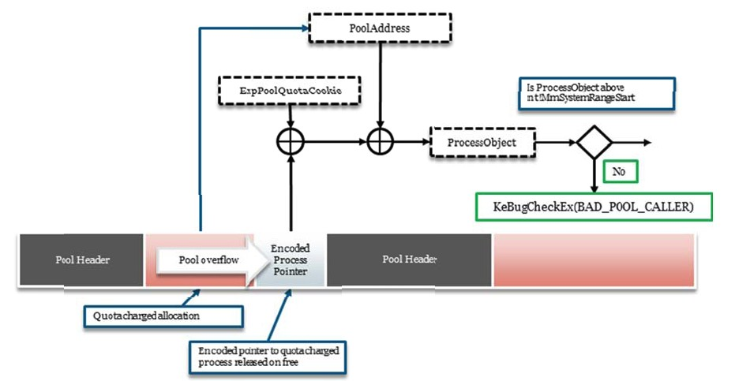

#### Lookaside Cookie

因为内核池的大量使用，lookaside链表在内核池的出色性能表现上扮演了一个关键角色。因为lookaside链表是单链表，也不需要对池描述符进行上锁，因此它们可以从高度优化的CPU指令中获得收益，比如增加和释放元素时使用的那些原子的比较和交换。然而，与双链表不同的是，想要验证单链表的一致性却非常困难。历史上也因此出现了大量的攻击手法，这也是它被用户模式所弃用的最重要原因。

Windows7系统以前，攻击者可以通过覆写lookaside链表上已释放的池chunk的next指针来控制下一个空闲池chunk的分配地址。攻击者可以强迫后续的分配(通过创建相同尺寸的对象)直到池分配器使用了攻击者控制的指针。这将允许攻击者控制内核使用的内存内容，因此可以被用来扩展lookaside指针覆写手法，化为一个更有用的exp原语，比如任意内核内存覆写。

Windows 8并没有弃用lookaside链表，而是通过一个随机值来保护每个lookaside链表，这个随机值源于内核池cookie。该值由池cookie和所用池chunk的首地址异或编码而得以计算。池头已经没有空闲(32位平台)，Windows 8上也没有发生改变，每个池chunk总是保留了一个`LIST_ENTRY`结构大小的空间，通过双向链表维护。`LIST_ENTRY`结构虽然包含两个指针，但单链表lookaside上的元素只使用一个next指针，因此该cookie可以直接存储在lookaside链表next指针的正前方来检测溢出覆写。在x64平台上，cookie被存储在池头中`ProcessBilled`指针的位置，因为在空闲态时该指针不会被用到。

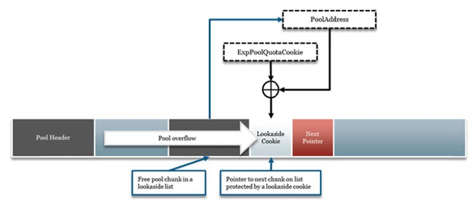

池cookie也用来保护阻塞释放链表，在处理阻塞释放链表时这些cookies使用和lookaside链表同样的方式校验(`nt!ExDeferredFreePool`)。然而，需要注意到不是所有的单链表都被cookie所保护。这包括池页lookaside链表和专用(特定任务)lookaside链表(诸如使用`nt!ExAllocateFromNPagedLookasideList`和`nt!ExAllocateFromPagedLookasideList`的那些)。

#### 缓存对齐分配Cookie

为了在内存操作中提升性能、降低缓存行命中的数量(译者注：这里说反了吧)，池分配可以按处理器缓存边界对齐。尽管MSDN文档表示缓存对齐池分配仅对内部使用，任何内核组件或第三方驱动还是可以通过选择诸如`NonPagedPoolCacheAligned`的`CacheAligned`池类型来使用。当请求时，池分配器会通过向上取整来确保合适的缓存对齐地址，该地址将是到最近的缓存行的字节数加上缓存行的尺寸。CPU缓存行尺寸定义在`nt!ExpCacheLineSize`，一般是64字节大小。

缓存对齐分配极大地提升了空间使用的性能。举个例子，32位系统上请求0x40字节的缓存对齐内存一般会以分配0xC0字节结束，以保证在缓存对齐边界上可以找到请求尺寸的碎片。由于分配器不会干扰未用的返回字节，Windows 8对在缓存对齐分配之前插入cookie的利用手法进行了缓解。

缓存对齐分配cookie的使用依赖于空闲链表返回的地址，如果在使用的池碎片之前有足够空间的话。如果系统组件请求了一个缓存对齐池分配，且返回的chunk已经在一个缓存对齐边界上，那么分配器就会遮蔽掉池头的`CacheAligned`类型并立即返回。尽管分配器增加了请求的尺寸，它还是留下了超出的未用字节。然而，如果返回的是未对齐的chunk，分配器就会调整地址到最近的缓存对齐边界。这种情况的话返回的缓存对齐chunk会保持`CacheAligned`类型，前提是跳过的字节碎片足够存储一个cookie(大于一个block尺寸)。该cookie存储在分离的池chunk中，它由chunk首地址和内核生成的池cookie异或编码生成(`nt!ExpPoolQuotaCookie`)。因此，释放算法会检查`CacheAligned`池类型以便于判断缓存对齐分配cookie是否需要被校验。

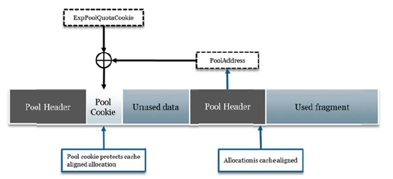

#### 安全链入链出((Un)linking)

安全链出在Windows 7内核池中已经被引入了，用于缓解双向链表的`LIST_ENTRY`结构地址的攻击(Kortchinsky)。如果攻击者可以污染该结构控制的前向和后向指针，那么释放一个chunk就会导致可以向攻击者控制的地址写入攻击者控制的值，这就是众所周知的任意地址4字节覆写。然而，Windows 7的链表验证机制并不完美。特别的，安全链出机制在某些特定情境下可以被绕过(可以看看Mandt展示的List Entry Flink攻击)，且内核池在链入chunk到链表中时不会执行任何校验。

Windows 8显著地提高了链表的验证机制，实现了安全链入和安全链出。值得一提的是，当分配内存时，池分配器会校验待分配chunk的Flink和Blink指针。这有效的抵消了Windows 7中安全链出时Flink链表头的Flink不合法的攻击手法。Windows 8池分配器也会在链入吃内存未使用的碎片前检查链表的一致性，通常是一个大于请求尺寸的chunk被链表返回。

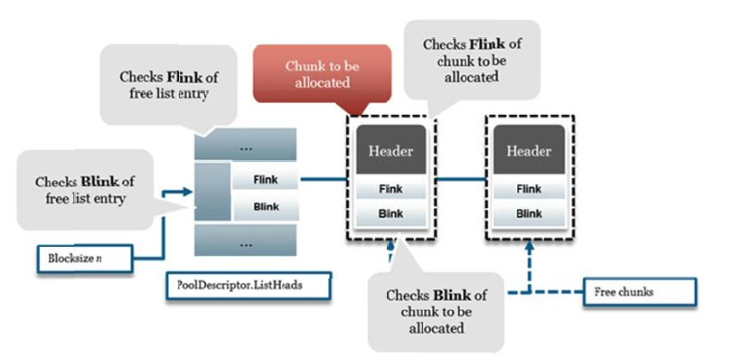

增强链表校验且指针被校验两次的原因在于Windows 8内核池使用了一种新的安全断言(lonescu)，它由汇编指令int 29h这个新的中断handler标志，在`KiRaiseSecurityCheckFailure`时被执行。只要`NO_KERNEL_LIST_ENTRY_CHECKS`未定义，Windows 8的`LIST_ENTRY`宏就自动的增加"`RtlpCheckListEntry(Entry);`"一行在任何操作执行前来校验链表。这使得链表验证对程序员来说是透明的，因为必要的检查会在编译期引入。

```cpp
FORCEINLINE
VOID
RtlpCheckListEntry(
  	_IN_ PLIST_ENTRY Entry
	)
{
  	if((((Entry->Flink)->Blink) != Entry) || (((Entry->Blink)->Flink) != Entry))
  	{
      	FatalListEntryError(
      		(PVOID)(Entry),
      		(PVOID)((Entry->Flink)->Blink),
      		(PVOID)((Entry->Blink)->Flink));
  	}
}
```

**池索引校验**

释放池chunk时，释放算法会使用池头定义的池类型和池索引来判断该chunk应该被返回到哪一个池描述符。池索引是一个池描述符数组的数组索引(包含了池描述符结构体的指针)，最为常见的情况就是`nt!ExpPagedPoolDescriptor`或`nt!ExpNonPagedPoolDescriptor`(如果定义了不止一个非分页池的话)。

因为Windows 7在查找池描述符时不会校验池索引，攻击者可以引用一个超过池描述符指针数组边界的值。例如，分页池描述符数组通常包含4个指针，攻击者可以用内存污染的漏洞来设置池chunk的池索引为5。在释放该chunk时，就会导致内核解引用紧随池描述符指针其后的空指针。因此，通过映射零页攻击者就可以完全控制池描述符数据结构(包括它的空闲链表)来让chunk释放到这里。更进一步，攻击者在池操作符上进行操作（实际上该操作符并不受系统控制），在exp时无需关心其内容，也无需清理管理结构。

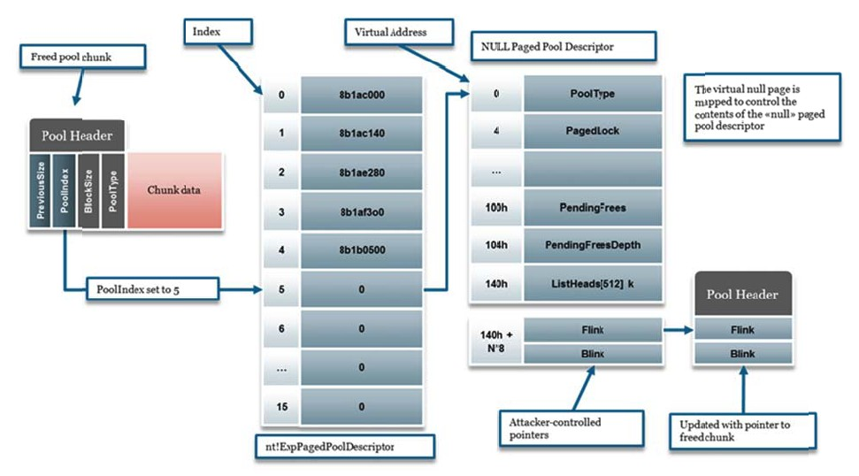

Windows 8缓解了池索引攻击，引入了一个非常简单的修正。当池chunk被释放时，它的池索引会被检查以确保它在相关联的池描述符数组边界以内。对分页池chunk来说，分配器会检查池索引是否小于分页池的数量(`nt!ExpNumberOfPagedPools`)。池索引在双向链表分配块时也会被校验，通过比较它和最初用于检索池描述符的索引来完成。更多地，Windows 8阻止了用户应用程序映射零页(进程再也不是VDM进程了)，因此池索引攻击的缓解有着多种方式。

#### 总结

总的来说，出于鲁棒性和安全性，Windows 8内核池缓解了此前版本系统上的各种攻击手法。尽管池头尚无保护，对池元数据的通用攻击已经是越来越困难了，因为池分配器有了更多的校验手段。下面的表格总结了最近Windows版本的安全增强和缓解措施，一直到Windows 8预览版。

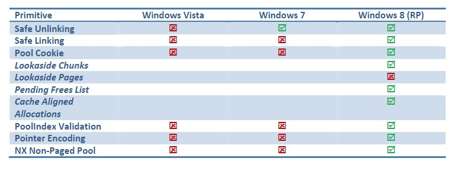

### 块尺寸攻击术

尽管Windows内核池缓解了此前存在的各种攻击手法，但却并不能阻止攻击者通过池污染漏洞精心操纵池头的字段。Windows 8执行了大量的校验，但依然还有很长的路要走，毕竟一些字段很难去校验，受限于其依赖性的缺失。判断chunk的尺寸就是一个这样的情景，因为池分配器完全依赖于池头控制的尺寸信息。在本节中，我们将描述两种基于块尺寸的攻击，攻击者可以将一个有限的(包括长度和写入的数据)污染转化成n字节任意数据污染。

#### 块尺寸攻击

如一开始讨论的，池chunk的池头包含两个尺寸值，块尺寸(`BlockSize`)和前一块的尺寸(`PreviousSize`)。分配器使用这些字段来判定给定池chunk的尺寸，同时也可以定位相邻位置的池chunks。块尺寸值也被用来在释放时进行基本的校验。特别的，`ExFreePoolWithTag`将检查释放的chunk块尺寸是否与其相邻的后一个chunk的`PreviousSize`尺寸匹配。该规则有一个例外，那就是当被释放块占满了页的剩余内容时并非如是，这是因为在页起始的chunks总是将其`PreviousSize`设置为null(对小块分配来说不存在跨页面的关系，因此无法保证下一个页是在使用的)。

当池chunk被释放时，它会据其尺寸被置入对应的空闲链表或lookaside链表。因此，一个池污染漏洞可以让攻击者覆写块的尺寸，以便于将其置入一个任意的空闲链表中。对此，有两点需要斟酌。攻击者可以设置一个小于块尺寸原始值的新值。然而，由于它无法进一步扩展污染所以往往没什么用；而由于池头当前的检查，创建一个内嵌的池头也往往没什么用。另一方面，如果攻击者将块尺寸设置为大于原始值的值，污染就可以进一步扩大到相邻的池chunks。尽管分配器在执行释放时会执行`BlockSize`/`PreviousSize`的检查，但可以通过设置块尺寸来填充页的剩余内容来避免这一检查。攻击者此后就可以重新分配被释放的块，使用字符串或一些其他的可控分配来完全控制边界池chunk的内容。

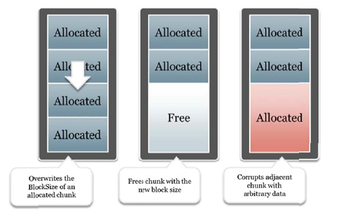

分配器校验块尺寸，除了查看周围chunks以外，没有什么更好的办法。在不使用块尺寸信息编码或是通过组织相同尺寸的分配到一个类似LFH结构的情况下，缓解块尺寸攻击看起来有些难度。块尺寸攻击，连同在特定情境下针对池分配的任何攻击，都依赖于攻击者有能力去成分操纵和控制内核池的状态。例如，该攻击的一大挑战就是要去找到待填充池页的碎片的尺寸。本质上来说这就需要攻击者可以选择性的分配和释放数据，如此才有了合理的成功性。

#### 切割碎片攻击

当请求一个池chunk(不大于4080字节(4064字节 x64))且lookaside链表无法使用时，分配器会扫描空闲链表直到找到一个合适的chunk。如果返回的chunk尺寸大于请求，那么分配器会切割chunk并将使用的碎片捏成chunk挂入空闲链表。切割并返回给调用者chunk的哪一部分取决于chunk的位置，这可以降低碎片化。如果chunk在页的起始位置，那么该chunk的前一部分会返回给调用者，剩余部分则返回给分配器。另一方面，如果chunk不在页的起始位置(也就是在中间位置)，那么会把chunk的尾部返回给调用者，前一部分会返回给分配器。

在从空闲链表检索池chunk时，有着一些心智检查。分配器会校验待分配chunk的Flink和Blink指针，同时也会校验空闲链表头的Flink和Blink。它还会校验待分配chunk的池索引来确保它来自预期的池描述符。然而，由于对块尺寸没有进行任何校验，攻击者就可以使用内存污染漏洞在待分配块尺寸和请求尺寸一致时依然触发块切割。如果块尺寸被设置为更大的值，剩余的字节就会被返回给分配器，因此攻击者可以隐式地释放使用内存的碎片。

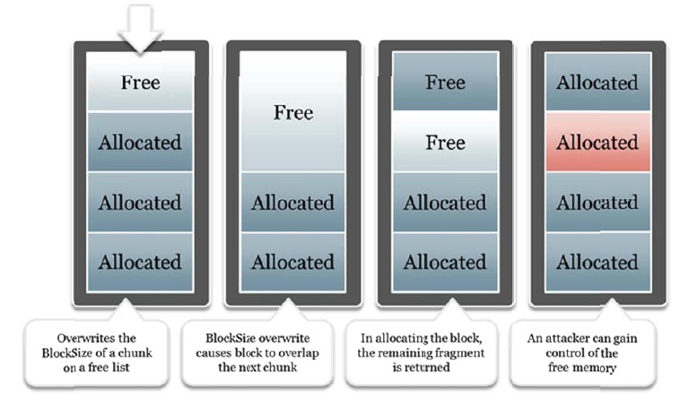

在上面的例子中，攻击者对相同尺寸的分配(例如可执行对象)进行了喷射，横跨多个页面。通过选择性地释放某些分配chunks并触发池污染漏洞，攻击者可以覆盖某个页起始的空闲chunk的块尺寸，将它的尺寸乘二。在使用可控的比如字符串来请求到该内存时，分配器会切割该chunk，返回该chunk的前一部分，将后一部分挂回空闲链表。此时，分配器就释放了一个正在使用的chunk，因此就创造了一个类似UAF的情景，攻击者可以重新分配到这一释放的内存以完全控制受影响的对象。

以攻击者的视角来看，切割碎片攻击相较于块尺寸攻击有一定的优势，那就是chunk的定位不那么痛苦，因为切割过程会保证受影响的池chunk头会被正确的更新。然而，由于内核仍会引用在创建切割碎片时释放的内存(例如，在一个以内核对象为目标的对象管理器中)，除非采取了预防措施，否则可能会有附加的损毁风险(比如double frees)。

### 内核空间总结

Windows 8内核池相较于旧版本在多个领域都有了相当的提升，再一次的拔高了exp的门槛。尽管其算法和数据结构没有什么显著变化，安全性的提升却使得通用内核池攻击统统失效。特别的，适宜的安全链入和链出的追加，随机化cookie编码对指针的保护来防止攻击者针对元数据等等措施，都极大的缓解了内核池攻击。然而，由于池头仍然未被保护，攻击者还是可以在某些情景下针对头部数据进行篡改，比如块尺寸值，使得一些漏洞或多或少有点用处。尽管这种攻击手法需要攻击者对内核池的操纵达到相当高的程度，对分配过程有着极高的确定性(处于效能考虑，对lookaside链表的使用具有偏好性)。也就是说，在Windows 8下可靠的池污染漏洞exp，难度和技巧均有了提升，这类攻击也将变得越来越少。

## 致谢

感谢下面的几位对我提供的帮助。

- Jon Larimer(@shydemeanor)
- Dan Rosenberg(@djrbliss)
- Mark Dowd(@mdowd)

##参考文献

- Jurczyk, Mateusz ‘j00ru’ ‐ Reserve Objects in Windows 7 (Hack in the Box Magazine)

- Hawkes, Ben. 2008. Attacking the Vista Heap. Ruxcon 2008 / Blackhat USA 2008,

  http://www.lateralsecurity.com/downloads/hawkes_ruxcon‐nov‐2008.pdf

- Ionescu, Alex – Int 0x29

  http://www.alex‐ionescu.com/?p=69

- Kortchinsky, Kostya – Real World Kernel Pool Exploitation

  http://sebug.net/paper/Meeting‐Documents/syscanhk/KernelPool.pdf

- Mandt, Tarjei. 2011, “Modern Kernel Pool Exploitation”

  http://www.mista.nu/research/kernelpool_infiltrate2011.pdf

- Moore, Brett, 2008 “Heaps about Heaps”

  http://www.insomniasec.com/publications/Heaps_About_Heaps.ppt

- Phrack 68 “The Art of Exploitation: MS IIS 7.5 Remote Heap Overflow”

  http://www.phrack.org/issues.html?issue=68&id=12#article

- SMP, “Symmetric multiprocessing”

  http://en.wikipedia.org/wiki/Symmetric_multiprocessing

- Valasek, Chris. 2010, “Understanding the Low Fragmentation Heap”

  http://illmatics.com/Understanding_the_LFH.pdf
  http://illmatics.com/Understanding_the_LFH_Slides.pdf

- Varghese George, Tom Piazza, Hong Jiang ‐ Technology Insight: Intel Next Generation

  Microarchitecture Codenamed Ivy Bridge
  http://www.intel.com/idf/library/pdf/sf_2011/SF11_SPCS005_101F.pdf