# 理解低碎片(LFH)堆

## 简介

Windows堆利用技术，伴随着越来越复杂的算法和数据结构，无论是利用方法的数量还是难度系数都在逐年递增。而这种趋势，加之社区内部对堆相关知识理解的浅显与匮乏，使得可靠的利用技术严重下滑。如果对堆管理机制的内部能有一个完整的理解，那么就可以避开那些不可预测的失败，写出精准的exp。

自Windows Vista以来，LFH已经成了Windows操作系统默认的前端堆管理器。相比较此前的Lookaside List，新的前端堆管理器引入了一套不同的数据结构与算法。同时，系统本身也改变了后端的内存管理机制。这些都对Windows 7应用程序分配和释放内存产生了影响。

本文的主要目的在于使读者可以熟悉新的创建逻辑以及与LFH相关的数据结构。首先，我们会阐释新的数据结构以及他们之间的耦合关系，谱写一些清晰简明的基础内容。此后会对底层算法如何操纵这些数据结构展开讨论。最后，我们会使用这些新的知识、通过具体的实例来揭秘一些新的利用技术。

###概览

本文分成4个独立的部分。第一部分详述了核心数据结构，它们贯穿了整个堆管理机制，维护内存。对这些结构有一个透彻的理解是深入理解本文其他部分内容的先决条件。

第二部分会讨论在Windows Vista和Windows 7上（移植过来）新的架构。这一部分会展示基于Windows XP代码而进化了的数据结构的使用。

第三部分将揭露Windows 7堆的核心算法的底层信息。这一部分会对前端和后端两个堆管理子系统进行详述。理解这一部分将有助于理解第四部分的框架与exp的开发。

第四部分，也是本文的最后一部分，将展示如何使用底层堆管理器，对堆进行精心操纵，通过用户提供的信息，滥改堆元数据以达成代码执行的一些战术。

###预前工作

尽管当前可能已经有非常多的LFH相关的信息，我还是仅仅列出我在做研究时所用到的一些资料。为了理解本文，这些资料理应被预先浏览。如果列表里落了谁，我对此表示抱歉。

- 我仍然确信Ben Hawkes在几年前就已经搞清楚这回事了。他在RuxCon/Blackhat 2008的演讲是我作品的灵感源泉。(Hawkes 2008)
- Nico Waisman对Windows Vista展开了大量的逆向工作，在Immunity Debugger中的libheap.py插件中提供了详细的信息。(Waisman 2008)
- Brett Moore的论文"Heaps about Heaps"是我认为所有看过的最精彩的演讲。我想它会永远作为堆相关工作的一个伟大的参考。(Moore 2007)
- Brett Moore还发表了在Windows XP SP2上FreeList[0]的链入过程利用手法，本文也会提及此手法。(Moore 2005)
- Richard Johnson在ToorCon 2006的演讲描述了Windows Vista的新生LFH。这是关于LFH算法和数据结构详细描述的第一份资料。(Johnson 2006)
- 尽管David B.Probert(Ph.D.)的演讲主要聚焦于LFH性能的表现，但对于试图理解在Windows 7上堆实现机制的变化来说这依然非常有价值。(Probet)
- Adrian Marinescu在Blackhat 2006上对Windows Vista的堆的变化进行了演讲。他清楚地解释了从旧堆管理机制到当下过渡的原因。(Marinescu 2006)
- 最后，Lionel d'Hauenens的Symbol Type Viewer是一个无价之宝，它可以分析Windows 7堆管理的数据结构。如果没有它，在寻找数据结构时定会浪费大量的时间。

###预备知识

本文所用的所有伪代码和数据结构都源于32位Windows 7的ntdll.dll，版本是6.1.7600.16385。利用Symbol Type Viewer和Windbg，从该库摘取的数据结构名称定义全部源于微软符号服务器。

伪代码的修改较多，以便于专注研究堆管理算法的核心部分。如果你觉着我落掉了某些内容或是解释的不正确，请与我邮件联系cvalasek@gamil.com。我会给你奖金。

###术语

关于Windows堆这一主题，当前已发表过多篇论文，不幸的是，我发现他们所用的术语各不相同。尽管本文使用的术语和其他人的也不一样，但我还是想现在对他们进行定义，以便在整篇文章中保持一致。

术语block或者blocks表示8字节连续内存。它是堆块(heap chunk)头部在引用大小时所用的最小度量单位。一个chunk是一片连续的内存空间，可以使用blocks或bytes来度量。

HeapBase是一个指向结构体`_HEAP`指针的别名，它由Windows调试符号定义。整篇文章中各种对象都会按HeapBase起始的某个偏移量进行定义。同时，LFH是Low Fragmentation Heap的缩写。

BlocksIndex是`_HEAP_LIST_LOOKUP`结构的别名。这两个术语可以相互替代。BlocksIndex结构体通过Lists来管理chunks，低于0x400（1024）字节的chunks所在的Lists作为第一个 BlocksIndex，而从0x400到0x4000(16k)的块所在的Lists作为第二个BlocksIndex。大于16k的且低于DeCommitThreshold和0xFE00 blocks的chunks会被组织在类似FreeList[0]的结构体中（在文章后面讨论）。

专用FreeLists的概念已经消失了。术语ListHint或FreeList用来表示指向Heap->FreeLists中特定位置的一个链表。这将在本文的架构部分进行展开。

最后，术语HeapBin, Bin, UserBlock用来表示LFH分配的一块具体大小的内存。我知道大部分人称之为HeapBucket，但是我一般不这样叫，这是为了避免与微软调试符号`_HEAP_BUCKET`产生混淆，`_HEAP_BUCKET`是一个0x4字节的数据结构，用来指定一个尺寸而不是用于内存容器。

###注意事项

本文旨在为John McDonald和我在Blackhat USA 2009完成的工作提供后续知识。关于双链表、Lookaside链表等结构的内部工作原理都可以在题为《Practical Windows XP/2003 Exploitation》一文中找到。

## 数据结构

所有的数据结构都源于ntdll.dll的Windows调试符号，版本是6.1.7600.16385。它们在堆管理器中用于追溯内存，通过抽象函数调用为用户提供访问虚拟内存的渠道，主要是通过`HeapAlloc()`,`HeapFree()`,`malloc()`和`free()`。

### _HEAP(HeapBase)

每个堆都以一个叫HeapBase的结构开始构建。HeapBase包含了堆管理器所用到的多个重要的值和结构体指针。它是每个堆的心脏，为了提供可靠的分配和释放操作，必须维持该结构的完整性。如果你对Windows XP的基础代码比较熟悉，那么它看起来是相当雷同的，但其中某些加粗的字段仍需进一步解释。下面展示了`_HEAP`结构体在32位Windows 7 Service Pack 0上的布局：

```
0:001> dt _HEAP 
ntdll!_HEAP 
  +0x000 Entry : _HEAP_ENTRY 
  +0x008 SegmentSignature : Uint4B 
  +0x00c SegmentFlags : Uint4B 
  +0x010 SegmentListEntry : _LIST_ENTRY 
  +0x018 Heap : Ptr32 _HEAP 
  +0x01c BaseAddress : Ptr32 Void 
  +0x020 NumberOfPages : Uint4B 
  +0x024 FirstEntry : Ptr32 _HEAP_ENTRY 
  +0x028 LastValidEntry : Ptr32 _HEAP_ENTRY 
  +0x02c NumberOfUnCommittedPages : Uint4B 
  +0x030 NumberOfUnCommittedRanges : Uint4B 
  +0x034 SegmentAllocatorBackTraceIndex : Uint2B 
  +0x036 Reserved : Uint2B 
  +0x038 UCRSegmentList : _LIST_ENTRY 
  +0x040 Flags : Uint4B 
  +0x044 ForceFlags : Uint4B
  +0x048 CompatibilityFlags : Uint4B 
  +0x04c EncodeFlagMask : Uint4B 	
  +0x050 Encoding : _HEAP_ENTRY 	
  +0x058 PointerKey : Uint4B 
  +0x05c Interceptor : Uint4B 
  +0x060 VirtualMemoryThreshold : Uint4B 
  +0x064 Signature : Uint4B 
  +0x068 SegmentReserve : Uint4B 
  +0x06c SegmentCommit : Uint4B 
  +0x070 DeCommitFreeBlockThreshold : Uint4B 
  +0x074 DeCommitTotalFreeThreshold : Uint4B 
  +0x078 TotalFreeSize : Uint4B 
  +0x07c MaximumAllocationSize : Uint4B 
  +0x080 ProcessHeapsListIndex : Uint2B 
  +0x082 HeaderValidateLength : Uint2B 
  +0x084 HeaderValidateCopy : Ptr32 Void 
  +0x088 NextAvailableTagIndex : Uint2B 
  +0x08a MaximumTagIndex : Uint2B 
  +0x08c TagEntries : Ptr32 _HEAP_TAG_ENTRY 
  +0x090 UCRList : _LIST_ENTRY 
  +0x098 AlignRound : Uint4B 
  +0x09c AlignMask : Uint4B 
  +0x0a0 VirtualAllocdBlocks : _LIST_ENTRY 
  +0x0a8 SegmentList : _LIST_ENTRY 
  +0x0b0 AllocatorBackTraceIndex : Uint2B 
  +0x0b4 NonDedicatedListLength : Uint4B 
  +0x0b8 BlocksIndex : Ptr32 Void 	
  +0x0bc UCRIndex : Ptr32 Void 
  +0x0c0 PseudoTagEntries : Ptr32 _HEAP_PSEUDO_TAG_ENTRY 
  +0x0c4 FreeLists : _LIST_ENTRY 	
  +0x0cc LockVariable : Ptr32 _HEAP_LOCK 
  +0x0d0 CommitRoutine : Ptr32 long 
  +0x0d4 FrontEndHeap : Ptr32 Void 	
  +0x0d8 FrontHeapLockCount : Uint2B 
  +0x0da FrontEndHeapType : UChar 	
  +0x0dc Counters : _HEAP_COUNTERS 
  +0x130 TuningParameters : _HEAP_TUNING_PARAMETERS
```

> 译者注：原文加粗的字段就是下面枚举解释的那些。

- `EncodeFlagMask` - 用于判断堆chunk头部是否被编码。该值初始化时由`RtlCreateHeap()`中的`RtlpCreateHeapEncoding()`设置为0x100000。
- `Encoding` - 在异或(XOR)操作中用于编码chunk头，防止可预知的元数据被污染。
- `BlocksIndex` - 这是个`_HEAP_LIST_LOOKUP`结构体，用途广泛。因为他比较重要，所以我们在文章的后面部分进行详细解释。
- `FreeLists` - 一个特殊的链表，包含了堆上所有空闲chunk的指针。基本上可以把它看成是个堆缓存，只不过对所有尺寸的chunk都适用（并且没有单一关联位图）。
- `FrontEndHeapType` - 初始化设置为0x0的整型数，随后会被赋予0x2的值，用于指示LFH的使用。注意：Windows 7实际上不支持Lookaside Lists。
- `FrontEndHeap` - 指向关联的前端堆。在Windows 7中，它要么是NULL要么是一个指向`_LFH_HEAP`结构体的指针。

### _HEAP_LIST_LOOKUP(HeapBase->BlocksIndex)

理解`_HEAP_LIST_LOOKUP`结构对于理解Windows 7堆管理机制来说非常重要。它是前端和后端堆管理器分配和释放机制的基石。在正常条件下，由`RtlCreateHeap()`初始化的第一个`_HEAP_LIST_LOOKUP`结构会分配在HeapBase+0x150处。

```
0:001> dt _HEAP_LIST_LOOKUP 
ntdll!_HEAP_LIST_LOOKUP 
  +0x000 ExtendedLookup : Ptr32 _HEAP_LIST_LOOKUP 
  +0x004 ArraySize : Uint4B 
  +0x008 ExtraItem : Uint4B 
  +0x00c ItemCount : Uint4B 
  +0x010 OutOfRangeItems : Uint4B 
  +0x014 BaseIndex : Uint4B 
  +0x018 ListHead : Ptr32 _LIST_ENTRY 
  +0x01c ListsInUseUlong : Ptr32 Uint4B 
  +0x020 ListHints : Ptr32 Ptr32 _LIST_ENTRY
```

- `ExtendedLookup` - 指向下一个`_HEAP_LIST_LOOKUP`结构体的指针，不存在下一个则为NULL。
- `ArraySize` - 该结构可以追溯的最大block尺寸，超出尺寸的就需要存储在一个特殊的`ListHint`中。Windows 7当前唯一使用的两个尺寸值是0x80和0x800。
- `OutOfRangeItems` - 该四字节值记载了类FreeList[0]结构中条目的个数。每个`_HEAP_LIST_LOOKUP`会通过`ListHint[ArraySize-BaseIndex-1]`来跟踪尺寸大于`ArraySize-1`的空闲chunks。
- `BaseIndex` - 用于索引`ListHints`数组的相对偏移，每个`_HEAP_LIST_LOOKUP`都被设计成对应于某一个具体尺寸。例如，第一个BlocksIndex的BaseIndex应该是0x0，因为它管理的chunks大小范围在0x0-0x80之间，而第二个BlocksIndex的BaseIndex应该是0x80。
- `ListHead` - 它和`HeapBase->FreeLists`指向同一个位置，该位置是一个链表，存储了堆中可用的所有的空闲chunks。
- `ListsInUseUlong` - 形式上作为`FreeListInUseBitmap`，该4字节整型数是一种优化，用于判断哪个`ListHints`拥有可用的chunks。
- `ListHints` - 也视为`FreeLists`，这些链表提供了内存中空闲chunks的指针，与此同时还用于其它目的。如果对一个给定的`Bucket`尺寸启用LFH，那么特定尺寸的`ListHint/FreeList`的`blink`将指向`_HEAP_BUCKET+1`。

### _LFH_HEAP(HeapBase->FrontEndHeap)

LFH由该数据结构管理。当激活时，它会告知堆管理器它可以管理何种尺寸，同时对此前用过的chunks保持缓存。尽管`BlocksIndex`足以追溯尺寸上超过0x800 blocks的chunks，但LFH仅仅为尺寸小于16k的chunks所用。

```
0:001> dt _LFH_HEAP 
ntdll!_LFH_HEAP 
  +0x000 Lock : _RTL_CRITICAL_SECTION 
  +0x018 SubSegmentZones : _LIST_ENTRY 
  +0x020 ZoneBlockSize : Uint4B 
  +0x024 Heap : Ptr32 Void 
  +0x028 SegmentChange : Uint4B 
  +0x02c SegmentCreate : Uint4B 
  +0x030 SegmentInsertInFree : Uint4B 
  +0x034 SegmentDelete : Uint4B 
  +0x038 CacheAllocs : Uint4B 
  +0x03c CacheFrees : Uint4B 
  +0x040 SizeInCache : Uint4B 
  +0x048 RunInfo : _HEAP_BUCKET_RUN_INFO 
  +0x050 UserBlockCache : [12] _USER_MEMORY_CACHE_ENTRY 
  +0x110 Buckets : [128] _HEAP_BUCKET 
  +0x310 LocalData : [1] _HEAP_LOCAL_DATA
```

- `Heap` - 该LFH指向父亲堆的指针
- `UserBlockCache` - 尽管不会详尽讨论该字段，但也值得提及。`UserBlockCache`数组跟踪了那些此前用过的内存chunks，这对未来的分配有用。
- `Buckets` - 0x4字节的数据结构数组，仅仅用于跟踪索引和尺寸。这就是为什么术语`Bin`会被用来描述满足特定`Bucket`请求的内存空间。
- `LocalData` - 指向一个大数据结构的指针，该数据结构保存了每个`SubSegment`的信息。可以参考`_HEAP_LOCAL_DATA`来了解更多信息。

### _LFH_BLOCK_ZONE(HeapBase->FrontEndHeap->LocalData->CrtZone)

该数据结构用于跟踪那些用于服务分配请求的内存的位置。这些指针在第一次服务请求时或者当指针链表用尽时被LFH设置。

```
0:000> dt _LFH_BLOCK_ZONE 
ntdll!_LFH_BLOCK_ZONE 
  +0x000 ListEntry : _LIST_ENTRY 
  +0x008 FreePointer : Ptr32 Void 
  +0x00c Limit : Ptr32 Void
```

- `ListEntry` - `_LFH_BLOCK_ZONE`结构链表
- `FreePointer` - 一个指向可以被`_HEAP_SUBSEGMENT`使用的内存指针
- `Limit` - 链表中最后一个`LFH_BLOCK_ZONE`结构。当该值达到临界时，后端堆会创建更多的`_LFH_BLOCK_ZONE`机构。

### _HEAP_LOCAL_DATA(HeapBase->FrontEndHeap->LocalData)

为LFH提供`_HEAP_LOCAL_SEGMENT_INFO`实例的关键数据结构。

```
0:000> dt _HEAP_LOCAL_DATA 
ntdll!_HEAP_LOCAL_DATA 
  +0x000 DeletedSubSegments : _SLIST_HEADER 
  +0x008 CrtZone : Ptr32 _LFH_BLOCK_ZONE 
  +0x00c LowFragHeap : Ptr32 _LFH_HEAP 
  +0x010 Sequence : Uint4B 
  +0x018 SegmentInfo : [128] _HEAP_LOCAL_SEGMENT_INFO
```

- `LowFragHeap` - 此结构关联的LFH。
- `SegmentInfo` - `_HEAP_LOCAL_SEGMENT_INFO`结构数组，代表LFH所有可用的尺寸。更多信息请参考`_HEAP_LOCAL_SEGMENT_INFO`。

### _HEAP_LOCAL_SEGMENT_INFO(HeapBase->FrontEndHeap->LocalData->SegmentInfo[])

所请求的尺寸将决定使用哪一个`_HEAP_LOCAL_SEGMENT_IOFO`结构。该结构控制了堆算法决定最有效的方式来分配和释放内存的信息。尽管`_HEAP_LOCAL_DATA`中只有128个该结构，所有的小于16k的8字节对齐尺寸都有一个对应的`_HEAP_LOCAL_SEGMENT_INFO`。有一个特殊的算法用于计算相对索引，以保证每个`Bucket`都有一个专门的结构。

```
0:000> dt _HEAP_LOCAL_SEGMENT_INFO 
ntdll!_HEAP_LOCAL_SEGMENT_INFO 
  +0x000 Hint : Ptr32 _HEAP_SUBSEGMENT 
  +0x004 ActiveSubsegment : Ptr32 _HEAP_SUBSEGMENT 
  +0x008 CachedItems : [16] Ptr32 _HEAP_SUBSEGMENT 
  +0x048 SListHeader : _SLIST_HEADER 
  +0x050 Counters : _HEAP_BUCKET_COUNTERS 
  +0x058 LocalData : Ptr32 _HEAP_LOCAL_DATA 
  +0x05c LastOpSequence : Uint4B 
  +0x060 BucketIndex : Uint2B 
  +0x062 LastUsed : Uint2B
```

- `Hint` - 该`Subsegment`仅在LFH释放了一个chunk时才设置。如果没有chunk被释放过，该值将始终是NULL。
- `ActiveSubsegment` - 为大部分内存请求所用的`SubSegment`。初始化为NULL，当为某个特定尺寸进行第一次分配时设置。
- `LocalData` - 体与此字段关联的`_HEAP_LOCAL_DATA`结构。
- `BucketIndex` - 每个`SegmentInfo`对象都与一个具体的`Bucket`尺寸(或索引)相关。

### _HEAP_SUBSEGMENT(HeapBase->FrontEndHeap->LocalData->SegmentInfo[]->Hint, ActiveSubsegment, CachedItems)

每个特定的`_HEAP_BUCKET`有着合适的结构来标识，前端管理器也因此可以执行释放或分配。既然LFH可以被视为一个堆管理器中的堆管理器，那么`_HEAP_SUBSEGMENT`用于跟踪有多少内存可用以及应该如何分布就很有意义了。

```
0:000> dt _HEAP_SUBSEGMENT 
ntdll!_HEAP_SUBSEGMENT 
  +0x000 LocalInfo : Ptr32 _HEAP_LOCAL_SEGMENT_INFO
  +0x004 UserBlocks : Ptr32 _HEAP_USERDATA_HEADER 
  +0x008 AggregateExchg : _INTERLOCK_SEQ 
  +0x010 BlockSize : Uint2B 
  +0x012 Flags : Uint2B 
  +0x014 BlockCount : Uint2B 
  +0x016 SizeIndex : UChar 
  +0x017 AffinityIndex : UChar 
  +0x010 Alignment : [2] Uint4B 
  +0x018 SFreeListEntry : _SINGLE_LIST_ENTRY 
  +0x01c Lock : Uint4B
```

- `LocalInfo` - 与此关联的`_HEAP_LOCAL_SEGMENT_INFO`结构
- `UserBlocks` - `_HEAP_USERDATA_HEADER`结构与此`SubSegment`耦合，它控制了一个大的内存chunk，该chunk被分割成n个chunks。
- `AggregateExchg` - `_INTERLOCK_SEQ`结构体，用于追溯当前的`Offset`和`Depth`。
- `SizeIndex` - 该`SubSegment`的`_HEAP_BUCKET SizeIndex`。

### _HEAP_USERDATA_HEADER(HeapBase->FrontEndHeap->LocalData->SegmentInfo[]->Hint, ActiveSubsegment, CachedItems->UserBlocks)

在UserBlock chunk之前的该头用于服务LFH所有的请求。当定位到一个`SubSegment`后，已提交(committed)内存实际上操纵的位置就是该结构。

```
0:000> dt _HEAP_USERDATA_HEADER 
ntdll!_HEAP_USERDATA_HEADER 
  +0x000 SFreeListEntry : _SINGLE_LIST_ENTRY 
  +0x000 SubSegment : Ptr32 _HEAP_SUBSEGMENT 
  +0x004 Reserved : Ptr32 Void 
  +0x008 SizeIndex : Uint4B 
  +0x00c Signature : Uint4
```

###_INTERLOCK_SEQ(HeapBase->FrontEndHeap->LocalData->SegmentInfo[]->Hint, ActiveSubsegment, CachedItems->AggregateExchg)

因为`UserBlock` chunks被划分的方式，我们需要某种方式来获取当前的偏移来释放或分配下一个chunk。该过程由`_INTERLOCK_SEQ`数据结构控制。

```
0:000> dt _INTERLOCK_SEQ 
ntdll!_INTERLOCK_SEQ 
  +0x000 Depth : Uint2B 
  +0x002 FreeEntryOffset : Uint2B 
  +0x000 OffsetAndDepth : Uint4B 
  +0x004 Sequence : Uint4B 
  +0x000 Exchg : Int8B
```

- `Depth` - 记录在`UserBlock`中剩余多少个chunks。释放时该值会递增，分配时则递减。它的初始值由`UserBlock/HeapBucket`决定。
- `FreeEntryOffset` - 该双字节整型数 * 0x8，加上`_HEAP_USERDATA_HEADER`的地址，就是下一个释放或分配内存的指针。该值以blocks(0x8字节chunks)为单位，初始化为0x2，这是因为`sizeof(_HEAP_USERDATA_HEADER)`等于0x10。(头部占两个blocks 0x2 * 0x8 == 0x10)
- `OffsetAndDepth` - 因为`Depth`和`FreeEntryOffset`都是双字节，所以它们可以组合形成一个单一四字节值。(译者注：注意这是个union)

###_HEAP_ENTRY(Chunk Header)

`_HEAP_ENTRY`就是堆chunk的头部，它是一个8字节的值，存储于每个chunk内存空间的起始位置（即使是`UserBlocks`内部的chunks也一样）。因为头部的有效性和安全性问题，自Windows XP基础代码以来该结构的改变巨大。

```
0:001> dt _HEAP_ENTRY 
ntdll!_HEAP_ENTRY 
  +0x000 Size : Uint2B 
  +0x002 Flags : UChar 
  +0x003 SmallTagIndex : Uchar 
  +0x000 SubSegmentCode : Ptr32 Void 
  +0x004 PreviousSize : Uint2B 
  +0x006 SegmentOffset : Uchar 
  +0x006 LFHFlags : Uchar 
  +0x007 UnusedBytes : Uchar 
  +0x000 FunctionIndex : Uint2B 
  +0x002 ContextValue : Uint2B 
  +0x000 InterceptorValue : Uint4B 
  +0x004 UnusedBytesLength : Uint2B 
  +0x006 EntryOffset : Uchar 
  +0x007 ExtendedBlockSignature : Uchar
```

- `Size` - chunk的尺寸，单位为blocks。它包括`_HEAP_ENTRY`本身的大小。
- `Flags` - 指示chunk的状态。比如FREE或BUSY。
- `SmallTagIndex` - 该值存储`_HEAP_ENTRY`前三个字节的XOR校验值。
- `UnusedBytes/ExtendedBlockSignature` - 表示未使用字节数，或是一个被LFH所管理的指示chunk状态的字节。

###概览

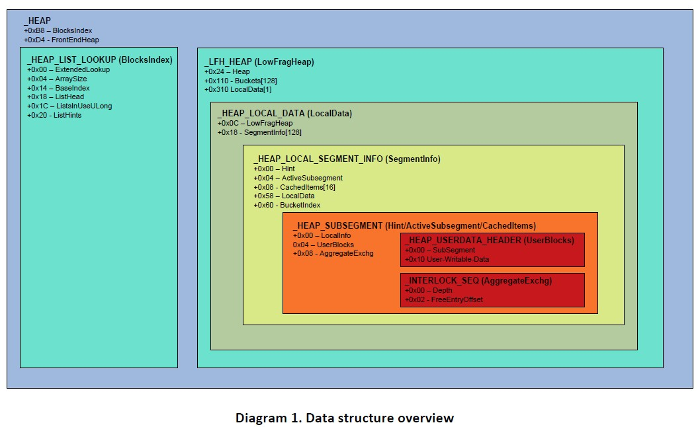

## 架构

Windows 7堆管理器自Windows XP以来变化非常巨大，因此重温一些简洁的架构调整将很有必要。特别的，FreeLists工作的方式进行了重构，数据是如何存储于其中也需要进一步解释。

### FreeLists

在我们讨论核心算法之前，需要先调查当下和此前的FreeList结构。这是因为FreeLists操作与存储数据的方式自Windows XP基础代码以来发生了改变。John McDonald和我曾在此前的一篇论文中给出FreeList结构的概要：

> 对1024字节以下的块尺寸来说，每个尺寸都有一个链表，一共是128个空闲链表（堆块尺寸是8的倍数）。每个双向空闲链表都有一个哨兵头结点，存储于堆基址处某偏移的数组中。每个头结点包含两个指针：一个前向指针(Flink)，和一个后向指针(Blink)。FreeList[1]没有被用到，FreeList[2]-FreeList[127]被称作专用的空闲链表。每个链表中所有的空闲块大小都相同，大小应该是数组索引*8。所有大于等于1024字节的块，都被保存在FreeList[0]中（该槽是可用的，因为不存在大小为0的空闲块）。该链表的空闲块按升序排列。因此，FreeList[0].Flink指向最小的块(size>=1024)，而FreeList[0].Blink指向最大的块(size>=1024)。

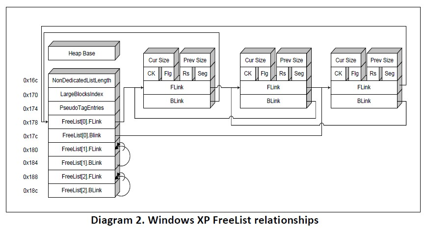

既然LFH改变了前端管理器的工作方式，那么后端管理器也需要进行适配。此后不再有一个单一的专门的`FreeList`，取而代之的，每个`BlocksIndex`都有它自己的`ListHints`，初始化为NULL。

`BlocksIndex`结构中有一个指向它自己的`ListHints`指针，而`ListHints`指向`FreeLists`结构。与旧版本的部署非常相似，只不过`FreeList[0]`不再用作存储大于0x400(1024)字节的chunk。如果不存在`BlocksIndex->ExtendedLookup`则所有的尺寸大于等于`BlocksIndex->ArraySize-1`的chunks都会以升序存储到`FreeList[ArraySize-BaseIndex-1]`之中。

尽管FreeLists包含哨兵节点，该节点在以ListHints指针计算的某个偏移位置处，而ListHints指针是大部分相似点结束的地方。虽然Flink指针仍然指向FreeList的下一个可用chunk，但它也可以扩展到更大的FreeLists。这使得`Heap.FreeLists`需要为特定堆而去遍历每一个可用空闲chunk。

哨兵节点的Blink也做了调整，为了满足两个目的。如果LFH没有为Bucket启用，那么哨兵Blink将作为启发式分配的计数。否则，它将存储`_HEAP_BUCKET+1`的地址（除了`ListHint[ArraySize-BaseIndex-1]`这种情况）。

下面的图是一个稀疏填充堆的实例，展示了这些新的结构体之间是如何交互的。它包含了一个用于跟踪1024字节尺寸以下的chunk的`BlocksIndex`。与此堆关联的chunk仅有5个，可以通过各种方式访问它们。

例如，如果请求分配0x30(48)字节，堆将尝试使用`ListHint[0x6]`。你可以看到，尽管只有3个chunk可供大小0x30的chunk所用，但最后一个大小为0x30的空闲chunk的Flink指向一个属于`FreeList[0x7]`的条目。`FreeList[0x7]`只有一个条目，但和`FreeList[0x6]`一样的是，它的最后一个chunk指向一个超出尺寸边界的更大的chunk。

这改变了链表终止的方式。链表中的最后一个节点不再指向所在的FreeList的哨兵节点，而是指向`HeapBase+0xC4`处的FreeLists条目。

> 注意：`_HEAP_LIST_LOOKUP`结构在`RtlCreateHeap()`或`RtlpExtendListLookup`中初始化时，`ListHead`设置为指向`Heap.FreeLists`(`HeapBase+0xC4`)。这使得两个条目标识并指向了同一片内存区域。

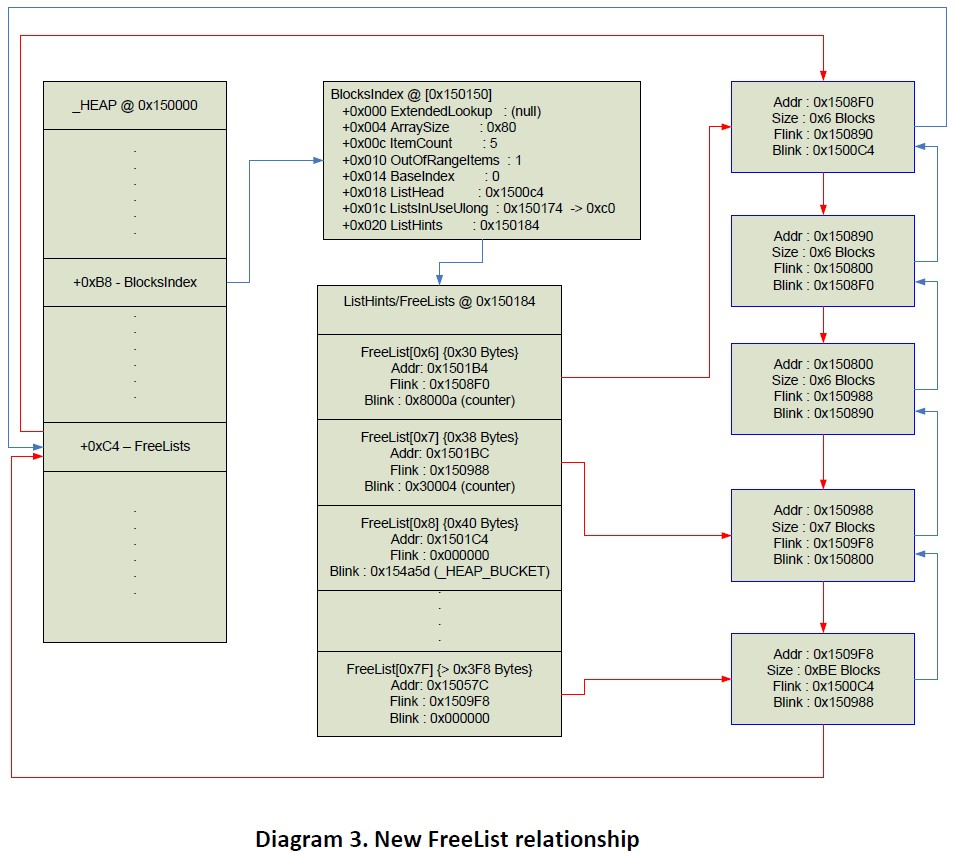

## 算法

要充分理解堆的利用理论，必须奠定基础知识。没有这些核心知识，就只能默念“大神保佑”。本节将把核心算法分成两个部分：分配和释放，并分为后端和前端。之所以如此，是因为前端和后端执行的内存操作可能会影响另一端的状态。

### 分配

当试图为应用程序调用请求而服务时，分配会从`RtlAllocateHeap()`开始。该函数首先会以8字节对齐分配量。此后，它会获取一个`ListHints`的索引。如果没有找到特定索引，就使用`BlocksIndex->ArraySize-1`。

<center>Listing 11. RtlAllocateHeap BlocksIndex 搜索</center>

```cpp
if(Size == 0x0) 
  Size = 0x1; 

//ensure that this number is 8-byte aligned 
//保证分配量是8字节对齐
int RoundSize = Round(Size); 

int BlocksSize = Size / 8; 

//get the HeapListLookup, which determines if we should use the LFH 
//获取HeapListLookup，判断是否该使用LFH
_HEAP_LIST_LOOKUP *BlocksIndex = (_HEAP_LIST_LOOKUP*)heap->BlocksIndex; 

//loop through the HeapListLookup structures to determine which one to use 
//遍历HeapListLookup结构，找出需要使用的是哪一个
while(BlocksSize >= BlocksIndex->ArraySize) 
{ 
  if(BlocksIndex->ExtendedLookup == NULL) 
  { 
    BlocksSize = BlocksIndex->ArraySize - 1; 
    break; 
  } 
  BlocksIndex = BlocksIndex->ExtendedLookup; 
}
```

有一种情况会返回`BlocksIndex->ArraySize-1`作为ListHint索引。如果出现了这种情况，那么后端分配器会使用一个值为NULL的`FreeList`。这将引起后端分配器尝试使用`Heap->FreeLists`。如果`FreeLists`不包含大小充足的chunk，堆会使用`RtlpExtendHeap()`来进行扩展。

如果特定的索引被成功获取到，那么堆管理器会试图使用`FreeList`来满足需求的尺寸。它会根据`FreeList->Blink`来判断对该Bucket来说LFH是否有激活；如果没有的话，管理器会默认使用后端：

<center>Listing 12. RtlAllocateHeap堆管理器选择器</center>

```cpp
//get the appropriate freelist to use based on size 
//基于尺寸获取对应的freelist
int FreeListIndex = BlocksSize - HeapListLookup->BaseIndex; 

_LIST_ENTRY *FreeList = &HeapListLookup->ListHints[FreeListIndex]; 
if(FreeList) 
{ 
  //check FreeList[index]->Blink to see if the heap bucket 
  //context has been populated via RtlpGetLFHContext() 
  //RtlpGetLFHContext() stores the HeapBucket 
  //context + 1 in the Blink 
  //检查FreeList[index]->Blink，看看heap bucket context是否由RtlpGetLFHContext()填充过
  //RtlpGetLFHContext()在Blink中存储了HeapBucket context + 1
  _HEAP_BUCKET *HeapBucket = FreeList->Blink; 
  
  if(HeapBucket & 1) 
  { 
    RetChunk = RtlpLowFragHeapAllocFromContext(HeapBucket-1, aBytes); 
    
    if(RetChunk && heap->Flags == HEAP_ZERO_MEMORY) 
      memset(RetChunk, 0, RoundSize); 
  } 
} 

//if the front-end allocator did not succeed, use the back-end 
//如果前端管理器不行，那就用后端
if(!RetChunk) 
{ 
  RetChunk = RtlpAllocateHeap(heap, Flags | 2, Size, RoundSize, FreeList); 
}
```

### 后端分配

后端分配器是分配算法的最后一道防线，如果它失败了，那么内存请求失败返回NULL。除了为无法由前端服务的内存请求提供服务这一职责以外，后端还负责启发式激活前端分配器。它的工作方式和Windows XP代码中的启发式堆缓存的工作方式非常相似。

#### RtlpAllocateHeap

`_HEAP`结构体，分配尺寸以及期望的`ListHint(FreeList)`作为一部分参数传递给`RtlpAllocateHeap()`。如同`RtlAllocateHeap`般，第一步就是对待分配的尺寸按8字节对齐，同时还要判断`Flags`是否对`HEAP_NO_SERIALIZE`置位。如果该位置位，则LFH不会启用。(<http://msdn.microsoft.com/en-us/library/aa366599%28v=VS.85%29.aspx>)

<center>Listing 13. RtlpAllocateHeap尺寸对齐以及堆维护</center>

```cpp
int RoundSize;

//if the FreeList isn't NULL, the rounding has already
//been preformed
//如果FreeList不是NULL，那么就已经完成尺寸对齐了
if(FreeList)
{
	RoundSize = RoundSize;
}
else
{
	int MinSize = 1;
	if(Size)
		MinSize = Size;
	
    //rounds to the nearest 8-byte aligned number
  	//向上取舍到最近的8字节对齐尺寸
	RoundSize = Round(MinSize);
}

int SizeInBlocks = RoundSize / 8;

if(SizeInBlocks < 2)
{
	//RoundSize += sizeof(_HEAP_ENTRY)
	RoundSize = RoundSize + 8;
	SizeInBlocks = 2;
}

//if NOT HEAP_NO_SERIALIZE, use locking mechanisms
//LFH CANNOT be enabled if this path isn't taken
//如果没有设置HEAP_NO_SERIALIZE，就使用上锁原语
//如果没设置则LFH不会被启用
if(!(Flags & HEAP_NO_SERIALIZE))
{
    //setup locking mechanisms here
    //上锁原语
  
    //if we have certain compaitibility flags
    //(either set below, or otherwise, then
    //we will call 'RtlpPerformHeapMaintenance'
    //which will activate the LFH and
    //setup an ExtendedListLookup as well
	//如果有具体的兼容性标志，就会调用'RtlpPerformHeapMaintenance'
  	//它会激活LFH，也会设置ExtendedListLookup
	if(Heap->CompatibilityFlags & 0x60000000)
		RtlpPerformHeapMaintenance(Heap);
}
```

> 注意：你可以在后面看到`CompatibilityFlags`是如何在代码中设置的。这就是LFH被激活的方式。尽管LFH是默认前端堆管理器，但直到具体的启发式策略触发之前，它实际上并不进行任何的内存管理。

尽管LFH此时已经做好服务请求的准备，但后端分配器仍然会继续进行它的分配。执行完这段代码后再次处理虚拟内存请求，就可以看到`RtlpAllocateHeap()`将试图查看`FreeList`的参数是否非空。根据到来的有效FreeList参数，后端管理器会应用启发式机制来判断LFH是否应该为后续的请求处理分配。

<center>Listing 14. RtlpAllocateHeap LFH启发式机制</center>

```cpp
if(FreeList != NULL)
{
	//if this freelist doesn't hold a _HEAP_BUCKET
	//update the counters and attempt to get the LFH context
    //如果freelist没有持有一个_HEAP_BUCKET
  	//就更新计数器并试图获取LFH上下文
	if(!(FreeList->Blink & 1))
	{
		//add a certain amount to the blink
      	//为blink增加一个具体的数量
		FreeList->Blink += 0x10002;

		//if the counter has ran more than 0x10 times OR
		//we haven't successfully entered the critical section OR
		//we've been through 0x1000 iterations
    	//then attempt to set the Compatibility flags
		//(which, in turn, will call RtlpPerformHeapMaintenance())
      	//如果计数器已经执行了超过0x10次
      	//或者我们不曾成功进入到关键区
      	//或者我们已经进行了0x1000次迭代
      	//那么就会试图设置这个Compatibility标志
      	//(这就意味着我们会调用到RtlpPerformHeapMaintenance())
        if(WORD)FreeList->Blink > 0x20 || FreeList->Blink > 0x10000000)
        {
            //if the FrontEndHeapType is LFH (0x2) assign it
          	//如果FrontEndHeapType是LFH(0x2)，进行赋值
            int FrontEndHeap;
            if(Heap->FrontEndHeapType == 0x2)
                FrontEndHeap = Heap->FrontEndHeap;
            else
                FrontEndHeap = NULL;

            //this function gets a _HEAP_BUCKET
            //stored in _LFH_HEAP->Bucket[BucketSize]
            //if the LFH hasn't been activated yet, it will return NULL
          	//该函数获取一个_HEAP_BUCKET
          	//它存储于_LFH_HEAP->Bucket[BucketSize]
          	//如果LFH仍未被激活，就返回NULL
            char *LFHContext = RtlpGetLFHContext(FrontEndHeap, Size);

            //if the context isn't set AND
            //we've seen 0x10+ allocations, set the flags
          	//如果上下文没有设置并且我们已经进行了0x10+次分配，也要设置该标志
            if(LFHContext == NULL)
            {
                if((WORD)FreeList->Blink > 0x20)
                {
                    //RtlpPerformHeapMaintenance heurstic
                  	//RtlpPerformHeapMaintenance启发式机制
                    if(Heap->FrontEndHeapType == NULL)
                        Heap->CompatibilityFlags |= 0x20000000;
                }
            }
            else
            {
                //save the _HEAP_BUCKET in the Blink
                //+1 == _HEAP_BUCKET
              	//保存_HEAP_BUCKET到Blink
                FreeList->Blink = LFHContext + 1;
            }
        }
	}
}
```

> 注意：这就是我为什么一直说前端和后端管理器存在紧密联系的原因。如你所见`ListHint`用来存储某个`_HEAP_BUCKET`的地址，它用来判断管理器是否应该使用LFH。这一双重用法看起来有点困惑，但是在讨论过前端分配和释放算法之后，它将变得非常清晰。

现在LFH激活flag已经被设置了，分配可以在后端继续进行了。`FreeList`会被检查来看他是否被填充过，然后就会执行一个safe unlink检查。这将确保FreeList值的完整性以避免在unlinking时被4字节覆盖所利用。`ListsInUseUlong`(FreeListInUseBitmap)随后会更新。最后，从链表上卸下来的chunk会更新头部，转为BUSY态并返回。

<center>Listing 15. RtlpAllocateHeap ListHint分配</center>

```cpp
//attempt to use the Flink
//试图使用Flink
if(FreeList != NULL && FreeList->Flink != NULL)
{
    int SizeToUse;

    //saved values
  	//保存值
    _HEAP_ENTRY *Blink = FreeList->Blink;
    _HEAP_ENTRY *Flink = FreeList->Flink;

    //get the heap chunk header by subtracting 8
  	//通过减去8来获取堆头
    _HEAP_ENTRY *ChunkToUseHeader = Flink - 8;

    //decode the header if applicable
  	//解码头部
    if(Heap->EncodeFlagMask)
    	DecodeAndValidateChecksum(ChunkToUseHeader);

    //ensure safe unlinking before acquiring this chunk for use
  	//使用该chunk前确保安全断链
    if(Blink->Flink != Flink->Blink ||
    	Blink->Flink != FreeList)
    {
    	RtlpLogHeapFailure();
    	//XXX RtlNtStatusToDosError and return
    }

    //decrement the total heap size
  	//递减整体堆尺寸
    Heap->TotalFreeSize -= ChunkToUseHeader->Size;

    //iterate through the BlocksIndex structures
    //If no sufficient BlocksIndex is found, use BlocksIndex->ArraySize - 1
  	//迭代BlocksIndex结构体
  	//如果找不到充足的BlocksIndex，就用BlocksIndex->ArraySize - 1
    _HEAP_LIST_LOOKUP *BlocksIndex = Heap->BlocksIndex;
    if(BlocksIndex)
    {
    	int ListHintIndex = GetListHintIndex(BlocksIndex, Size);
    	int RelativeOffset = ListHintIndex - BlocksIndex->BaseIndex;

    	//if there are more of the same size
    	//don't update the bitmap
      	//如果相同尺寸chunk有很多，就不用更新位图
    	if(Flink->Flink != BlocksIndex->ListHead &&
    		Flink.Size == Flink->Flink.Size)
        {
        	BlocksIndex->ListHints[FreeListOffset] =
        	Flink->Flink;
        }
    	else
    	{
    		BlocksIndex->ListHints[FreeListOffset] = NULL;
    		BlocksIndex->ListsInUseUlong[RelativeOffset >> 5] &= 
                ~(1 << RelativeOffset & 0x1F);
    	}
    }

    //unlink the current chunk to be allocated
  	//断链chunk，予以分配
    Blink->Flink = Flink;
    Flink->Blink = Blink;
}
```

> 注意：尽管随后会讨论到，我们还是要注意更新bitmap时不会再使用异或(XOR)操作，取而代之的是使用按位与(&)。这防止了1字节FreeListInUseBitmap翻转攻击（McDonald/Valasek 2009）。

如果`ListHint`无法满足内存分配请求，后端堆管理器就会使用`Heap->FreeLists`。`FreeLists`包含了堆上所有的空闲chunks。如果某个尺寸合适的chunk被找到，那么就会对它进行切割（如果需要的话）并返回给用户。否则，堆就需要使用`RtlpExtendHeap()`来扩展。

<center>Listing 16. RtlpAllocateHeap Heap->FreeLists分配</center>

```cpp
//attempt to use the FreeLists
//试图使用FreeLists
_LIST_ENTRY *HeapFreeLists = &Heap->FreeLists;
_HEAP_LIST_LOOKUP *BlocksIndex = Heap->BlocksIndex;
_LIST_ENTRY *ChunkToUse;

//find an appropriate chunk on the FreeLists
//在FreeLists上寻找合适的chunk
_HEAP_LIST_LOOKUP *CurrBlocksIndex = BlocksIndex;

while(1)
{
    //if we've ran out of structures
    //abort and we'll extend the heap
  	//如果穷尽了结构体还是找不到，就扩展堆
    if(CurrBlocksIndex == NULL)
    {
        ChunkToUse = CurrBlocksIndex->ListHead;
        break;
    }

    //remember that ListHead and HeapFreeLists
    //point to the same location
  	//记住ListHead和HeapFreeLists指向同一位置
    CurrListHead = CurrBlocksIndex->ListHead;
    
    //if we've came upon an empty FreeList extend the heap
  	//如果是空的FreeList，就扩展heap
    if(CurrListHead == CurrListHead->Blink)
    {
        ChunkToUse = CurrListHead;
        break;
    }

    _HEAP_ENTRY *BlinkHeader = (CurrListHead->Blink - 8);

    //if the chunk is encoded decode it
  	//如果chunk被编码了，就先解码
    if(Heap->EncodeFlagMask &&
    	Heap->EncodeFlagMask & BlinkHeader)
    {
    	DecodeHeader(BlinkHeader);
    }

    //if the chunk can't be serviced by the
    //largest chunk extend the heap
  	//如果最大的chunk不能服务，那么就扩展堆
    if(SizeInBlocks > BlinkHeader->Size)
    {
        ChunkToUse = CurrListHead;
        break;
    }

    _HEAP_ENTRY *FlinkHeader = CurrListHead->Flink-8;

    //if the chunk is encoded decode it
  	//如果chunk被编码了，就先解码
    if(Heap->EncodeFlagMask &&
    	Heap->EncodeFlagMask & FlinkHeader)
    {
    	DecodeHeader(FlinkHeader);
    }

    //if the first chunk is sufficient use it
    //otherwise loop through the rest
  	//如果第一个chunk是充足的，就使用它，否则继续循环剩余的
    if(FlinkHeader->Size >= SizeInBlocks)
    {
        ChunkToUse = CurrListHead->Flink;
        break;
    }
    else
    {
        //loop through all the BlocksIndex->ListHints
        //looking for a sufficiently sized chunk
        //then update the bitmap accordingly
      	//循环所有的BlocksIndex->ListHints
      	//寻找一个尺寸充足的chunk
      	//然后相应的更新bitmap
    }

    //look at the next blocks index
  	//下一个blocks索引
    CurrBlocksIndex = CurrBlocksIndex->ExtendedLookup;
}
```

#### 概览

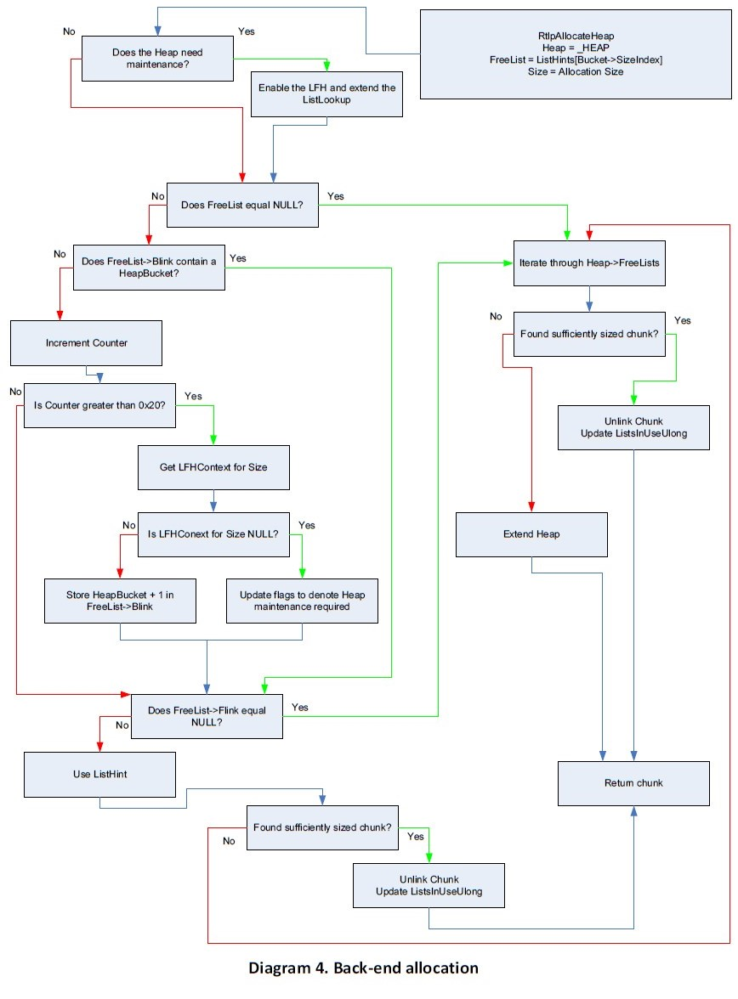

### 前端分配

现在我们已经看过了LFH是如何通过后端管理器的启发式机制来激活的，我们可以看看前端管理器使用的分配算法。LFH的设计考虑了性能和准确性(Marinescu 2006)。为了搞清楚前端分配器的具体工作方式，这些新的增益对逆向工程师来说无疑是巨大的工作量。本节我将尝试阐释一个使用LFH进行分配的典型案例。

#### RtlpLowFragHeapAllocFromContext

如前所述，`RtlpLowFragHeapAllocFromContext()`仅仅在`ListHint`的blink的0位被置位时才会被调用。该位操作可以判断出blink是否包含一个`HeapBucket`，标志着LFH已做好服务该请求的准备。

管理器的分配一开始需要获取所有的关键数据结构。这包括`_HEAP_LOCAL_DATA, _HEAP_LOCAL_SEGMENT_INFO`和`_HEAP_SUBSEGMENT`(可以在图1中看到这些结构的关系)。

分配器首先会试图使用`Hint SubSegment`。如果失败则继续尝试使用`ActiveSubsegment`。如果`ActiveSubsegment`也失败了，那么分配器必须为LFH设置适当的数据结构以继续(为了避免冗余，下面的代码仅仅展示了`Hint Subsegment`使用的伪代码，但其逻辑对于`ActiveSubsegment`来说也是一样的)。

`_INTERLOCK_REQ`结构被用来获取当前的`Depth, Offset`和`Sequence`。这些信息用来获取一个指向当前空闲chunk的指针，同时也会计算出下一个可用chunk的`Offset`。循环逻辑是为了保证关键数据的更新是原子的，不会在操作期间出现其他修改。

<center>Listing 17. LFH SubSegment分配</center>

```cpp
int LocalDataIndex = 0;

//uses the SizeIndex of the _HEAP_BUCKET to
//get the address of the LFH for this bucket
//使用_HEAP_BUCKET的SizeIndex来为该bucket获取LFH的地址
LFH_HEAP *LFH = GetLFHFromBucket(HeapBucket);

//figure this out yourself :)
//这个请自己研究
if(HeapBucket->Affinity == 1)
{
    AllocateAndUpdateLocalDataIndex();
}

//get the LocalData and LocalSegmentInfo
//structures based on Affinity and SizeIndex
//根据Affinity和SizeIndex获取LocalData和LocalSegmentInfo结构
_HEAP_LOCAL_DATA *HeapLocalData = LFH->LocalData[LocalDataIndex];
_HEAP_LOCAL_SEGMENT_INFO *HeapLocalSegmentInfo = 
  	HeapLocalData->SegmentInfo[HeapBucket->SizeIndex];

//try to use the 'Hint' SubSegment first
//otherwise this would be 'ActiveSubsegment'
//首先尝试使用'Hint' Subsegment
//不成再尝试使用'ActiveSubsegment'
_HEAP_SUBSEGMENT *SubSeg = HeapLocalSegmentInfo->Hint;
_HEAP_SUBSEGMENT *SubSeg_Saved = HeapLocalSegmentInfo->Hint;

if(SubSeg)
{
    while(1)
    {
      //get the current AggregateExchange information
      //获取当前的AggregateExchange信息
      _INTERLOCK_SEQ *AggrExchg = SubSeg->AggregateExchg;
      int Offset = AggrExchg->FreeEntryOffset;
      int Depth = AggrExchg->Depth;
      int Sequence = AggrExchg->Sequence;
      
      //store the old values, to ensure atomic swapping
      //存储旧值，保证原子交换
      _INTERLOCK_SEQ AggrExchg_Saved;
      AggrExchg_Saved.OffsetAndDepth = AggrExchg.OffsetAndDepth;
      AggrExchg_Saved.Sequence = Sequence;
      
      //continue only if this is a valid SubSegment
      //仅在是合法的SubSegment情形下才继续
      _HEAP_USERDATA_HEADER *UserBlocks = SubSeg->UserBlocks;
      if(!Depth || !UserBlocks || SubSeg->LocalInfo != HeapLocalSegmentInfo)
      {
          break;
      }
      
      //this gets the offset from the AggregateExchg
      //(block size) and creates a byte offset
      //从AggregateExchg中获取offset(block尺寸)，计算出字节偏移
      int ByteOffset = Offset * 8;
      LFHChunk = UserBlocks + ByteOffset;
      
      //the next offset is store in the 1st 2-bytes
      //of the userdata (this can probably be abused :))
      //下一个offset存储于用户数据的前两个字节中(这可能会被滥用)
      short NextOffset = UserBlocks + ByteOffset + sizeof(_HEAP_ENTRY);
      
      //store the updated offset, depth and sequence
      //存储更新的offset，depth和sequence
      //new_offset = current_offset += BucketSize
      //new_depth = current_deth--
      //new_sequence = depends on current depth
      _INTERLOCK_SEQ AggrExchg_New;
      AggrExchg_New.Offset = NextOffset;
      AggrExchg_New.Depth = Depth--;
      if(AggrExchg_New.Depth == -1)
      	AggrExchg_New.Sequence = Sequence--;
      else
        AggrExchg_New.Sequence = Sequence;
      
      //i.e InterLockedCompareExchange
      if(AtomicSwap(AggrExchg, AggrExchg_New))
      {
          UpdateHeaders(LFHChunk);
          return LFHChunk;
      }
      else
      {
          UpdateAffinity();
          SubSeg = SubSeg_Saved;
      }
    }
}
```

> 注意：尽管出于格式的原因，我们需要清楚`RtlpLowFragHeapAllocFromContext()`的所有代码都由`try/catch`块包裹。这是为了处理LFH中失败发生时，可以返回NULL，此后后端分配器会处理分配请求。

如果Hint和Active SubSegments都失败了，无论是因为未初始化还是非法，`RtlpLowFragHeapAllocFromContext()`都必须去分配内存来获取一个新的`SubSegment`（使用后端分配器），此后会将大块的chunk分成`HeapBin`。一旦这一步完成了，上面的代码就可以通过`ActiveSubsegment`来服务请求了。

如果两种SubSegment都失败了，前端堆就需要分配一个新的chunk内存。该内存的总量不是任意的，而是基于请求chunk的尺寸以及当前堆上可用的内存总量。下面的伪代码就是我提及的Magic Formula（魔法公式）。它将计算需要从后端请求多少内存以便于为一个具体的`HeapBucket`分割出一个`UserBlock`：

<center>Listing 18. LFH UserBlocks分配尺寸算法</center>

```cpp
int TotalBlocks = HeapLocalSegmentInfo->Counters->TotalBlocks;

if(MaxRunLenReached)
	TotalBlocks = TotalBlocks / 16;

int BucketAffinity = HeapBucket->Affinity & 1;

int BucketBytesSize = RtlpBucketBlockSizes[HeapBucket->SizeIndex];

int StartIndex = 7;

if(BucketBytesSize < 256)
	BucketAffinity--;
if(dword_77F97594 > RtlpHeapMaxAffinity >> 1)
	BucketAffinity++;

int BlockMultiplier = 4 - BucketAffinity;

if(TotalBlocks < (1 << BlockMultiplier))
	TotalBlocks = 1 << BlockMultiplier;

if(TotalBlocks > 1024)
	TotalBlocks = 1024;

//used to calculate cache index and size to allocate
//用于计算要分配的缓存索引和尺寸
int TotalBlockSize = TotalBlocks * (BucketBytesSize + sizeof(_HEAP_ENTRY)) + 0x18l
  
if(TotalBlockSize > 0x78000)
	TotalBlockSize = 0x78000;

//calculate the cache index
//upon a cache miss, this index will determine
//the amount of memory to be allocated
//根据缓存命中计算缓存索引，索引将决定待分配的内存总量
if(TotalBlockSize >= 0x80)
{
    do
    {
        StartIndex++;
    }while(TotalBlockSize >> StartIndex);
}

//we will @ most, only allocate 40 pages (0x1000 bytes per page)
//我们至少要分配40个页(0x1000字节/页)
if((unsigned)StartIndex > 0x12)
	StartIndex = 0x12;

int UserBlockCacheIndex = StartIndex;

if(HeapBucket->Affinity & 6)
	UserBlockCacheIndex = 0x12;

//allocate space for a _HEAP_USERDATA_HEADER along with room
//for ((1 << UserBlockCacheIndex) / BucketBytesSize) heap chunks
//为_HEAP_USERDATA_HEADER和((1 << UserBlockCacheIndex) / BucketBytesSize)个堆chunks分配空间
void *pUserData = RtlpAllocateUserBlock(LFH, UserBlockCacheIndex, BucketByteSize + 8);

_HEAP_USERDATA_HEADER *UserData = (_HEAP_USERDATA_HEADER*)pUserData;
if(!pUserData)
	return 0;
```

UserBlockCacheIndex变量用作缓存条目数组的索引值。如果缓存命中，则相同的值被用来计算需要为一个`UserBlocks` chunk分配多少内存。`UserBlocks` chunk随后会被分割成`BucketSize` chunks。`RtlpAllocateUserBlock`在缓存未命中时，实际上是个`RtlpAllocateHeap`的封装：

<center>Listing 19. 缓存未命中时的RtlpAllocateUserBlock</center>

```cpp
int AllocAmount = 1 << UserBlockCacheIndex;
if(AllocAmount > 0x78000)
	AllocAmount = 0x78000;

UserBlock = RtlAllocateHeap(LFH->Heap, 0x800000, AllocAmount - 8);
if(UserBlock)
{
    LFH->CacheAllocs++;
  
  	//Assign the _HEAP_USERDATA_HEADER->SizeIndex
  	//赋值_HEAP_USERDATA_HEADER->SizeIndex
  	*(UserBlock+8) = UserBlockCacheIndex;
}

return UserBlock;
```

尽管内存已经分配了，但LFH还未完全准备好使用它。它必须先和一个`_HEAP_SUBSEGMENT`结构耦合。该SubSegment要么是先前被删除的一个，要么创建于`_LFH_BLOCK_ZONE`链表取回的地址上。

<center>Listing 20. LFH Pre-SubSegment初始化设置</center>

```cpp
int UserDataBytesSize = 1 << UserData->AvailableBlocks;
if(UserDataBytesSize > 0x78000)
	UserDataBytesSize = 0x78000;

int UserDataAllocSize = UserDataBytesSize - 8;

//Increment SegmentCreate to denote a new SubSegment created
//递增SegmentCreate来指示一个新的SubSegment被创建了
InterlockedExchangeAdd(&LFH->SegmentCreate, 1);

DeletedSubSegment = ExInterlockedPopEntrySList(HeapLocalData);
_HEAP_SUBSEGMENT *NewSubSegment = NULL;
if(DeletedSubSegment)
{
    // if there are any deleted subsegments, use them
  	// 如果有被删除的subsegments，就使用它
  	NewSubSegment = (_HEAP_SUBSEGMENT*)(DeletedSubSegment - 0x18);
}
else
{
    NewSubSegment = RtlpLowFragHeapAllocateFromZone(LFH, LocalDataIndex);
  
  	//return failure use back-end
  	//返回失败，使用后端
  	if(!NewSubsegment)
        return 0;
}

//this function will setup the _HEAP_SUBSEGMENT structure
//and check out the data in 'UserData' to be of HeapBucket->SizeIndex chunks
//该函数会设置_HEAP_SUBSEGMENT结构体并检查'UserData'的数据是否是HeapBucket->SizeIndex chunks
RtlpSubSegmentInitialize(LFH, 
                         NewSubSegment, 
                         UserBlock, 
                         RtlpBucketBlockSizes[HeapBucket->SizeIndex],
                         UserDataAllocSize,
                         HeapBucket);

//each UserBlock starts with the same sig
//每个UserBlock一开始都有着相同的标记
UserBlock->Signature = 0xF0E0D0C0;
```

`RtlpLowFragHeapAllocateFromZone()`具有二重效用：要么为`_HEAP_SUBSEGMENT`找到一个指针要么为后续的地址跟踪创建多个`_LFH_BLOCK_ZONE`结构。

该函数首先会检查是否存在有效的`_LFH_BLOCK_ZONE`结构控制了`SubSegment`使用的地址。如果没有或者超出了设计的限制，那么就会分配0x3F8(1016)字节的内存来存储新的`_LFH_BLOCK_ZONE`对象。下面的代码展示了`RtlpLowFragHeapAllocateFromZone()`的经典工作情景。

<center>Listing21. RtlpLowFragHeapAllocateFromZone</center>

```cpp
_LFH_BLOCK_ZONE *CrtZone = LFH->LocalData[LocalDataIndex]->CrtZone;
_LFH_BLOCK_ZONE *CrtZoneFlink = NULL;

while(1)
{
    while(1)
    {
        while(1)
        {
            //Flink == NULL => create initial zones
          	CrtZoneFlink = CrtZone->ListEntry->Flink;
          	if(!CrtZone->Flink)
              	break;
          
          	void *FreePointer = CrtZoneFlink->FreePointer;
          
          	//This will increment it to the next SubSegment
          	//这会递增到下一个SubSegment
          	void *FreePointer_New = FreePointer + LFH->ZoneBlockSize;
          
          	//if we've exceeded the limit
          	//create more zones
          	//如果超出了限制，就创建更多的域
          	if(FreePointer_New >= CrtZoneFlink->Limit)
              	break;
          
          	//InterlockedCompareExchange
          	//loop if this fails
          	//如果失败就一直循环，原子操作
          	if(CompareExchange(
            	&CrtZoneFlink->FreePointer,
            	FreePointer_New))
              	return FreePointer;
        }
      
      	if(CrtZoneFlink == CrtZone->ListEntry.Flink)
          	break;
    }
  
  	//this will effectively give us 31 _LFH_BLOCK_ZONE
  	//structures to use for keeping track of userdata
  	//这将有效的给我们31个_LFH_BLOCK_ZONE结构体，用于跟踪用户数据
  	void *NewLFHBlockZone = RtlAllocateHeap(LFH->Heap, 0x80000u, 0x3F8u);
  
  	if(!NewLFHBlockZone)
      	return 0;
  
  	//if the CrtZone's ListEntry is empty
  	//如果CrtZone的ListEntry是空的
  	if(CrtZoneFlink == CrtZone->ListEntry.Flink)
    {
        //link in the newly created structure
      	//into the LFH->SubSegmentZones
      	//把新创建的结构链入到LFH->SubSegmentZones
      	LinkInBlockZone(LFH, NewLFHBlockZone);
      
      	//points to the end of the allocations
      	//指向分配的末尾
      	NewLFHBlockZone->Limit = NewLFHBlockZone + 0x3F8;
      
      	//sizeof(_LFH_BLOCK_ZONE) == 0x10
      	char *AlignedZone = RoundAlign(NewLFHBlockZone + 0x10);
      
      	NewLFHBlockZone->FreePointer = AlignedZone;
      	CrtZone->ListEntry.Flink = NewLFHBlockZone;
      	continue;
    }
  	// if we failed, free the data
  	// 如果失败了，就释放数据
  	RtlFreeHeap(LFH->Heap, 0x800000, NewLFHBlockZone);
}
```

尽管上面的代码不太好理解，但它的设计还是比较单纯的。最内层的循环保证了`FreePointers`的原子交换，避免了多线程之间的竞态。最外层的循环保证了函数在资源耗尽时创建了新的`BlockZones`。

当通过`RtlpLowFragHeapAllocateFromZone()`获取到地址时，`SubSegment`就可以在`RtlpSubSegmentInitialize()`中初始化。如其名所暗示，它负责初始化`_HEAP_SUBSEGMENT`，使用了一大堆参数，比如新创建的SubSegment(NewSubSegment)，最近分配的内存(UserBlock)，可用内存量(UserDataAllocSize)以及创建chunks的尺寸(HeapBucket / BucketBytesSize)。

`RtlpSubSegmentInitialize()`首先基于`HeapBucket`尺寸获取`LocalSegmentInfo`和`LocalData`结构。在确保具体的`Affinity`状态后，它会精准地计算该`UserBlock`有多少个可用的chunks。一旦chunks的数量被计算出来，他就会迭代内存的大块chunk，为每个chunk写出一个头部。最后`_INTERLOCK_SEQ`设置它的初始化值，其`Depth`等同于`NumberOfChunks`，而`FreeEntryOffset`为0x2。

<center>Listing 22. RtlpSubSegmentInitialize</center>

```cpp
void *UserBlockData = UserBlock + sizeof(_HEAP_USERDATA_HEADER); 

_HEAP_LOCAL_SEGMENT_INFO *LocalSegmentInfo = 
  	LFH->LocalData[NewSubSegment->AffinityIndex]->SegmentInfo[HeapBucket->SizeIndex]; 

_HEAP_LOCAL_DATA *LocalData = 
  	LFH->LocalData[NewSubSegment->AffinityIndex]->Segmentinfo[HeapBucket->SizeIndex]->LocalData; 

if (!((HeapBucket->Affinity >> 1) & 3)) 
{ 
    int TotalBucketByteSize = BucketByteSize + sizeof(_HEAP_ENTRY); 
    int BucketBlockSize = TotalBucketByteSize / 8; 

    //sizeof(_HEAP_USERDATA_HEADER) == 0x10 
    int NumberOfChunks = (UserDataAllocSize - 0x10) / TotalBucketByteSize; 

    //skip past the header, so we can start chunking 
  	//跳过头部，我们可以开始chunking
    void *pUserData = UserBlock + sizeof(_HEAP_USERDATA_HEADER); 

    //assign the SubSegment 
  	//赋值给SubSegment
    UserBlock->SubSegment = NewSubSegment;

    //sizeof(_HEAP_USERDATA_HEADER) == 0x10 (2 blocks) 
    int SegmentOffset = 2; 

    _INTERLOCK_SEQ AggrExchg_New; 
    AggrExchg_New.FreeEntryOffset = 2; 

    if(NumberOfChunks) 
    { 
      int NumberOfChunksItor = NumberOfChunks; 
      do 
      { 
        SegmentOffset += BucketBlockSize; 
        pUserData = UserBlockData; 
        UserBlockData += BucketByteSize; 

        //next FreeEntryOffset 
        *(WORD*)(pUserData + 8) = SegmentOffset; 
        //Set _HEAP_ENTRY.LFHFlags 

        *(BYTE*)(pUserData + 6) = 0x0; 
        //Set _HEAP_ENTRY.UnusedBytes 

        *(BYTE*)(pUserData + 7) = 0x80; 
        EncodeDWORD(LFH, pUserData) 
      } 
      while(NumberOfChunksItor--); 
    } 

    //-1 indicates last chunk 
    //in the UserBlock (_HEAP_USERDATA_HEADER) 
  	//-1表示UserBlock中的最后一个chunk
    *(WORD*)(pUserData + 8) = -1; 

    //Sets all the values for this subsegment 
  	//为该subsegment设置所有的值
    InitSubSegment(NewSubSegment); 
    //updates the bucket counter to reflect 
    //NumberOfChunk as total blocks and 
    //sets the SubSegmentCount 
  	//更新bucket计数器，NumberOfChunk视为整个blocks并设置SubSegmentCount
    UpdateBucketCounters(LocalSegmentInfo); 

    //will be atomically assigned to the 
    //NewSubSegment's _INTERLOCK_SEQ 
  	//将原子的赋值给NewSubSegment的_INTERLOCK_SEQ结构
    AggrExchg_New.Depth = NumberOfChunks; 
    AggrExchg_New.Sequence = AggrExchg_Saved.Sequence + 1; 
  
    //InterlockedCompareExchange64 
    AtomicSwap(&NewSubSegment->AggregateExchg, AggrExchg_New); 
}
```

最后，在UserBlocks被分配以后，对SubSegment赋值并初始化后，LFH就可以设置`ActiveSubsegment`为刚刚初始化的那个。它会使用一些锁机制进行操作，最终原子地赋值给`ActiveSubsegment`。最后执行流将返还到Listing 17的点。

<center>Listing23. ActiveSubsegment赋值</center>

```cpp
//now used for LFH allocation for a specific bucket size
//现在为特定bucket尺寸做LFH分配
AtomicSwap(&HeapLocalSegmentInfo->ActiveSegment, NewSubSegment);
```

#### 概览

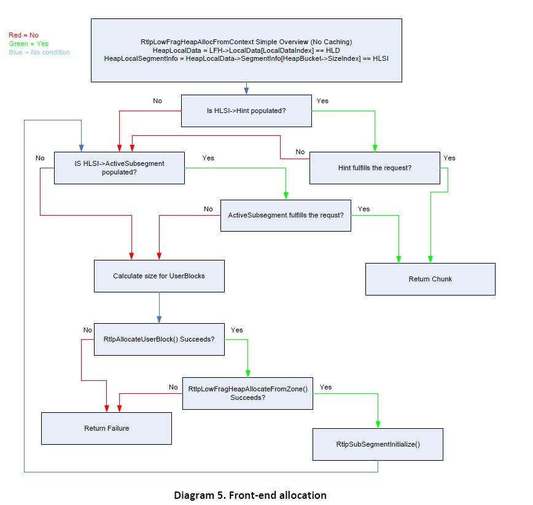

#### 示例

想要完整理解分配过程的最佳方法就是透过实例来分析。我们假定LFH已经被激活且这是我们第一次将由前端分配器进行处理的分配请求。当收到0x28(40)字节分配请求时，因为头部大小的关系，尺寸会调整为0x30(48)字节(0x6 blocks)。我们假定将使用`_HEAP_LOCAL_DATA`结构中`SegmentInfo[0x6]`处的`ActiveSubSegment`。

> 备注：LFH->LocalData[0]->SegmentInfo[0x6]->ActiveSubsegment->UserBlocks

根据上面的魔法公式，我们可以推断出对0x30字节来说有0x2A个chunks（对应`Depth`）。初始化偏移量为0x2，因为`_HEAP_USERDATA_HEADER`是0x10字节。

`UserBlock`中的每个chunk都包含一个8字节头部，前4个字节被编码过，调用过程返回的是其后的n字节用户可写的内存。用户可写的前两个字节控制了赋值给`_INTERLOCK_SEQ`的next offset。

每个offset都通过`UserBlock` chunk的起始来计算，以blocks为单位。下一个可用chunk的字节offset将是`UserBlocks + FreeEntryOffset * 0x8`。

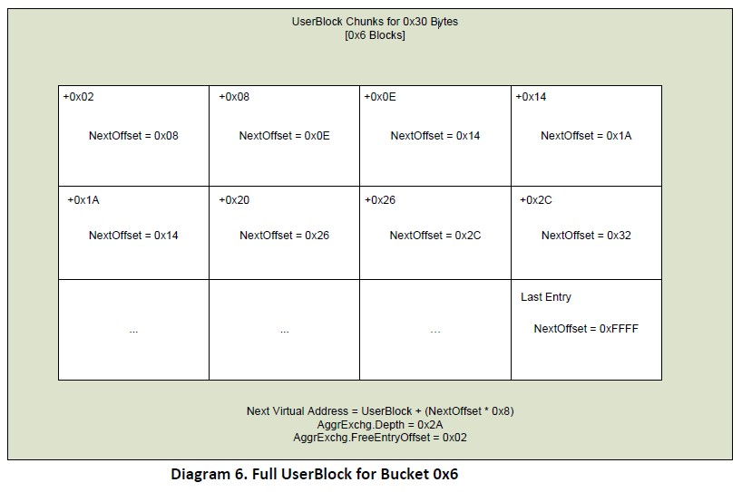

在分配初始化后，Depth和offset都会被刷新以反射出UserBlock中下一个可用的chunk。实际上内存并没有移动，只是索引发生了变化，下面的图表展示了一次分配之后可用内存的状态。注意Offset的值是之前存储在chunk的那个，Depth会以0x1递减，这表示了我们已经用了一个block，现在还剩余0x29个chunks。

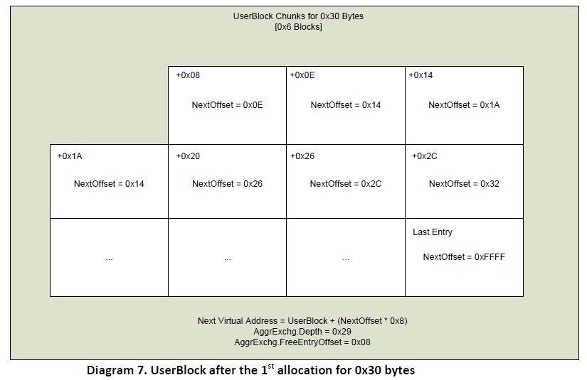

在第二次分配之后，`UserBlock+0xE`将成为下一个空闲块。此后，`UserBlock+0x14`将顺延，依此类推。它会一直递增Offset，递减Depth，直到Depth等于0，这表示需要另一个UserBlock分配更多内存。下面的图表是2次连续分配0x30字节之后的状态。我们将在释放一节中看到这些块是如何被释放的。

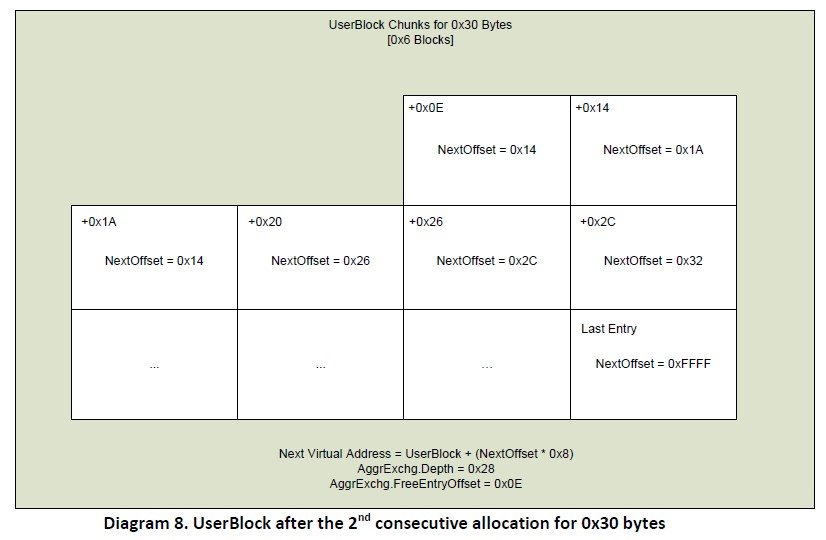

### 释放

现在我们对Windows 7的内存分配有了一定的理解，我可以讨论它的释放了。使用中的chunk会被应用程序释放并返还给堆管理器。它从`RtlFreeHeap()`开始，把heap, flags和待释放的chunk作为参数。该函数首先鉴别该chunk是否是可以释放的(free-able)，此后检查chunk的头部来判断哪个堆管理器应该负责去释放它。

<center>Listing 24. RtlFreeHeap</center>

```cpp
ChunkHeader = NULL;

//it will not operate on NULL 
//NULL无需操作
if(ChunkToFree == NULL) 
  	return;

//ensure the chunk is 8-byte aligned 
//chunk得是8字节对齐
if(!(ChunkToFree & 7)) 
{ 
  	//subtract the sizeof(_HEAP_ENTRY) 
  	//剪掉sizeof(_HEAP_ENTRY) 
  	ChunkHeader = ChunkToFree - 0x8; 
  
  	//use the index to find the size 
  	//使用index来寻找尺寸
  	if(ChunkHeader->UnusedBytes == 0x5) 
      	ChunkHeader -= 0x8 * (BYTE)ChunkToFreeHeader->SegmentOffset; 
} 
else 
{
  	RtlpLogHeapFailure(); 
  	return; 
}

//position 0x7 in the header denotes 
//whether the chunk was allocated via 
//the front-end or the back-end (non-encoded ;) ) 
//头部的0x7位置指示了chunk是前端还是后端（未编码）分配的
if(ChunkHeader->UnusedBytes & 0x80) 
  	RtlpLowFragHeapFree(Heap, ChunkToFree); 
else 
  	RtlpFreeHeap(Heap, Flags | 2, ChunkHeader, ChunkToFree); 

return;
```

#### 后端释放

后端管理器负责处理那些前端处理不了的内存，无论是因为尺寸还是因为LFH的缺失。所有超过0xFE00 blocks的分配都是由VirtualAlloc()/VirtualFree()直接处理，所有超过0x800 blocks的以及那些不能被前端处理的都由后端处理。

#### RtlpFreeHeap

`RtlpFreeHeap()`以`_HEAP`,`Flags`, `ChunkHeader`和`ChunkToFree`作为参数。他将首先试图解码chunk头部（如果被编码了的话），然后在BlocksIndex内找到一个合适的`ListHint`。如果无法找到充足的索引，它将使用`BlocksIndex->ArraySize-1`作为`ListHint`。

<center>Listing 25. RtlpFreeHeap BlocksIndex搜索</center>

```cpp
if(Heap->EncodeFlagMask) 
  	DecodeAndValidateChecksum(ChunkHeader); 

int ChunkSize = ChunkHeader->Size; 
_HEAP_LIST_LOOKUP *BlocksIndex = Heap->BlocksIndex; 

while(1) 
{ 
  	//if the chunk will fit in this BlocksIndex, break out 
  	//如果chunk匹配该BlocksIndex，跳出去
  	if(ChunkSize < BlocksIndex->ArraySize) 
      	break; 
  
  	//if the chunk is too big for this blocksindex and there is NOT 
  	//and extended lookup, then free onto FreeList[BlocksIndex->ArraySize-1] 
  	//如果chunk太大了，且后面没有扩展了，就释放到FreeList[BlocksIndex->ArraySize-1] 
  	if(!BlocksIndex->ExtendedLookup) 
    { 
      	ChunkSize = BlocksIndex->ArraySize - 1; 
      	break; 
    } 
  
  	//next item in the linked list 
  	//链表的下一个条目
  	BlocksIndex = BlocksIndex->ExtendedLookup; 
}
```

> 注意：搜索ListHint索引并返回的过程从现在开始将视为`BlocksIndexSearch()`。它会以`_HEAP_LIST_LOOKUP`和`ChunkSize`作为输入。它会遍历链表，更新BlocksIndex参数直到找到一个候选者，最终返回一个`FreeListIndex`。

现在`_HEAP_LIST_LOOKUP`已经找到了，函数可以尝试使用特定的`ListHint`了。ListHint可以是一个特定的值，比如ListHints[0x6]，或者，如果待释放的chunk尺寸大于该`BlocksIndex`管理的额度，它就会被释放到ListHints[BlocksIndex->ArraySize-BaseIndex-1]。（类似以前的FreeList[0]链表）

<center>Listing 26. RtlpFreeHeap ListHint检索</center>

```cpp
//attempt to locate a freelist 
//试图定位freelist
_LIST_ENTRY *ListHint = NULL; 

//if the chunk can be managed by specific BlocksIndex 
//如果chunk可以由特定BlocksIndex来管理
if(ChunkSize < (BlocksIndex->ArraySize - 1) || 
   BlocksIndex->ExtendedLookup != 0x0 && 
   ChunkSize == (BlocksIndex->ArraySize - 1)) 
{ 
    //get the offset into the ListHints 
  	//获取ListHints的offset
    int BaseIndex = BlocksIndex->BaseIndex; 
    int FreeListIndex = RelativeSize(BlocksIndex, ChunkSize - BaseIndex); 
    //acquire a freelist 
  	//获得一个freelist
    ListHint = BlocksIndex->ListHints[FreeListIndex]; 
}
```

如果`ListHint`已经被找到，`blink`不包含`HeapBucket`，那么后端管理器就会更新LFH启发式策略所用的值。当堆上的chunk被放回时，它会从计数器中扣除0x2。这实际上意味着想要对给定的`Bucket`激活LFH，至少要进行0x11次连续分配。

举个例子，如果`Bucket[0x6]`收到0x10个请求，此后那些chunks中的0x2个释放回堆，接着再进行0x2次同样大小的分配，LFH对Bucket[0x6]来说不会启用。该阈值必须在激活启发式执行堆维护之前触发。

<center>Listing 27. RtlpFreeHeap LFH计数器递减</center>

```cpp
if(ListHint != NULL) 
{ 
    int FreeListBlink = ListHint->Blink; 

    //if the blink is not populated with a HeapBucket 
    //decrement the counter, as we just freed a chunk 
  	//如果blink没有用HeapBucket填充
  	//递减计数器，因为我们释放了一个chunk
    if( !(BYTE)FreeListBlink & 1) 
    { 
      	if(FreeListBlink >= 2) 
        	ListHint->Blink = FreeListBlink - 2; 
    } 
}
```

在更新了LFH激活的计数后，如果堆允许的话，`RtlpFreeHeap()`将试图合并chunk。chunk合并是一个非常重要的过程，堆将视察内存上两个毗邻的free chunks。这是为了避免有太多的小块空闲chunks挨在一起（LFH直接调节了这一问题）。尽管`RtlpCoalesceFreeBlocks()`总是被调用，chunk合并仅仅只在相邻的空闲chunk存在时才会发生。

一旦合并完成，将会继续检查新的块尺寸以保证其不超过`Heap->DeCommitThreshold`，也要确保它的分配请求不是由virtual memory处理的。最后，该算法片段将标记chunk为FREE态，并且将其未用到的字节零化。

<center>Listing 28. RtlpFreeHeap Chunk合并和头部重置</center>

```cpp
//unless the heap says otherwise, coalesce the adjacent free blocks 
//除非特定情形，堆将合并毗邻的free blocks
int ChunkSize = ChunkHeader->Size; 
if( !(Heap->Flags & 0x80) ) 
{ 
  	//combine the adjacent blocks 
  	//合并毗邻blocks
    ChunkHeader = RtlpCoalesceFreeBlocks(Heap, ChunkHeader, &ChunkSize, 0x0); 
} 

//reassign the ChunkSize if neccessary 
//重置ChunkSize
ChunkSize = ChunkHeader->Size; 

//if the coalesced chunk is bigger than the 
//decommit threshold for this heap, decommit the memory 
//如果合并chunk大于decommit阈值，就decommit该内存
if(ChunkHeader->Size > DeCommitThreshold 
	|| ChunkHeader->Size + TotalFreeBlocks > DeCommitThreshold) 
{ 
    RtlpDeCommitFreeBlock(Heap, ChunkHeader, ChunkSize, 0x0); 
    return; 
} 

if(ChunkSize > 0xFE00) 
{ 
    RtlpInsertFreeBlock(Heap, ChunkHeader, ChunkSize); 
    UpdateTagEntry(ChunkHeader); 
    return; 
} 

//mark the chunk as FREE 
//标志chunk为FREE
ChunkToFreeHeader->Flags = 0x0; 
ChunkToFreeHeader->UnusedBytes = 0x0;
```

一个空闲chunk必须被放置在FreeLists特定的位置，或者放在FreeList[0]风格的结构ListHints[ArraySize-BaseIndex-1]中。该过程的第一步就是遍历`_HEAP_LIST_LOOKUP`来找到一个插入点。此后它会进一步遍历`ListHead`，如果你还记得的话，它就是和`Heap->FreeLists`等同的指针。该指针以最小的空闲chunk起始，一路链到最大的空闲chunk。

循环被用来迭代所有的堆上可用的`_HEAP_LIST_LOOKUP`结构。该算法会攫取`ListHead`并做一些初始化验证：首先检查链表是否为空，如果是的话，循环会终止，执行流继续。其次要确保待释放的chunk与该链表匹配。它将比较链表的最后一个项目的尺寸是否大于待释放chunk的尺寸。

最后，它会检查ListHead的第一个条目来判断它是否可以在此前插入。如果不行的话，`FreeLists`将被遍历以找到新的释放的chunk可以被链入的位置，以`FreeListIndex`索引开始。(请参考图3中有关FreeLists的信息。)你现在可以看到为什么这些条目被归类为`ListHints`，这是因为它们实际上并不是那种以指向哨兵节点而终止的专门的链表，它们的指针将`FreeLists`全部链在了一起。

<center>Listing 29. RtlpFreeHeap插入点搜索</center>

```cpp
//FreeList will determine where, if anywhere there is space 
//FreeList将决定位置
BlocksIndex = Heap->BlocksIndex; 
_LIST_ENTRY *InsertList = Heap->FreeLists; 

//attempt to find where to insert this item 
//on the ListHead list for a particular BlocksIndex 
//试图在特定BlocksIndex的ListHead链表中找到插入该条目的点
if(BlocksIndex) 
{ 
    //find a BlocksIndex for storage 
  	//找到一个存储的BlocksIndex
    int FreeListIndex = BlocksIndexSearch(BlocksIndex, ChunkSize);

    while(BlocksIndex != NULL) 
    { 
        _HEAP_ENTRY *ListHead = BlocksIndex->ListHead; 
        //if the ListHead is empty 
        //our insert list will be the sentinel node 
      	//如果ListHead为空
      	//我们的插入链表就是哨兵节点
        if(ListHead == ListHead->Blink) 
        { 
            InsertList = ListHead; 
            break; 
        } 

        //if the chunk is larger than the largest 
        //entry, we'll insert it after 
      	//如果chunk大于最大的条目，就插入在其后
        if(ChunkSize > ListHead->Blink.Size) 
        { 
            InsertList = ListHead; 
            break; 
        } 

        //pick the insertion point behind the 1st 
        //chunk larger than the ChunkToFree 
      	//找到第一个大于该chunk的chunk位置，插入在其前
        _LIST_ENTRY *NextChunk = ListHead->Flink; 
        if(NextChunk.Size > ChunkSize) 
        { 
            InsertList = NextChunk; 
            break; 
        } 

        NextChunk = BlocksIndex->ListHints[FreeListIndex]; 
        while(NextChunk != ListHead) 
        { 
            //there is actually some decoding done here 
          	//实际上是一些解码操作
            if(NextChunk.Size > ChunkSize) 
            { 
              	InsertList = NextChunk; 
             	break; 
            } 

            NextChunk = NextChunk->Flink; 
        } 
        //if we've found an insertion 
        //spot terminate the loop 
      	//如果找到了插入点，就终止循环
        if(InsertList != Heap->FreeLists) 
          	break; 
        BlocksIndex = BlocksIndex->ExtendedLookup; 
    } 
}
```

> 注意：为了简洁，chunk头的解码以获取尺寸的代码没有列出。请不要误以为它是无需解引用的未编码头。

当插入位置被精准地锁定后，`RtlpFreeHeap()`将确保chunk被链入到了合适的位置。一旦最后chunk插入的位置锁定了，它将安全的链入到FreeList。在我的认知中这是新的功能，它直接调解了Brett Moore的插入攻击(Moore 2005)。最后该chunk被放置在合适的`FreeList`上，`ListsInUseUlong`也相应更新。

<center>Listing 30. Safe link-in</center>

```cpp
while(InsertList != Heap->FreeLists) 
{ 
    if(InsertList.Size > ChunkSize) 
    	break; 
    InsertList = InsertList->Flink; 
} 

//R.I.P FreeList Insertion Attack 
if(InsertList->Blink->Flink == InsertList) 
{ 
    ChunkToFree->Flink = InsertList; 
    ChunkToFree->Blink = InsertList->Blink; 
    InsertList->Blink->Flink = ChunkToFree; 
    InsertList->Blink = ChunkToFree; 
} 
else 
{ 
    RtlpLogHeapFailure(); 
} 

BlocksIndex = Heap->BlocksIndex; 
if(BlocksIndex) 
{ 
    FreeListIndex = BlocksIndexSearch(BlocksIndex, ChunkSize); 
    int RelSize = ChunkSize - BlocksIndex->BaseIndex; 
    FreeListIndex = RelativeSize(BlocksIndex, RelSize); 
    _LIST_ENTRY *FreeListToUse = BlocksIndex->ListHints[FreeListIndex]; 
    if(ChunkSize >= FreeListToUse.Size) 
    { 
      	BlocksIndex->ListHints[FreeListIndex] = ChunkToFree; 
    } 

    //bitwise OR instead of the XP XOR (R.I.P Bitmap flipping (hi nico))
  	//按位或操作取代了XP时代的异或
    if(!FreeListToUse) 
    { 
        int UlongIndex = Chunkize - BlocksIndex->BaseIndex >> 5; 
        int Shifter = ChunkSize - BlocksIndex->BaseIndex & 1F; 
        BlocksIndex->ListsInUseUlong[UlongIndex] |= 1 << Shifter; 
    } 
    EncodeHeader(ChunkHeader); 
}
```

> 注意：注意到`ListInUseUlong`用了一个OR位操作，而不是此前所用的XOR操作。这确保了被填充的链表总是被标记为被填充态，而空的链表不可能被标记为填充态。
>
> 提示：如果`RtlpLogHeapFailure()`没有终止执行流将发生什么？(Flink/Blink将永远不会更新。。。)

#### 概览

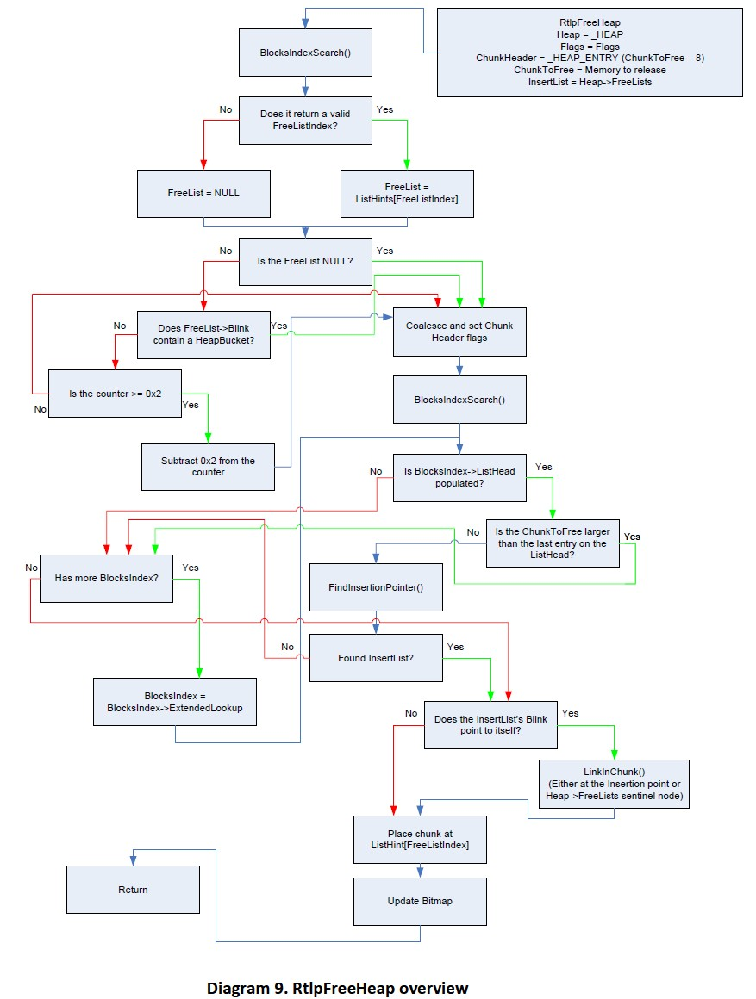

### 前端释放

前端释放由LFH处理。当特定的启发式被触发时，它才会启用。设计LFH是为了避免内存碎片并支持频繁的特定尺寸内存的使用，它与旧的前端管理器Lookaside链表完全不同，Lookaside是通过链表结构来维护小于1024字节的chunks。尽管`BlocksIndex`结构可以跟踪尺寸超过16k的chunks，LFH也仅仅为小于16k的chunks服务。

#### RtlpLowFragHeapFree

`RtlpLowFragHeapFree`使用两个参数，一个`_HEAP`结构体和一个指向待释放的chunk指针。该函数首先检查具体的flags是否有在待释放块的头部中设定。如果flags为0x5，那么就需要做出调整来改变头部的位置。此后它会找到相关联的`SubSegment`，`SubSegment`使得它可以访问跟踪内存时所有需要的成员。它也会重置头部的一些值来反映出其是一个最近释放的块。

<center>Listing 31. RtlpLowFragHeapFree Subsegment acquisition</center>

```cpp
//hi ben hawkes :) 
_HEAP_ENTRY *ChunkHeader = ChunkToFree - sizeof(_HEAP_ENTRY); if(ChunkHeader->UnusedBytes == 0x5) 
  ChunkHeader -= 8 * (BYTE)ChunkHeader->SegmentOffset; 

_HEAP_ENTRY *ChunkHeader_Saved = ChunkHeader; 

//gets the subsegment based off 
//the LFHKey, Heap and ChunkHeader
_HEAP_SUBSEGMENT SubSegment = GetSubSegment(Heap, ChunkToFree); 
_HEAP_USERDATA_HEADER *UserBlocks = SubSegment->UserBlocks; 

//Set flags to 0x80 for LFH_FREE (offset 0x7) 
ChunkHeader->UnusedBytes = 0x80; 

//Set SegmentOffset or LFHFlags (offset 0x6) 
ChunkHeader->SegmentOffset = 0x0;
```

> 注意：Ben Hawkes解释了在ChunkHeader指针之后如何使用chunk头部覆写，它可以实现部分控制的内存释放。你可以选择至多ChunkHeader-(0x8*0xFF)大小的内存地址空间。

一个合适的chunk头部被定位到以后，函数将需要计算出一个新的偏移。该偏移将用来写入到与`SubSegment`关联的UserBlock中。此时还需要做一些初始的检查来保证在释放chunk前`Subsegment`没有超过它的边界。如果这些情况不满足，就会设置一个值来标识`SubSegment`需要进一步的维护操作。

这之后将尝试从`SubSegment`获取一个`_INTERLOCK_SEQ`，获取当前的`Depth`, `Offset`和`Sequence`。下一个offset将通过该待释放chunk的前向毗邻的chunk来获取。正如我们在`RtlpLowFragHeapAllocFromContext()`中所看到的，它被存储在chunks数据域的前2个字节处。`Depth`会递增1，这是因为一个chunk刚刚被放回可用bin中。

新旧值将进行原子交换，成功则跳出循环，失败则循环继续。这是LFH中大多数的典型操作，它被设计成用于高并发环境下工作。

<center>Listing 32. RtlpLowFragHeapFree OffsetAndDepth / Sequence更新</center>

```cpp
while(1) 
{ 
    _INTERLOCK_SEQ AggrExchg; 
    AggrExchg.OffsetAndDepth = SubSegment->AggregateExchg.OffsetAndDepth; 
    AggrExchg.Sequence = SubSegment->AggregateExchg.Sequence; 

    int Sequence_New = AggrExchg.Sequence + 1; 
    if(AggrExchg.OffsetAndDepth >= -1) 
      	Sequence_New--; 

    int Depth = SubSegment->AggrExchg.Depth; 
    _HEAP_LOCAL_SEGMENT_INFO *LocalSegmentInfo = SubSegment->LocalInfo; 
    unsigned int Sequence = SubSegment->LocalInfo->LocalData->Sequence; 
    unsigned int LastOpSequence = LocalSegmentInfo->LastOpSequence; 

    //setup the new INTERLOCK_SEQ 
  	//设置新的INTERLOCK_SEQ 
    _INTERLOCK_SEQ AggrExchg_New; 
    AggrExchg_New.Sequence = Sequence_New; 

    if(Depth != SubSegment->BlockCount 
       || LocalSegmentInfo->Counters.SubSegmentCounts == 1) 
    { 
        if(Sequence >= LastOpSequence && (Sequence - LastOpSequence) < 0x20) 
        { 
            //set the FreeEntry Offset of ChunkToFree 
          	//为ChunkToFree设置FreeEntry offset
            *(WORD)(ChunkHeader + 8) = AggrExchg.FreeEntryOffset; 

            //Subtract the size of the block being freed 
            //from the current offset; which will give 
            //you the next free chunk 
          	//从当前offset扣除释放的block尺寸；得到下一个free chunk的offset
            int NewOffset = AggrExchg.FreeEntryOffset - (ChunkHeader - UserBlocks) / 8; 
            AggrExchg_New.FreeEntryOffset = NewOffset; 
            //increase depth because we're freeing 
          	//递增depth，因为我们释放了chunk
            AggrExchg_New.Depth = Depth + 1; 

            //set the Hint in the subsegment 
          	//在subsegment中设置Hint
            Sequence = 1; 
            SubSegment->LocalInfo->Hint = SubSegment; 
        } 
        else 
        { 
            Sequence = 3; 
            AggrExchg_New.Depth = -1; //last entry 
            AggrExchg_New.FreeEntryOffset = 0; //no offset 
        } 
    }
    else 
    { 
        Sequence = 3; 
        AggrExchg_New.Depth = -1; //last entry 
        AggrExchg_New.FreeEntryOffset = 0; //no offset 
    } 
    //_InterlockedCompareExchange64 
    if(AtomicSwap(&SubSegment->AggregateExchg, AggrExchg_New, AggrExchg)) 
      	break; 

    //if something has changed since swapping, try again 
  	//交换时如果发生了什么变化，就重试
    ChunkHeader = ChunkHeader_Saved; 
}
```

> 注意：你可以看到`Subsegment->Hint`是在这里赋值的，它将用于后续的分配。

最后，将检查`Sequence`变量是否被设置成了0x3。如果是的话，就说明`SubSegment`需要执行更多操作，`UserBlocks` chunk可以被释放(通过后端管理器)；如果不是的话，就会返回0x1。

<center>Listing 33. RtlpLowFragHeapFree谢幕曲</center>

```cpp
//if there are cached items handle them 
//如果有缓存条目，就处理它们
UpdateCache(SubSegment); 

//if we've freed every item in the list 
//update the subsegment and free the UserBlock 
//如果我们释放了list中每一个条目，就更新subsegment并释放UserBlock
if(Sequence == 3) 
{ 
  PerformSubSegmentMaintenance(SubSegment); 
  RtlpFreeUserBlock(LFH, SubSegment->UserBlocks); 
} 

return 1;
```

> 注意：PerformSubSegmentMaintenance()不是一个真正的函数，只是一系列复杂指令的伪代码，它将为SubSegment做好释放或后续使用的准备。

#### 概览

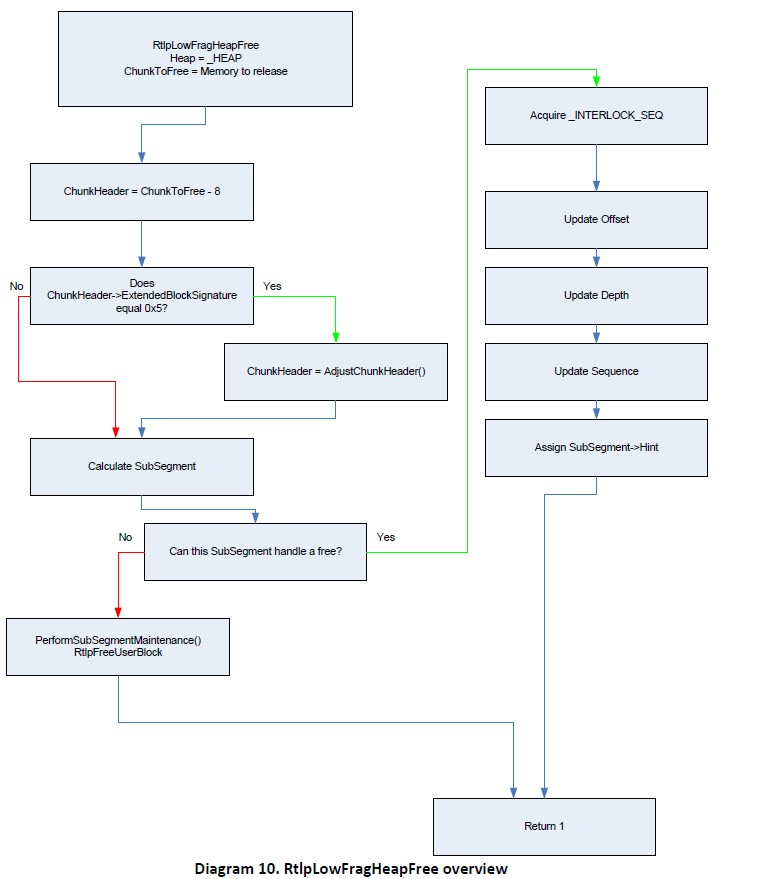

#### 示例

继续看本文分配一节中的例子，我们进行第三次的0x30字节的连续分配。这意味着还有0x27个chunks剩余(每个0x30大小)，当前到下一个chunk的位置是`UserBlock`的0x14偏移处。它看起来像这样：

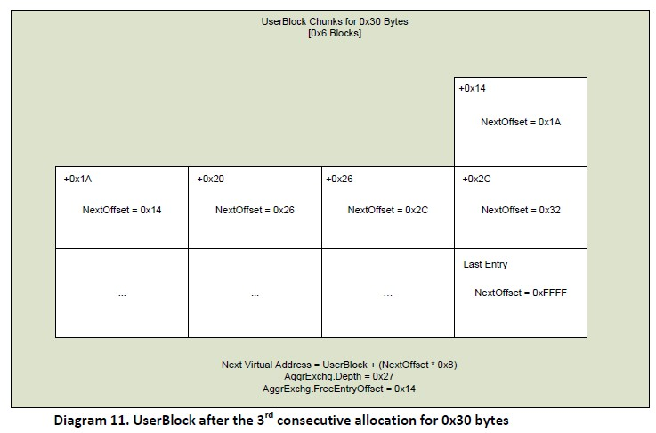

当我们从LFH分配的内存被释放时会发生什么呢？如前所述，内存本身不会移动，只是`Offset`被更新，它用于作为下一个空闲chunk位置的索引。

现在假设第一个chunk被释放了，此时需要更新第一个chunk的offset并递增depth 0x1。新的offset由chunk头部地址来计算，扣除UserBlock的地址并除以0x8。也就是说，新的offset继承自UserBlock的相对位置(以blocks为单位)。下面的图展示了UserBlock在第一个chunk被释放时的状态。


现在想象第二个chunk也被释放了(在其他任何分配或释放之前)。新的offset就会变成0x8，这是因为第二个chunk的释放在第一个chunk之后。尽管在offset 0x2处有空闲chunk，下一个被用来分配的chunk位置也将被设置为0x8 offset。这可以想象成是一个链表，它更新它的指针而不是其地址。

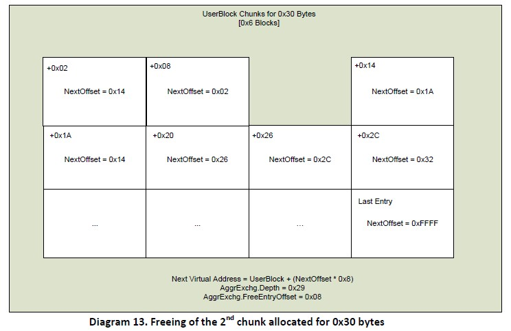

## 安全机制

大部分在Windows XP SP2中引入的安全机制在Windows 7中原封不动，而Windows 7中还有一些额外的安全机制(基于Windows Vista代码)。本节我们将讨论其中的一些安全措施，包括它们是如何实现的，以及每个机制的一些想法。我认为在Windows Vista代码基础上引入的所有保护逻辑对Windows堆的exp产生了巨大的难度。

### 堆随机化

堆随机化的目的在于`HeapBase`将有一个不可预测的地址。每次堆创建时，都会在基地址上增加一个随机的偏移以防止可预测的内存地址。

这在`RtlCreateHeap`中通过创建一个随机的64k对齐的值并增加到`HeapBase`上实现。该值是变化非常范围非常大。随机化依赖于heap尺寸的最大值，该值由传递给`HeapCreate()`的参数计算出来。下面的代码片段源于`RtlCreateHeap()`，它试图随机化`HeapBase`：

<center>Listing 34. RtlCreateHeap随机化</center>

```cpp
int BaseAddress = Zero; 
int RandPad = Zero; 

//get page aligned size to use as a random pad 
//获取页对齐尺寸作为随机数pad
int RandPad = (RtlpHeapGenerateRandomValue64() & 0x1F) << 0x10; 

//if maxsize + pad wraps, null out the randpad 
//如果maxsize + pad溢出了，就零化randpad
int TotalMaxSize = MaximumSize + RandPad; 
if(TotalMaxSize < MaximumSize) 
{ 
    TotalMaxSize = MaximumSize; 
    RandPad = Zero; 
} 

//0x2000 = MEM_RESERVE 
//0x40 = PAGE_EXECUTE_READWRITE 
//0x04 = PAGE_READWRITE 
//this will reserve the memory at the baseaddress 
//but NOT actually commit any memory at this point 
//在baseaddress上reserver内存，但实际上不会在此时commit
int Opts = 0x4; 
if(Options & 0x40000) 
   	Opts = 0x40; 

if(NtAllocateVirtualmemory(-1, &BaseAddress, 0x0, &TotalMaxSize, 0x2000, Opts) 
   	return 0; 
   
Heap = (_HEAP*)BaseAddress; 
//adjust the heap pointer by randpad if possible 
//用randpad来调整堆指针
if(RandPad != Zero) 
{ 
  	if(RtlpSecMemFreeVirtualMemory(-1, &BaseAddress, &RandPad, 0x8000) >= 0 )
    { 
      	Heap = (_HEAP*)RandPad + BaseAddress; 
      	MaximumSize = TotalSize - RandPad; 
    } 
}
```

#### 注解

对堆来说当使用随机化时，实际上基地址的数量是有限的，这是因为它们需要64k对齐(5bits熵)。通过熵的缺陷来猜测堆基地址可能不切实际，但也不是完全没有可能。

另一个不太可能的情景源于这样一个事实：如果RandPad+MaximumSize越界，那么RandPad将为NULL。这将有效的避免堆随机化的产生。我之所以说它不太可能发生是基于两个原因：首先它无法控制HeapCreate()的传参。我知道在应用程序中这可以发生，但它并不通用。其次获取一个足够大的MaximumSize堆往往会引起`NtAllocateVirtualMemory()`返回NULL，总之是完全失败的。

### 头部编码/解码

在Windows Vista之前，判断chunk没有被污染的唯一方法就是校验chunk头部的1字节cookie。这显然不是鲁棒性最好的解决方案，因为这个cookie可以被暴力猜解出来，更为重要的是，在这之前有着头部数据(McDonald/Valasek 2009)。

于是编码chunk头部的措施应运而生。堆现在将编码每个`_HEAP_ENTRY`的第一个4字节。这将阻止对Size, Flags和Checksum溢出的影响。编码过程由异或前3个字节并存储到`SmallTagIndex`变量中完成，此后前4个字节会与`Heap->Encoding`进行异或(由`RtlCreateHeap()随机产生`)。

<center>Listing 35. Heap header编码</center>

```cpp
EncodeHeader(_HEAP_ENTRY *Header, _HEAP *Heap) 
{ 
    if(Heap->EncodeFlagMask) 
    { 
    	Header->SmallTagIndex = 
      		(BYTE)Header ^ (Byte)Header+1 ^ (Byte)Header+2; 
    	(DWORD)Header ^= Heap->Encoding; 
  	} 
}
```

解码chunk和编码很像，但是解码前需要一些额外的检查。需要确保chunk的头部被编码过。

<center>Listing 36. Heap header解码</center>

```cpp
DecodeHeader(_HEAP_ENTRY *Header, _HEAP *Heap) 
{ 
    if(Heap->EncodeFlagMask && (Header & Heap->EncodeFlagMask)) 
    { 
     	(DWORD)Header ^= Heap->Encoding; 
    } 
}
```

####注解

对chunk头部起始4字节的编码使得覆写`Size`, `Flags`或是`Checksum`字段的操作在不使用信息泄露(info leak)的情况下几乎不可行(Hawkes 2008)。但这也没有阻止我们覆写头部的其他信息：如果头部可以被覆写且在值校验之前被使用，那么就可以潜在的改变执行流。我们会在后续章节中讨论。

另一个可行的回避方案是去覆写堆管理器，使其认为chunk是没有被编码的。有多种方法来做到。第一个也是可能性最低的方法就是NULL化`Heap->EncodeFlagMask`(被初始化为0x100000)。后续的任何编解码操作都不会进行。这种方法有些缺陷，因为堆不稳定不易跟踪。一般会创建一个新的堆来达到这种效果(未编码覆写`_HEAP_ENTRY`头)。

第二种也是最有可能的方法是通过覆盖chunk头的4字节，使得其与`Heap->EncodeFlagMask`的AND位操作可以返回false。这种方法可对`Size`, `Flags`和`Checksum`进行有限的控制。这仅仅在`FreeLists`中覆写头部有用，因为校验合法的操作在分配过程中已完成了。

最后，攻击者可以将chunk头的后4个字节作为目标。我们此前已经看过了这些字段用于判断chunk的状态。例如，chunk头0x7偏移字节用来判断chunk是来自LFH还是后端。

### 位图翻转的破灭

在Brett Moore的Heaps about Heaps一文中，曾对如何欺骗FreeList使其误判自身的填充状态的手法进行了介绍。从那开始，这种手法一度被称为位图翻转(Moore 2008)。这种攻击手法在较新的Windows版本中调解了，因为在2009年McDonald和Valasek输出了一篇质量相当高的论文。

在Windows XP代码基础上，XOR操作用来更新位图。如果逻辑上可以触发该更新操作且此时FreeList为空的话，在位图中当前的位会对自身进行XOR异或操作，这就会使得它的值翻转。

<center>Listing 37. Death of Bitmap Flipping</center>

```cpp
// if we unlinked from a dedicated free list and emptied it,clear the bitmap 
// 如果我们对专门的freelist摘除并清空，就会清除bitmap
if (reqsize < 0x80 && nextchunk == prevchunk) 
{ 
  size = SIZE(chunk); 
  BitMask = 1 << (size & 7); 
  
  // note that this is an xor 
  // 注意到这是个xor
  FreeListsInUseBitmap[size >> 3] ^= vBitMask; 
}
```

这种技术的问题在于一旦chunk的尺寸被污染了，你就可以修改某个专门的FreeList的状态，而它原本是不该被修改的，这就会导致我们可以进一步去覆盖`HeapBase`中的关键数据。

当更新bitmap来陈列一个空链表时，按位与AND操作被使用到，这确保了空的链表可以保持空的状态而被填充过的链表仅仅可以被标志为空。对于标志一个链表为填充态来说也是一样的，它使用按位或OR操作来改变`ListsInUserUlong`。如此，一个空的链表可以被标志为填充态，但已填充的链表却不能变成未填充态。

以上的这些修改，专用FreeLists的概念已经消失了，所以试图从空的链表中分配仅仅是遍历FreeList结构来找到一个大小充足的chunk。

<center>Listing 38. Death of Bitmap Flipping 2</center>

```cpp
//HeapAlloc 
size = SIZE(chunk); 
BitMask = 1 << (Size & 0x1F); 
BlocksIndex->ListInUseUlong[Size >> 5] &= ~BitMask; 

//HeapFree 
size = SIZE(chunk); 
BitMask = 1 << (Size & 0x1F);
BlocksIndex->ListInUseUlong[Size >> 5] |= BitMask;
```

### 安全链入

安全链出机制最早在Windows XP SP2中提出，它可以侦测出从FreeList上断链chunk(或者合并两个空闲chunk)时4字节覆写的行为。从这开始，大量通用的堆exp被阻绝。

尽管从链表中断链一个条目不能再进行任意地址覆写，但仍然可以覆写FreeList[0]上某个条目的blink去指向你想覆写的地址(Moore 2005)。如此，一旦一个chunk被插入到了被修改的条目之前，blink就会指向刚刚被释放的chunk的地址。

在后端管理器中新的检查机制在链入一个空闲chunk前校验了chunk的blink。我们在解释`RtlpFreeHeap()`工作机制时看到了这部分代码，让我们来回顾一下。你可以看到如果FreeList的Blink->Flink不是指向自身，那就认为它已经被破坏而不会再执行链入操作。

<center>Listing 39. Safe Linking</center>

```cpp
if(InsertList->Blink->Flink == InsertList) 
{ 
    ChunkToFree->Flink = InsertList; 
    ChunkToFree->Blink = InsertList->Blink; 
    InsertList->Blink->Flink = ChunkToFree; 
    InsertList->Blink = ChunkToFree ;
} 
else 
{ 
  	RtlpLogHeapFailure(); 
}
```

#### 注解

虽然因被污染的Blink指针设备阻止了覆写操作，但它仍然存在着一个问题，那就是在`RtlpLogHeapFailure()`之后过程并没有终止。后面的代码直接把chunk插入到合适的ListHints槽，而实际上并没有更新flink和blink。这意味着flink和blink是用户完全可控的（译者注：因为flink和blink在data域，释放之后用作flink和blink不会被零化，所以在不改写的情况下释放前是什么释放后还是什么）。

## 战术

### 堆的确定性

这些年研究者把精力集中在堆的元数据之上，以达成执行流改写。这一琐碎的任务越来越困难了。通用的4字节写攻击已经灭亡，堆头现在也用伪随机数进行了编码，保护了它的完整性，现在即使是老如欺骗FreeList插入攻击的伎俩也基本失效了。

今之视昔，在试图营造有利的局势时，exp的精度必须要非常高。我们在讨论堆时，称之为堆的精心操纵(heap manipulation)。不同chunk尺寸、分配或是释放操作的时机都会在现代Windows堆EXP中引起不同的变化。

本节中在试图使用LFH获得一个确定状态的堆时，我会尝试讨论一些通用的情景来替代。比如，哪个位置会分配chuk X？分配的chunk X毗邻的是什么？如果chunk X被释放会发生什么？

#### 激活LFH

理解对特定Bucket如何激活LFH是最为基础的信息之一。LFH对Windows 7来说是唯一的前端堆管理器，但这并不意味着它会默认处理所有的特定尺寸chunk的分配请求。如上面代码所展示，LFH必须由后端的启发式机制激活。如果你强制进行那样的分配（这也是相当常见的），那么你就可以为特定尺寸激活LFH。LFH可以由至少0x12次连续分配相同尺寸的操作来激活(或者0x11，如果LFH此前被激活过)。

<center>Listing 40. 为特定尺寸激活LFH</center>

```cpp
//0x10 => Heap->CompatibilityFlags |= 0x20000000; 
//0x11 => RtlpPerformHeapMaintenance(Heap); 
//0x11 => FreeList->Blink = LFHContext + 1; 
for(i = 0; i < 0x12; i++) 
{ 
    printf("Allocation 0x%02x for 0x%02x bytes\n", i, SIZE); 
    allocb[i] = HeapAlloc(pHeap, 0x0, SIZE); 
} 

//now that the _HEAP_BUCKET is in the 
//ListHint->Blink, the LFH will be used 
//现在_HEAP_BUCKET在ListHint->Blink中，LFH会被使用
printf("Allocation 0x%02x for 0x%02x bytes\n", i++, SIZE); 
printf("\tFirst serviced by the LFH\n"); 
allocb[i] = HeapAlloc(pHeap, 0x0, SIZE);
```

如你所见，为特定尺寸激活和启用LFH相当琐碎，如果你有能力控制分配的话，诸如分配DOM对象。现在前端管理器是为特定的尺寸而使用，可以步步为营达成更高层次的确定性。

#### 碎片整理

在我们讨论在LFH上布置相邻的chunks之前，必需要先讨论碎片整理。因为频繁的分配和释放操作，`UserBlock` chunk会碎片化。这意味着必须要进行碎片整理操作以保证我们溢出的chunk与我们想要覆写的chunk毗邻。

在下一个例子中我们将把chunks直接的相邻布局作为前提。处理新的`SubSegment`是相当琐碎的因为当前没有任何坑洞，而使用已经在用的SubSegment则不会有这个问题。下图展示了单次分配不会导致3个毗邻的对象，为此必须要先占坑。最简单的方法就是对当前应用程序的内存布局有一些了解然后做出一些分配动作。

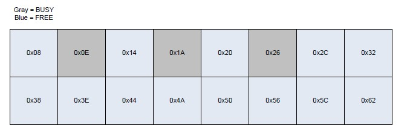

在本例中，我们仅需要进行3次分配就可以填充这些坑洞，但是很显然这不是个现实的例子。攻击者往往不知道具体有多少坑洞需要去填充，也不知道需要多少个分配才能完全耗尽`UserBlocks(Depth==0x0)`。于是就强制堆管理器来创建一个新的`SubSegment`，他不会包含任何坑洞(标注：感谢Alex/Matt)。

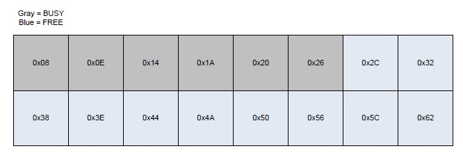

#### 毗邻数据

当试图完成一个堆缓冲区溢出exp时，最难的任务之一就是精心操纵堆，使得堆的状态已知。你希望保证溢出的chunk与想要被覆写的chunk是物理毗邻的。通常对后端堆来说，释放内存时的合并操作非常棘手，它会导致exp的不可靠型。

> 注意：在Windows XP/2003 Heap Exploitation这个demo中，试图利用堆缓冲区溢出漏洞时，这可谓是最难的任务。应用程序的多线程特性会不可靠的合并chunks，让我们的堆精心操纵失效。

LFH不会合并chunks，因为它们的尺寸全部一致，由`UserBlock`的相对偏移来索引。这使得相同大小的chunks可以挨着放置。如果可以溢出，BUSY和FREE态chunks可以被覆写，这依赖于`UserBlocks`当前的状态。

假设我们想要覆写alloc3的信息，并且我们有一个n字节写的情景。如此我们可以溢出alloc3 chunk前的chunk，就可以覆盖alloc3中的数据。

<center>Listing 42. LFH Chunk overflow</center>

```cpp
EnableLFH(SIZE); 
NormalizeLFH(SIZE); 

alloc1 = HeapAlloc(pHeap, 0x0, SIZE); 

alloc2 = HeapAlloc(pHeap, 0x0, SIZE); 
memset(alloc2, 0x42, SIZE); 
*(alloc2 + SIZE-1) = '\0'; 

alloc3 = HeapAlloc(pHeap, 0x0, SIZE); 
memset(alloc3, 0x43, SIZE); 
*(alloc3 + SIZE-1) = '\0'; 
printf("alloc2 => %s\n", alloc2); 
printf("alloc3 => %s\n", alloc3); 

memset(alloc1, 0x41, SIZE * 3); 

printf("Post overflow..\n"); 
printf("alloc2 => %s\n", alloc2); 
printf("alloc3 => %s\n", alloc3);
```

<center>Listing 43. LFH Chunk overflow result</center>

```
Result: 
alloc2 => BBBBBBBBBBBBBBBBBBBBBBBBBBBBBBBBBBBBBBB 
alloc3 => CCCCCCCCCCCCCCCCCCCCCCCCCCCCCCCCCCCCCCC 

Post overflow.. 

alloc2 => AAAAAAAAAAAAAAAAAAAAAAAAAAAAAAAAAAAAAAA 
          AAAAAAAAAAAAAAAAAAAAAAAAAAAAAAAAACCCCCC 
          CCCCCCCCC 
alloc3 => AAAAAAAAAAAAAAAAAAAAAAAACCCCCCCCCCCCCCC
```

如你所见，alloc3中的数据被覆盖成了溢出alloc1的数据。另一个值得注意的影响在于alloc2在溢出后期字符串的长度。该字符串的长度实际上是alloc2和alloc3组合在一起的长度，因为null终止符被覆盖掉了。可以阅读Peter Vreugdenhil的论文(Vreugdenhil 2010)来对一个真实的覆盖null终止符案例一探究竟，该利用最后达成了代码执行。

但是如果alloc2被使用到了或者在alloc3使用前对其头部进行了验证该如何？因此你才需要找到那个恰好在被溢出chunk正前方的chunk。这可能看起来很繁琐，在控制分配和释放时还需要考虑碎片问题。

<center>Listing 44. Chunk reuse</center>

```cpp
alloc1 = HeapAlloc(pHeap, 0x0, SIZE); 
alloc2 = HeapAlloc(pHeap, 0x0, SIZE); 
alloc3 = HeapAlloc(pHeap, 0x0, SIZE); 

HeapFree(pHeap, 0x0, alloc2); 

//overflow-able chunk just like alloc1 could reside in same position as alloc2 
alloc4 = HeapAlloc(pHeap, 0x0, SIZE); 

memcpy(alloc4, src, user_controlled_size);
```

> 注意：尽管精心操纵堆使得chunk按序相邻在LFH中更简单一些，但却有个重大缺陷。想要布置两个不同尺寸的chunks变得更为复杂(涉及了相邻内存上多重的`SubSegments`)。如果想要控制不同尺寸的chunk来达成exp，那么这无疑是最大的绊脚石。

#### 播种数据

撰写此文之际，UAF漏洞非常流行。该漏洞的大多数exp都包含了各种各样的分配方法(JavaScript strings, DOM对象实例等等)，如此便可以在堆中播种数据。Nico Waisman称之为pray-after-free(Waisman 2010)，盖因其缺少对目标对象数据布局的深入理解。

我们已经知道了在巨大的`UserBlocks`中LFH是如何存储内存的——切割成`BucketSize`的chunks。我们也知道了UserBlock中这些chunks都是相互毗邻的，这依赖于分配和释放行为的控制。基于此，每个chunk都可以通过写入用户的数据来控制内容([这因`HEAP_ZERO_MEMORY`标志是否设置这一情况而异，该标志的设置在`HeapAlloc()`调用中](http://msdn.microsoft.com/en-us/library/aa366597%28VS.85%29.aspx))。

下面的实例展示了内存如何被拷贝到LFH中的chunks上，随后释放再分配时原本数据没有大量丢失的情景。

<center>Listing 45. Data seeding</center>

```cpp
EnableLFH(SIZE); 
NormalizeLFH(SIZE); 

for(i = 0; i < 0x10; i++) 
{ 
    printf("Allocation 0x%02x for 0x%02x bytes => ", i, SIZE); 
    allocb[i] = HeapAlloc(pHeap, 0x0, SIZE); 
    memset(allocb[i], 0x41 + i, SIZE); 
    for(j=0; j<12; j++) 
      	printf("%.2X", allocb[i][j]); 
    printf("\n"); 
} 

printf("Freeing all chunks!\n"); 
for(i = 0; i < 0x10; i++) 
{ 
 	HeapFree(pHeap, 0x0, allocb[i]); 
} 

printf("Allocating again\n"); 
for(i = 0; i < 0x10; i++) 
{ 
    printf("Allocation 0x%02x for 0x%02x bytes => ", i, SIZE); 
    allocb[i] = HeapAlloc(pHeap, 0x0, SIZE); 
    for(j=0; j<12; j++) 
      	printf("%.2X", allocb[i][j]); 
    printf("\n"); 
}
```

<center>Listing 46. Data seeding results</center>

```cpp
Result: 
Allocation 0x00 for 0x28 bytes => 41414141 41414141 41414141 
Allocation 0x01 for 0x28 bytes => 42424242 42424242 42424242 
Allocation 0x02 for 0x28 bytes => 43434343 43434343 43434343 
Allocation 0x03 for 0x28 bytes => 44444444 44444444 44444444 
Allocation 0x04 for 0x28 bytes => 45454545 45454545 45454545 
Allocation 0x05 for 0x28 bytes => 46464646 46464646 46464646 
Allocation 0x06 for 0x28 bytes => 47474747 47474747 47474747 
Allocation 0x07 for 0x28 bytes => 48484848 48484848 48484848 
Allocation 0x08 for 0x28 bytes => 49494949 49494949 49494949 
Allocation 0x09 for 0x28 bytes => 4A4A4A4A 4A4A4A4A 4A4A4A4A 
Allocation 0x0a for 0x28 bytes => 4B4B4B4B 4B4B4B4B 4B4B4B4B 
Allocation 0x0b for 0x28 bytes => 4C4C4C4C 4C4C4C4C 4C4C4C4C 
Allocation 0x0c for 0x28 bytes => 4D4D4D4D 4D4D4D4D 4D4D4D4D 
Allocation 0x0d for 0x28 bytes => 4E4E4E4E 4E4E4E4E 4E4E4E4E 
Allocation 0x0e for 0x28 bytes => 4F4F4F4F 4F4F4F4F 4F4F4F4F 
Allocation 0x0f for 0x28 bytes => 50505050 50505050 50505050 

Freeing all chunks!
Allocating again 

Allocation 0x00 for 0x28 bytes => 56005050 50505050 50505050 
Allocation 0x01 for 0x28 bytes => 50004F4F 4F4F4F4F 4F4F4F4F 
Allocation 0x02 for 0x28 bytes => 4A004E4E 4E4E4E4E 4E4E4E4E 
Allocation 0x03 for 0x28 bytes => 44004D4D 4D4D4D4D 4D4D4D4D 
Allocation 0x04 for 0x28 bytes => 3E004C4C 4C4C4C4C 4C4C4C4C 
Allocation 0x05 for 0x28 bytes => 38004B4B 4B4B4B4B 4B4B4B4B 
Allocation 0x06 for 0x28 bytes => 32004A4A 4A4A4A4A 4A4A4A4A 
Allocation 0x07 for 0x28 bytes => 2C004949 49494949 49494949
Allocation 0x08 for 0x28 bytes => 26004848 48484848 48484848 
Allocation 0x09 for 0x28 bytes => 20004747 47474747 47474747 
Allocation 0x0a for 0x28 bytes => 1A004646 46464646 46464646 
Allocation 0x0b for 0x28 bytes => 14004545 45454545 45454545 
Allocation 0x0c for 0x28 bytes => 0E004444 44444444 44444444 
Allocation 0x0d for 0x28 bytes => 08004343 43434343 43434343 
Allocation 0x0e for 0x28 bytes => 02004242 42424242 42424242 
Allocation 0x0f for 0x28 bytes => 62004141 41414141 41414141
```

> 注意：如果一个`HeapBin`中所有的chunks都被释放了，那么整个Bin自身也会被释放。这意味着与此前的Lookaside链表表现是不同的。Jay-Z建议在进行多重释放之前，先分配大量的chunks，降低`HeapBin`因太小而会被释放这一情形的概率。

首次分配打印出了LFH每个chunk写入的内存数据，尺寸是0x28(增加`_HEAP_ENTRY`头大小是0x30)。所有的chunks都被释放掉，此后重新分配了相同大小的内存。尽管这一次我们没有看到对memset的调用，但是chunks中的数据却是惊人的相似。

这是因为这些chunks既没有被合并也没有被清除数据。被改变的仅仅只有数据域的前两个字节。这是在算法一节中谈到的保存的`FreeEntryOffset`。`FreeEntryOffset`存储与前两个字节，紧紧跟随着chunk头部，它们为堆管理器日后所用。

还应当注意重新分配的chunks相对于一开始在UserBlock中原本的顺序来说是颠倒的。这不是因为内存自身做了翻转，而是因为`FreeEntryOffset`在每次`HeapFree()`调用时都会重新建立索引。因此在知晓分配尺寸和旧数据的情况下我们可以做什么呢？对于已知尺寸分配能力的利用，UAF是一个非常完美的候选者。

让我们假定某个对象尺寸为0x30字节，并且在0x0偏移处有个虚表。该对象在被释放后，垃圾回收后，仍然被错误的使用到。这就给了我们在释放后可以覆写其数据域的机会，攻击者就可以控制或半控制虚表所在的地址。

既然尺寸已知且我们可以控制free对象暂时不被分配出去，这就给了我们完全的控制权去决定对象的虚表应该使用哪个地址。控制该地址可以让我们有能力修改程序执行流跳转到想要的地址上，而这里往往是我们的payload。

<center>Listing 47. Use-after-free contrived example (Sotoriv 2007)</center>

```cpp
//LFH is enabled 

//0x30 byte object 
var obj = new FakeObj(); 

//. 
//. 
//. 
//obj goes out of scope & garbage collected 
//. 
//. 
//. 

var heap = new heapLib.ie(); 

//this will allocate the same location 
//in memeory as obj 
heap.alloc("A" * 0x30, "overwrite"); 

//vtable == 0x41414141 
obj.DoStuff();
```

> 尽管这是一个最简单的例子，但它仍然展示了堆管理的知识如何作用于精准的exp。如果你在Blackhat USA 2010前阅读本文，我强烈建议你参加Nico Waisman的演讲，Aleatory Persistent Threat。如果没有的话请花些时间阅读这篇同名的论文。它会提供本文讨论课题的应用程序实例。

### 利用(Exploitation)

自从堆exp流行之后，若干保护机制相继诞生，从安全断链到编码chunk头，堆exp的困难险阻之路还在继续。当下的元数据污染通常用来覆写部署在堆上的应用程序数据，而不是直接达成代码执行。换句话说，这种方式已经行不通了，元数据污染仍然可以用来达成代码执行，但难度很大。

在本节中我会连同堆元数据相关的新旧技术一起讨论。该元数据污染不是一个简单的4字节写，而是在一定的前提条件下，如何通过操纵数据来达成代码执行。

#### Ben Hawkes 

Ben Hawkes的RuxCon 2008论文(Hawkes 2008)不仅仅对Windows Vista内存管理给出了一个概览，还对通过堆污染达成代码执行的新技术进行了阐述。我建议读者在阅读本论文、尤其是本节内容前，优先阅读他的文章。他引入了若干技巧，印象最深的就是他的Heap HANDLE payload，我在本文中只讨论一种技术。

Dr. Hawkes还特别的谈到了由LFH管理的UserBlock中的chunks污染。当在`RtlpLowFragHeapFree()`中释放chunk时，它会检查`_HEAP_ENTRY`的`UnusedBytes`(offset 0x7)的值是否是0x5。如果是的话函数会使用`SegmentOffset`(offset 0x6)作为一个不同的chunk头部的索引。

<center>Listing 48. Chunk header relocation</center>

```cpp
_HEAP_ENTRY *ChunkHeader = ChunkToFree - sizeof(_HEAP_ENTRY);
if(ChunkHeader->UnusedBytes == 0x5)
	ChunkHeader -= 8 * (BYTE)ChunkHeader->SegmentOffset;
```

LFH上一个常规chunk连同头部看起来如是：

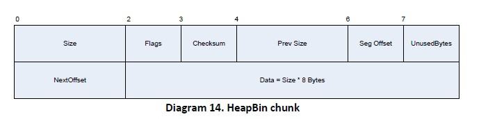

> `NextOffset`实际上不是一个独立的字段，它只是数据域的前两个字节。

如果你可以布置一个可溢出chunk在待释放chunk的正前方，那么`UnusedBytes`就可以被赋值成0x5，`SegOffset`可以覆写成你所选择的1字节值，这意味着header位置可以向前0x0 * 8到0xFF * 8字节。

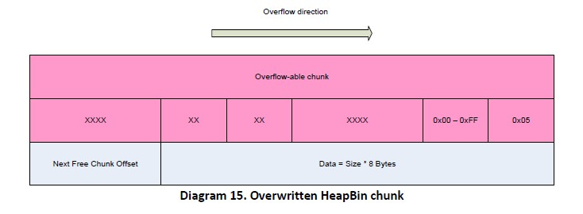

`ChunkHeader`基于被覆写的`SegOffset`而重新定位，但其`_HEAP_ENTRY`必须得合法，因为`RtlpLowFragHeapFree()`必须得把它释放掉。一眼望去好像没什么卵用，让我们看看下面的代码实例。

一个最简单，最不自然的示例。它接收输入并试图创建对象并分配内存。因为读操做内存量的计算错误这里存在一个缓冲区溢出。我将展示该溢出时如何覆盖应用程序数据的。

<center>Listing 49. C++ contrived example</center>

```cpp
class Paser
{
public:
	Parser();
	virtual void DoThings();
	~Parser();
private:
    int Items;
    int Values;
    int Stuff;
    int Things;
};

void *buffer, *output;
int action, copy_size = 0x40;
Parser *p;

while(1)
{
    action = ReadInt();
  
    if(action == 0x1)
    	p = new Parser();
    else if(action == 0x2)
    	buffer = malloc(sizeof(Parser));
    else if(action == 0xFF)
    	break;
  
    action = ReadInt();
    if(action == 0x3)
    	p.DoThings();
    else if(action == 0x4)
    	ReadBytes(buffer, copy_size);
    else if(action == 0x5)
   		free(buffer);
    else if(action == 0x6)
    	delete p;
    else if(action == 0x7)
    	ReadBytes(buffer, 0x10);
}
```

第一件事就是为sizeof(Parser)激活LFH，然后设置内存以便于Parser对象被布置在可以溢出的对象的后面。还需要进行另一次分配，以便于被溢出的chunk头部在`RtlpLowFragHeapAllocFromContext()`中处理下一次分配时不会被重新赋值。这将允许我们用可控值覆盖相邻的chunk头。


在溢出了Alloc2的头部之后，它会调整chunk头指向parser对象，我们此后释放Alloc2，这就会使得parser对象所在的内存位置变成了下一个可用chunk。

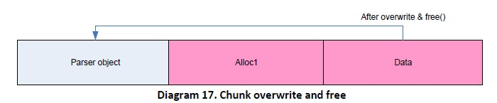

现在我们再次分配时，就会得到parser对象的地址，此后我们可以覆写其虚表。因此，通过这第三次的分配加上对`p.DoThings()`的调用就可以为所欲为。

**步步为营**

1. 激活sizeof(Parser)的LFH
2. 分配一个Parser对象
3. 分配一个chunk内存，它可以溢出(Alloc1)
4. 分配第二个chunk内存，用于被溢出覆写头部(Alloc2)
5. 溢出Alloc1，覆盖Alloc2的头部，`UnusedBytes`改为0x5，`SegOffset`改为指向parser对象所需要的blocks的数量
6. 释放Alloc2
7. 分配一个chunk，写入期望的数据。于是，我们可以覆写parser对象的虚表指针(Alloc3)
8. 触发对parser对象虚函数的调用(这里以`p.DoThings()`为例)

**先决条件**

- 可以控制具体尺寸的分配
- 有能力激活特定尺寸的LFH
- 在被溢出的chunk前放置一个合法的chunk
- 至少溢出8字节，改变相邻内存的chunk头
- 可以释放被覆写的chunk

**方法论**

1. 激活LFH
2. 标准化堆
3. Alloc1
4. Alloc2
5. Alloc3
6. 覆写Alloc3(至少8字节)
7. 释放Alloc3(调整头部指向Alloc1)
8. Alloc4(实际上指向Alloc1)
9. 写入数据(污染Alloc1的内存)
10. 使用Alloc1

#### 覆写FreeEntryOffset

本节以一个新技术开始，该技术是我在撰写该论文时调研所得。在前面的章节我们讨论了`UserBlock`中的chunks是如何编排管理以跟踪当前的偏移以及下一个可用chunk的偏移。当前的偏移保存在`_INTERLOCK_SEQ`结构体中。LFH于是知晓了如何获取下一个空闲chunk。

主要的问题在于下一个`FreeEntryOffset`存储于chunk数据域的前两个字节。这意味着分配器必须算出一个值，该值与管理的chunk的尺寸相关，随后被存储到数据域用于下一次迭代。既然LFH中每个chunk相互之间都是挨着的，并且chunk头部在分配时不会做校验，那么`FreeEntryOffset`就可以被覆写成一个新的Offset，这使得后续的分配会指向任意位置。

<center>Listing 50. Try/Catch for LFH allocation</center>

```cpp
try { 
  //the next offset is stored in the 1st 2-bytes of userdata 
  short NextOffset = UserBlocks + BlockOffset + sizeof(_HEAP_ENTRY)); 
  
  _INTERLOCK_SEQ AggrExchg_New; 
  AggrExchg_New.Offset = NextOffset; 
} 
catch 
{ 
  return 0; 
}
```

于是，通过至少0x9(0xA更好)字节的覆写，我们可以影响到`NextOffset`的值，从而影响下一次分配。让我们看一个示例。

<center>Listing 51. FreeEntryOffset ovewrite example</center>

```cpp
class Dollar 
{ 
public: 
 	Dollar(); 
  	virtual void INeedDollar(); 

private: 
    int Job = 0;
    int Dollars = 0; 
    unsigned int Booze = 0xFFFFFFFF; 
}; 

int first_len, second_len, total_len; 
char *dollar1, *dollar2, *dollar3, *data1, *data2; 
char *statement = "I need dollar"; 

first_len = ReadInt(); 
second_len = ReadInt();

data = alloc(first_len); 
ReadBytes(data, first_len);
//int wrap 
total_len = first_len + second_len; 

//we can write more data than this 
//allocation can hold 
dollar1 = alloc(total_len); 
memcpy(dollar1, data, first_len); 

//this will store the tainted FreeEntryOffset 
//in the _INTERLOCK_SEQ 
dollar2 = alloc(total_len); 
memcpy(dollar2, statement, strlen(statement));

//although not on the same UserBlock, it will be 
//allocated on an adjacent page in memory 
Dollar dollars[0x20]; 
for(i = 0; i < 0x20; i++) 
{ 
  	dollars[i] = new Dollar(); 
} 

//this will give us 0xFFFF * 0x8 bytes of 
//forward range when making an allocation, more 
//than enough room to overwrite any of the Dollar objects 
dollar3 = alloc(first_len); 
memcpy(dollar3, data, first_len); 

//one or more of these can be overwritten 
//with data copied into dollar3 
for(i = 0; i < 0x20; i++) 
{ 
  	dollars[i].INeedDollar(); 
}
```

在程序的开始处有个明显的integer wrap，后面跟了一个潜在的缓冲区溢出。但是和以往的exp方法不同的是，我们不能通过简单的覆盖一些元数据来达成代码执行。我们需要覆盖在dollar2中存储的`FreeEntryOffset`来控制dollar3返回的地址。

我们假定LFH为`Bucket[0x6]`(0x30字节)已经启用，也假定dollar1是第一个`Bucket[0x6]`分配出的chunk(处于简单的目的，实际上不需要是特定尺寸LFH的第一次分配)。`UserBlock`状态看起来如是：

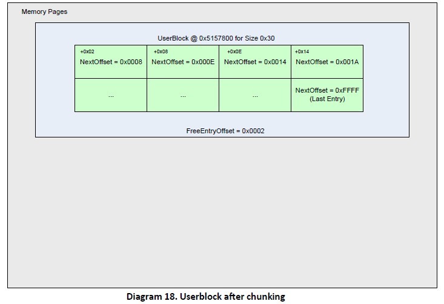

在dollar1被分配后，随后的溢出会覆盖下一个空闲堆chunk，`FreeEntryOffset`被更新为下一个chunk的偏移(应是0x0008 chunk)。

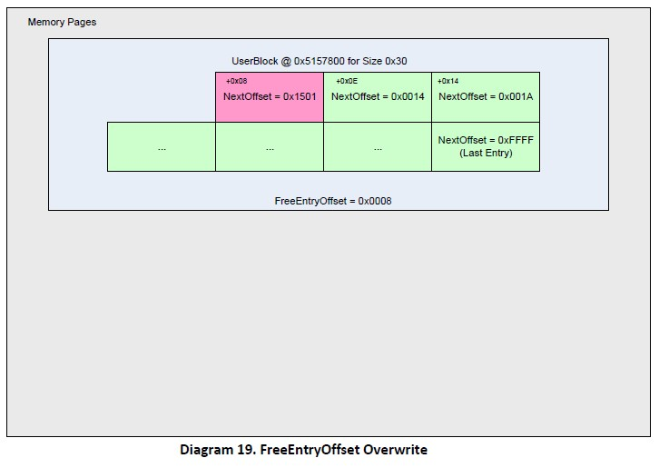

此时，下一个偏移已经被覆写，值是我们可控的，但是为了使用这个偏移我们需要进行下一次分配，这一次该值会存储在`_INTERLOCK_SEQ`中。本次分配，在这个例子中，就是为dollar2分配内存时发生的。

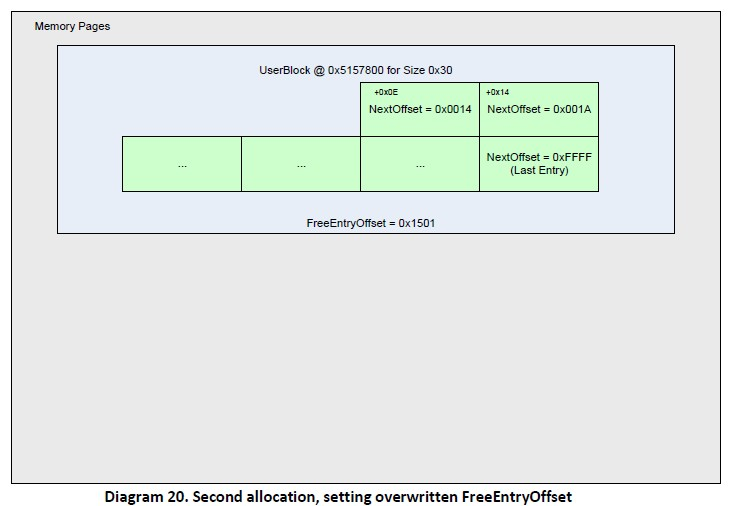

现在我们有了一个0x1501的`FreeEntryOffset`。该值会超出`UserBlock`所在的分配页，因此相邻的内存也需要被覆盖。（并不总是这个值。如果在内存页上有完美的数据可以覆写，那么覆写的offset可以是0x0000-0xFFFF之间的值）。

本例中相邻的内存在构造0x20 Dollar对象数组时被创建（我们假定它们是0x40字节宽）。一旦`Bucket[0x8]`的LFH被启用(0x40字节)，就可以看到一个完整的内存布局，如同下图所示：

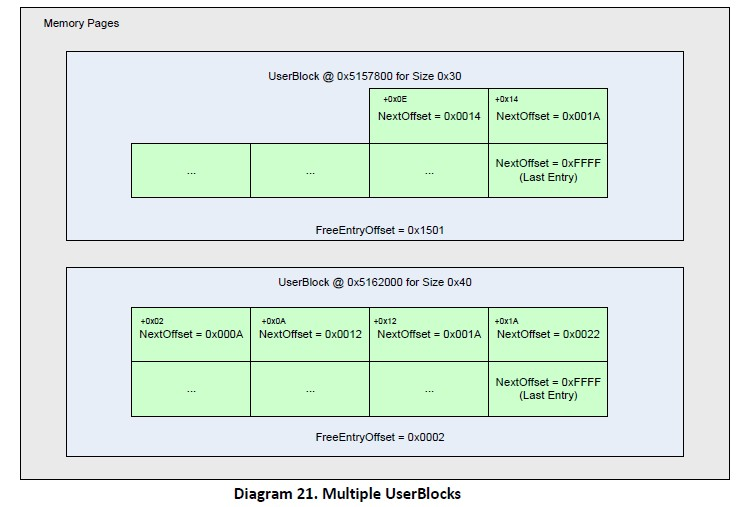

此时就形成了一个相当有利的局面来覆写函数指针或虚表。下一个0x30字节的分配会返回内存地址0x5162006，因为下一个空闲条目是由当前的UserBlock [0x5157800]计算出来的，UserBlocks 加上当前偏移(0x0E)，最后再加上`FreeEntryOffset * 8` [0x1501]。

```cpp
NextChunk = UserBlock + Depth_IntoUserBlock + (FreeEntryOffset * 8)
NextChunk = 0x5157800 + 0x0E + (0x1501 * 8)
NextChunk = 0x5162016
```

这意味着一旦我们分配dollar3并写入0x30字节的数据，我们就可以覆盖Dollar array的对象。覆盖的偏移甚至可以调整成指向数组内部特定的对象。尽管该例子非常简单，攻击了应用程序在堆上的数据，他仍然可以用在多种n字节覆盖的方法中。

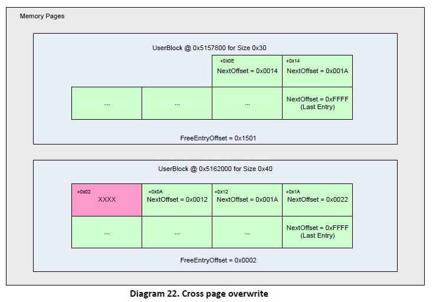

**步步为营**

1. 激活LFH
2. 分配已激活的大小的chunk(dollar1)
3. 溢出dollar1至少0x9字节(0xA更好)，覆写物理相邻的空闲chunk，它会在下一次分配中返回
4. 分配相同大小的chunk(dollar2)（它会存储覆盖的`FreeEntryOffset`到`_INTERLOCK_SEQ`中）
5. 分配一个对象，它用于被覆盖。该分配需要部署在`FreeEntryOffset`(0x08 * 0xFFFF是最大值)可触摸的范围内。本例，使用的是Dollar对象数组。
6. 分配相同大小的chunk(dollar3)（它会返回选择被覆盖的对象所在的地址）
7. 写入n字节，覆盖关键对象
8. 调用关键的函数指针或虚函数

**先决条件**

- 可以为特定Bucket激活LFH
- 可以控制特定Bucket的分配
- 至少可以覆盖0x9字节，最好0xA字节
- 可以覆写相邻的空闲chunk
- 最大可触范围(0xFFFF * 0x8)内存在可覆盖对象
- 可以触发被覆盖对象的关键函数

**方法论**

1. 激活LFH
2. 标准化堆
3. Alloc 1
4. 覆盖相邻chunk的`FreeEntryOffset`
5. Alloc 2
6. Alloc 3
7. 写入数据到Alloc3(这会覆盖感兴趣的对象)
8. 触发

### Observations（观察结果）

尽管本节展现的材料应该更容易放到Exploitation这一部分中，我还是认为放在Observations之后更好一些。这是因为这之后的代码执行利用技术都缺乏可靠性。我想做的最后一件事就是把一个感兴趣的项目放在Exploitation部分，而事实上正如Sinan Erin所说的——草莓布丁。

#### 覆写SubSegment

我们在分配一节中看到LFH会在分配内存时试图使用`SubSegment`。如果当前没有可用的`Subsegment`，他就会为`UserBlock`分配空间，然后产生一个`SubSegment`。

<center>Listing 52. SubSegment获取</center>

```cpp
HEAP_SUBSEGMENT *SubSeg = HeapLocalSegmentInfo->ActiveSubsegment; 

if(SubSeg) 
{ 
    while(1) 
    { 
        . 
        . 
        . 
        //checks to ensure valid subsegment 
        //检查确保合法的subsegment
        _HEAP_USERDATA_HEADER *UserBlocks = SubSeg->UserBlocks; 

        if(!Depth || !UserBlocks || SubSeg->LocalInfo != HeapLocalSegmentInfo) 
        { 
          	break; 
        } 
      	. 
        . 
        . 
    } 
} 
. 
. 
. 
_HEAP_USERDATA_HEADER *UserData = 
  RtlpAllocateUserBlock(lfh, UserBlockCacheIndex, BucketByteSize + 8); 

DeletedSubSegment = ExInterlockedPopEntrySList(HeapLocalData); 
if (DeletedSubSegment) 
{ 
    // if there are any deleted subsegments, use them 
  	// 如果存在被删除的subsegments，就使用它们
    NewSubSegment = (_HEAP_SUBSEGMENT *)(DeletedSubSegment - 0x18); 
}
else 
{ 
    _HEAP_SUBSEGMENT *NewSubSegment = 
      RtlpLowFragHeapAllocateFromZone(LFH, LocalDataIndex); 
  
    //return failure use back-end 
  	//返回失败，使用后端
    if(!NewSubSegment)
     	return 0; 
} 

//this function will setup the _HEAP_SUBEMENT structure 
//and chunk out the data in 'UserData' to be of HeapBucket->SizeIndex chunks 
RtlpSubSegmentInitialize(LFH, 
                         NewSubSegment, 
                         UserBlock, 
                         RtlpBucketBlockSizes[HeapBucket->SizeIndex], 
                         UserDataAllocSize,HeapBucket); 
. 
. 
.
```

该执行流通常发生在`_HEAP_SUBSEGMENT`还没有设置的时候（例如：LFH第一次分配特定Bucket）或者所有的SubSegments都用完了。这种情况下内存布局看起来如下图：

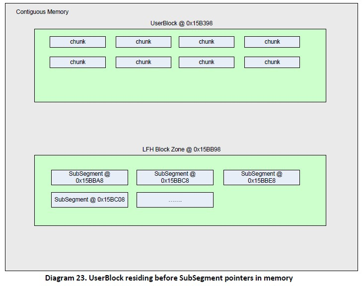

如你所见，如果你把UserBlock chunk放置在为`SubSegments`分配的内存之前，那么溢出就可以覆盖`_HEAP_SUBSEGMENT`结构所用的指针。尽管Richard Johnson论证了`_LFH_BLOCK_ZONE`的`FreePointer`可以写一个`_HEAP_SUBSEGMENT`结构到半任意位置(Johnson 2006)，我却有个不同的想法。你可以覆写SubSegment，包括UserBlock指针。此后进行随后的分配，此时就可以用用户提供的指针进行n字节覆写。

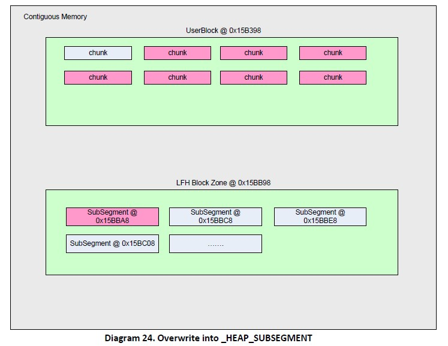

#### 示例

下面的例子展示了LFH Bin如何为特定尺寸激活，后续的分配又是如何覆写了`_HEAP_SUBSEGMENT`，导致分配时使用了污染的数据。注意到覆盖尺寸为0x200，该值不是一个特定的值，而是个可以覆写所有`_LFH_BLOCK_ZONE`条目的值。

<center>Listing 53. SubSegment overwrite</center>

```cpp
//turn on the LFH 
for(i = 0; i < 0x12; i++) 
  allocb[i] = HeapAlloc(pHeap, 0x0, SIZE); 

//first allocation for SIZE in LFH 
alloc1 = HeapAlloc(pHeap, 0x0, SIZE); 

//get closer in virtual memory 
//to make overwrite easier 
for(i = 0; i < 0x27; i++) 
  alloc2 = HeapAlloc(pHeap, 0x0, SIZE); 

//overwrite the UserBlocks pointer for this SubSegment 
alloc3 = HeapAlloc(pHeap, 0x0, SIZE); 
memset(alloc3, 0x41, 0x200); 

//this allocation will use the tainted UserBlocks 
alloc4 = HeapAlloc(pHeap, 0x0, SIZE);
```

#### 争议

这种技术的利用主要有两大阻碍。第一个是需要具备一种对堆可以精准操控的手法。如实例中所展现，`UserBlock` chunk需要在内存被用来存储`SubSegment`指针(`_LFH_BLOCK_ZONE`)之前分配出来。启用LFH Bin很繁琐，想要保证它布置在连续的内存上且在SubSegment指针所用的chunk之前，在真实环境中更为困难。你只要去看看IE就可以了解到这项任务是多么的困难。

第二个难点是要避免分配过程中的检查以保证`SubSegment`的完整性。这将确保对请求尺寸的`_HEAP_LOCAL_SEGMENT_INFO`结构，和当前存储在`_HEAP_SUBSEGMENT`的那一个匹配。

<center>Listing 54. SubSegment校验</center>

```cpp
_HEAP_LOCAL_SEGMENT_INFO *HeapLocalSegmentInfo = 
  	HeapLocalData->SegmentInfo[HeapBucket->SizeIndex]; 

_HEAP_SUBSEGMENT *SubSeg = HeapLocalSegmentInfo->ActiveSubsegment; 

. 
. 

if(!Depth || !UserBlocks || SubSeg->LocalInfo != HeapLocalSegmentInfo) 
{ 
  	break; 
}
```

`Depth`和`UserBlocks`易于欺骗，但检查机制却使得保证`LocalInfo`结构与存储在LFH中的指针是同一个这件事有些复杂。使用一个已泄露的chunk地址是一种解决问题的可行方案，但是应用程序运行运行的越久，想要可靠地预测一个地址就越困难。最简单的方法就是通过`HeapBase`来获取`FrontEndHeap`指针的地址。这将为我们提供一个指向`_LFH_HEAP`结构的指针，此后合适的`_HEAP_LOCAL_SEGMENT_INFO`条目地址就可以由请求的chunk尺寸来推断出来。

总之该技术提供了一个非常简单的n字节写情景，纯粹依赖于堆元数据以及需要覆写的地址。不幸的是，在撰写本文之际，还是没能挖掘出一种更为可靠的技巧。这并非不可能，而是我屡试屡败最终选择了放弃。

## 总结

Windows内存管理的各个方面自Windows XP以来都有相当的改变。这些巨大的改变最早发生于Windows Vista并最终迁移到了Windows 7。

使用的数据结构更为复杂，对多线程发起的频繁的内存请求有了更好的支持，但仍然与过去的堆实现机制有着一定的相似之处。

这些新的数据结构使用的风格和之前不同。专用FreeLists这一设计已经被新的更为鲁棒的设计取缔。这些新的技术提供了后端管理器去启用前端管理器的方式，当前的前端管理器只支持LFH，Lookaside链表已经过时了。当特定的阈值达到后，新的`UserBlock`结构将为`HeapBucket`包揽所有的chunks，布置在一片连续的大块内存上。这为频繁的分配和释放提供了更为有效的内存访问方式。

尽管后来增加了多种安全机制，比如头部编码，反位图翻转以及安全断链，依然有着新的精准操控堆的可靠手法一一诞生。现在相同尺寸的chunk可以在内存空间中连续部署，覆盖也变得可预测，通过数据的播种也可以简单的控制分配和释放。

最后，尽管覆写元数据可以改变程序执行流，但对比以往的可用性依然大打折扣。堆exp变得越来越复杂，随着时间的推进，相比较所想要覆写的数据，对分配和释放操作以及chunks布局的深层次理解将变得更为重要(不提及DEP和ASLR)。可能看起来讨论前端和后端管理器到如此深的层次不是很有必要，但是想要游刃有余的操控堆，你必须理解它底层的工作机制。

## 参考文献

- Hawkes, Ben. 2008. Attacking the Vista Heap. Ruxcon 2008 / Blackhat USA 2008,

  http://www.lateralsecurity.com/downloads/hawkes_ruxcon-nov-2008.pdf
  http://www.blackhat.com/presentations/bh-usa-08/Hawkes/BH_US_08_Hawkes_Attacking_Vista_Heap.ppt

- Immunity Inc. Immunity Debugger heap library source code. Immunity Inc.

  http://debugger.immunityinc.com/update/Documentation/ref/Libs.libheap-pysrc.html

- Johnson, Richard. 2006. Windows Vista: Exploitation Countermeasures. Toorcon 8,

  http://rjohnson.uninformed.org/Presentations/200703%20EuSecWest%20-%20Windows%20Vista%20Exploitation%20Countermeasures/rjohnson%20-%20Windows%20Vista%20Exploitation%20Countermeasures.ppt

- McDonald/Valasek. 2009. Practical Windows XP/2003 Heap Exploitation. Blackhat USA 2009,

  http://www.blackhat.com/presentations/bh-usa-09/MCDONALD/BHUSA09-McDonald-WindowsHeap-PAPER.pdf

- Marinescu, Adrian. 2006. Windows Vista Heap Management Enhancements. Blackhat USA 2006

  http://www.blackhat.com/presentations/bh-usa-06/BH-US-06-Marinescu.pdf

- Moore, Brett. 2005. Exploiting Freelist[0] on XP Service Pack 2. Security-Assessment.com White Paper,

  http://www.insomniasec.com/publications/Exploiting_Freelist%5B0%5D_On_XPSP2.zip

- Moore, Brett. 2008. Heaps About Heaps. SyScan 2008,

  http://www.insomniasec.com/publications/Heaps_About_Heaps.ppt

- Probert, David B. (PhD),

  http://www.i.u-tokyo.ac.jp/edu/training/ss/lecture/new-documents/Lectures/16-UserModeHeap/UserModeHeapManager.ppt

- Sotirov, Alexander. 2007. Heap Feng Shui in JavaScript. Black Hat Europe 2007, http://www.blackhat.com/presentations/bh-europe-07/Sotirov/Presentation/bh-eu-07-sotirov-apr19.pdf

- Vreugdenhil, Peter. 2010. Windows7-InternetExplorer8. Pwn2Own 2010,

  http://vreugdenhilresearch.nl/Pwn2Own-2010-Windows7-InternetExplorer8.pdf

- Waisman, Nico. 2010. (A)leatory (P)ersitent (T)hreat,

  http://eticanicomana.blogspot.com/2010/03/aleatory-persitent-threat.html